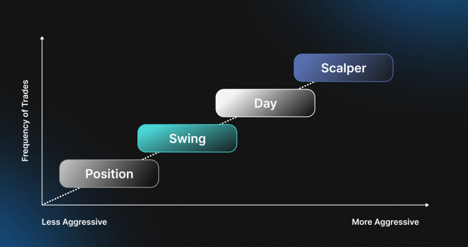
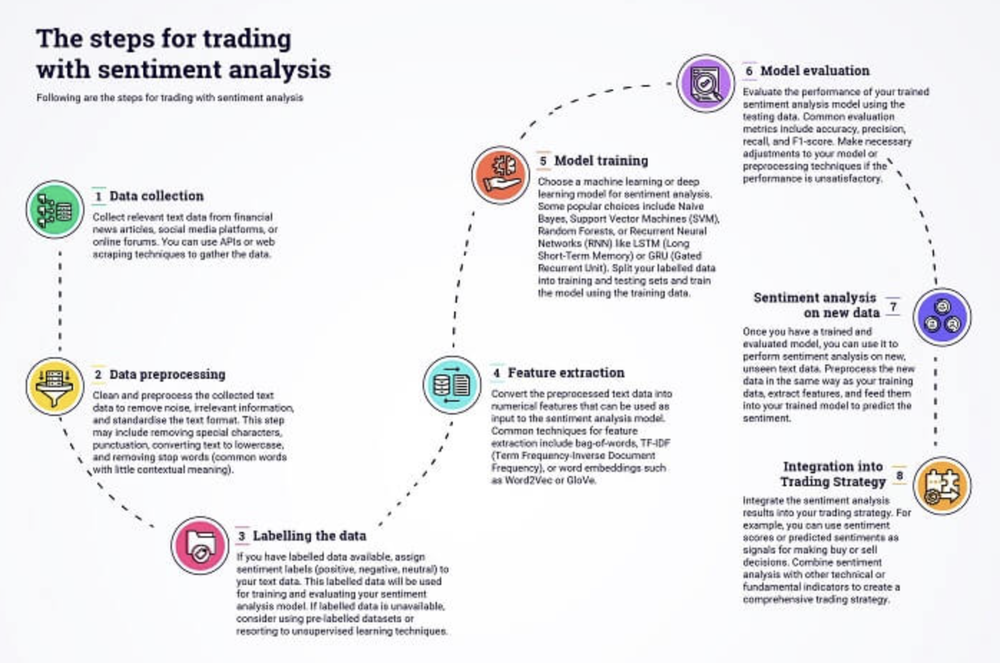

Short-term trading involves buying and selling financial instruments within a brief period, which can range from a few minutes to several weeks. Unlike long-term investment strategies which focus on buy-and-hold principles and the fundamental value of assets over months or years, short-term trading seeks to capitalize on market volatility and the rapid changes in prices that occur within these shorter time frames.

Traders employing short-term strategies are typically engaged in a more active approach to the markets. They utilize a variety of methods to identify and execute trades, often aiming to exploit small price gaps created by market spreads or order flows. This form of trading requires a robust understanding of market trends, technical analysis, and the ability to act quickly on market movements.

The financial landscape for short-term trading is vast, encompassing various markets such as stocks, forex, commodities, and cryptocurrencies. Each market presents unique opportunities and challenges for short-term traders. For example, the forex market's 24-hour cycle offers continuous opportunities for trades, while the stock market is more structured with defined opening and closing times.

Short-term trading has seen significant evolution with technological advancements. The advent of electronic trading platforms and sophisticated trading tools has democratized access to financial markets and made short-term trading a viable strategy for a broader audience. High-frequency trading (HFT) and algorithmic trading have also become prominent, where trades are executed in fractions of a second by computers, a far cry from past decades where floor traders were the norm.

The advent of these technologies has led to a more efficient and liquid market environment, but also one that is more complex and competitive. Short-term traders must navigate not only market and economic indicators but also the activities of these automated systems which can greatly influence price movements and market dynamics.

## Table of Contents

## Understanding Short-Term Trading

Short-term trading refers to the practice of buying and selling financial instruments within a short timeframe. This can range from several minutes to a few days, but rarely exceeds a few weeks. Short-term traders capitalize on small price movements, seeking to turn a quick profit rather than investing for the long haul.

The time frames for short-term trading strategies are distinctly categorized, with **scalping** focusing on minutes, **day trading** closing out at the end of the market day, and **swing trading** looking at a slightly longer horizon of days to weeks. Each approach requires its own set of strategies, capital, and risk management techniques.

**Psychologically**, short-term trading demands a high level of discipline, decisiveness, and emotional control. The rapid pace of trading and the necessity for quick decision-making can be stressful and may not be suitable for all investors.

**Financially**, it requires sufficient capital to withstand the volatility and to leverage positions effectively. Short-term traders also need to be mindful of the costs that can eat into profits, including transaction fees and taxes.

Therefore, successful short-term traders often have a deep understanding of market indicators, a well-thought-out trading plan, and the ability to remain disciplined even under pressure. With these skills, they are able to navigate the rapid changes in the market and capitalize on opportunities as they arise.

## Types of Short-Term Trading Strategies

Short-term trading encompasses a variety of strategies, each with unique characteristics, tactics, and goals. Scalping, day trading, swing trading, and position trading are the primary methods utilized by traders looking to capitalize on short-term market movements.

### Scalping

Scalping is the strategy of making dozens or hundreds of trades in a single day to "scalp" a small profit from each. This technique requires intense focus and quick decision-making, as positions are held for a very short time, often just minutes. Scalpers rely heavily on technical analysis and real-time news to take advantage of small fluctuations in price.

### Day trading

Day trading involves entering and exiting positions within the same trading day. Unlike scalpers, day traders may hold positions for hours and aim for higher profits per trade. This strategy reduces the risk of overnight market volatility affecting the trader's positions. Day traders often use chart patterns and technical indicators to identify short-term trends and reversal points.

### Swing trading

Swing trading captures gains in a stock within an overnight hold to several weeks. Swing traders typically use a combination of technical and fundamental analysis to identify potential trading opportunities. They look for situations where the market's emotional reactions provide opportunities, often in the context of an emerging trend.

### Position trading

Position trading is a longer-term approach compared to the other strategies, but still falls under the umbrella of short-term trading. Position traders may hold onto their trades for days to months, not as long as traditional buy-and-hold investors. They tend to use a mix of technical analysis and macroeconomic factors to make their trading decisions, often looking for a confluence of signals before entering a trade.

Each of these strategies requires a clear understanding of market mechanics and the ability to react quickly to market changes. Scalping and day trading are more suited to traders who can dedicate a significant portion of their day to monitoring the markets, while swing and position trading allow for a more flexible schedule but require patience and a good grasp of market trends.

## Identifying Potential Short-Term Trades

Identifying potential short-term trades is a critical skill that combines technical analysis with fundamental insights to pinpoint profitable trading opportunities. Short-term traders rely on technical analysis to identify patterns and signals that suggest future market movements. Key tools include trend lines, support and resistance levels, moving averages, and various chart patterns like head and shoulders, triangles, and flags. These elements provide traders with visual cues about market sentiment and potential price direction.

Traders may also apply momentum indicators such as the **Relative Strength Index (RSI)**, **Moving Average Convergence Divergence (MACD)**, and the **Stochastic Oscillator** to gauge the speed and change of price movements. These tools help to confirm trends and signal potential reversals or continuations of the market.

Volume indicators play a pivotal role in confirming the strength of a trend. The **Average True Range (ATR)** provides insight into market volatility, while tools like the **Volume Oscillator and On-Balance Volume (OBV)** can confirm the momentum behind price movements. High volume alongside price moves indicates a strong trend, whereas divergence between volume and price can signal a potential reversal or weakening trend.

While technical analysis is at the forefront of short-term trade identification, incorporating fundamental analysis can add depth to a trader’s approach. Fundamental analysis in the short term might involve staying abreast of news events, economic announcements, and earnings reports, which can cause significant price swings and provide opportunities for short-term gains.

The fusion of technical and fundamental analysis can yield optimal results. For example, a trader might use technical indicators to pinpoint a potential entry point and then look to upcoming economic data to decide on the timing of the trade. A strong understanding of market catalysts, such as interest rate decisions or corporate earnings releases, allows traders to anticipate volatility and capitalize on the market's reaction to new information[1][2].

## Essential Risk Management Techniques

Essential risk management is the cornerstone of any successful short-term trading strategy. It's not just about the potential profits you can make but also about the potential losses you can prevent.

Setting **stop losses** is a trader's first line of defense against sudden market movements. These are orders placed with a broker to sell a security when it reaches a specific price. They are crucial in short-term trading to prevent significant losses. For example, a trader might set a stop loss at 10% below the purchase price to cap the potential loss on that trade.

**Take profits** orders work on the opposite end of the spectrum. They allow traders to set a target price at which they're content to take profits and close out their trade. This locks in profit and ensures that the trader does not miss out on gains if the market suddenly reverses.

**Position sizing** involves determining how much of your capital to allocate to a single trade. It's essential to avoid overexposure to a single asset. A common rule of thumb is not to risk more than 1-2% of your trading capital on any one trade. This way, even a string of losses won’t significantly impact the overall capital.

**Diversification** is another critical risk management technique. In the context of a short-term trading portfolio, this means not putting all your eggs in one basket. It’s about spreading your investments across different assets, sectors, and markets to reduce the impact of a single failing trade. For instance, a short-term trading portfolio might include a mix of forex, commodities, and different stock sectors.

## Short-Term Trading Strategies

Short-Term Trading Strategies encompass a variety of methods aimed at extracting profits from market movements that occur within a brief time period. These strategies are diverse and can be tailored to match a trader’s risk profile, trading platform, market understanding, and the prevailing market conditions.

### Momentum

Momentum trading focuses on assets moving significantly in one direction on high volume. Traders who employ this strategy will seek to identify the strength of an asset's price trend and make trades in the same direction as the trend, aiming to enter and exit the market before the momentum ceases. This strategy relies heavily on technical analysis, using indicators like moving averages to ascertain the trend's direction and strength.

### Range

Range trading, another key strategy, involves identifying stocks that are trading within a consistent range or channel. Traders using this strategy will buy at the lower end of the price range and sell at the higher end, capitalizing on the price movement within this range. This strategy is most effective in markets that lack a clear direction and exhibit sideways movement.

### Breakout

Breakout trading strategies are employed when the market price moves outside a defined resistance or support level with increased volume. A breakout trader enters a long position after the stock price breaks above resistance or enters a short position after the stock price breaks below support. Since breakouts often lead to volatile market movements, traders must be adept at using volume indicators to confirm the strength of the breakout.

### Reversal

Reversal trading is predicated on the notion that the momentum of a price movement will eventually reverse. This strategy requires identifying potential tops and bottoms of the market, entering the market as the trend starts to reverse. Reversal traders use oscillators like the RSI and MACD to find divergences which can signal a potential reversal.

Each of these strategies has its nuances and requires a detailed understanding of market indicators and conditions. For example, 'Technical Analysis Explained' by Martin J. Pring can provide traders with insights on using technical analysis to support these strategies. Furthermore, practical application via demo accounts or simulation platforms can help traders to hone these strategies in real-time market conditions without financial risk[3].

## Execution and Technology in Short-Term Trading

In short-term trading, execution speed is paramount. Quick execution can mean the difference between capitalizing on an opportunity at the desired price and missing out on a fleeting trade window. Short-term traders must rely on platforms that ensure rapid order execution, as delays can significantly impact the profitability of high-frequency trading strategies like scalping, where positions are entered and exited within minutes.

**Slippage** refers to the difference between the expected price of a trade and the price at which the trade is executed. Slippage often occurs during periods of higher volatility when market orders are used, and also when large orders are executed but there isn't enough volume at the chosen price to maintain the bid/ask spread. To minimize slippage, traders can use limit orders to ensure that they do not pay more for a stock than their set price, although this means the trade is not guaranteed to be executed if the price does not reach the trader’s limit. Additionally, some trading platforms offer slippage protection tools that help manage this risk.

For those looking to deep dive deeper into the technical aspects of execution and technology in trading, resources like "Algorithmic Trading: Winning Strategies and Their Rationale" by Ernie Chan provide comprehensive insights. Additionally, engaging with community forums like Elite Trader can offer real-world advice and reviews on different platforms' performance and capabilities[4].

## Psychological Aspects of Short-Term Trading

The psychological landscape of short-term trading is markedly different from that of long-term investing. Where long-term investors may weather the market's ups and downs with a degree of detachment, short-term traders are in the thick of volatility. This proximity to market fluctuations requires a robust mental approach. The emotional rollercoaster can lead to rash decisions driven by fear or greed, so it’s vital for short-term traders to maintain discipline and control over their emotions.

One of the key psychological challenges in short-term trading is the concept of **overtrading**. The temptation to make numerous trades in search of profits can be overwhelming, especially after a loss when a trader might feel the urge to 'make back' lost capital. This can lead to a dangerous cycle of impulsive trading, where decisions are made not on the basis of sound analysis, but emotional reactions.

To combat this, many successful short-term traders employ strict trading plans which include predefined entry and exit points, and adhere to them meticulously. They also establish firm daily loss limits to protect from significant downturns. The use of these safeguards can help maintain a level head when the market is most erratic.

Another critical aspect is the **fear of missing out** (FOMO). With markets moving rapidly, traders often fear missing a lucrative opportunity. This fear can lead to jumping into positions without proper analysis or entering trades at suboptimal prices. Mindfulness practices and setting strict criteria for trades can help mitigate FOMO by ensuring a trader only enters the market when conditions align with their strategy.

Furthermore, short-term trading requires **quick thinking and decisiveness**. Indecision or hesitation can lead to missed opportunities or losses. To develop a quick but careful trading approach, many traders perform simulated trading sessions or paper trading. This practice can help in honing the skill of making fast decisions without the associated risk of real money trading.

The stark psychological differences between short-term and long-term trading also manifest in the handling of success. The immediate feedback loop of short-term trading can create an illusion of control or lead to overconfidence. It's essential to remain humble and continuously learn, understanding that the market is unpredictable and respecting the risk involved with each trade[5][6].

## The Role of Backtesting in Short-Term Trading

Backtesting is a pivotal step in developing and refining short-term trading strategies. It involves simulating a trading strategy against historical market data to determine how it would have performed in the past. The underlying premise is that past performance, while not indicative of future results, can provide valuable insights into how a strategy responds to various market conditions.

When properly conducted, backtesting allows traders to assess the viability of a strategy before risking actual capital. It can reveal the strategy's **win rate**, **average profit per trade**, **drawdowns**, and other crucial metrics. Effective backtesting requires a comprehensive dataset that includes price movements, volume, and other market factors relevant to the strategy being tested.

However, backtesting isn't without its limitations. One major constraint is the accuracy of historical data. Incomplete or incorrect data can lead to misleading results, known as '**overfitting**,' where a strategy appears perfect for past data but fails in live trading. To counter this, traders should source their data from reliable providers and ensure it encompasses a range of market conditions.

Another limitation is that backtesting typically does not account for **market impact**, liquidity constraints, or slippage—the difference between the expected price of a trade and the price at which the trade is executed. Real-time trading conditions can differ significantly from historical simulations. To mitigate these issues, it's crucial to incorporate realistic transaction costs and slippage into backtesting models.

For rigorous backtesting, traders often use software like TradeStation, NinjaTrader, or MetaTrader, which come with backtesting capabilities and allow for the testing of complex strategies across various asset classes. There are also programming languages like Python, which can be used with libraries such as `Backtrader` or `PyAlgoTrade` for custom backtesting solutions.

## The Future of Short-Term Trading

The future of short-term trading is inextricably linked to the continuous evolution of the financial markets and the technological advancements that drive them. As global markets become increasingly interconnected, short-term traders must navigate an environment where macroeconomic and geopolitical events can have immediate impacts on asset prices. This interconnectedness means that news from across the globe can affect markets instantaneously, requiring traders to be ever vigilant and ready to act on developments swiftly.

**Machine learning**

In the realm of technology, the rise of artificial intelligence (AI) and machine learning (ML) presents both opportunities and challenges for short-term traders. AI and ML are becoming pivotal in analyzing vast amounts of market data to identify trading signals that might elude human traders. These technologies can process complex patterns and predict potential market movements with a speed and accuracy that can enhance a trader's ability to make informed decisions.

**Sentiment analysis**

For example, machine learning algorithms can be trained to recognize early signs of market sentiment changes by analyzing social media trends, news headlines, and financial indicators, allowing traders to anticipate and react to market shifts before they become apparent to the broader market. This predictive power, however, comes with the need for rigorous testing and validation, as AI systems are only as good as the data they are fed and the quality of their programming.

[https://www.youtube.com/watch?v=b6rSa724txI](https://www.youtube.com/watch?v=b6rSa724txI)

**Algorithmic trading**

Moreover, as algorithmic and high-frequency trading become more prevalent, the market landscape is becoming more competitive. Short-term traders will need to leverage these technologies to stay competitive, as manual trading strategies may not execute as quickly as those powered by advanced algorithms. This shift doesn't necessarily negate the role of the human trader but rather emphasizes the need for a symbiotic relationship between human strategic oversight and algorithmic efficiency.

The democratization of trading technology also means that retail traders now have access to tools and platforms that were once the exclusive domain of institutional traders. This leveling of the playing field has led to an increase in retail participation in the markets, which can lead to greater liquidity but also to increased volatility as more traders react to market events.

## Conclusion

Short-term trading encapsulates a dynamic approach to the markets, seeking to capitalize on price movements over a limited time horizon. It is an endeavor that demands a robust skill set, including a sharp analytical mind, a disciplined approach, and an unwavering adherence to well-thought-out strategies. The critical elements that underpin successful short-term trading involve a thorough understanding of market indicators, a strategic approach to entry and exit points, and an unyielding commitment to risk management.

As we gaze into the future of short-term trading, it is evident that technological advancements and the introduction of artificial intelligence and machine learning will further transform trading strategies. Traders must stay abreast of these developments and be willing to incorporate new tools and techniques into their trading arsenals.

💡 **Read more:**

- Trading strategies papers with code on [Equities](https://wiki.paperswithbacktest.com/trading-strategies/equities), [Cryptocurrencies](https://wiki.paperswithbacktest.com/trading-strategies/cryptocurrencies), [Commodities](https://wiki.paperswithbacktest.com/trading-strategies/commodities), [Currencies](https://wiki.paperswithbacktest.com/trading-strategies/currencies), [Bonds](https://wiki.paperswithbacktest.com/trading-strategies/bonds), [Options](https://wiki.paperswithbacktest.com/trading-strategies/options)
- [A curated list](https://github.com/paperswithbacktest/awesome-systematic-trading) of awesome libraries, packages, strategies, books, blogs, and tutorials for systematic trading
- [A bunch of datasets](https://huggingface.co/paperswithbacktest) for quantitative trading
- [A website to help you](https://paperswithbacktest.com/) become a quant trader and achieve financial independence

## Frequently Asked Questions

**How much capital do I need to start short-term trading?**

The amount of capital required for short-term trading varies based on individual strategies, markets, and risk tolerance. Some markets, like forex, can be entered with a relatively small capital due to high leverage, whereas stock trading in the U.S. requires a minimum of $25,000 to day trade actively due to the Pattern Day Trader rule.

**What is the best time frame for short-term trading?**

The best time frame for short-term trading depends on the trading style. Scalpers may use 1-minute to 5-minute charts, day traders often use 5-minute to 30-minute charts, while swing traders may prefer hourly to daily charts.

**Can short-term trading be a full-time job?**

Yes, short-term trading can be a full-time job, but it requires significant knowledge, experience, and discipline. It also involves inherent risks, and not all traders will find consistent success.

**How do I manage risk in short-term trading?**

Risk management is crucial in short-term trading. Use stop-loss orders to limit potential losses, apply position sizing to avoid overexposure, and never risk more than a small percentage of your trading capital on a single trade.

**Are there any specific strategies for trading news events?**

Trading on news events involves identifying potential market-moving events, understanding the expected outcomes, and setting up trades that benefit from the volatility. It's important to have a clear plan for entry, exit, and risk management due to the fast-paced nature of news trading.

**How important is technical analysis in short-term trading?**

Technical analysis is a vital part of short-term trading as it helps in identifying trends, patterns, and potential reversal points in the market. However, it should be complemented with a sound understanding of market fundamentals and risk management.

**What are the tax implications of short-term trading?**

Short-term trading profits are typically taxed as ordinary income, which can be at a higher rate than long-term capital gains. It's important to consult with a tax professional to understand the specific implications for your situation.

**How do I choose the best broker for short-term trading?**

Look for brokers that offer low transaction costs, fast execution speeds, robust trading platforms, and good customer support. Also, consider the broker's regulatory status and the range of available markets and instruments.

**Is it better to specialize in one market or trade multiple markets?**

This depends on the trader's expertise and comfort level. Some traders find success by specializing in one market, while others diversify across several markets to spread risk and capitalize on more opportunities.

**How do I know if short-term trading is right for me?**

Short-term trading requires quick decision-making, discipline, and the ability to manage stress. It's suitable for individuals who can dedicate the time to actively monitor the markets and who are comfortable with the higher risk associated with short-term market fluctuations. It's advisable to start with a demo account to assess your suitability without risking real capital.

## References & Further Reading

[1]: ["Technical Analysis of the Financial Markets"](https://www.amazon.com/Technical-Analysis-Financial-Markets-Comprehensive/dp/0735200661) by John J. Murphy

[2]: ["Trading for a Living"](https://www.youtube.com/watch?v=ocHNbkQohMQ) by Dr. Alexander Elder

[3]: [”Technical Analysis Explained”](https://www.amazon.com/Technical-Analysis-Explained-Fifth-Successful/dp/0071825177) by Martin J. Pring

[4]: ["Algorithmic Trading: Winning Strategies and Their Rationale"](https://www.amazon.com/Algorithmic-Trading-Winning-Strategies-Rationale/dp/1118460146) by Ernie Chan

[5]: ["Trading in the Zone"](https://www.amazon.com/Trading-Zone-Confidence-Discipline-Attitude/dp/0735201447) by Mark Douglas

[6]: ["The Daily Trading Coach"](https://www.amazon.com/Daily-Trading-Coach-Becoming-Psychologist/dp/1511384581) by Brett N. Steenbarger