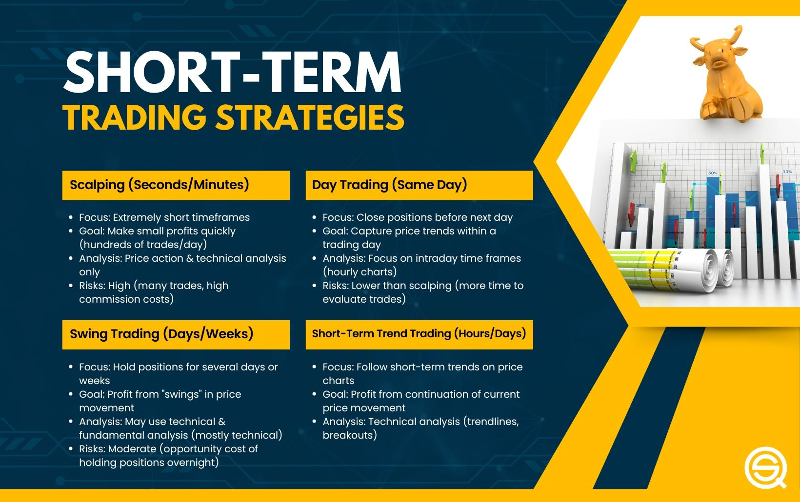

The financial markets have seen profound changes over the years, driven by rapid technological advancements and the increasing complexity of trading instruments. Among these changes, algorithmic trading has emerged as a crucial component, allowing traders to execute transactions with precision and speed that surpasses traditional manual methods. This method primarily automates trading decisions, enabling efficient execution of trades by using complex algorithms that analyze market data in real-time.

Short-term trading has garnered considerable attention in this evolving landscape, especially for traders aiming to profit from minor market discrepancies that can occur within very short timeframes. This strategy focuses on making swift trades with quick turnaround times, often lasting from minutes to a few days. The approach leverages short-term price fluctuations influenced by market sentiments, news, and other transient factors rather than relying on long-term investment fundamentals.



The rise of algorithmic trading has provided tools and technologies that enhance the effectiveness of short-term trading strategies. Traders can implement these strategies with a high level of accuracy, often outperforming manual trading due to the reduced latency in decision-making and execution. By deploying algorithms that execute trades based on predefined criteria, traders can eliminate emotional biases that might otherwise affect their decisions.

This article reviews various short-term trading strategies facilitated by algorithmic trading and discusses their numerous advantages and inherent challenges. The role of technology in implementing these strategies cannot be overstated, as it allows traders to backtest their approaches against historical data, thereby refining and optimizing their trading systems. With a solid grasp of these strategies and the associated technologies, traders can enhance their performance in the often volatile environment of financial markets. Understanding these complex strategies and their components will empower traders to navigate the financial markets with increased confidence and improved outcomes.

## Table of Contents

## What is Short-Term Trading in Algo Trading?

Short-term trading in algorithmic trading refers to the practice of buying and selling financial instruments within brief time frames, often ranging from a few minutes to several days. Traders who employ these strategies aim to exploit short-term price fluctuations rather than relying on long-term market trends or economic fundamentals. The primary goal is to profit from the volatility and liquidity present in the markets through rapid transactions.

Algorithmic trading plays a crucial role in enhancing the effectiveness of short-term strategies by optimizing the precision and speed of trade executions. It significantly reduces the time lag between trade analysis, decision-making, and execution. This automation allows traders to efficiently capitalize on fleeting market opportunities that manual trading might miss due to human limitations.

Among the most prevalent short-term trading strategies in [algorithmic trading](/wiki/algorithmic-trading) are [scalping](/wiki/gamma-scalping), [day trading](/wiki/day-trading-spy), and swing trading:

1. **Scalping**: This strategy involves executing numerous trades throughout the day to capture small price increments. Scalpers aim to benefit from minor price changes by holding positions for only a few seconds to minutes. The success of scalping depends on the trader's ability to execute trades swiftly and accurately, something that algorithmic trading enhances by minimizing transaction time.

2. **Day Trading**: Unlike scalping, day trading seeks to capture more significant price movements within the same trading day. Traders open and close all positions before the market closes, thereby avoiding overnight risk. Algorithmic trading assists day traders by providing tools to analyze vast amounts of data quickly and execute trades that align with intraday market trends.

3. **Swing Trading**: This strategy targets price movements in the short to medium term. Swing traders hold positions for a few days to weeks, aiming to capture the market "swings" or price fluctuations. Although not as rapid as scalping or day trading, swing trading still benefits from algorithmic tools for identifying potential entry and exit points based on technical indicators.

By leveraging technology, traders can develop and execute short-term strategies that align closely with the market's dynamic nature, allowing them to better manage risks and improve their overall trading performance.

## Advantages of Using Algorithmic Strategies for Short-Term Trading

Algorithmic trading offers significant advantages for short-term trading. Its primary benefit lies in the ability to execute trades with remarkable speed and precision, which is crucial in fast-moving markets. As algorithms can process market data and execute trades in milliseconds, traders can exploit fleeting price discrepancies that would be impossible to capture manually.

Moreover, algorithmic trading effectively eliminates emotional biases from trading decisions. By relying on pre-defined rules and mathematical models, algorithms ensure that trades are executed based on objective criteria, reducing the impact of emotions such as fear and greed. This disciplined approach leads to more consistent and reliable decision-making processes, enhancing overall trading performance.

Another key advantage is the capacity for [backtesting](/wiki/backtesting). Algorithmic trading allows traders to test their short-term strategies using historical market data before deploying them in live markets. By simulating trades over past data, traders can assess the potential profitability and robustness of their strategies. This process helps identify the strengths and weaknesses of various approaches, facilitating refinements to improve performance.

Backtesting is typically conducted with software that enables testing over extensive historical datasets. Python, for example, offers libraries like `pandas` and `[backtrader](/wiki/backtrader)` that assist in conducting comprehensive backtests. Here is a basic Python snippet demonstrating how one might set up a simple backtest using `pandas`:

```python
import pandas as pd

# Load historical data
data = pd.read_csv('historical_market_data.csv', parse_dates=['Date'], index_col='Date')

# Define a simple moving average strategy
short_window = 40
long_window = 100

# Compute moving averages
data['Short_MA'] = data['Close'].rolling(window=short_window, min_periods=1).mean()
data['Long_MA'] = data['Close'].rolling(window=long_window, min_periods=1).mean()

# Generate trading signals
data['Signal'] = 0
data['Signal'][short_window:] = np.where(data['Short_MA'][short_window:] > data['Long_MA'][short_window:], 1, 0)

# Calculate strategy returns
data['Returns'] = data['Signal'].shift(1) * data['Close'].pct_change()

# Print cumulative returns
print(data['Returns'].cumsum().apply(np.exp))
```

This code sets up a simple moving average crossover strategy and calculates potential returns. Such backtesting insights are invaluable, as they provide traders with confidence and a deeper understanding of how strategies might perform under various market conditions.

In summary, algorithmic trading's advantages in short-term trading include superior execution speed, elimination of emotional biases, and robust backtesting capabilities, all of which contribute to a more strategic and efficient approach to trading.

## Popular Short-Term Trading Strategies in Algorithmic Trading

Scalping, day trading, and swing trading are prominent short-term trading strategies in algorithmic trading. Each strategy has distinct characteristics that cater to different trading objectives and risk profiles.

Scalping focuses on exploiting small price changes within the shortest time frames. Scalpers aim to make numerous trades per day, capitalizing on minor price discrepancies. By using sophisticated algorithms, scalpers can execute trades with high speed and precision, often entering and exiting positions within seconds or minutes. Scalping demands advanced technology and infrastructure, such as direct market access and low-latency execution systems, to ensure that traders can compete effectively in a fast-paced environment.

Day trading involves opening and closing positions within the same trading day, eliminating the risk of holding positions overnight. The objective is to profit from price fluctuations throughout the day. Algorithms employed in day trading monitor real-time market data, quickly responding to price movements and ensuring trades are executed at optimal times. Day traders often rely on intraday charts, focusing on minute-to-minute price action and [volume](/wiki/volume-trading-strategy) trends to inform their decisions.

Swing trading, on the other hand, aims to capture price movements over several days to weeks, taking advantage of market "swings." Swing traders use algorithms to analyze market trends and identify entry and [exit](/wiki/exit-strategy) points based on anticipated short to medium term price movements. Unlike scalping and day trading, swing trading allows for holding positions longer to ride out temporary [volatility](/wiki/volatility-trading-strategies) and benefit from more substantial price movements. Technical indicators such as moving averages, [momentum](/wiki/momentum) oscillators, and trendlines are essential tools for swing traders to determine market direction and potential reversals.

Each of these strategies necessitates an understanding of market dynamics and the ability to leverage technology for timely decision-making and execution. The choice between scalping, day trading, and swing trading often depends on a trader's individual risk tolerance, time commitment, and market expertise.

## Key Technical Indicators Used in Short-Term Algorithmic Trading

Moving averages are a fundamental tool in short-term algorithmic trading, providing insight into the direction and strength of a trend. They smooth out price data to create a single flowing line, which is easier to interpret than the raw data. Two popular types are the Simple Moving Average (SMA) and the Exponential Moving Average (EMA). The SMA is calculated by taking the arithmetic mean of a given set of prices over a specified number of periods. The EMA, however, gives more weight to recent prices, making it more responsive to new information. The formula for an EMA is:

$$
EMA_t = (P_t \cdot \frac{2}{N+1}) + EMA_{t-1} \cdot (1 - \frac{2}{N+1})
$$

where $P_t$ is the price at time $t$ and $N$ is the number of periods.

The Relative Strength Index (RSI) and stochastic oscillators are critical for identifying overbought or oversold conditions, which can signal potential reversals. The RSI measures the magnitude of recent price changes to evaluate overbought or oversold conditions on a scale of 0 to 100. An RSI above 70 may indicate an overbought situation, while below 30 may suggest oversold conditions. The RSI is calculated as:

$$
RSI = 100 - \frac{100}{1 + RS}
$$

where $RS$ is the average of $N \ ) days' up closes divided by the average of $N$ days' down closes.

Stochastic oscillators, on the other hand, compare a particular closing price of a security to a range of its prices over a certain period. The stochastic formula is:

$$
\%K = \frac{(C - L_{14})}{(H_{14} - L_{14})} \cdot 100
$$

where $C$ is the most recent closing price, $L_{14}$ is the lowest price over the last 14 sessions, and $H_{14}$ is the highest price over the same period.

In addition to these indicators, price action and volume analysis play a significant role in the decision-making processes for algorithmic short-term traders. Price action involves analyzing basic price movements across charts, without the need for indicators, to make trading decisions. This approach focuses on technical analysis and patterns such as candlestick formations and support and resistance levels.

Volume analysis complements price action by providing insights into the strength of a price movement. High volume on a price increase suggests strong momentum, while a decrease in volume might signal the end of a movement. Successful traders often incorporate a mixture of these technical indicators to fine-tune their strategies and improve their performance in short-term trading contexts.

## Challenges and Risks of Short-Term Algorithmic Trading

Short-term algorithmic trading, while offering significant opportunities, also presents various challenges and risks that traders need to navigate prudently. One of the primary concerns is the accumulation of transaction costs. Given the [high frequency](/wiki/high-frequency-trading) and volume of trades associated with short-term strategies, the expenses related to commissions, spreads, and market fees can substantially erode profits. Traders must account for these costs when devising strategies, as failing to do so can turn potentially profitable strategies into loss-making ones.

Moreover, slippage becomes a critical issue in volatile markets. Slippage refers to the difference between the expected price of a trade and the actual price at which the trade is executed. In fast-moving markets, this discrepancy can be significant, resulting in undesirable entry or exit points that can adversely affect the performance of a strategy. Algorithms need to be continuously updated and optimized to mitigate the impact of slippage, especially when dealing with assets characterized by low [liquidity](/wiki/liquidity-risk-premium) or high volatility.

Another significant challenge is the tendency for strategies to overfit historical data. Overfitting occurs when a strategy is too closely tailored to past market conditions and fails to generalize to future, unseen data. This can lead to poor real-world performance, as the strategy may not adapt well to changing market dynamics. Ensuring robust strategy testing and validation is crucial. This involves using techniques such as cross-validation and walk-forward optimization to confirm the strategy's robustness. For example, in Python, one could employ libraries such as `Backtrader` or `QuantConnect` to facilitate rigorous backtesting and forward testing processes.

Traders must also engage in continuous monitoring and adaptation of their strategies. The financial markets are inherently dynamic, influenced by economic indicators, geopolitical events, and changing investor sentiment. As a result, a strategy that performs well under certain conditions may become obsolete as market conditions evolve. A proactive approach to strategy management necessitates regular performance evaluations and the incorporation of adaptive mechanisms capable of responding to new market data and trends.

In conclusion, while short-term algorithmic trading can be profitable, success requires diligent attention to transaction costs, slippage, strategy robustness, and evolving market conditions. By acknowledging and addressing these challenges, traders can better position themselves for sustained success in the competitive landscape of algorithmic trading.

## Developing and Backtesting Short-Term Algorithmic Strategies

Developing a robust short-term trading strategy in algorithmic trading begins with the critical phase of idea generation. This initial step involves hypothesizing potential market opportunities by analyzing various market conditions, identifying inefficiencies, or leveraging specific events that may influence price movements. Successful idea generation requires a comprehensive understanding of market structures, price patterns, and the broader economic context. 

Once a viable hypothesis is formed, the strategy moves into the backtesting phase. Backtesting is an essential aspect of algorithmic trading strategies as it involves the simulation of trades using historical data to evaluate the strategy's performance. This process allows traders to determine how the strategy would have performed in the past, helping to identify its strengths and weaknesses. The accuracy and reliability of backtesting heavily depend on the quality of historical data, the sophistication of the backtesting software, and the realism of the simulated trading conditions, taking into account factors like transaction costs and market impact.

The mathematical foundation of backtesting can involve metrics such as profit and loss (P&L), maximum drawdown, Sharpe ratio, and other statistical measurements to quantify performance. For example, the Sharpe ratio is calculated as:

$$

\text{Sharpe Ratio} = \frac{E[R_p - R_f]}{\sigma_p}
$$

where $E[R_p]$ is the expected portfolio return, $R_f$ is the risk-free rate, and $\sigma_p$ is the standard deviation of the portfolio's excess return.

After the initial backtesting phase, the strategy undergoes optimization. This involves fine-tuning parameters to improve performance; however, caution must be exercised to avoid overfitting—an error where the model is too closely tailored to historical data and performs poorly in live trading. A technique used to mitigate overfitting is out-of-sample testing, which entails separating the historical data into a training set and a testing set. The model is developed using the training set and then tested on the unseen out-of-sample data to assess its predictive capability.

In Python, libraries like pandas, NumPy, and backtrader can facilitate the development and backtesting of strategies. Here's a simple example of backtesting a moving average crossover strategy using Python's backtrader library:

```python
import backtrader as bt

class MovingAverageCrossStrategy(bt.SignalStrategy):
    def __init__(self):
        self.short_ma = bt.indicators.SimpleMovingAverage(
            self.data.close, period=10)
        self.long_ma = bt.indicators.SimpleMovingAverage(
            self.data.close, period=50)
        self.crossover = bt.indicators.CrossOver(self.short_ma, self.long_ma)

    def next(self):
        if self.crossover > 0:  # Golden cross
            self.buy()
        elif self.crossover < 0:  # Death cross
            self.sell()

cerebro = bt.Cerebro()
data = bt.feeds.YahooFinanceData(dataname='AAPL', fromdate=datetime(2022, 1, 1),
                                 todate=datetime(2023, 1, 1))
cerebro.adddata(data)
cerebro.addstrategy(MovingAverageCrossStrategy)
cerebro.run()
```

This basic framework can be further refined through iterative testing and adaptation, ensuring that the strategy remains effective under varying market conditions. As markets are dynamic, continuous monitoring and tweaking of strategies are necessary to maintain a competitive edge. Ultimately, the comprehensive development and rigorous backtesting of short-term algorithmic strategies maximize the potential for profitable trading outcomes.

## Conclusion

Short-term trading strategies in algorithmic trading offer exciting opportunities for traders to capitalize on rapid market movements. These strategies allow for quick decision-making and execution, benefiting from technological advancements that enhance precision and speed. As traders navigate the complexities of algorithmic trading, understanding fundamental principles and effectively leveraging algorithms becomes crucial.

Algorithmic trading minimizes human error, reduces emotional biases, and allows traders to backtest strategies against historical data. However, despite these advantages, algorithmic trading presents challenges, such as transaction costs, slippage, and the risk of overfitting strategies, which can diminish real-world performance. Thus, continuous monitoring and adjustment of strategies are essential in maintaining competitive advantage and profitability.

With the financial markets being highly dynamic, the ongoing evolution of technology is pivotal in shaping the landscape of short-term algorithmic trading. Traders must remain vigilant and adaptable, enhancing their skill set to keep pace with technological advancements. By staying informed and flexible, traders can maximize the potential benefits of algorithmic trading and navigate the fast-paced financial environment effectively. As such, the integration of technology and an in-depth understanding of market dynamics are indispensable tools for traders aiming to succeed in short-term algorithmic trading.

## References & Further Reading

[1]: Bergstra, J., Bardenet, R., Bengio, Y., & Kégl, B. (2011). ["Algorithms for Hyper-Parameter Optimization."](https://papers.nips.cc/paper/4443-algorithms-for-hyper-parameter-optimization) Advances in Neural Information Processing Systems 24.

[2]: ["Advances in Financial Machine Learning"](https://www.amazon.com/Advances-Financial-Machine-Learning-Marcos/dp/1119482089) by Marcos Lopez de Prado

[3]: ["Evidence-Based Technical Analysis: Applying the Scientific Method and Statistical Inference to Trading Signals"](https://www.amazon.com/Evidence-Based-Technical-Analysis-Scientific-Statistical/dp/0470008741) by David Aronson

[4]: ["Machine Learning for Algorithmic Trading"](https://github.com/stefan-jansen/machine-learning-for-trading) by Stefan Jansen

[5]: ["Quantitative Trading: How to Build Your Own Algorithmic Trading Business"](https://books.google.com/books/about/Quantitative_Trading.html?id=j70yEAAAQBAJ) by Ernest P. Chan