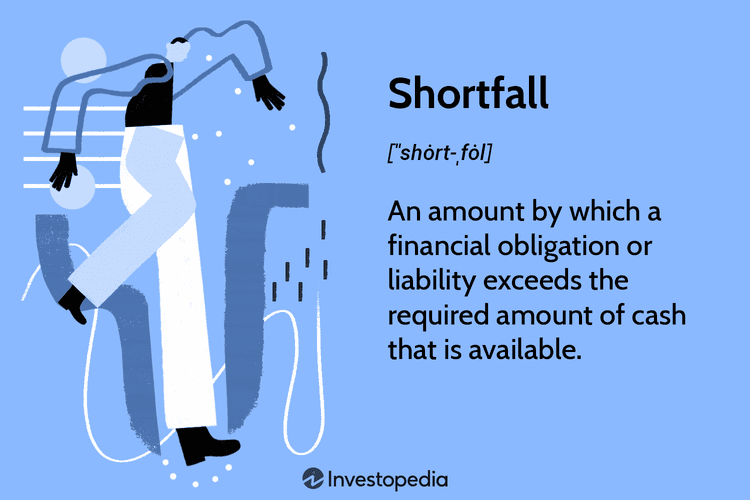

## Table of Contents

## What is a shortfall?

A shortfall is when you don't have enough of something that you need. It's like when you plan to have a certain amount of money, but you end up with less than you expected. This can happen in many situations, like not having enough money to pay bills, or not having enough supplies for a project.

Shortfalls can cause problems because they mean you can't do everything you planned. For example, if a company has a shortfall in its budget, it might have to cut back on spending or delay projects. It's important to plan carefully and keep track of your resources to avoid shortfalls, but sometimes they happen even when you try your best to prevent them.

## What are the common causes of a shortfall?

Shortfalls often happen because of unexpected events or mistakes in planning. For example, a business might not sell as many products as it thought it would, leading to less money coming in than expected. Or, a person might lose their job suddenly, causing a shortfall in their personal budget. These unexpected changes can throw off the best-laid plans and result in not having enough resources.

Another common cause of shortfalls is poor planning or miscalculations. Sometimes, people or organizations might overestimate how much money they will make or underestimate how much they will need to spend. For instance, a company might not account for rising costs of materials, or a family might not save enough for unexpected expenses like car repairs. When these miscalculations happen, it can lead to a shortfall.

Lastly, external factors like economic downturns or natural disasters can also cause shortfalls. If the economy is doing badly, businesses might see fewer customers and less income, leading to budget shortfalls. Natural disasters can disrupt supply chains or damage property, causing both businesses and individuals to face unexpected costs and resource shortages. These external events are often out of our control, but they can have a big impact on our resources.

## How does a shortfall impact individuals?

A shortfall can make life hard for people. When someone doesn't have enough money, they might not be able to pay their bills or buy things they need, like food or medicine. This can cause a lot of stress and worry. Sometimes, people might have to borrow money or use their savings to cover the shortfall, which can make things even harder in the future.

Shortfalls can also affect a person's plans and goals. For example, if someone was saving up to go to school or buy a house, a shortfall could mean they have to wait longer or give up on those dreams. This can be really disappointing and frustrating. It's important for people to try and plan carefully to avoid shortfalls, but sometimes they happen even when you do your best.

## How does a shortfall affect businesses?

When a business has a shortfall, it means they don't have enough money or resources to do everything they planned. This can make it hard for the business to pay its bills, like rent or salaries. If the shortfall is big, the business might have to cut back on spending, maybe by laying off workers or stopping certain projects. This can make the people who work there feel worried and unsure about their jobs.

A shortfall can also make it hard for a business to grow or improve. If a company wanted to buy new equipment or open a new store, but they don't have enough money, they might have to wait or change their plans. This can slow down the business and make it harder for them to compete with other companies. Sometimes, if the shortfall is really bad, the business might even have to close down, which can be sad for everyone involved.

## What are the economic consequences of a shortfall?

A shortfall can have big effects on the economy. When businesses don't have enough money, they might have to cut back on spending. This means they might buy fewer supplies or lay off workers. When workers lose their jobs, they have less money to spend on things they need, like food and clothes. This can make other businesses sell less, leading to more shortfalls and more job losses. It's like a chain reaction that can make the whole economy slow down.

Governments can also feel the impact of shortfalls. If businesses and people are [earning](/wiki/earning-announcement) less money, they pay less in taxes. This can lead to a shortfall in the government's budget, making it hard for them to pay for important things like schools and hospitals. Sometimes, the government might have to borrow money or raise taxes to cover the shortfall, which can make life harder for everyone. Overall, shortfalls can create a lot of problems and make the economy less stable.

## What are some basic solutions to address a shortfall?

One way to deal with a shortfall is to cut back on spending. This means looking at where you or your business are spending money and finding ways to spend less. For example, a family might decide to eat out less often or a business might choose to delay buying new equipment. By spending less, you can make the money you have last longer and help close the gap between what you have and what you need.

Another solution is to find ways to bring in more money. This could mean getting a second job, selling things you don't need, or for a business, finding new customers or selling more to existing ones. Sometimes, borrowing money can help, but it's important to be careful because you'll need to pay it back. By increasing your income, you can cover the shortfall and get back on track.

Lastly, planning better for the future can help prevent shortfalls from happening again. This means making a budget and sticking to it, saving money for unexpected expenses, and always keeping an eye on your finances. By being prepared and planning ahead, you can avoid many of the problems that come with not having enough money or resources.

## How can governments mitigate the effects of a shortfall?

Governments can help with shortfalls by spending less money. This means they might have to cut back on some programs or services. For example, they could delay building new roads or reduce funding for certain projects. By spending less, the government can make sure they have enough money to pay for the most important things, like schools and hospitals. This can help keep the economy stable and make sure people still get the services they need.

Another way governments can deal with shortfalls is by finding ways to bring in more money. They might do this by raising taxes or finding new ways to make money, like selling things they own. Sometimes, governments borrow money to cover a shortfall, but they have to be careful because they'll need to pay it back. By increasing their income, governments can make sure they have enough money to keep running and help people who are struggling.

Planning better for the future is also important. Governments can make budgets and stick to them, saving money for unexpected expenses. They can also keep a close eye on the economy and be ready to make changes if things start to go wrong. By being prepared and planning ahead, governments can avoid many of the problems that come with not having enough money and help keep the economy strong.

## What advanced strategies can businesses use to prevent shortfalls?

Businesses can use advanced strategies to prevent shortfalls by using something called "scenario planning." This means they think about different things that could happen in the future, like a sudden drop in sales or a big increase in costs. By planning for these different situations, businesses can be ready to change their plans quickly if something unexpected happens. They might decide to keep some extra money saved up, just in case, or they might make deals with suppliers to get better prices if costs go up. This way, they can avoid running out of money and keep their business running smoothly.

Another strategy is to use "diversification." This means a business doesn't just rely on one product or one group of customers. Instead, they try to sell different kinds of products or services to different kinds of people. If one part of their business isn't doing well, the other parts can help make up for it. For example, if a company that makes winter coats sees fewer sales because of a warm winter, they might also sell other things like hats or gloves that people still need. By spreading out their business, they can protect themselves from shortfalls and keep their income steady.

## How do shortfalls vary across different industries?

Shortfalls can be different in different industries because each industry has its own challenges and ways of making money. For example, in the farming industry, shortfalls can happen because of bad weather or diseases that hurt crops. Farmers might not be able to sell as much as they planned, which means they don't make enough money. On the other hand, in the tech industry, shortfalls might happen because of fast changes in technology. If a company's products become outdated quickly, they might not sell as well, leading to less money coming in.

In the retail industry, shortfalls can be caused by changes in what people want to buy. If a store has a lot of one type of product but people start wanting something different, the store might not sell enough to make money. In the construction industry, shortfalls can happen if there are delays in getting materials or if there are problems with the projects. These delays can make it hard for the company to finish jobs on time and get paid. Each industry has to deal with its own kind of shortfalls, and they need to find ways to plan and prepare for them.

## What are the long-term effects of recurring shortfalls?

Recurring shortfalls can cause big problems over time. For people, it means they might always be struggling to pay their bills and buy what they need. This can make them feel stressed and worried all the time. They might have to keep borrowing money or using their savings, which can make things even harder in the future. For businesses, recurring shortfalls can stop them from growing or improving. They might have to keep cutting back on spending, which can mean laying off workers or stopping projects. This can make the business weaker and less able to compete with others.

In the long run, recurring shortfalls can also hurt the economy. When businesses keep having shortfalls, they might have to lay off more workers, which means more people are out of work. This can make the whole economy slow down because people have less money to spend. Governments can also have a hard time if they keep facing shortfalls. They might have to cut back on important services like schools and hospitals, which can make life harder for everyone. Overall, recurring shortfalls can create a cycle of problems that are hard to break.

## How can predictive analytics be used to anticipate shortfalls?

Predictive analytics can help businesses and people guess when shortfalls might happen. It uses data and math to look at what has happened in the past and guess what might happen in the future. For example, a business can use predictive analytics to look at their sales numbers from the last few years. If they see that sales go down every winter, they can plan to have extra money saved up for that time. This way, they can be ready for the shortfall and not be surprised when it happens.

Governments can also use predictive analytics to plan better. They can look at things like how much money they made from taxes last year and guess how much they might make this year. If they see that there might be a shortfall, they can start planning early. They might decide to spend less money on some things or find new ways to bring in more money. By using predictive analytics, governments can avoid big problems and make sure they have enough money to keep things running smoothly.

## What are the global implications of widespread shortfalls?

When shortfalls happen all over the world, it can cause big problems for everyone. Countries might not have enough money to help their people, so they might have to cut back on important things like schools and hospitals. This can make life harder for people everywhere. If many countries are facing shortfalls at the same time, it can slow down the whole world's economy. People might lose their jobs, and businesses might have to close. This can make it hard for countries to trade with each other and can lead to even more problems.

On a global level, widespread shortfalls can also make it harder for countries to work together. If everyone is struggling, it can be tough to help each other out. For example, if one country needs food or medicine, other countries might not be able to give it to them because they are facing their own shortfalls. This can lead to more tension and less cooperation between countries. In the end, widespread shortfalls can make the world a more difficult and less stable place for everyone.

## References & Further Reading

[1]: Bergstra, J., Bardenet, R., Bengio, Y., & Kégl, B. (2011). ["Algorithms for Hyper-Parameter Optimization."](https://dl.acm.org/doi/10.5555/2986459.2986743) Advances in Neural Information Processing Systems 24.

[2]: ["Advances in Financial Machine Learning"](https://www.amazon.com/Advances-Financial-Machine-Learning-Marcos/dp/1119482089) by Marcos Lopez de Prado

[3]: ["Evidence-Based Technical Analysis: Applying the Scientific Method and Statistical Inference to Trading Signals"](https://www.amazon.com/Evidence-Based-Technical-Analysis-Scientific-Statistical/dp/0470008741) by David Aronson

[4]: ["Machine Learning for Algorithmic Trading"](https://github.com/stefan-jansen/machine-learning-for-trading) by Stefan Jansen

[5]: ["Quantitative Trading: How to Build Your Own Algorithmic Trading Business"](https://www.amazon.com/Quantitative-Trading-Build-Algorithmic-Business/dp/1119800064) by Ernest P. Chan