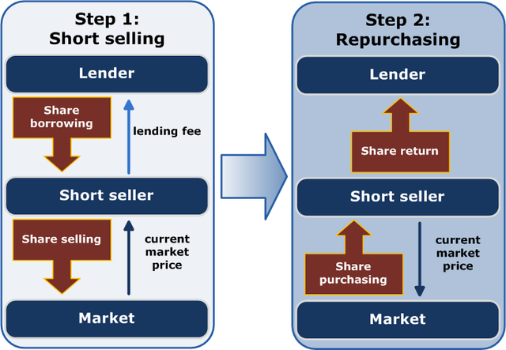

## Table of Contents

## What is shorting in the context of investing?

Shorting, or short selling, is a way to invest where you make money if a stock's price goes down. Instead of buying a stock and hoping it goes up, you borrow shares from someone else, sell them at the current price, and then buy them back later at a lower price. You return the borrowed shares and keep the difference as profit. It's like betting that a stock will decrease in value.

However, shorting can be risky. If the stock price goes up instead of down, you lose money. You have to buy back the shares at a higher price to return them, which means you'll have to pay more than you got when you sold them. Also, there's no limit to how much you could lose because a stock's price can keep going up. So, while shorting can be profitable, it's important to understand the risks involved.

## How does shorting differ from traditional investing?

Shorting and traditional investing are two different ways to make money in the stock market. In traditional investing, you buy a stock because you think its price will go up. If you're right and the price does go up, you can sell the stock for more than you paid for it, making a profit. It's like buying something cheap and selling it for a higher price later.

Shorting, on the other hand, is like betting that a stock's price will go down. Instead of buying the stock, you borrow it from someone else and sell it right away at the current price. Later, if the stock's price drops, you buy it back at the lower price, return the borrowed shares, and keep the difference as profit. It's the opposite of traditional investing because you make money when the stock's price falls, not when it rises.

Both methods have their own risks. With traditional investing, the most you can lose is the money you spent on the stock if its price goes to zero. But with shorting, your potential losses can be much bigger because there's no limit to how high a stock's price can go. If the stock's price goes up instead of down, you'll have to buy it back at a higher price to return the borrowed shares, which could cost you a lot more than you made from selling it initially.

## What are the basic steps to short a stock?

To short a stock, first you need to find a broker that allows short selling. Once you have a broker, you need to find a stock that you think will go down in price. You then tell your broker that you want to short that stock. Your broker will borrow the shares from someone else's account and sell them at the current market price. The money from the sale goes into your account.

Next, you wait for the stock price to drop. If it does, you buy back the same number of shares at the lower price. You give these shares back to the person your broker borrowed them from, and you keep the difference between the price you sold the shares for and the price you bought them back at. That's your profit.

But if the stock price goes up instead, you lose money. You still have to buy back the shares to return them, but now you have to pay more than you got when you sold them. The more the price goes up, the more you lose. So, it's important to watch the stock closely and decide when to buy back the shares, even if it means taking a loss.

## What are the risks associated with shorting stocks?

Shorting stocks can be risky. The main risk is that the stock price might go up instead of down. If that happens, you lose money. You have to buy back the shares at a higher price to return them, and the more the price goes up, the more you lose. There's no limit to how high a stock's price can go, so your potential losses can be huge. This is different from buying stocks, where the most you can lose is what you paid for them.

Another risk is that you might not be able to find shares to borrow. If a lot of people want to short the same stock, there might not be enough shares available. This can make it hard to start your short position. Also, the person you borrowed the shares from might want them back before you're ready to buy them back. This is called a short squeeze, and it can force you to buy back the shares at a bad time, which can cost you a lot of money.

Lastly, shorting can be emotionally tough. Watching a stock's price go up when you're hoping it goes down can be stressful. It's easy to make bad decisions when you're feeling stressed. Plus, shorting goes against the general trend of the market, which usually goes up over time. So, it's important to stay calm and stick to your plan, even when things aren't going your way.

## How can shorting be used in quantitative investing strategies?

Shorting can be a useful tool in quantitative investing strategies, where investors use math and data to make decisions. In these strategies, shorting can help investors balance their portfolios. For example, if a computer model predicts that a certain stock will go down, an investor might short that stock to make money if the prediction is right. This can help offset losses from other investments that are not doing well. By using shorting, investors can try to make money in both up and down markets, which can lead to more stable returns over time.

Another way shorting is used in quantitative strategies is through pairs trading. This involves finding two stocks that usually move together but are currently out of sync. An investor might short the stock that seems overpriced and buy the one that seems underpriced. If the stocks return to their normal relationship, the investor makes money from the short position on the overpriced stock and the long position on the underpriced one. This strategy can help reduce risk because it's based on the relationship between the two stocks, not just on guessing which way the market will go.

## What are some common quantitative models used for identifying shorting opportunities?

One common quantitative model for finding shorting opportunities is the mean reversion model. This model looks at how a stock's price moves over time. It assumes that if a stock's price goes up a lot, it will eventually come back down to its average price. So, if a stock is trading much higher than its usual price, a mean reversion model might suggest shorting it because it expects the price to fall back to normal. This model uses historical price data and statistical measures to predict when a stock might be due for a price drop.

Another model is the momentum model. This one looks at the speed and direction of a stock's price movement. If a stock's price has been going down quickly, a momentum model might suggest shorting it because it expects the downward trend to continue. Momentum models use indicators like moving averages and rate of change to spot stocks that are losing value fast. By shorting these stocks, investors hope to make money as the price keeps falling.

A third model is the [fundamental analysis](/wiki/fundamental-analysis) model. This model looks at a company's financial health, like its earnings, debts, and other numbers. If the model finds that a company's stock price is much higher than what its financials suggest it should be, it might recommend shorting the stock. The idea is that once investors realize the stock is overvalued, its price will drop. This model uses ratios like price-to-earnings and debt-to-equity to find stocks that might be good candidates for shorting.

## How does short interest impact stock prices and what does it indicate?

Short interest is the number of shares of a stock that have been sold short and not yet bought back. When short interest is high, it means a lot of people think the stock's price will go down. This can make the stock's price go down because more people are selling the stock than buying it. Also, high short interest can make the stock more volatile, meaning its price can go up and down a lot. If a lot of people are shorting a stock, and something good happens to the company, the stock price can shoot up as short sellers rush to buy back the shares to avoid bigger losses.

On the other hand, short interest can also lead to something called a short squeeze. This happens when the stock's price starts to go up, and short sellers have to buy back the shares to cut their losses. As they buy back the shares, the price goes up even more, which makes more short sellers buy back their shares, and the price can go up really fast. So, high short interest can be a sign that the stock might be ready for a big move, either up or down. It's like a warning that the stock could be risky, but it could also be a chance for big gains if you guess right.

## What are the regulatory and legal considerations when shorting stocks?

When shorting stocks, there are rules and laws you need to follow. One big rule is the uptick rule. This says you can only short a stock if its last price was higher than the one before it. This rule is meant to stop the stock price from falling too fast. Another rule is about borrowing shares. You need to make sure the shares you're shorting are really available to borrow. If you can't borrow them, you can't short the stock. Also, there are rules about how much you can short. Some stocks have limits on how many shares can be shorted at one time.

There are also laws to stop bad behavior when shorting. One law is against spreading false information about a company to make its stock price go down so you can make money from shorting it. This is called market manipulation, and it's illegal. Another law is about naked shorting, which is shorting a stock without borrowing the shares first. This is also illegal because it can make the stock price go down unfairly. So, when you're shorting stocks, you need to follow all these rules and laws to stay out of trouble.

## How can short squeezes affect a shorting strategy and how can they be mitigated?

A short squeeze can really mess up your shorting strategy. It happens when a lot of people have shorted a stock, and then something good happens to the company that makes the stock price go up. When this happens, short sellers start buying back the shares to avoid losing more money, which makes the price go up even more. This can turn into a cycle where the price keeps going up and up, and short sellers can lose a lot of money. So, if you're shorting a stock and there's a lot of short interest, you need to watch out for short squeezes because they can make your losses much bigger than you expected.

To mitigate the risk of a short squeeze, you can use a few different strategies. One way is to set a stop-loss order, which is like a safety net that automatically buys back the shares if the price goes up to a certain level. This can help limit your losses if a short squeeze happens. Another way is to keep an eye on the news and the company's performance. If you see something that could make the stock price go up, you might want to buy back the shares before a short squeeze starts. Also, you can try to short stocks with less short interest, because they're less likely to have a big short squeeze. By being careful and having a plan, you can reduce the risk of a short squeeze hurting your shorting strategy.

## What role does market timing play in successful shorting within quantitative investing?

Market timing is super important when you're shorting stocks in quantitative investing. It's all about figuring out the best time to short a stock and the best time to buy it back. If you short a stock at the right time, before its price starts to go down, you can make a lot of money. But if you get the timing wrong, and the stock's price goes up instead, you can lose a lot. So, in quantitative investing, people use math and computer models to try to predict when a stock's price will go down. These models look at things like how the stock has moved in the past, what's happening in the market right now, and other data to help make better timing decisions.

Even with all these tools, getting the timing right is still really hard. The stock market can be unpredictable, and things can change fast. That's why it's important to keep watching the stock and the market, and be ready to change your plan if you need to. If you see that the stock's price is starting to go up, you might want to buy it back quickly to avoid losing too much money. And if you think the stock's price is going to keep going down, you might want to wait a bit longer before buying it back. By being careful and using the right tools, you can make better timing decisions and increase your chances of making money from shorting stocks.

## How can advanced statistical techniques enhance the performance of shorting strategies?

Advanced statistical techniques can really help make shorting strategies work better. These techniques, like machine learning and regression analysis, can look at a lot of data and find patterns that are hard to see with just your eyes. For example, they can spot when a stock's price is likely to go down by looking at things like how the stock has moved in the past, what's happening in the market right now, and even news about the company. By using these techniques, you can make smarter decisions about which stocks to short and when to do it, which can lead to making more money and losing less.

Another way advanced [statistics](/wiki/bayesian-statistics) can help is by managing risk. These techniques can help you figure out how much risk you're taking when you short a stock. They can tell you things like how likely it is that the stock's price will go up instead of down, and how big your losses could be if that happens. By understanding these risks better, you can set up safety nets, like stop-loss orders, to protect yourself. This can make your shorting strategy safer and more reliable, so you can feel more confident about making money from shorting stocks.

## What are the latest trends and innovations in shorting within the field of quantitative investing?

In the world of quantitative investing, one of the latest trends in shorting is the use of [artificial intelligence](/wiki/ai-artificial-intelligence) (AI) and machine learning. These technologies can analyze huge amounts of data really fast, finding patterns and making predictions about which stocks might go down in price. By using AI, investors can make smarter choices about which stocks to short and when to do it. This can help them make more money and avoid big losses. Another cool thing is that AI can keep learning and getting better over time, which means the shorting strategies can improve and adapt to new market conditions.

Another innovation is the use of [alternative data](/wiki/best-alternative-data) sources. Instead of just looking at traditional financial data like stock prices and company earnings, investors are now using data from things like social media, satellite images, and even credit card transactions. This alternative data can give them a better picture of what's happening with a company and its stock. For example, if a lot of people are talking negatively about a company on social media, it might be a good time to short its stock. By using this new kind of data, investors can find shorting opportunities that others might miss, which can give them an edge in the market.

## What are Quantitative Strategies Utilizing Shorting?

Quantitative trading strategies often leverage shorting to hedge positions or capitalize on anticipated price declines. Shorting enables traders to pursue profit opportunities not only from rising markets but also from falling prices. Here, we explore several popular strategies that incorporate shorting.

Trend-following strategies are among the most common methods, where algorithms initiate short positions during predicted downward trends and enter long positions during upward trends. These strategies rely on technical indicators, such as moving averages, to identify potential trend reversals. For example, a [momentum](/wiki/momentum) indicator may signal a shorting opportunity when the short-term moving average crosses below the long-term moving average.

Arbitrage strategies frequently utilize shorting when discrepancies between related securities suggest overvaluation. Consider a pair-trading example where two correlated stocks diverge in price: one might appear overvalued relative to the other. An algorithm might simultaneously short the overvalued stock and go long on the undervalued one, anticipating that prices will eventually converge.

Index fund rebalancing provides another context for shorting. As funds adjust their holdings to match the index composition, discrepancies arise between the fund's asset levels and the index. These adjustments can create temporary price distortions, presenting shorting opportunities for traders to exploit the predicted pricing corrections. 

Central to these strategies is the use of mathematical models and statistical analysis to predict price movements accurately. Models like regression analysis, [machine learning](/wiki/machine-learning) algorithms, or econometric models help refine the timing and execution of short trades. A simple linear regression model might be expressed as:

$$
y = \beta_0 + \beta_1 x + \varepsilon
$$

where $y$ is the security's return, $x$ is the predictor variable, $\beta_0$ is the intercept, $\beta_1$ is the coefficient indicating the relationship strength, and $\varepsilon$ is the error term. By analyzing past data, these models enhance the precision of shorting strategies, making them more effective in volatile and complex markets.

## References & Further Reading

[1]: ["Advances in Financial Machine Learning"](https://www.amazon.com/Advances-Financial-Machine-Learning-Marcos/dp/1119482089) by Marcos Lopez de Prado

[2]: ["Evidence-Based Technical Analysis: Applying the Scientific Method and Statistical Inference to Trading Signals"](https://www.amazon.com/Evidence-Based-Technical-Analysis-Scientific-Statistical/dp/0470008741) by David Aronson

[3]: ["Machine Learning for Algorithmic Trading"](https://github.com/stefan-jansen/machine-learning-for-trading) by Stefan Jansen

[4]: ["Quantitative Trading: How to Build Your Own Algorithmic Trading Business"](https://books.google.com/books/about/Quantitative_Trading.html?id=j70yEAAAQBAJ) by Ernest P. Chan

[5]: Carr, P., & Wu, L. (2006). ["A Tale of Two Indices."](https://www.semanticscholar.org/paper/A-Tale-of-Two-Indices-Carr-Wu/794f4df5d1cc2395256427f68fe78df21c2696c4) The Journal of Derivatives, 13(3), 13-29.

[6]: Asness, C. S., Moskowitz, T. J., & Pedersen, L. H. (2013). ["Value and Momentum Everywhere."](https://pages.stern.nyu.edu/~lpederse/papers/ValMomEverywhere.pdf) The Review of Financial Studies, 26(9), 2323–2369.

[7]: Boehmer, E., Jones, C. M., & Zhang, X. (2008). ["Shackling Short Sellers: The 2008 Shorting Ban."](https://academic.oup.com/rfs/article-abstract/26/6/1363/1595651) National Bureau of Economic Research.