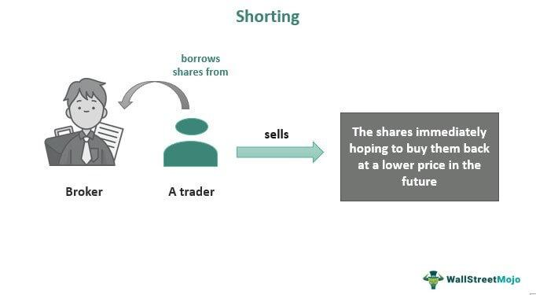

In quantitative investing and algorithmic trading, shorting is a fundamental concept. Shorting, or short selling, involves the sale of securities not currently owned, with the intention of purchasing them later at a reduced price. The process typically includes borrowing the securities, selling them in the open market, and eventually buying them back, ideally at a lower cost, to return to the lender. This method allows traders to benefit from declining prices, making it a valuable strategy during market downturns.

Algorithmic traders frequently employ shorting as a means to exploit anticipated price declines. The integration of short selling in quantitative strategies leverages advanced algorithms that can analyze vast datasets and execute trades at optimal moments to enhance profitability. Such strategies not only focus on timing but also involve complex statistical models to predict price movements accurately.



The practice of shorting complements various algorithmic trading strategies by providing the means to achieve market-neutral positions, enhance portfolio diversification, or capitalize on arbitrage opportunities. As shorting directly influences market dynamics, its widespread use by algorithmic traders contributes to market liquidity and the price discovery process.

Understanding the mechanics of shorting, its strategic applications, and inherent risks is essential for traders. Although shorting offers substantial opportunities for profit, it also carries risks, such as the potential for unlimited losses if the market moves against the short position.

This article aims to explore the intricacies of shorting within the context of quantitative strategies, its implementation in algorithmic trading, and the associated risks and challenges. With continuous advancements in technology and methodologies, shorting remains a relevant and potent strategy in the toolkit of sophisticated quantitative traders.

## Table of Contents

## Understanding Shorting

Shorting involves borrowing securities and selling them on the open market with plans to repurchase them later at a reduced price. This financial maneuver is based on the projection that the prices of the involved securities will decrease. Traditionally, the mechanism of shorting involves several steps: the trader borrows the securities, sells them immediately at the current market price, waits for a price decline, repurchases the securities at the reduced price, and finally returns them to the lender, pocketing the difference as profit. 

In [quantitative trading](/wiki/quantitative-trading), shorting strategies are frequently automated through sophisticated algorithms designed to
optimize the timing and execution of trades. Algorithms analyze large datasets to identify pricing inefficiencies and trends, thereby enabling traders to execute short positions at the most opportune moments. Automation in shorting enhances precision and speed, essential factors for capitalizing on temporary market movements.

A thorough understanding of the shorting process, particularly elements such as margin requirements and borrowing costs, is crucial. Margin requirements dictate the minimum amount of equity an investor must maintain in the short position, serving as a safeguard for brokers against potential losses. The costs associated with borrowing securities, often referred to as “borrow rates” or “short interest,” can vary significantly based on factors such as the [liquidity](/wiki/liquidity-risk-premium) and demand of the security being shorted. These costs are effectively the interest charged by the lender for borrowing the securities, and they represent an important consideration that can impact the profitability of a shorting strategy.

Shorting is not limited to stocks; it finds application in a variety of financial markets. Within the stock market, both individual stocks and stock indices can be shorted. Options markets provide mechanisms such as "put options" which allow traders to profit from downward movements without directly shorting a stock. Similarly, the futures market offers instruments that can be shorted, enabling traders to speculate on declining prices of commodities or indices.

Overall, shorting is a fundamental technique within quantitative trading, allowing market participants to exploit anticipated declines across diverse financial instruments through automated and strategically timed positions. Understanding the intricacies of shorting, including the mechanisms and costs involved, is essential for traders aiming to harness its full potential within their [algorithmic trading](/wiki/algorithmic-trading) strategies.

## Quantitative Strategies Utilizing Shorting

Quantitative trading strategies often leverage shorting to hedge positions or capitalize on anticipated price declines. Shorting enables traders to pursue profit opportunities not only from rising markets but also from falling prices. Here, we explore several popular strategies that incorporate shorting.

Trend-following strategies are among the most common methods, where algorithms initiate short positions during predicted downward trends and enter long positions during upward trends. These strategies rely on technical indicators, such as moving averages, to identify potential trend reversals. For example, a [momentum](/wiki/momentum) indicator may signal a shorting opportunity when the short-term moving average crosses below the long-term moving average.

Arbitrage strategies frequently utilize shorting when discrepancies between related securities suggest overvaluation. Consider a pair-trading example where two correlated stocks diverge in price: one might appear overvalued relative to the other. An algorithm might simultaneously short the overvalued stock and go long on the undervalued one, anticipating that prices will eventually converge.

Index fund rebalancing provides another context for shorting. As funds adjust their holdings to match the index composition, discrepancies arise between the fund's asset levels and the index. These adjustments can create temporary price distortions, presenting shorting opportunities for traders to exploit the predicted pricing corrections. 

Central to these strategies is the use of mathematical models and statistical analysis to predict price movements accurately. Models like regression analysis, [machine learning](/wiki/machine-learning) algorithms, or econometric models help refine the timing and execution of short trades. A simple linear regression model might be expressed as:

$$
y = \beta_0 + \beta_1 x + \varepsilon
$$

where $y$ is the security's return, $x$ is the predictor variable, $\beta_0$ is the intercept, $\beta_1$ is the coefficient indicating the relationship strength, and $\varepsilon$ is the error term. By analyzing past data, these models enhance the precision of shorting strategies, making them more effective in volatile and complex markets.

## Implementing Shorting in Algorithmic Trading

Algorithmic trading systems harness the power of automation to streamline the shorting process through carefully crafted algorithms based on statistical models. At the core of implementing shorting in such systems is the precise determination of entry and [exit](/wiki/exit-strategy) points, crucial for optimizing trades. This determination is often guided by robust market data analysis, employing a wide array of indicators and predictive analytics to identify potential downturns in asset prices. 

To set up an algorithmic short, traders must define criteria that trigger entry into a short position and, similarly, define conditions for exit. Entry points are generally determined based on signals derived from technical analysis or machine learning models predicting future price movements. For instance, a simple moving average crossover could serve as a signal to initiate a short position when a shorter-term moving average crosses below a longer-term one. Exit points, on the other hand, may be dictated by similar indicators or conditions such as reaching a predefined price target or the activation of a stop-loss order. 

High-frequency trading ([HFT](/wiki/high-frequency-trading-strategies)) represents a sophisticated application within algorithmic trading, enabling the execution of short trades in mere fractions of a second. These systems are designed to exploit minute price discrepancies in assets with high liquidity, leveraging rapid execution speeds to gain an advantage over less agile market participants. HFT algorithms utilize low-latency networks and co-location services near exchanges to reduce delays and enhance precision in trade execution.

Effective risk management is integral to managing the potential downsides associated with shorting. Short positions inherently [carry](/wiki/carry-trading) the risk of unlimited losses, as there is no cap on how high prices can rise. Implementing risk management protocols, such as stop-loss orders, helps mitigate this risk by automatically closing a position when it reaches a certain level of loss. Diversification across multiple sectors or asset classes can further moderate risk. Moreover, algorithmic systems often incorporate dynamic position sizing techniques to adjust exposure based on market conditions and [volatility](/wiki/volatility-trading-strategies).

Backtesting is a critical component in the development and refinement of shorting strategies within algorithmic trading. By applying strategies to historical data, traders can evaluate their performance and make informed adjustments before deploying them in live markets. This step is vital for verifying the robustness of a strategy under different market conditions and scenarios. A successful [backtesting](/wiki/backtesting) framework considers factors such as transaction costs, slippage, and compliance with real-world trading constraints. 

In practice, an algorithm might execute the following in Python using a backtesting library:

```python
from backtesting import Backtest, Strategy
from backtesting.lib import crossover

class ShortStrategy(Strategy):
    def init(self):
        price = self.data.Close
        self.short_ma = self.I(SMA, price, 50)
        self.long_ma = self.I(SMA, price, 200)

    def next(self):
        if crossover(self.short_ma, self.long_ma):
            self.sell()
        elif crossover(self.long_ma, self.short_ma):
            self.position.close()

bt = Backtest(data, ShortStrategy, cash=10000, commission=.002)
stats = bt.run()
bt.plot()
```

This simplistic model triggers a short position when a short-term moving average crosses below a long-term moving average. Despite its simplicity, such backtested strategies can serve as a foundation, subsequently refined through more complex algorithms, including those integrating real-time analytics and machine learning predictions.

## Risks and Challenges of Shorting

Shorting, or short selling, carries significant risks that require diligent consideration and robust risk management strategies. One of the primary risks associated with shorting is the potential for unlimited losses. Unlike traditional investing, where the maximum loss is limited to the initial investment, shorting exposes the trader to losses that can theoretically extend infinitely, as stock prices can rise without bound.

Technical challenges also present considerable risks to shorting strategies. Latency issues, which refer to the delay in the execution of trade orders, can significantly affect the profitability and effectiveness of a short position. High-frequency trading, often employed in algorithmic strategies, is particularly sensitive to latency, as even millisecond delays can result in substantial deviations from expected outcomes.

Market conditions introduce additional complexity and risk to shorting activities. Shorting strategies are particularly vulnerable to sudden volatility, which can lead to rapid and unpredictable price changes. Such volatility can quickly erode profits or increase losses, especially if the market moves aggressively against the expected trend. The "short squeeze" phenomenon, where a heavily shorted stock's price rises sharply, forcing short sellers to cover their positions at higher prices, is a classic example of volatility impacting short positions.

Regulatory environments also pose challenges to short sellers. Different markets enforce distinct rules and restrictions on short selling, which can influence a trader's ability to initiate or sustain short positions. Regulations may include requirements like the uptick rule, which allows short selling only at a price higher than the last trade, or mandatory disclosure of large short positions. Complying with these regulations necessitates a thorough understanding of each market's legal framework and the associated operational constraints.

Effective risk management practices are crucial in mitigating the risks inherent in shorting. Diversification, setting strict loss limits, and employing stop-loss orders can protect against severe losses. Diversification involves spreading investments across different securities, reducing exposure to any single asset that might experience unforeseen positive price movements. Additionally, the implementation of stop-loss orders helps in automatically closing a position when the price reaches a predefined level, thereby limiting potential losses.

In conclusion, while shorting provides opportunities for profit, especially in declining markets, the associated risks require careful management. Comprehensive risk management practices, awareness of technical and market-based challenges, and adherence to regulatory requirements are critical to successfully utilizing shorting as a strategy in algorithmic trading.

## The Future of Shorting in Algorithmic Trading

The evolution of technology, including advancements in machine learning and [artificial intelligence](/wiki/ai-artificial-intelligence) (AI), is opening new avenues for shorting strategies in algorithmic trading. These innovations enhance the precision of market predictions, thereby reducing the risks traditionally associated with short selling. Machine learning algorithms can analyze vast datasets to identify patterns and predict price movements with greater accuracy than conventional methods. For instance, neural networks and [reinforcement learning](/wiki/reinforcement-learning) models can adapt to changing market conditions, allowing for more effective short positions that anticipate future market trends.

Algorithmic advancements are not just confined to predictive accuracy but also extend to execution speed and efficiency. High-frequency trading (HFT) systems benefit significantly from machine learning by utilizing complex models that can optimize the timing of short trades to milliseconds, seizing opportunities quickly as they arise.

Ethical and regulatory considerations increasingly influence the landscape of short-selling practices. Regulatory bodies across various markets are imposing stricter guidelines to ensure that short selling is conducted transparently and ethically. These regulations are aimed at mitigating potential manipulative practices and maintaining market stability. As market environments evolve, traders may face increased scrutiny regarding the ethical implications of their strategies, especially in contexts where shorting could be perceived to destabilize financial systems.

The future may witness heightened regulation of shorting practices, particularly as their impact on market stability comes under examination. This could lead to tighter constraints on the ability to initiate or maintain short positions. However, despite these challenges, short selling remains a key aspect of sophisticated quantitative trading strategies. Its role in providing liquidity and contributing to price discovery cannot be understated, and its strategic use will likely persist as traders continuously adapt to regulatory changes while leveraging technological advancements.

Overall, while shorting in algorithmic trading will be shaped by emerging technological and regulatory landscapes, it is expected to remain a central component of advanced trading frameworks. Prudent traders will balance innovation with ethical and regulatory compliance, ensuring their strategies not only seek profitability but also align with broader market integrity objectives.

## Conclusion

Shorting in quantitative investing and algorithmic trading provides a strategic avenue for capitalizing on market downturns. This technique allows traders to profit from declining asset prices, offering a vital hedge against market volatility. However, the potential rewards come with inherent risks that demand meticulous strategy design and execution. One key challenge is the possibility of unlimited losses since asset prices can rise indefinitely. 

Advanced technologies, such as machine learning and artificial intelligence, continually evolve the landscape of shorting. These advancements enhance the precision and accuracy of market predictions, making shorting techniques more viable and effective. By leveraging these technologies, traders can potentially identify profitable shorting opportunities with greater accuracy, thus improving their risk-adjusted returns.

Practitioners must exercise caution and adhere to robust risk management practices. This includes setting stop-loss orders, diversifying strategies, and maintaining strict loss limits to mitigate the risks associated with shorting. Effective risk management is crucial to avoid significant losses and maintain financial stability.

Despite the challenges and risks, shorting remains an essential strategy for quantitative algorithmic traders. It offers a means of executing diversified strategies, enabling traders to profit in various market conditions. By balancing opportunity with caution, shorting can be a powerful tool that complements a trader's portfolio, providing opportunities for profit in a dynamic and often unpredictable market environment.

## References & Further Reading

[1]: ["Advances in Financial Machine Learning"](https://www.amazon.com/Advances-Financial-Machine-Learning-Marcos/dp/1119482089) by Marcos Lopez de Prado

[2]: ["Evidence-Based Technical Analysis: Applying the Scientific Method and Statistical Inference to Trading Signals"](https://www.amazon.com/Evidence-Based-Technical-Analysis-Scientific-Statistical/dp/0470008741) by David Aronson

[3]: ["Machine Learning for Algorithmic Trading"](https://github.com/stefan-jansen/machine-learning-for-trading) by Stefan Jansen

[4]: ["Quantitative Trading: How to Build Your Own Algorithmic Trading Business"](https://books.google.com/books/about/Quantitative_Trading.html?id=j70yEAAAQBAJ) by Ernest P. Chan

[5]: Carr, P., & Wu, L. (2006). ["A Tale of Two Indices."](https://www.semanticscholar.org/paper/A-Tale-of-Two-Indices-Carr-Wu/794f4df5d1cc2395256427f68fe78df21c2696c4) The Journal of Derivatives, 13(3), 13-29.

[6]: Asness, C. S., Moskowitz, T. J., & Pedersen, L. H. (2013). ["Value and Momentum Everywhere."](https://pages.stern.nyu.edu/~lpederse/papers/ValMomEverywhere.pdf) The Review of Financial Studies, 26(9), 2323–2369.

[7]: Boehmer, E., Jones, C. M., & Zhang, X. (2008). ["Shackling Short Sellers: The 2008 Shorting Ban."](https://academic.oup.com/rfs/article-abstract/26/6/1363/1595651) National Bureau of Economic Research.