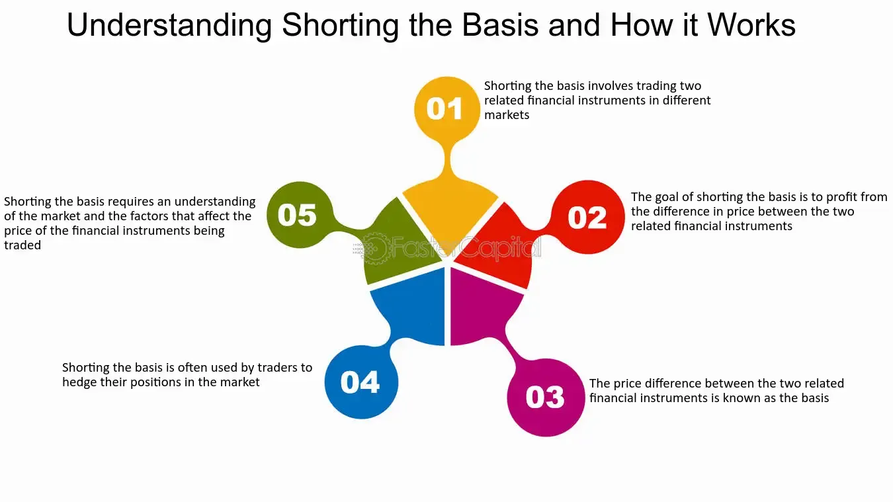

## Table of Contents

## What is shorting the basis?

Shorting the basis is a trading strategy used in futures markets. It involves selling a futures contract while simultaneously buying the underlying asset. The goal is to profit from the difference between the price of the futures contract and the price of the underlying asset, which is known as the basis. Traders use this strategy when they believe the basis will narrow, meaning the futures price will fall faster than the price of the underlying asset.

For example, imagine a farmer who grows wheat. The farmer can sell wheat futures contracts at today's price but needs to deliver the wheat later. If the farmer thinks the difference between the futures price and the actual price of wheat will decrease, they might short the basis. They would sell the futures contract and buy physical wheat. If the basis narrows as expected, the farmer can make a profit from the difference. This strategy can be risky because it depends on correctly predicting how the basis will change.

## What are the basic components involved in shorting the basis?

Shorting the basis involves two main parts: selling a futures contract and buying the underlying asset. A futures contract is an agreement to buy or sell something at a set price in the future. The underlying asset is the actual thing you're trading, like wheat or oil. When you short the basis, you sell the futures contract because you think its price will go down faster than the price of the actual asset. At the same time, you buy the real asset, hoping to make money from the difference between these two prices.

The key to this strategy is the basis, which is the difference between the futures price and the price of the underlying asset. If you think this difference will get smaller, you can make a profit by shorting the basis. For example, if you sell a futures contract for wheat at $5 per bushel and buy actual wheat at $4.50 per bushel, your basis is $0.50. If the futures price drops to $4.80 and the wheat price stays at $4.50, the basis narrows to $0.30. You can then close your positions and make a profit from the change in the basis.

## How does shorting the basis differ from traditional short selling?

Shorting the basis is different from traditional short selling because it involves two steps instead of one. In traditional short selling, you borrow an asset, like a stock, and sell it, hoping to buy it back later at a lower price. You make money if the price goes down. But with shorting the basis, you're not just betting on one price going down. You're betting on the difference between two prices getting smaller. You sell a futures contract and buy the actual asset at the same time.

The main difference is what you're trying to profit from. In traditional short selling, you're focused on the price of one thing going down. With shorting the basis, you're focused on the gap between the futures price and the actual asset price getting smaller. This can be trickier because you have to keep an eye on both prices and how they move compared to each other. It's a more complex strategy that can be riskier but also potentially more rewarding if you guess right about how the basis will change.

## What are the primary motivations for shorting the basis?

People short the basis when they think the difference between the futures price and the actual price of an asset will get smaller. This difference is called the basis. If someone believes that the futures price will drop faster than the price of the real asset, they can make money by selling the futures contract and buying the actual asset at the same time. This strategy is often used by people who work directly with the asset, like farmers or oil producers, who want to manage their risks or make extra money from price changes.

Another reason to short the basis is to take advantage of temporary market conditions. Sometimes, the futures price might be much higher than the actual price because of things like supply and demand changes or market speculation. If someone thinks these conditions will change soon, they might short the basis to profit from the expected narrowing of the gap. This strategy needs careful planning and a good understanding of the market, but it can be a smart way to make money if done right.

## What are the risks associated with shorting the basis?

Shorting the basis can be risky because it depends on two prices moving in a certain way. If the futures price doesn't go down faster than the price of the real asset, you could lose money. For example, if you sell a futures contract for wheat at $5 and buy actual wheat at $4.50, hoping the gap will narrow, but instead the futures price stays the same or goes up while the wheat price drops, you'll end up losing money. It's a tricky strategy because you need to predict how both prices will change compared to each other.

Another risk is that shorting the basis can be affected by things you can't control, like sudden changes in the market or unexpected events. If there's a big news event that makes the futures price jump up or the actual asset price drop suddenly, your plan could go wrong. Also, if you're not careful with how much you're betting, you could lose more money than you planned. It's important to understand these risks and be ready for them when you decide to short the basis.

## How do you calculate the basis in a futures contract?

To calculate the basis in a futures contract, you need to know two things: the price of the futures contract and the price of the actual asset. The basis is just the difference between these two prices. For example, if the futures price for wheat is $5 per bushel and the actual price of wheat is $4.50 per bushel, the basis is $0.50. You can find this by subtracting the actual price from the futures price: $5 - $4.50 = $0.50.

The basis can be positive or negative, depending on whether the futures price is higher or lower than the actual price. If the futures price is lower than the actual price, the basis will be negative. For instance, if the futures price for oil is $60 per barrel and the actual price is $62 per barrel, the basis would be -$2. It's important to keep track of the basis because it helps you understand how the futures market relates to the real market, and it's key to strategies like shorting the basis.

## What are the steps to execute a short basis trade?

To execute a short basis trade, you first need to sell a futures contract. This means you agree to sell something at a set price in the future. You do this because you think the price of the futures contract will go down faster than the price of the actual thing you're trading, like wheat or oil. At the same time, you buy the real thing. So, if you're trading wheat, you sell a futures contract for wheat and buy actual wheat. You're betting that the difference between these two prices, called the basis, will get smaller.

Once you've set up your trade, you need to watch both prices closely. If the futures price drops more than the price of the real thing, the basis will narrow, and you can make a profit. For example, if you sold a futures contract for wheat at $5 per bushel and bought actual wheat at $4.50 per bushel, your basis is $0.50. If the futures price drops to $4.80 and the wheat price stays at $4.50, the basis narrows to $0.30. You can then close your positions by buying back the futures contract and selling the wheat, making money from the change in the basis.

## How does the timing of futures and spot market transactions affect shorting the basis?

The timing of when you do things in the futures and spot markets is really important for shorting the basis. You need to sell the futures contract and buy the actual thing at the same time, or as close as possible. If you wait too long to do one of these things, the prices might change in a way that messes up your plan. For example, if you sell the futures contract first and then the futures price goes up before you buy the real thing, the basis might not narrow like you hoped, and you could lose money.

Also, you need to think about when you will close your positions. You want to buy back the futures contract and sell the real thing when the basis has gotten smaller. If you wait too long and the basis starts to get bigger again, you could miss out on your profit or even lose money. So, watching the timing carefully and being ready to act quickly is key to making shorting the basis work well.

## What are some common strategies for managing a short basis position?

When you're shorting the basis, one common strategy is to keep a close eye on both the futures price and the actual price of the thing you're trading. You want to make sure that the difference between these two prices, which is the basis, is getting smaller like you hoped. If you see that the basis isn't narrowing or is starting to get bigger, you might want to close your positions early to avoid losing money. This means buying back the futures contract and selling the real thing before the situation gets worse.

Another strategy is to use stop-loss orders to limit how much you could lose. A stop-loss order is like a safety net that automatically closes your trade if the price moves against you too much. For example, if you set a stop-loss order on your futures contract, it will buy it back if the price goes up past a certain point. This can help protect you from big losses if the market moves in a way you didn't expect. By using these strategies, you can manage your short basis position more safely and increase your chances of making a profit.

## How can market conditions influence the success of shorting the basis?

Market conditions can really affect how well shorting the basis works. If there's a lot of uncertainty or big changes in the market, like sudden news about supply and demand, it can make the futures price and the actual price move in unexpected ways. For example, if there's a surprise announcement about a big new wheat harvest, the futures price might drop a lot, but if it drops more than the actual price of wheat, the basis might not narrow like you hoped. So, you need to pay close attention to what's going on in the market and be ready to adjust your strategy if things change.

Another way market conditions can impact shorting the basis is through changes in interest rates or storage costs. If interest rates go up, it can make it more expensive to hold onto the futures contract, which might affect how the basis changes. Also, if the cost of storing the actual thing you're trading goes up, it could make the basis wider instead of narrower. So, understanding these market factors and how they might change can help you decide when and how to short the basis to increase your chances of making a profit.

## What advanced techniques can be used to optimize a short basis strategy?

One advanced technique to optimize a short basis strategy is using technical analysis to predict how the futures and actual prices might move. Technical analysis involves looking at past price charts and using tools like moving averages and trend lines to spot patterns. By studying these patterns, you can make better guesses about when the basis might narrow. For example, if you see that the futures price often drops after reaching a certain level, you might decide to short the basis right before that happens. This can help you time your trades better and increase your chances of making a profit.

Another technique is to use hedging to manage risk. Hedging means taking another position in the market that can help protect you if things don't go as planned. For instance, if you're shorting the basis with wheat, you might also buy a put option on wheat futures. A put option gives you the right to sell the futures contract at a set price, which can limit your losses if the futures price goes up instead of down. By using hedging, you can feel more secure about trying to short the basis, knowing you have a backup plan if the market moves against you.

## How do regulatory environments impact the practice of shorting the basis?

The rules and laws set by governments and financial watchdogs can really change how people short the basis. Different countries have different rules about trading futures and the actual things you're trading. Some places might have tight rules that make it harder to short the basis, like limits on how much you can trade or needing special permission to do certain trades. These rules are there to stop the market from getting too wild and to protect people from losing too much money. But they can also make it trickier to use strategies like shorting the basis, because you have to be careful to follow all the rules.

On top of that, changes in these rules can shake things up. If a government decides to make new laws or change old ones, it can mess with the prices in the futures and spot markets. For example, if a new rule makes it harder to trade futures, the futures price might go up or down in a way you didn't expect. This can make the basis wider or narrower without warning, which can be bad news if you're trying to short the basis. So, it's important to keep an eye on what the regulators are doing and be ready to change your plans if the rules change.

## What is 'Short the Basis'?

"Short the basis" is a hedging strategy in futures trading that involves two simultaneous actions: buying a futures contract and selling the corresponding underlying asset in the spot market. This approach is strategically designed to neutralize price risk by locking in a price differential, thereby stabilizing potential revenue streams or costs for a predetermined period.

For instance, consider a wheat producer anticipating next year's harvest. The producer can "short the basis" by selling wheat in the spot market and purchasing wheat futures contracts. By doing so, they are essentially hedging against the risk of falling wheat prices in the future. If the spot price of wheat declines, losses in the spot market could be offset by gains in the futures market, where the producer has secured a buy position at a potentially lower price. This allows the producer to lock in a profit margin irrespective of downward price movements.

The strategic essence of shorting the basis lies in its capacity to narrow the gap between futures and spot prices. Unlike mere long or short positions, this strategy seeks to exploit the price differential between the two markets. By shorting the basis, market participants—be they producers, traders, or speculators—can mitigate risks associated with price [volatility](/wiki/volatility-trading-strategies) and enhance their financial outcomes. This strategy is particularly vital for entities that require stable revenue or cost conditions over a defined period, such as agricultural producers, manufacturers, or commodity exporters. 

In mathematics, the relation between the spot price, futures price, and the basis can be represented as:

$$
\text{Basis} = \text{Spot Price} - \text{Futures Price}
$$

This equation captures how shorting the basis aims to manage variations in the basis value, allowing traders to capture [arbitrage](/wiki/arbitrage) opportunities and hedge effectively against potential price adversities. As market conditions fluctuate, successful shorting of the basis ensures that the financial impact on the market participant remains within manageable and predictable limits.

## References & Further Reading

[1]: Hull, J. C. (2017). ["Options, Futures, and Other Derivatives."](https://www.semanticscholar.org/paper/Options%2C-Futures%2C-and-Other-Derivatives-Hull/89bdee500c8623864fc9eb7a471546aa713acc44) Pearson Education.

[2]: Kaminski, K. M. (2014). ["The Role of Hedging in Commercial Real Estate Investment."](https://www.annualreviews.org/content/journals/10.1146/annurev-financial-110311-101741) Journal of Portfolio Management.

[3]: Hull, J. C. (2006). ["Risk Management and Financial Institutions."](https://www.amazon.com/Management-Financial-Institutions-Wiley-Finance/dp/1119932483) Wiley.

[4]: Tsay, R. S. (2010). ["Analysis of Financial Time Series."](https://onlinelibrary.wiley.com/doi/book/10.1002/9780470644560) Wiley.

[5]: Cartea, Á., Jaimungal, S., & Penalva, J. (2015). ["Algorithmic and High-Frequency Trading."](https://assets.cambridge.org/97811070/91146/frontmatter/9781107091146_frontmatter.pdf) Cambridge University Press.

[6]: Murphy, J. J. (1999). ["Technical Analysis of the Financial Markets."](https://archive.org/details/technicalanalysi0000murp) New York Institute of Finance.