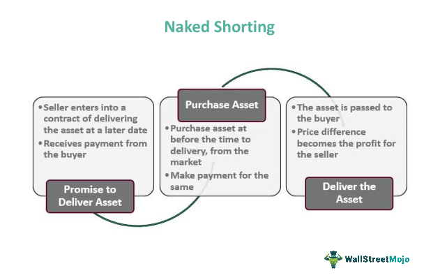

Futures trading is a fundamental component of the financial markets, playing a crucial role in both hedging and speculation activities. This trading mechanism enables participants to navigate future uncertainties by locking in prices today for transactions scheduled at a later date. Among the various strategies employed in futures trading, "short the basis" stands out as a notable approach for mitigating price risks. This strategy entails purchasing a futures contract while concurrently selling the underlying asset in the spot market. Its primary goal is to hedge against potential price fluctuations by solidifying a price differential, thus offering stability in revenue or costs over specific timeframes.

Participants utilizing this strategy often include producers and speculators who wish to manage their exposure to unfavorable price movements. The ability of traders to strategically narrow the gap between futures and spot prices highlights the importance of this approach. Furthermore, advancements in financial technologies are playing an increasingly critical role in refining these strategies. Algorithmic trading, in particular, has revolutionized how traders engage with futures markets. By leveraging algorithms, traders can automate complex strategies and optimize the timing and conditions of their trades, enhancing the efficiency and effectiveness of their operations.



As the landscape of futures markets continues to evolve, understanding the intricate mechanics of shorting the basis becomes essential. Such knowledge equips traders with vital tools for managing risk and seizing market opportunities. Moreover, the integration of sophisticated technologies like algorithmic trading into these strategies signifies a new era in trading practices, promising greater precision and adaptability in ever-changing market conditions.

## Table of Contents

## What is 'Short the Basis'?

"Short the basis" is a hedging strategy in futures trading that involves two simultaneous actions: buying a futures contract and selling the corresponding underlying asset in the spot market. This approach is strategically designed to neutralize price risk by locking in a price differential, thereby stabilizing potential revenue streams or costs for a predetermined period.

For instance, consider a wheat producer anticipating next year's harvest. The producer can "short the basis" by selling wheat in the spot market and purchasing wheat futures contracts. By doing so, they are essentially hedging against the risk of falling wheat prices in the future. If the spot price of wheat declines, losses in the spot market could be offset by gains in the futures market, where the producer has secured a buy position at a potentially lower price. This allows the producer to lock in a profit margin irrespective of downward price movements.

The strategic essence of shorting the basis lies in its capacity to narrow the gap between futures and spot prices. Unlike mere long or short positions, this strategy seeks to exploit the price differential between the two markets. By shorting the basis, market participants—be they producers, traders, or speculators—can mitigate risks associated with price volatility and enhance their financial outcomes. This strategy is particularly vital for entities that require stable revenue or cost conditions over a defined period, such as agricultural producers, manufacturers, or commodity exporters. 

In mathematics, the relation between the spot price, futures price, and the basis can be represented as:

$$
\text{Basis} = \text{Spot Price} - \text{Futures Price}
$$

This equation captures how shorting the basis aims to manage variations in the basis value, allowing traders to capture [arbitrage](/wiki/arbitrage) opportunities and hedge effectively against potential price adversities. As market conditions fluctuate, successful shorting of the basis ensures that the financial impact on the market participant remains within manageable and predictable limits.

## Understanding Basis Risk

Basis risk is a critical concern in futures trading, arising when the price of a futures contract does not move in tandem with the underlying spot price. This discrepancy can undermine hedging strategies intended to stabilize costs or revenue. Several market factors contribute to basis risk, making its management essential for effective risk mitigation.

One source of basis risk is seasonal variations. Agricultural commodities, for example, experience price shifts due to planting and harvest periods, which can cause futures and spot prices to diverge. Market [volatility](/wiki/volatility-trading-strategies) further exacerbates basis risk. Sharp, unexpected changes in market dynamics can alter the relationship between spot and futures prices. For instance, geopolitical events or natural disasters might disrupt typical pricing patterns, increasing basis risk.

Supply-demand dynamics also play a crucial role. Imbalances in supply and demand can lead to significant differences between futures and spot prices. Consider a scenario where a sudden surge in demand significantly increases the spot price, while the futures price, locked in at an earlier level that doesn’t immediately reflect this surge, remains unchanged — this gap exemplifies basis risk.

Managing basis risk is vital for hedgers who use futures contracts to protect against adverse price movements in the spot market. Effective strategies might include diversification of futures contracts, active monitoring of market conditions, and employing statistical models to forecast potential basis changes. By understanding and responding to basis risk, traders can better align their hedging activities with market realities, thereby reducing the likelihood of financial loss due to unforeseen price disparities.

## Short the Basis vs. Long the Basis

While shorting the basis involves holding a short position in the underlying asset paired with a long position in futures, the strategy known as "long the basis" constitutes the reverse approach. In a long the basis strategy, a trader anticipates that the spot price will rise relative to the futures price, prompting them to hold a long position in the underlying asset while simultaneously taking a short position in the futures contract.

### Strategy Comparison

#### Short the Basis
- **Objective:** Protect against declining spot prices or exploit a favorable futures price by locking in a future sale price.
- **Mechanism:** Gain from a decrease in the basis, where the spot price falls relative to the futures price.
- **Example:** A wheat farmer might sell the wheat in the spot market and secure a future buy-back at a lower price through futures, benefiting if the spot price decreases.

#### Long the Basis
- **Objective:** Capitalize on a basis increase, where the spot price rises faster than the futures prices, or to profit from expected cost increases of output.
- **Mechanism:** A favorable outcome occurs when the spot price appreciates relative to the futures price.
- **Example:** A grain merchant anticipates higher prices for grain due to upcoming demand surges, choosing to purchase grain now and secure a future selling price with futures contracts.

### Application by Market Participants

These strategies serve distinct purposes for commercial hedgers and speculators:

- **Commercial Hedgers:** Employ basis trading to stabilize costs and revenues. For instance, agricultural producers use basis trading to lock in favorable input prices and secure profit margins in uncertain market conditions.

- **Speculators:** Look to profit from anticipated movements in basis levels rather than underlying assets' prices. By predicting basis fluctuation, they leverage both short and long the basis strategies without holding the actual asset.

In both scenarios, understanding the variables affecting basis levels, such as inventory levels, seasonal demand, and macroeconomic indicators, is crucial for effectively executing these strategies. Advanced calculation tools and data analysis software, often integrated within [algorithmic trading](/wiki/algorithmic-trading) systems, aid traders in making informed decisions and executing trades with precision.

## Role of Algorithmic Trading in Futures Markets

Algorithmic trading involves deploying computer programs to automate trading strategies based on predefined criteria, significantly impacting the efficiency and precision with which market participants can operate. In futures markets, algorithmic trading has enabled traders to execute complex strategies like shorting the basis with greater effectiveness. By leveraging advanced algorithms, traders can optimize both the timing and conditions under which trades are executed, allowing them to capitalize on even minor market movements with precision and speed.

The strategic execution of a 'short the basis' involves buying a futures contract while simultaneously selling the asset in the spot market. This strategy requires precise timing and rapid execution to successfully hedge against price fluctuations. Algorithms facilitate this by processing extensive market data in real-time, thus ensuring swift and accurate execution of trades. They can analyze various market factors, such as price trends, [volume](/wiki/volume-trading-strategy), and volatility, to make informed decisions about when and how trades should be executed to maximize profitability and minimize risk.

Advanced algorithms can incorporate aspects of [artificial intelligence](/wiki/ai-artificial-intelligence) (AI) and [machine learning](/wiki/machine-learning), further enhancing their predictive capabilities. These technologies allow for dynamic adjustment of strategies based on real-time data analysis and pattern recognition. Machine learning models can identify subtle correlations and trends within the market data, enabling algorithms to predict future market movements with greater accuracy. For example, through training on historical data, a machine learning model could predict basis changes by analyzing the price movements of correlated assets or identifying seasonality patterns, thus offering a predictive edge to traders.

An example in Python could illustrate the basic structure of an algorithm that utilizes machine learning for predicting future price movements:

```python
from sklearn.ensemble import RandomForestRegressor
import numpy as np

# Example data: historical prices and basis
basis_features = np.array([[spot_price_1, futures_price_1],
                           [spot_price_2, futures_price_2],
                           ...])
future_changes = np.array([change_1, change_2, ...])

# Training a predictive model
model = RandomForestRegressor(n_estimators=100)
model.fit(basis_features, future_changes)

# Predicting future basis change
prediction_input = np.array([[current_spot_price, current_futures_price]])
predicted_change = model.predict(prediction_input)
```

In this illustrative code, a RandomForestRegressor from the `scikit-learn` library is used to train a model on historical spot and futures prices to predict future changes in the basis. Once the model is trained, it can be used to anticipate movements based on current market conditions, enabling traders to adjust their strategies accordingly.

Overall, algorithmic trading has transformed futures markets by providing traders with tools to execute trades with unprecedented speed and precision. The integration of AI and machine learning holds potential for even greater advancements, allowing for more sophisticated and adaptable trading strategies to be developed and employed.

## Advantages and Disadvantages of Algo Trading

Algorithmic trading, often referred to as algo trading, leverages computer programs to execute trades based on predetermined criteria at incredibly high speeds, enhancing trading strategies in several notable ways. One of the primary advantages is the ability to process and analyze large datasets at speeds unattainable through manual methods. This capability allows traders to detect patterns and execute trades with high precision, reducing the likelihood of human error.

The precision offered by algorithmic trading ensures that trades are executed at the best possible price, maximizing potential profits or minimizing losses. Algorithms can be programmed to operate across multiple markets and instruments simultaneously, providing traders with diversification and the ability to adapt swiftly to market conditions.

Despite these advantages, algorithmic trading presents certain challenges. Developing and maintaining sophisticated technology for algorithmic trading is resource-intensive, requiring expertise in both finance and software development. Furthermore, there's a significant risk associated with technical malfunctions or "glitches," which could lead to substantial financial losses. These malfunctions can be catastrophic in fast-paced markets where milliseconds make a difference.

Algorithmic systems, due to their automated nature, must be meticulously designed to adapt to unexpected market conditions. They need robust risk management protocols to mitigate potential downsides of high-frequency trading. This involves stress-testing algorithms against various market scenarios to ensure stability and reliability.

Additionally, issues such as [liquidity](/wiki/liquidity-risk-premium) and market impact must be considered. While algos can rapidly execute large orders, doing so without moving the market price requires restraint and sophisticated execution strategies, such as "slice and dice" techniques to break large orders into smaller, less noticeable transactions.

In conclusion, algorithmic trading offers substantial benefits in terms of speed and precision, but it requires significant investment in technology and risk management practices to address its inherent challenges.

## Conclusion

Shorting the basis stands as a sophisticated strategy within futures trading, instrumental in leveraging financial derivatives to manage price risk effectively. This approach involves buying a futures contract while simultaneously selling the underlying asset in the spot market, enabling traders to hedge against potential adverse price movements. By narrowing the differential between spot and futures prices, market participants can stabilize revenues or costs over a predetermined period.

The advent of algorithmic trading has markedly enhanced the efficiency and accessibility of executing strategies like shorting the basis. Algorithms, powered by advancements in computing technology, facilitate the automation of complex trading strategies, ensuring optimal timing and execution. The integration of artificial intelligence and machine learning further refines these processes by dynamically adjusting strategies in response to evolving market conditions.

As futures markets continue their rapid evolution, understanding and implementing strategies such as shorting the basis are crucial for traders striving to maintain a competitive advantage. These strategies offer robust tools for risk management, providing a cushion against the inherent volatility of financial markets. Furthermore, the fusion of trading strategies with cutting-edge technology promises ongoing improvements in precision, speed, and market insights, underscoring the strategic imperative for traders to leverage such advancements.

## References & Further Reading

[1]: Hull, J. C. (2017). ["Options, Futures, and Other Derivatives."](https://www.semanticscholar.org/paper/Options%2C-Futures%2C-and-Other-Derivatives-Hull/89bdee500c8623864fc9eb7a471546aa713acc44) Pearson Education.

[2]: Kaminski, K. M. (2014). ["The Role of Hedging in Commercial Real Estate Investment."](https://www.annualreviews.org/content/journals/10.1146/annurev-financial-110311-101741) Journal of Portfolio Management.

[3]: Hull, J. C. (2006). ["Risk Management and Financial Institutions."](https://www.amazon.com/Management-Financial-Institutions-Wiley-Finance/dp/1119932483) Wiley.

[4]: Tsay, R. S. (2010). ["Analysis of Financial Time Series."](https://onlinelibrary.wiley.com/doi/book/10.1002/9780470644560) Wiley.

[5]: Cartea, Á., Jaimungal, S., & Penalva, J. (2015). ["Algorithmic and High-Frequency Trading."](https://assets.cambridge.org/97811070/91146/frontmatter/9781107091146_frontmatter.pdf) Cambridge University Press.

[6]: Murphy, J. J. (1999). ["Technical Analysis of the Financial Markets."](https://archive.org/details/technicalanalysi0000murp) New York Institute of Finance.