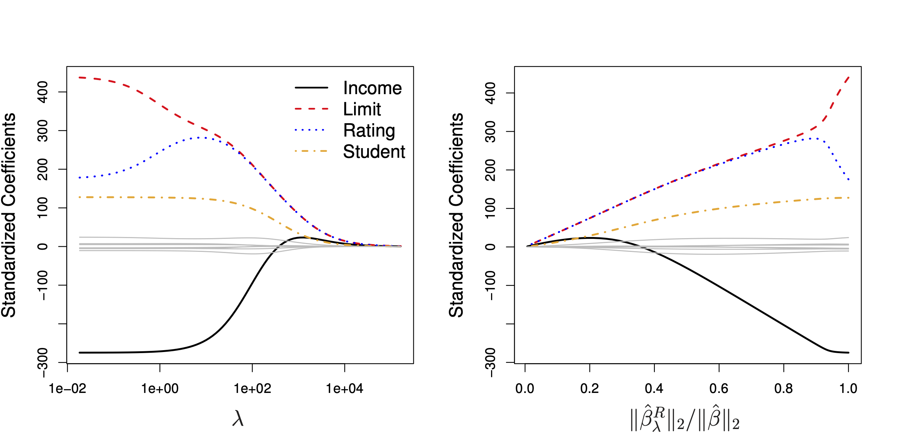

## Table of Contents

## What is shrinkage in the context of machine learning?

Shrinkage in machine learning is a technique used to improve the accuracy and reliability of models by reducing the impact of less important features. It works by pulling the estimated coefficients of a model towards zero, which helps to prevent overfitting. Overfitting happens when a model learns the training data too well, including its noise and errors, and performs poorly on new, unseen data. By shrinking the coefficients, the model becomes simpler and more generalizable, meaning it can perform better on new data.

A common method that uses shrinkage is called ridge regression. In ridge regression, a penalty term is added to the least squares method. This penalty term is controlled by a parameter, often called lambda ($$\lambda$$), which determines how much the coefficients are shrunk. The larger the value of lambda, the more the coefficients are shrunk towards zero. This helps to reduce the model's complexity and can lead to better predictions on new data. By adjusting lambda, you can find a balance between fitting the training data well and keeping the model simple enough to generalize to new data.

## How does shrinkage help in improving model performance?

Shrinkage helps improve model performance by making the model simpler and less likely to overfit. Overfitting happens when a model learns the training data too well, including its mistakes and random noise. This makes the model perform badly on new data it hasn't seen before. By using shrinkage, the model's coefficients, which are the numbers that show how much each feature affects the prediction, are pulled towards zero. This means that features that are not very important have less impact on the model's predictions, making the model easier to understand and more likely to work well on new data.

A common way to use shrinkage is through a method called ridge regression. In ridge regression, a penalty term is added to the usual way of finding the best coefficients. This penalty term is controlled by a parameter called lambda ($$\lambda$$). The bigger the lambda, the more the coefficients are pulled towards zero. This helps to make the model simpler and better at predicting new data. By choosing the right lambda, you can find a good balance between fitting the training data well and keeping the model simple enough to work well on new data.

## What are the common shrinkage methods used in machine learning?

Shrinkage methods are used in [machine learning](/wiki/machine-learning) to make models simpler and better at predicting new data. One common shrinkage method is ridge regression. In ridge regression, a penalty term is added to the usual way of finding the best coefficients. This penalty term is controlled by a parameter called lambda ($$\lambda$$). The bigger the lambda, the more the coefficients are pulled towards zero. This helps to make the model simpler and better at predicting new data. By choosing the right lambda, you can find a good balance between fitting the training data well and keeping the model simple enough to work well on new data.

Another common shrinkage method is lasso regression. Lasso regression also adds a penalty term to the usual way of finding the best coefficients, but it uses a different kind of penalty than ridge regression. The penalty in lasso regression can actually make some coefficients become exactly zero, which means some features can be completely ignored by the model. This is useful for making the model even simpler and easier to understand. Like ridge regression, lasso regression also uses a parameter, often called lambda ($$\lambda$$), to control how much the coefficients are shrunk. The right choice of lambda can help the model perform better on new data.

Elastic net is a third shrinkage method that combines the ideas of ridge and lasso regression. It uses two parameters: one for the ridge penalty and one for the lasso penalty. This allows elastic net to benefit from the strengths of both methods. The ridge part helps to shrink all coefficients, while the lasso part can make some coefficients exactly zero. By adjusting these parameters, you can find the best way to balance fitting the training data and keeping the model simple enough to work well on new data.

## Can you explain the concept of ridge regression as a shrinkage method?

Ridge regression is a shrinkage method used in machine learning to improve how well a model can predict new data. It does this by adding a penalty to the usual way of finding the best coefficients, which are the numbers that show how much each feature affects the prediction. This penalty pulls the coefficients towards zero, making the model simpler and less likely to overfit. Overfitting happens when a model learns the training data too well, including its mistakes and random noise, and then doesn't work well on new data. By using ridge regression, the model becomes more general and can predict new data better.

The penalty in ridge regression is controlled by a parameter called lambda ($$\lambda$$). The bigger the lambda, the more the coefficients are pulled towards zero. This helps to find a good balance between fitting the training data well and keeping the model simple enough to work well on new data. For example, if lambda is set to zero, ridge regression is the same as the usual least squares method, and there's no shrinkage. But as lambda gets bigger, the model becomes simpler and better at predicting new data. By choosing the right lambda, you can make the model perform better on new data it hasn't seen before.

## How does the Lasso method differ from ridge regression in terms of shrinkage?

Lasso regression, like ridge regression, is a shrinkage method used to improve how well a model can predict new data. But there's a big difference between them. Lasso uses a different kind of penalty than ridge regression. While ridge regression pulls all coefficients towards zero, lasso can actually make some coefficients become exactly zero. This means that some features can be completely ignored by the model, which can make the model even simpler and easier to understand. The penalty in lasso regression is controlled by a parameter called lambda ($$\lambda$$), just like in ridge regression. The bigger the lambda, the more the coefficients are shrunk, and the more likely it is that some coefficients will become zero.

The main advantage of lasso over ridge regression is that it can do feature selection. By setting some coefficients to zero, lasso can automatically choose which features are important and which ones can be left out. This can be very helpful when you have a lot of features and you want to make your model simpler. On the other hand, ridge regression will always keep all features in the model, but it will make them less important by shrinking their coefficients. Both methods help to prevent overfitting, but they do it in different ways. By choosing the right lambda, you can make sure your model works well on new data it hasn't seen before.

## What is the Elastic Net method and how does it combine the benefits of ridge and Lasso?

Elastic Net is a shrinkage method that combines the strengths of both ridge and Lasso regression. It does this by using two penalties instead of one. One penalty is the same as the one used in ridge regression, which pulls all coefficients towards zero. The other penalty is the same as the one used in Lasso regression, which can make some coefficients become exactly zero. By using both penalties, Elastic Net can shrink all coefficients like ridge regression and also do feature selection like Lasso regression. This makes the model simpler and better at predicting new data.

The way Elastic Net works is by using two parameters: one for the ridge penalty and one for the Lasso penalty. The ridge penalty is controlled by a parameter called alpha ($$ \alpha $$), and the Lasso penalty is controlled by a parameter called lambda ($$ \lambda $$). By adjusting these parameters, you can find the best way to balance fitting the training data and keeping the model simple enough to work well on new data. This flexibility makes Elastic Net a powerful tool for improving model performance, especially when you have a lot of features and you want to make sure your model is as simple and accurate as possible.

## How do shrinkage methods address the problem of multicollinearity in datasets?

Shrinkage methods like ridge regression, Lasso, and Elastic Net help deal with multicollinearity in datasets. Multicollinearity happens when two or more features in a dataset are closely related to each other. This can make it hard for a model to figure out which feature is really important, leading to unstable and unreliable predictions. Shrinkage methods work by pulling the coefficients of the model towards zero. This makes the model simpler and less affected by the small changes that come from multicollinearity. By shrinking the coefficients, these methods help the model focus on the most important features and ignore the noise caused by multicollinearity.

Ridge regression, for example, adds a penalty term to the usual way of finding the best coefficients. This penalty term is controlled by a parameter called lambda ($$ \lambda $$). The bigger the lambda, the more the coefficients are pulled towards zero. This helps to stabilize the model and reduce the impact of multicollinearity. Lasso regression also uses a penalty term, but it can make some coefficients become exactly zero. This means that Lasso can ignore some features completely, which can be helpful when dealing with multicollinearity. Elastic Net combines the benefits of both ridge and Lasso by using two penalties, one for ridge and one for Lasso. This allows Elastic Net to shrink all coefficients and also do feature selection, making it a powerful tool for handling multicollinearity.

## What are the mathematical principles behind shrinkage estimators?

Shrinkage estimators are used in machine learning to make models better at predicting new data. The main idea behind them is to pull the estimated coefficients of a model towards zero. This is done by adding a penalty term to the usual way of finding the best coefficients. For example, in ridge regression, the penalty term is the sum of the squares of the coefficients, multiplied by a parameter called lambda ($$\lambda$$). The bigger the lambda, the more the coefficients are pulled towards zero. This helps to make the model simpler and less likely to overfit, which is when a model learns the training data too well, including its mistakes and random noise, and doesn't work well on new data.

Lasso regression uses a different kind of penalty. Instead of the sum of the squares of the coefficients, Lasso uses the sum of the absolute values of the coefficients, also multiplied by lambda ($$\lambda$$). This can make some coefficients become exactly zero, which means some features can be completely ignored by the model. This is helpful for making the model even simpler and easier to understand. Elastic Net combines the ideas of ridge and Lasso by using two penalties: one for the sum of the squares of the coefficients and one for the sum of the absolute values of the coefficients. This allows Elastic Net to shrink all coefficients and also do feature selection, making it a powerful tool for improving model performance.

## How can one choose the optimal shrinkage parameter in practice?

Choosing the optimal shrinkage parameter, often called lambda ($$\lambda$$), is important for making sure your model works well on new data. One common way to do this is by using a method called cross-validation. In cross-validation, you split your data into different parts, use some parts to train your model, and use the other parts to test how well it works. You try different values of lambda and see which one makes your model predict the test data the best. This helps you find the right balance between fitting your training data well and keeping your model simple enough to work well on new data.

Another way to choose the optimal lambda is by using a technique called grid search. In grid search, you pick a bunch of different values for lambda and try them all out. You then pick the value that makes your model perform the best on your test data. This can be done automatically using computer code. For example, you might use a programming language like Python with a library like scikit-learn to try different values of lambda and see which one works best. By using these methods, you can find the best lambda for your model and make sure it predicts new data as accurately as possible.

## What are the potential drawbacks or limitations of using shrinkage techniques?

Shrinkage techniques like ridge regression, Lasso, and Elastic Net can make models simpler and better at predicting new data. But they also have some potential problems. One issue is that choosing the right shrinkage parameter, like lambda ($$ \lambda $$), can be tricky. If you pick a lambda that's too big, you might shrink your model too much, and it won't fit your data well. If you pick a lambda that's too small, your model might still overfit and not work well on new data. Finding the right lambda often takes a lot of time and computer power, especially if you're using methods like cross-validation or grid search to test different values.

Another limitation is that shrinkage methods can sometimes make it hard to understand your model. When you use shrinkage, the coefficients of your model get pulled towards zero. This can make it difficult to see which features are really important and which ones are not. For example, in Lasso regression, some coefficients might become exactly zero, which means some features are completely ignored. While this can make your model simpler, it can also make it harder to explain why your model makes certain predictions. If understanding your model is important for your project, you might need to be careful about using shrinkage techniques.

## How do shrinkage methods impact the bias-variance tradeoff in machine learning models?

Shrinkage methods like ridge regression, Lasso, and Elastic Net help balance the bias-variance tradeoff in machine learning models. The bias-variance tradeoff is about finding the right balance between a model that's too simple and one that's too complex. A model with high bias might not fit the training data well because it's too simple, while a model with high variance might fit the training data too well, including its noise and errors, and not work well on new data. Shrinkage methods reduce variance by pulling the model's coefficients towards zero, which makes the model simpler and less likely to overfit. This means the model can perform better on new data it hasn't seen before.

However, using shrinkage methods can sometimes increase the bias of a model. When the coefficients are shrunk towards zero, the model might not capture all the important patterns in the data as well as it could. For example, in ridge regression, the penalty term $$ \lambda \sum_{i=1}^n \beta_i^2 $$ pulls all coefficients towards zero, which can make the model miss some important features. In Lasso regression, the penalty term $$ \lambda \sum_{i=1}^n |\beta_i| $$ can make some coefficients become exactly zero, which means some features are completely ignored. The key is to find the right shrinkage parameter, like lambda ($$ \lambda $$), that balances reducing variance without increasing bias too much. This way, the model can be simple enough to work well on new data but still capture the important patterns in the training data.

## Can you discuss advanced applications or research areas involving shrinkage in machine learning?

Shrinkage methods have found advanced applications in various fields of machine learning, including genomic data analysis and image processing. In genomic data analysis, researchers use shrinkage techniques like Lasso to select important genes from thousands of genetic markers. This helps to identify which genes are most related to certain diseases or traits. For example, in a study on cancer, Lasso might be used to find a small set of genes that are most predictive of cancer risk. This can lead to better understanding of the disease and potentially new treatments. In image processing, shrinkage methods are used to denoise images. By applying shrinkage to the coefficients of a model that represents an image, noise can be reduced, and the image can be made clearer.

Another area of research involving shrinkage is in the development of new shrinkage methods that can handle complex data structures. For instance, researchers are working on adaptive Lasso, which adjusts the shrinkage parameter $$ \lambda $$ for each coefficient based on the data. This can lead to better performance when the importance of features varies greatly. Additionally, shrinkage methods are being explored in the context of [deep learning](/wiki/deep-learning), where they can be used to regularize neural networks. By applying shrinkage to the weights of a [neural network](/wiki/neural-network), overfitting can be reduced, leading to better generalization on new data. These advanced applications show how shrinkage methods continue to be a valuable tool in improving machine learning models across different fields.