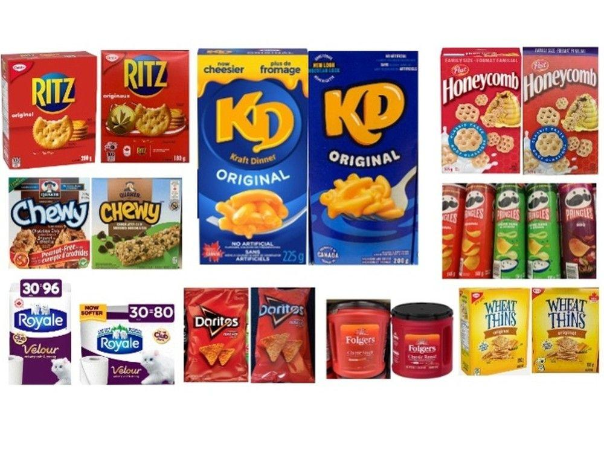

## Table of Contents

## What is shrinkflation?

Shrinkflation is when companies make their products smaller but keep the price the same. This means people are getting less for their money without realizing it. Companies do this to save money on materials and still make the same amount of profit. It's a sneaky way to raise prices without changing the price tag.

You might see shrinkflation with things like snacks, drinks, or even toilet paper. For example, a bag of chips might look the same size, but there are fewer chips inside. Or a roll of toilet paper might be shorter than before. It can be hard to notice, but over time, it adds up and people end up paying more for less.

## How does shrinkflation differ from inflation?

Shrinkflation and inflation are two different ways that the cost of things can go up. Inflation is when the prices of things go up over time. For example, if a candy bar used to cost $1 and now it costs $1.25, that's inflation. It happens because of things like the cost of making the product going up or because there's more money in the economy.

Shrinkflation, on the other hand, is when the size or amount of a product gets smaller, but the price stays the same. So, you might still pay $1 for that candy bar, but it's smaller than it used to be. Companies do this to save money on what they need to make the product, without making it obvious that they're charging more for less. Both shrinkflation and inflation make things more expensive, but they do it in different ways.

## What are common examples of products affected by shrinkflation?

Shrinkflation often hits everyday items that people buy a lot. For example, you might notice it with snacks like chips or cookies. A bag of chips might look the same size, but when you open it, there are fewer chips inside. The same goes for a box of cookies; it might be the same price, but there are fewer cookies in the box. This can be frustrating because people expect to get the same amount for their money.

Another common example is with household items like toilet paper and paper towels. A roll of toilet paper might be shorter than before, or a pack of paper towels might have fewer sheets. Even though the package looks the same, you're getting less for the same price. It's easy to miss these changes, but over time, it means you have to buy these things more often, which costs more money.

## How can consumers identify shrinkflation?

Consumers can identify shrinkflation by paying close attention to the size and weight of products they buy regularly. If a product's packaging looks the same but feels lighter or seems smaller, it might be a sign of shrinkflation. For example, if a box of cereal feels lighter than usual, check the weight on the package. It's a good idea to compare the current product with what you remember or even keep notes on the sizes of products you buy often.

Another way to spot shrinkflation is by looking at the unit price, which is the price per ounce or per item. Stores often list this on the shelf tag. If the total price stays the same but the unit price goes up, it means you're getting less for your money. This can be a clear sign that the product has shrunk. By being aware and checking these details, consumers can catch shrinkflation and make more informed buying decisions.

## What are the economic reasons behind companies using shrinkflation?

Companies use shrinkflation to save money and keep their profits up when costs go up. When the price of things like ingredients, packaging, or shipping goes up, it costs more to make the product. Instead of raising the price, which might make customers unhappy, companies make the product smaller. This way, they can still make the same amount of money without changing the price tag. It's a sneaky way to deal with higher costs without losing customers.

Shrinkflation also helps companies stay competitive. If a company raises its prices, people might switch to a cheaper brand. By keeping the price the same but making the product smaller, the company can still seem like a good deal compared to others. This helps them keep their customers and their place in the market. It's all about finding a balance between making money and keeping customers happy.

## How does shrinkflation impact consumer behavior?

Shrinkflation can make people feel tricked because they're getting less for the same price. When people notice that their favorite snacks or household items are smaller, they might start looking for other brands that give them more for their money. This can lead to people switching brands or even buying less of the product. If a lot of people do this, it can hurt the company's sales and make them think twice about using shrinkflation in the future.

On the other hand, some people might not notice shrinkflation right away. They keep buying the same products without realizing they're getting less. But over time, as they use up the product faster, they might start to feel like they're spending more money. This can make them more careful about what they buy and how much they spend. In the end, shrinkflation can make people more aware of the value they're getting and change how they shop.

## What are the ethical considerations of shrinkflation?

Shrinkflation raises some big ethical questions. It's not fair to customers when companies make their products smaller but keep the prices the same. People work hard for their money and expect to get what they pay for. When companies use shrinkflation, they're not being honest with their customers. It can feel like a sneaky trick to make more money without being upfront about it. This can make people lose trust in the company and feel cheated.

On the other hand, companies might argue that shrinkflation is a way to survive when costs go up. They need to make money to keep their business running and to pay their workers. If they raise prices, they might lose customers to other brands. Shrinkflation can seem like a way to balance these needs without making customers too unhappy. But even if it helps the company, it still doesn't feel right to many people. It's a tough situation where companies have to think about what's fair for everyone involved.

## How do companies justify the use of shrinkflation?

Companies say shrinkflation helps them deal with higher costs without losing customers. When the price of things like ingredients or shipping goes up, it costs more to make their products. Instead of raising the price, which might make people buy from other brands, companies make the product a bit smaller. This way, they can still make the same amount of money and keep their customers happy. It's like a way to balance what they need to do to stay in business and what their customers expect.

Some companies also think shrinkflation is better than other options. If they raise the price, people might get upset and stop buying their products. By keeping the price the same but making the product smaller, it's less noticeable. They hope customers won't mind too much and will keep buying from them. It's a tricky choice, but companies believe it's the best way to keep making money without losing too many customers.

## What are the long-term effects of shrinkflation on brand loyalty?

Shrinkflation can hurt brand loyalty over time. When people find out they're getting less for the same price, they might feel tricked. This can make them lose trust in the brand. If a company keeps using shrinkflation, more and more people might start to feel this way. They might decide to switch to other brands that give them more for their money. Losing customers like this can be bad for the company in the long run.

On the other hand, some people might not notice shrinkflation right away. They keep buying the same products without realizing they're getting less. But over time, as they use up the product faster, they might start to feel like they're spending more money. This can make them more careful about what they buy and how much they spend. In the end, shrinkflation can make people more aware of the value they're getting and change how they shop, which can affect brand loyalty.

## How can regulatory bodies address shrinkflation?

Regulatory bodies can help by making rules that companies have to follow about shrinkflation. They can make it a rule that companies have to be clear about when they change the size of their products. This means companies would have to tell people if a product gets smaller. That way, people can see the changes and decide if they want to keep buying the product or not. It's all about making sure companies are honest with their customers.

Another way regulatory bodies can help is by keeping an eye on companies to make sure they're not using shrinkflation too much. If they see a company doing it a lot, they can step in and do something about it. This could mean making the company change back to the old size or even making them pay a fine. By watching companies closely, regulatory bodies can help stop shrinkflation from happening too often and keep things fair for everyone.

## What are the global trends in shrinkflation?

Shrinkflation is happening all over the world. In many countries, people are noticing that their favorite snacks and household items are getting smaller but still cost the same. For example, in the United States, people have seen shrinkflation with things like candy bars and toilet paper. In the United Kingdom, it's happening with chocolate and ice cream. No matter where you live, shrinkflation can be a sneaky way for companies to make more money without changing the price tag.

The reasons for shrinkflation are pretty much the same everywhere. Companies are trying to deal with higher costs for things like ingredients and shipping. Instead of raising prices and risking losing customers, they make their products a bit smaller. This way, they can still make the same amount of money and keep their customers happy. But even though it's a common problem around the world, it can still make people feel tricked and less likely to trust the companies they buy from.

## How can data analytics be used to track and predict shrinkflation?

Data analytics can help track and predict shrinkflation by looking at lots of information about products. Companies and researchers can use computers to see how the size and price of products change over time. They can look at things like how much a product weighs, how big it is, and how much it costs. By putting all this information together, they can spot when a product gets smaller but the price stays the same. This helps them see shrinkflation happening and understand how often it's happening with different products.

With enough data, people can also start to predict when shrinkflation might happen. They can look at things like the cost of ingredients and shipping, which can go up and make companies want to use shrinkflation. By watching these costs and seeing how they affect product sizes in the past, data analytics can guess when companies might make their products smaller in the future. This can help people be ready for shrinkflation and make smarter choices about what they buy.

## References & Further Reading

[1]: Malmgren, P. (2015). ["Signals: The Breakdown of the Social Contract and the Rise of Geopolitics."](https://archive.org/details/signalsbreakdown0000malm) W H Allen.

[2]: ["Algorithmic Trading: Winning Strategies and Their Rationale"](https://www.wiley.com/en-us/Algorithmic+Trading%3A+Winning+Strategies+and+Their+Rationale-p-9781118460146) by Ernest P. Chan

[3]: ["Mastering Python for Finance: Implement advanced state-of-the-art financial data analysis and machine learning techniques for smarter investing"](https://www.amazon.com/Mastering-Python-Finance-financial-investing/dp/178934637X) by James Ma Weiming

[4]: ["Consumer Price Index Manual: Theory and Practice"](https://www.elibrary.imf.org/view/book/9789221136996/9789221136996.xml) produced by the International Labour Organization, International Monetary Fund, Organisation for Economic Co-operation and Development, Eurostat, United Nations Economic Commission for Europe, and the World Bank

[5]: ["Price Index Concepts and Measurement"](https://press.uchicago.edu/ucp/books/book/chicago/P/bo6674627.html) edited by W. Erwin Diewert, John S. Greenlees, and Charles R. Hulten