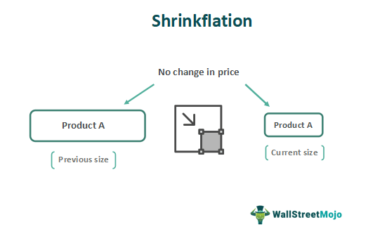

In today's rapidly shifting market environment, consumer economics is increasingly influenced by phenomena such as product downsizing, shrinkflation, and algorithmic trading, each playing a pivotal role in consumer behavior and market strategy formulation. Shrinkflation, a form of hidden inflation where product sizes are reduced while prices remain static, impacts consumers by subtly altering the real value of their purchases. This tactic, often utilized by companies to manage escalating production costs, adjusts consumer perceptions and spending habits without overtly shifting price tags.

Meanwhile, the advent of algorithmic trading has introduced new dimensions to economic strategies, offering tools for navigating market fluctuations and inflation effects. By utilizing computer algorithms, traders can execute high-speed transactions, analyzing vast datasets to predict market shifts influenced by various economic factors, including those induced by shrinkflation.



This article aims to dissect how shrinkflation tangibly affects consumer economics, examining the underlying causes and broader implications for both businesses and consumers. Additionally, the role of algorithmic trading will be explored as a modern economic instrument, providing insights into its capacity to adapt and respond to changes brought about by product downsizing and inflationary pressures. As these elements become more intertwined, they collectively shape the landscape of modern consumer economics, necessitating awareness and adaptability from both consumers and market strategists.

## Table of Contents

## Understanding Shrinkflation in Consumer Economics

Shrinkflation refers to the strategic reduction of a product's size or quantity while maintaining its original price point. This phenomenon is particularly prevalent in the food and beverage industry, where companies face rising production costs due to various factors, including increased prices for raw materials, transportation, and labor. By reducing the quantity of a product rather than increasing its price, companies can effectively manage their profit margins while avoiding overt consumer backlash that might occur if prices were visibly increased.

The term "shrinkflation" was popularized by economist Pippa Malmgren, who described it as a form of hidden inflation. Unlike traditional inflation where prices increase directly, shrinkflation is subtler, as the price per unit of a product increases even though the nominal price remains unchanged. For instance, a chocolate bar that used to weigh 200 grams may be downsized to 180 grams but still sold at the same price, resulting in a hidden cost to the consumer.

This practice exploits a psychological nuance in consumer behavior: many consumers focus primarily on the price tag rather than the quantity they receive for their money. Consequently, shrinkflation often results in consumers inadvertently paying a higher price per unit of product. Over time, this can contribute to a general sense of diminished purchasing power, even if consumers are not immediately aware of the specific changes in product sizing.

In essence, shrinkflation is a tactic employed by companies to subtly navigate economic pressures without explicitly raising prices, thereby maintaining competitive market positions while potentially eroding consumer trust if these changes are eventually noticed.

## Reasons and Drawbacks of Shrinkflation

Shrinkflation, a strategy employed by many consumer goods companies, is primarily driven by the necessity to manage rising production costs and maintain competitive standing without directly increasing prices. These costs can include raw materials, labor, transportation, and regulatory expenses, all of which have been subject to variability and upward trends in global markets. By reducing the quantity or size of a product while keeping the price constant, companies can effectively maintain their profit margins in a challenging economic environment.

Intense market competition further accentuates the reliance on shrinkflation. Companies face pressure to differentiate themselves in terms of pricing strategies to retain or gain market share. In industries where product differentiation is minor, such as staple consumer goods, price sensitivity is high. Therefore, shrinkflation offers a way to subtly adjust the economic equation without triggering negative consumer reactions that might accompany a visible price hike.

However, this tactic is not without its drawbacks. Over time, consumers may become aware of these subtle decreases in product size or quantity, leading to distrust and negative perceptions towards the brand. This erosion of consumer trust can have long-term consequences, potentially resulting in diminished brand loyalty and lost sales, as consumers might opt for competitors perceived as more transparent or offering better value.

Furthermore, shrinkflation complicates the measurement of inflation. Traditional inflation metrics often focus on price changes without accounting for alterations in product quantity or quality. As a result, shrinkflation can obscure true inflationary trends, making it more challenging for economists and policymakers to assess the real purchasing power of consumers and the economy's health. Calculating accurate inflation becomes complex when product sizes fluctuate, requiring adjustments in how inflation indices are computed to reflect these hidden price changes accurately. 

Consumers and analysts alike must recognize the implications of shrinkflation to interpret economic data correctly and make informed decisions.

## Consumers' Response to Shrinkflation and How to Combat It

Shrinkflation is a tactic that can often go unnoticed by consumers, yet awareness of its presence is gradually increasing. Recent studies highlight that while a significant number of consumers recognize shrinkflation, only a small fraction consistently monitor product sizes or unit prices. This lack of vigilance allows shrinkflation to continue largely undetected in daily shopping habits.

To effectively identify shrinkflation, consumers should adopt specific strategies. One key approach is to closely examine packaging. Changes or redesigns in packaging can be indicative of a reduction in product size or quantity without a corresponding change in price. Additionally, comparing unit prices rather than simply the sticker price can reveal hidden increases in cost. As unit prices provide a measure of cost per unit of weight or [volume](/wiki/volume-trading-strategy), this method offers a more accurate reflection of price changes stemming from shrinkflation.

Exploring alternatives is another strategy for managing shrinkflation's impact. Consumers might consider switching brands if they notice shrinkflation in their preferred products. Often, store brands or generic alternatives do not follow the same shrinkflation trends as national brands and can offer better value. Furthermore, store brands might reformulate products or offer larger package sizes to attract consumers, which can be beneficial in counteracting shrinkflation.

Fundamentally, consumer education stands as a critical [factor](/wiki/factor-investing) in combating shrinkflation. Awareness initiatives and accessible information on packaging and price alterations empower consumers to make decisions that align with their value perceptions. By understanding the mechanics of shrinkflation and learning to detect changes, consumers can effectively navigate the complexities of modern consumer markets.

Ultimately, while shrinkflation poses challenges, informed consumers can mitigate its effects through strategic shopping practices and heightened awareness of market trends.

## Algorithmic Trading: Navigating Shrinkflation in Financial Markets

Algorithmic trading utilizes computer algorithms to execute trades with remarkable speed and volume, transforming the dynamics of financial markets. In the face of shrinkflation, where product sizes decrease while prices remain unchanged, this trading technique becomes particularly relevant. Algorithmic trading enables investors to navigate the complexities of price adjustments and inflationary effects linked to shrinkflation, offering a strategic advantage in a volatile economic environment.

Algorithms have the capacity to analyze extensive datasets, mining them for patterns related to consumer behavior and economic indicators like shrinkflation. This capability allows these systems to predict market shifts, providing traders with insights that inform their investment decisions. Algorithms process data from various sources — including economic reports, market trends, and consumer feedback — to identify correlations that human analysts might overlook. For instance, they can detect subtle changes in consumer purchasing patterns caused by shrinkflation, which may affect the stock prices of affected companies.

A typical [algorithmic trading](/wiki/algorithmic-trading) strategy that could be employed in the context of shrinkflation is a trend-following model. This model identifies trends in market data, enabling traders to buy high-performing assets and sell underperforming ones. By incorporating predictive analytics, these algorithms can anticipate how shrinkflation might influence company valuations and adjust portfolios accordingly.

In Python, a simple algorithmic trading strategy might involve the following steps:

```python
import pandas as pd
import numpy as np

# Load market data
data = pd.read_csv('market_data.csv')
prices = data['Close']

# Calculate moving average
short_window = 40
long_window = 100
signals = pd.DataFrame(index=data.index)
signals['signal'] = 0.0

# Generate signals
signals['short_mavg'] = prices.rolling(window=short_window, min_periods=1, center=False).mean()
signals['long_mavg'] = prices.rolling(window=long_window, min_periods=1, center=False).mean()
signals['signal'][short_window:] = np.where(signals['short_mavg'][short_window:] > signals['long_mavg'][short_window:], 1.0, 0.0)

# Calculate daily positions
signals['positions'] = signals['signal'].diff()
```

This Python code outlines the initiation of a basic trading system that operates on moving averages. When a short-term moving average exceeds a long-term one, a buy signal is generated, and vice versa. Such systems can be further enhanced with data pertinent to shrinkflation indices and consumer price movements, refining trading acumen in response to inflationary pressures.

Algorithmic trading thus acts as a sophisticated mechanism, empowering investors to translate the nuances of inflation and consequent market adjustments into actionable investment strategies. Through technological innovation, traders can adeptly manage economic changes, ensuring resilience and profitability in the financial landscape shaped by phenomena like shrinkflation.

## Conclusion: The Interplay of Shrinkflation and Algorithmic Trading in Modern Economics

In modern economics, product downsizing driven by shrinkflation poses significant challenges for both consumers and businesses. Shrinkflation can create a misleading perception of price stability, causing consumers to unknowingly receive less product for the same price, which effectively raises the real cost of goods. This phenomenon complicates consumers' ability to make informed purchasing decisions and undermines trust in brands and market transparency.

Businesses, on the other hand, utilize shrinkflation primarily as a strategy to counter rising production costs and maintain profit margins without increasing prices overtly. However, this tactic carries the risk of eroding consumer trust and loyalty if detected, potentially damaging brand reputation and affecting long-term sales growth.

Algorithmic trading offers a mechanism for navigating these challenges, as it facilitates rapid analysis and response to market changes driven by shrinkflation. Through sophisticated algorithms capable of processing vast amounts of data, traders can identify patterns and predict shifts in consumer behavior linked to product downsizing. This predictive capability allows both investors and businesses to make strategic decisions, aligning their operations with anticipated economic trends.

For example, algorithms can incorporate variables such as changes in product packaging, ingredient lists, and unit pricing, providing insights into where and when shrinkflation is likely to occur. By simulating various economic scenarios, algorithmic trading can aid in optimizing pricing strategies, supply chain management, and investment portfolios, thereby enhancing resilience in an unpredictable market environment.

Understanding these dynamics enables consumers to become more vigilant and informed in their purchasing choices. By regularly checking unit prices and being aware of packaging changes, consumers can better protect themselves against the effects of shrinkflation. Likewise, businesses equipped with insights from algorithmic trading can adapt their strategies more effectively, ensuring competitive positioning and maintaining consumer trust.

In an ever-changing economic landscape, awareness and adaptation are essential to thriving amid shrinkflation and algorithm-driven markets. As these phenomena continue to evolve, both consumers and businesses must stay informed and agile, leveraging technology and data-driven insights to navigate the complexities of modern consumer economics.

## References & Further Reading

[1]: Malmgren, P. (2015). ["Signals: The Breakdown of the Social Contract and the Rise of Geopolitics."](https://archive.org/details/signalsbreakdown0000malm) W H Allen.

[2]: ["Algorithmic Trading: Winning Strategies and Their Rationale"](https://www.wiley.com/en-us/Algorithmic+Trading%3A+Winning+Strategies+and+Their+Rationale-p-9781118460146) by Ernest P. Chan

[3]: ["Mastering Python for Finance: Implement advanced state-of-the-art financial data analysis and machine learning techniques for smarter investing"](https://www.amazon.com/Mastering-Python-Finance-financial-investing/dp/178934637X) by James Ma Weiming

[4]: ["Consumer Price Index Manual: Theory and Practice"](https://www.elibrary.imf.org/view/book/9789221136996/9789221136996.xml) produced by the International Labour Organization, International Monetary Fund, Organisation for Economic Co-operation and Development, Eurostat, United Nations Economic Commission for Europe, and the World Bank

[5]: ["Price Index Concepts and Measurement"](https://press.uchicago.edu/ucp/books/book/chicago/P/bo6674627.html) edited by W. Erwin Diewert, John S. Greenlees, and Charles R. Hulten