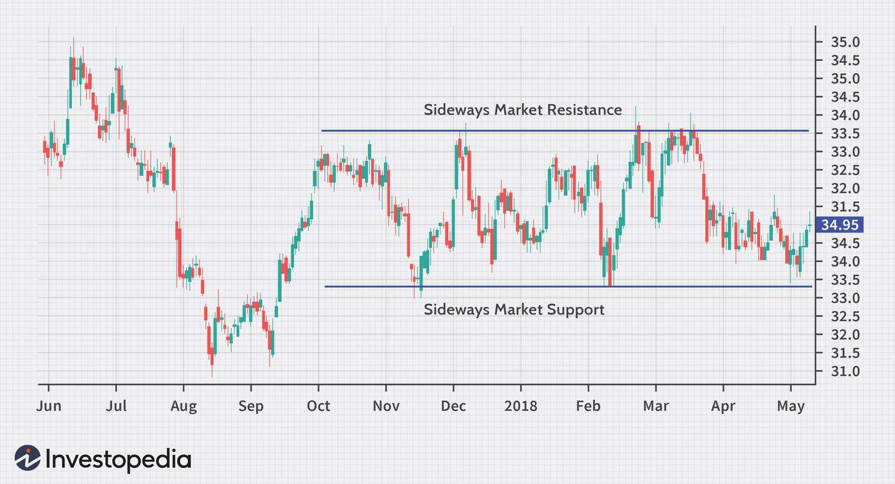

## Table of Contents

## What is a sideways market?

A sideways market is when the price of a stock or other investment doesn't go up or down much. It stays about the same for a while. This can happen when there's not much news or big changes happening with the company or the economy. Traders might find it boring because they can't make a lot of money quickly.

In a sideways market, the price moves in a small range. It might go up a little, then down a little, but it stays between two levels. This is called trading in a range. Investors who like to buy low and sell high might wait for the price to hit the bottom of the range before buying, and sell when it gets to the top. This way, they can still make some money even if the market isn't moving much.

## How can you identify a sideways market?

You can spot a sideways market by looking at a price chart. If the price of a stock or an investment stays between two levels for a long time, without going much higher or lower, that's a sign of a sideways market. The price might go up a bit, then down a bit, but it keeps coming back to the same area. This kind of movement makes a flat line or a small zigzag on the chart, showing that the market is not trending up or down.

Another way to identify a sideways market is by watching the trading [volume](/wiki/volume-trading-strategy). In a sideways market, the volume is usually lower because fewer people are buying and selling. They might be waiting for a big change or news that could move the price. If you see that the volume stays low and the price doesn't break out of its range, it's likely you're in a sideways market.

## What causes a sideways market?

A sideways market happens when there's no strong reason for the price to go up or down a lot. It's like when people are not sure what to do, so they just wait. This can happen when there's no big news about the company or the economy. If there's no new information, people might not want to buy or sell, so the price stays the same.

Sometimes, a sideways market can happen because people have different ideas about what will happen next. Some might think the price will go up, and others might think it will go down. When these ideas balance out, the price doesn't move much. It's like a tug-of-war where no one is winning, so the price stays in the middle.

## What is sideways drift in trading?

Sideways drift in trading is when the price of a stock or investment moves slowly from side to side without going up or down a lot. It's like the price is drifting along without any big changes. This happens when there's not much news or excitement about the company or the market, so people are not sure what to do. They might buy a little and sell a little, but the price stays in a small range.

This kind of movement can be boring for traders who like to see big changes and make quick profits. But for some investors, sideways drift can be a good time to buy or sell. They might wait for the price to hit the bottom of the range before buying, and sell when it gets to the top. This way, they can still make some money even if the market is not moving much.

## How does sideways drift differ from a sideways market?

Sideways drift and a sideways market are pretty similar, but there's a small difference. A sideways market is when the price of a stock or investment stays between two levels for a long time. It doesn't go up or down much, and it's like the price is stuck in a range. This happens when there's no big news or changes, so people are not sure what to do.

Sideways drift is a bit like a sideways market, but it's more about the slow movement from side to side. The price doesn't stay exactly the same, but it moves slowly within a small range. It's like the price is drifting along without any big changes. Both sideways drift and a sideways market can be boring for traders who like big moves, but they can still be good times for some investors to buy low and sell high.

## What are the common strategies used in a sideways market?

In a sideways market, one common strategy is to buy low and sell high within the price range. This means waiting for the price to drop to the bottom of the range before buying, and then selling when it goes up to the top. This way, you can make a profit even if the market isn't moving much. It's like taking small bites of profit instead of waiting for a big move.

Another strategy is to use options trading. You can sell options that will expire worthless if the price stays in the sideways range. This is called selling straddles or strangles. It can be a good way to make money from the lack of movement in the market. But it's important to know that options trading can be risky, so it's not for everyone.

Some traders also use technical analysis to spot patterns in the sideways market. They look for signs that the price might break out of the range, either up or down. If they think the price will break out, they might buy or sell before it happens to make a bigger profit. This strategy needs a lot of watching and understanding of the market, but it can be rewarding if you get it right.

## How can traders profit from sideways drift?

Traders can profit from sideways drift by using a strategy called range trading. This means they wait for the price to hit the bottom of its range and then buy. When the price goes up to the top of the range, they sell. By doing this over and over, they can make small profits each time the price moves within its range. It's like catching the price at the low point and letting it go at the high point, making money from the small ups and downs.

Another way to make money from sideways drift is by selling options. Traders can sell options that will expire worthless if the price stays in its range. This strategy is called selling straddles or strangles. It can be a good way to make money from the lack of big moves in the market. But it's important to know that options trading can be risky, so traders need to be careful and understand what they're doing.

## What are the risks associated with trading in a sideways market?

Trading in a sideways market can be risky because the price doesn't move much. Traders who like big changes might get bored and make bad decisions. They might try to guess when the price will break out of its range, but if they guess wrong, they could lose money. Also, if the market stays sideways for a long time, traders might feel stuck and start trading too much, hoping to make a profit. This can lead to more losses because they're not following a good plan.

Another risk is that the market might suddenly change direction. If the price breaks out of its range, traders who are betting on the sideways movement could lose money. For example, if they bought at the bottom of the range and the price suddenly drops below it, they could lose more than they expected. It's hard to predict when a sideways market will end, so traders need to be ready for surprises. Keeping a close eye on the market and having a good plan can help manage these risks.

## How do technical indicators help in navigating a sideways market?

Technical indicators can help traders understand what's happening in a sideways market. They show patterns and trends that might not be easy to see just by looking at the price. For example, moving averages can help traders see the middle of the price range. If the price stays above a moving average, it might be a good time to buy. If it stays below, it might be a good time to sell. Another useful indicator is the Relative Strength Index (RSI). It can show if a stock is overbought or oversold within its range, helping traders decide when to buy low or sell high.

Using these indicators, traders can make better choices about when to enter and [exit](/wiki/exit-strategy) trades. For example, if the price hits the bottom of its range and the RSI shows it's oversold, a trader might decide it's a good time to buy. They can then wait for the price to go up to the top of the range and sell when the RSI shows it's overbought. This way, technical indicators help traders take advantage of the small moves in a sideways market, making small profits over time. But it's important to remember that no indicator is perfect, so traders should use them along with other tools and their own judgment.

## What role does volume play in confirming a sideways market?

Volume is important in confirming a sideways market. When the market is moving sideways, the trading volume is usually low. This means fewer people are buying and selling because they're not sure what will happen next. They might be waiting for big news or a change in the market. If you see that the volume stays low and the price keeps moving in a small range, it's a good sign that you're in a sideways market.

But volume can also help you know when a sideways market might be ending. If the volume suddenly gets higher, it could mean that more people are starting to buy or sell. This might be a sign that the price is about to break out of its range and start moving up or down. So, watching the volume can help traders decide when to get ready for a change in the market.

## How can options be used effectively in a sideways market?

In a sideways market, selling options can be a good way to make money. Traders can sell options that will expire worthless if the price stays in its range. This strategy is called selling straddles or strangles. When you sell a straddle, you sell both a call option and a put option at the same strike price. When you sell a strangle, you sell a call option at a higher strike price and a put option at a lower strike price. If the price stays in the middle, both options will expire worthless, and you keep the money you got from selling them. But remember, options trading can be risky, so it's important to know what you're doing.

Another way to use options in a sideways market is to buy options that let you make money if the price stays in its range. For example, you can buy a call option at the bottom of the range and a put option at the top. This is called a long strangle. If the price stays between these two points, you can make money from both options. This strategy can be good if you think the sideways market will last for a while. But like selling options, buying options can also be risky, so it's important to have a good plan and understand the risks.

## What advanced techniques can be employed to predict the end of a sideways market?

One advanced technique to predict the end of a sideways market is to watch for volume changes. When the price has been moving sideways for a while, a sudden increase in trading volume can be a sign that the market might be getting ready to break out of its range. Traders pay close attention to this because it means more people are starting to buy or sell, which can push the price up or down. They might use volume indicators like the On-Balance Volume (OBV) to see if the volume is confirming the price movement. If the volume goes up as the price starts to move out of its range, it's a strong sign that the sideways market might be ending.

Another technique is to use technical indicators like the Bollinger Bands. These bands show the high and low points of the price range, and they can get narrower or wider. When the bands start to get narrower during a sideways market, it means the price is getting squeezed into a smaller range. Traders watch for this because it often means a big move is coming. If the price then breaks out of the bands with high volume, it's a good sign that the sideways market is over. By using these advanced techniques, traders can get ready for the next big move in the market.

## References & Further Reading

[1]: Bergstra, J., Bardenet, R., Bengio, Y., & Kégl, B. (2011). ["Algorithms for Hyper-Parameter Optimization."](https://dl.acm.org/doi/10.5555/2986459.2986743) Advances in Neural Information Processing Systems 24.

[2]: ["Advances in Financial Machine Learning"](https://www.amazon.com/Advances-Financial-Machine-Learning-Marcos/dp/1119482089) by Marcos Lopez de Prado

[3]: ["Evidence-Based Technical Analysis: Applying the Scientific Method and Statistical Inference to Trading Signals"](https://www.amazon.com/Evidence-Based-Technical-Analysis-Scientific-Statistical/dp/0470008741) by David Aronson

[4]: ["Machine Learning for Algorithmic Trading"](https://github.com/stefan-jansen/machine-learning-for-trading) by Stefan Jansen

[5]: ["Quantitative Trading: How to Build Your Own Algorithmic Trading Business"](https://github.com/LucindaYa/quant-resources/blob/master/Quantitative%20Trading%20How%20to%20Build%20Your%20Own%20Algorithmic%20Trading%20Business.pdf) by Ernest P. Chan