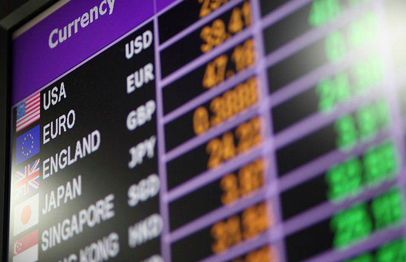

## Table of Contents

## What is the Sierra Leonean Leone?

The Sierra Leonean Leone is the money used in Sierra Leone, a country in West Africa. It is written as "Le" and is the main way people buy things and pay for services in the country. The Leone has been used since 1964, when it replaced the British West African pound. This change happened because Sierra Leone wanted its own money after becoming independent from Britain.

The Leone is divided into smaller units called cents, but people mostly use the Leone itself. Banknotes come in different amounts like 1,000, 2,000, 5,000, and 10,000 Leones. Coins are not used much anymore. The value of the Leone can change compared to other countries' money, like the US dollar. This can affect how much things cost in Sierra Leone and how much money people can get for their Leone when they travel or trade with other countries.

## How is the Sierra Leonean Leone abbreviated?

The Sierra Leonean Leone is abbreviated as "Le". This is the short way to write the name of Sierra Leone's money.

When you see "Le" in prices or on money, it means Sierra Leonean Leone. It's used on banknotes and in stores to show how much things cost in Sierra Leone.

## What is the history of the Sierra Leonean Leone?

The Sierra Leonean Leone started being used in 1964. Before that, Sierra Leone used the British West African pound because it was a British colony. When Sierra Leone became independent in 1961, they wanted their own money. So, they made the Leone. At first, the Leone was worth a lot more than it is now. It was equal to ten shillings of the old British West African pound.

Over the years, the Leone has changed a lot. It used to be divided into 100 cents, but now people mostly use the Leone itself. The Leone has had many different banknotes and coins. But because of inflation, the Leone's value went down. This means that things cost more Leones now than they did before. The Leone's value also goes up and down compared to other countries' money, like the US dollar. This can make it hard for people in Sierra Leone to buy things from other countries or to travel.

## What are the denominations of the Sierra Leonean Leone?

The Sierra Leonean Leone has different amounts of money that people can use. These are called denominations. Right now, the banknotes come in 1,000 Leones, 2,000 Leones, 5,000 Leones, and 10,000 Leones. People use these notes to buy things and pay for services in Sierra Leone.

In the past, there were also coins like 10 Leones, 50 Leones, and 100 Leones, but they are not used much anymore. Now, most transactions happen with the banknotes. The different denominations help people to have the right amount of money for what they need to buy.

## How does the exchange rate of the Leone compare to major world currencies?

The Sierra Leonean Leone's value changes a lot when compared to big world currencies like the US dollar, the Euro, and the British pound. For example, it might take around 20,000 Leones to get one US dollar. This means the Leone is worth less than these major currencies. The exchange rate can change every day because of things like how much people want to buy or sell Leones, what's happening in Sierra Leone's economy, and what's happening in the world's economy.

These changes in the exchange rate can make a big difference for people in Sierra Leone. If the Leone gets weaker, things that come from other countries, like food or medicine, can cost more Leones. This can make life harder for people. On the other hand, if the Leone gets stronger, it can help people buy things from other countries more easily. But because the Leone is usually weaker than major currencies, it can be hard for Sierra Leone to trade with other countries and for people to travel abroad.

## What are the key factors influencing the value of the Sierra Leonean Leone?

The value of the Sierra Leonean Leone is affected by many things. One big thing is how well Sierra Leone's economy is doing. If the economy is growing and making more money, the Leone might get stronger. But if the economy is not doing well, the Leone can get weaker. Another thing is how much people want to buy or sell Leones. If lots of people want to buy Leones, its value can go up. But if people want to sell their Leones and get other money, the value can go down.

Also, what happens in the world's economy can change the Leone's value. If other countries' economies are doing well, they might want to buy things from Sierra Leone, which can help the Leone. But if big economies are not doing well, they might not want to buy as much, and the Leone can get weaker. The Leone's value can also change because of inflation. If prices in Sierra Leone go up a lot, the Leone's value can go down. All these things together make the Leone's value go up and down compared to other countries' money.

## How has inflation affected the Sierra Leonean Leone over the years?

Inflation has made the Sierra Leonean Leone worth less over time. When there is inflation, prices go up, and people need more Leones to buy the same things they used to buy. This means the Leone does not buy as much as it used to. For example, if something cost 100 Leones a few years ago, it might cost 500 Leones now because of inflation. This makes life harder for people in Sierra Leone because their money does not go as far.

The Leone's value has gone down a lot compared to other countries' money because of high inflation. When the Leone loses value, it takes more Leones to buy things from other countries, like food or medicine. This can make it hard for people to get what they need. The government and the central bank try to control inflation, but it is a big challenge. Inflation has been a big problem for Sierra Leone for many years, and it keeps making the Leone worth less and less.

## What are the economic policies that impact the Leone?

The Sierra Leonean Leone is affected by the country's economic policies. The government and the central bank use different ways to try to control inflation and keep the Leone's value steady. One way is by setting interest rates. If they make interest rates higher, it can slow down how fast people borrow money and spend it, which can help lower inflation. They also try to manage how much money is in the economy. If there is too much money, prices can go up, so they try to keep the right amount.

Another policy that affects the Leone is how the government spends money. If the government spends a lot more than it earns, it can cause inflation and make the Leone weaker. The government also tries to make the economy grow by helping businesses and making it easier for people to find jobs. When the economy grows, it can make the Leone stronger. But if these policies do not work well, the Leone can lose value and make life harder for people in Sierra Leone.

## How is the Sierra Leonean Leone used in international trade?

The Sierra Leonean Leone is used in international trade, but it faces challenges because it is not a strong currency. When Sierra Leone buys things from other countries, like food or machines, it has to use other currencies like the US dollar or the Euro. This is because many countries and companies do not want to take Leones. So, Sierra Leone has to change its Leones into stronger currencies to buy things from other places. This can be hard because the Leone's value changes a lot compared to other currencies.

When Sierra Leone sells things to other countries, like diamonds or cocoa, it usually gets paid in stronger currencies too. This helps Sierra Leone earn money that it can use to buy things it needs from other countries. But because the Leone is weak, it does not help Sierra Leone trade as easily as countries with stronger currencies. The government and the central bank try to make the Leone more stable so it can be used better in international trade, but it is a big challenge.

## What are the challenges faced by the Sierra Leonean Leone in the global market?

The Sierra Leonean Leone faces many challenges in the global market because it is a weak currency. When Sierra Leone wants to buy things from other countries, like food or medicine, it has to change its Leones into stronger currencies like the US dollar or the Euro. This can be hard because the Leone's value goes up and down a lot compared to other currencies. If the Leone gets weaker, it takes more Leones to buy the same things, which can make life harder for people in Sierra Leone.

When Sierra Leone sells things like diamonds or cocoa to other countries, it usually gets paid in stronger currencies too. This helps Sierra Leone earn money that it can use to buy things it needs from other places. But because the Leone is weak, it does not help Sierra Leone trade as easily as countries with stronger currencies. The government and the central bank try to make the Leone more stable so it can be used better in international trade, but it is a big challenge.

## How does the Central Bank of Sierra Leone manage the Leone's monetary policy?

The Central Bank of Sierra Leone works hard to manage the Leone's value and keep the economy stable. One way they do this is by setting interest rates. When they make interest rates higher, it can slow down how much people borrow and spend money, which can help control inflation. If inflation goes down, the Leone might get stronger. The Central Bank also tries to control how much money is in the economy. If there is too much money, prices can go up, so they try to keep the right amount of money to help the Leone stay stable.

Another way the Central Bank manages the Leone is by buying and selling foreign currency. This helps them keep the Leone's value steady compared to other countries' money. They also watch how the government spends money. If the government spends too much, it can cause inflation and make the Leone weaker. So, the Central Bank tries to make sure the government's spending does not hurt the Leone's value. By doing all these things, the Central Bank tries to make the Leone a more stable and useful currency for Sierra Leone.

## What future trends might affect the stability and value of the Sierra Leonean Leone?

The future of the Sierra Leonean Leone could be affected by how well Sierra Leone's economy grows. If the country can make more money by selling things like diamonds and farming products, the Leone might get stronger. Also, if the government can keep spending under control and make good plans for the economy, it can help the Leone stay stable. But if the economy does not grow, or if there are big problems like wars or natural disasters, the Leone could get weaker and make life harder for people.

Another thing that might affect the Leone is what happens in the world's economy. If big countries like the US or China do well, they might want to buy more things from Sierra Leone, which can help the Leone. But if those big economies have problems, they might not buy as much, and the Leone could lose value. Also, if there are big changes in how much oil or other important things cost around the world, it can change how much Sierra Leone has to pay for things it needs, which can make the Leone go up and down.

## What are the challenges facing the SLL?

The Sierra Leonean Leone (SLL) faces several significant challenges, primarily stemming from high inflation, economic dependence on raw commodity exports, historical disruptions, and reliance on external aid. These challenges collectively affect the currency's stability and value.

High inflation in Sierra Leone has been a persistent issue, eroding the purchasing power of the Leone and making it less attractive to investors. Inflationary pressures can be attributed to various factors, including fiscal deficits, supply chain disruptions, and external market conditions. Persistent inflation diminishes the Leone's value over time, making it susceptible to rapid devaluation against more stable currencies. For instance, if the annual inflation rate is $i$, the real value of the currency can be modeled as:

$$
V_t = V_0 \times (1 - i)^t
$$

where $V_t$ is the currency value at time $t$, and $V_0$ is the initial currency value.

Sierra Leone's economy heavily relies on raw commodity exports, with diamonds being a significant contributor. While the diamond industry can generate substantial revenue, the reliance on a single commodity type makes the economy vulnerable to international price fluctuations and demand shifts. A downturn in global commodities can result in reduced export earnings, negatively affecting the Leone's strength.

The country's economy has historically been impacted by major events such as the civil war from 1991 to 2002 and the Ebola virus outbreak from 2014 to 2016. These events resulted in infrastructure destruction, loss of lives, and a long-term economic slowdown. The consequences of such disruptions continue to hinder economic growth and stability, thereby affecting the currency's performance on an ongoing basis.

Finally, Sierra Leone often requires external aid and engages in international economic collaborations to stabilize its economy. While such assistance can provide short-term relief, over-reliance on external aid may inhibit sustainable economic development and could influence fiscal and monetary policies that impact the Leone's valuation.

Collectively, these challenges underscore the need for comprehensive strategies to stabilize the Leone and strengthen Sierra Leone's economic resilience in a globally competitive market.

## References & Further Reading

[1]: Bergstra, J., Bardenet, R., Bengio, Y., & Kégl, B. (2011). ["Algorithms for Hyper-Parameter Optimization."](https://dl.acm.org/doi/10.5555/2986459.2986743) Advances in Neural Information Processing Systems 24.

[2]: ["Advances in Financial Machine Learning"](https://www.amazon.com/Advances-Financial-Machine-Learning-Marcos/dp/1119482089) by Marcos Lopez de Prado

[3]: ["Evidence-Based Technical Analysis: Applying the Scientific Method and Statistical Inference to Trading Signals"](https://www.amazon.com/Evidence-Based-Technical-Analysis-Scientific-Statistical/dp/0470008741) by David Aronson

[4]: ["Machine Learning for Algorithmic Trading"](https://github.com/stefan-jansen/machine-learning-for-trading) by Stefan Jansen

[5]: ["Quantitative Trading: How to Build Your Own Algorithmic Trading Business"](https://www.amazon.com/Quantitative-Trading-Build-Algorithmic-Business/dp/1119800064) by Ernest P. Chan

[6]: Roberts, H., & Schach, S. (2001). ["Volatility in the Exchange Rate Markets in Africa: How Volatile is the Natural Resource Currency?"](https://en.wikipedia.org/wiki/Cheating_in_chess) Journal of African Economies, 10(1).

[7]: Adepegba, S. (2020). ["Algorithmic Trading: An Overview for African Markets."](https://ijrpr.com/uploads/V5ISSUE6/IJRPR30540.pdf) African Financial Journals.

[8]: "Sierra Leone: A Study of the Impact of External Factors on Currency Volatility," African Development Perspectives Yearbook, Vol. 15, 2010.

[9]: ["Currency Management in Emerging and Developing Markets"](https://analystprep.com/study-notes/cfa-level-iii/currency-management-for-emerging-market-currencies/) by Sohail M. Ahmad, in Handbook of Banking and Finance.

[10]: McGroarty, F., & Sood, H. (2012). ["The Risks and Opportunities of Trading in Emerging Markets."](https://www.sciencedirect.com/science/article/abs/pii/S1042443112000704) International Review of Financial Analysis.