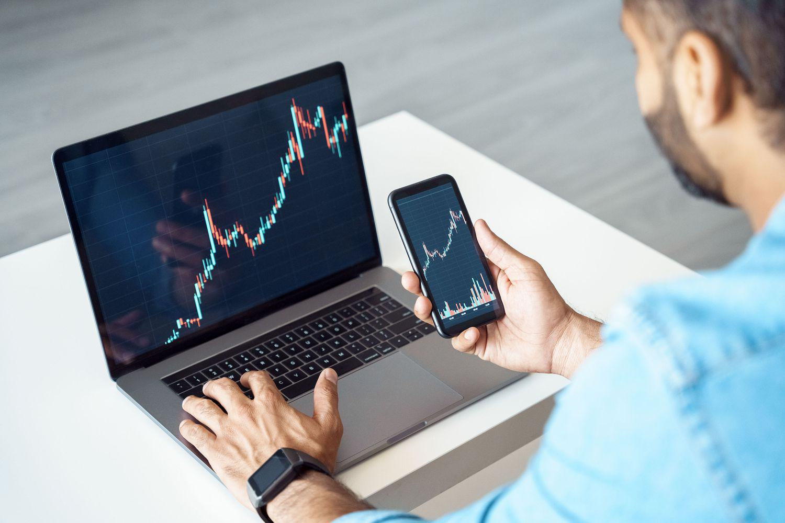

The financial markets security industry is a dynamic and evolving field that plays a vital role in global economics, encompassing a range of activities and entities integral to the functioning of financial systems worldwide. A key player in this industry is the Securities Industry and Financial Markets Association (SIFMA), which serves as a significant advocate for the development and preservation of efficient and resilient capital markets. SIFMA is a non-profit trade association that represents American brokerage firms, investment banks, and asset managers, thereby providing a unified voice within the industry. Through its efforts, SIFMA aims to foster public trust and ensure that financial markets are well-informed and transparent.

Another major development in the financial markets is the widespread adoption of algorithmic trading, commonly referred to as algo trading. This modern trading approach utilizes complex algorithms and high-speed data analytics to facilitate trades. A significant portion of financial market transactions is now carried out electronically through algo trading, enhancing market efficiency and transparency. This technological evolution has transformed trading practices, making the financial markets more agile and responsive to changes in real-time data.

This article addresses the interrelationship between SIFMA's advocacy activities, the broader financial markets security industry, and the advancements in algorithmic trading. By exploring these connections, we gain insights into the roles these players and practices have in shaping market dynamics today. Alongside highlighting their contributions, the article will examine the challenges they face and their future prospects. As global markets continue to advance, understanding these interactions is crucial for anticipating shifts in market regulations, technological integration, and security measures.

## Table of Contents

## Understanding SIFMA's Role

SIFMA, or the Securities Industry and Financial Markets Association, operates as a pivotal non-profit trade association within the financial markets, representing an extensive segment of the industry. Specifically, SIFMA accounts for approximately 80% of the U.S. broker-dealer sector by revenue and 50% of the asset management sector by assets under management. This representation underscores SIFMA's influential position in advocating for and advancing the interests of brokerage firms, investment banks, and other financial entities.

The association's mission is multifaceted, centering on the enhancement of public trust in financial markets. This mission is achieved through a combination of providing industry-leading research and robust support for its members via advocacy and educational initiatives. SIFMA plays a crucial role in ensuring that industry participants remain well-informed regarding the latest developments and best practices within the financial sector.

To address the myriad challenges faced by the financial markets, SIFMA has established various committees and subcommittees. These bodies focus on critical issues such as regulatory compliance, cybersecurity, and market infrastructure. By tackling these challenges, SIFMA ensures that both current market participants and future entrants can operate within a framework that prioritizes safety, efficiency, and resilience.

One of the key aspects of SIFMA's support is its ability to foster dialogue between its members and regulatory bodies, thereby ensuring that the voices of industry stakeholders are considered in legislative and regulatory processes. This dialogue is vital in shaping a regulatory environment that supports innovation while maintaining market integrity.

Furthermore, the association is instrumental in developing strategies to safeguard against emerging threats, such as cyber-attacks, which have increasingly become a concern for the industry. By prioritizing cybersecurity, SIFMA supports the development of resilient systems and protocols that protect sensitive financial data and maintain the integrity of market operations.

In summary, SIFMA serves as a cornerstone of the financial industry's infrastructure, facilitating growth, and stability. Through its advocacy, educational efforts, and focus on key industry challenges, SIFMA continues to play an essential role in shaping the future trajectory of financial markets.

## The Evolution and Impact of Algorithmic Trading

Algorithmic trading, often referred to as algo trading, employs complex mathematical formulas and high-speed data processing to execute trades. This approach has significantly reshaped financial markets, facilitating over 75% of trade executions in modern times. The primary advantage of [algorithmic trading](/wiki/algorithmic-trading) lies in its ability to conduct transactions with increased efficiency, transparency, and precision, which were previously unattainable through manual trading methods.

The core mechanism of algorithmic trading is the use of algorithms—sets of rules or procedures for solving problems or completing tasks. These algorithms can analyze vast datasets at speeds far superior to human capability, enabling instantaneous decision-making. For instance, an algorithm might identify [arbitrage](/wiki/arbitrage) opportunities by exploiting price differences across multiple exchanges, executing numerous trades in milliseconds. This rapid execution helps reduce transaction costs and enhance market [liquidity](/wiki/liquidity-risk-premium) by ensuring that buy and sell orders are matched swiftly and with minimal price slippage.

Despite these efficiencies, algorithmic trading introduces complexities that can affect market stability. High-frequency trading ([HFT](/wiki/high-frequency-trading-strategies)), a subset of algo trading characterized by extremely high turnover rates and short holding periods, can exacerbate market [volatility](/wiki/volatility-trading-strategies). Situations such as the "Flash Crash" of May 6, 2010, where major stock indices experienced unprecedented drops within minutes before partially recovering, highlight the potential risks. Such events underscore the need for robust regulatory frameworks to mitigate these risks and preserve market integrity.

Regulatory bodies like the U.S. Commodity Futures Trading Commission (CFTC) have proposed rules targeting automated trading systems. These rules aim to improve transparency and accountability, mandating measures like pre-trade risk controls and the registration of algorithmic trading firms. The intent is to prevent market manipulation and ensure fair trading practices while balancing the benefits of technological advancements in trading.

In conclusion, while algorithmic trading offers substantial benefits in terms of efficiency and liquidity, it is accompanied by challenges concerning market volatility and regulatory compliance. A balanced approach that embraces technological progress while safeguarding market stability is essential for the continued advancement of financial markets.

## Regulatory Environment and Challenges

Regulating algorithmic trading presents intricate challenges, necessitating a careful equilibrium between fostering innovation and maintaining market stability. SIFMA's involvement in the regulatory framework is crucial as it actively shapes policies that both encourage growth and safeguard market integrity. This dual role of advocacy and protection is vital in an industry characterized by rapid technological advancements and considerable economic impact.

One of the primary concerns in the regulation of algorithmic trading is data security. The increasing reliance on complex algorithms and automated systems amplifies the risk of data breaches, which can have significant repercussions for market stability. Protecting proprietary trading algorithms and sensitive data from cyber threats is paramount, necessitating robust cybersecurity measures and stringent data protection protocols.

Another critical aspect is the protection of intellectual property (IP) rights related to the algorithms used in trading. The unique methodologies and strategies encoded within these algorithms represent significant intellectual capital for financial firms. Safeguarding these IP rights while promoting a competitive and fair market environment remains a delicate balance for regulators and industry participants alike.

Market manipulation, facilitated by the speed and anonymity of algorithmic trading, poses another substantial challenge. The rapid execution capabilities of algo trading can potentially be exploited to influence market prices unfairly, undermining market integrity. Ensuring that trading practices remain transparent and accountable is essential for building and maintaining trust in financial markets.

The Commodity Futures Trading Commission (CFTC) has proposed rules on automated trading to address these challenges. These regulations emphasize the necessity for greater transparency and accountability in trading activities. By imposing stringent reporting requirements and enhanced surveillance mechanisms, the CFTC aims to mitigate the risks associated with automated trading systems.

SIFMA's engagement in the regulatory conversation ensures that the perspectives and practical concerns of industry stakeholders are considered. By advocating for balanced and effective regulatory measures, SIFMA plays a pivotal role in shaping policies that accommodate the dynamic nature of financial markets while ensuring their resilience and integrity. The ongoing dialogue between SIFMA, regulatory bodies, and industry participants is essential for achieving a harmonious regulatory environment that supports innovation without compromising market stability.

## The Future of Financial Markets Security with SIFMA and Algo Trading

The future trajectory of financial markets security is poised for transformation, driven by the integration of [artificial intelligence](/wiki/ai-artificial-intelligence) (AI) and [machine learning](/wiki/machine-learning) technologies into trading practices. As financial markets continue to embrace technological advancements, these computational methods will play a crucial role in enhancing the efficiency, speed, and accuracy of trading operations. AI algorithms can analyze vast datasets in seconds, identifying patterns and trends that were previously imperceptible to human traders. Machine learning, on the other hand, allows systems to continuously improve their performance and adapt to new market conditions without explicit programming.

SIFMA (Securities Industry and Financial Markets Association) is at the forefront of promoting standardized practices within this evolving landscape. By providing guidance and frameworks, SIFMA helps ensure that market participants collectively adhere to best practices and industry standards as technology evolves. This leadership is essential for maintaining an orderly and fair market environment as the complexity of trading systems increases.

A key consideration for the future is enhancing cybersecurity measures. As trading processes become more digitized and interconnected, the risk of cyberattacks grows. SIFMA's focus on strengthening cybersecurity defenses is critical, as breaches can lead to significant financial losses and undermine market confidence. Implementing advanced security protocols and fostering information-sharing among industry stakeholders will be paramount in safeguarding against these threats.

Adapting to shifts in global financial regulations is another emerging area of focus. As countries update their regulatory frameworks in response to technological developments, market participants must navigate a complex web of rules and compliance standards. SIFMA plays a pivotal role in this context, advocating for policies that balance innovation with market integrity and ensuring that the voices of industry participants are heard in regulatory discussions.

The convergence of financial markets security and technology underscores the need for ongoing collaboration between industry players and regulators. As regulatory bodies develop new rules to address the challenges posed by algorithmic trading and AI, it is crucial for SIFMA to facilitate dialogue and cooperation among stakeholders. This collaboration will help create a resilient and adaptable regulatory environment that supports sustainable market growth.

SIFMA's research and advocacy efforts are integral in addressing the complexities of these evolving dynamics. By conducting comprehensive studies and providing data-driven insights, SIFMA empowers industry participants to make informed decisions. Additionally, their advocacy work helps shape policies that promote transparency, efficiency, and innovation in financial markets.

In summary, the future of financial markets security will be characterized by the growing influence of AI and machine learning in trading practices, necessitating enhanced cybersecurity, adaptive regulations, and collaborative efforts led by SIFMA. As technological advancements continue to reshape the industry, SIFMA's role in guiding and supporting its members will be crucial in navigating these changes and ensuring the stability and success of financial markets.

## Conclusion

SIFMA, as a central representative of the securities industry, remains influential in shaping the trajectory of financial markets. It continuously plays a critical role in promoting efficient market operations, supporting advocacy, and providing valuable research to its members. Its efforts are instrumental in navigating the complex landscape of financial regulations and innovations.

Algorithmic trading has firmly established itself as a fundamental component of modern trading mechanisms. It offers numerous advantages including the enhancement of trading efficiency and market liquidity, though it also presents challenges, such as increased market volatility and the necessity for robust regulatory oversight. The collaboration between SIFMA, industry participants, and regulatory bodies is fundamental to maintaining market integrity and fostering sustainable growth. This collaboration ensures that thorough oversight accompanies the technological advancements in the market, such as AI and machine learning integrations in trading processes.

As technological innovations progress, the call for informed, adaptable, and resilient trading practices becomes more urgent. SIFMA is poised to lead the industry in adapting to these technological shifts, emphasizing the importance of cybersecurity and the necessity to align with evolving global financial regulations. By endorsing a flexible and comprehensive regulatory environment, SIFMA ensures that financial markets remain stable and successful in the face of rapid technological changes and global economic dynamics. The commitment to collaboration and adaptation will continue to underpin the strength and resilience of financial markets in the future.

## References & Further Reading

[1]: Bergstra, J., Bardenet, R., Bengio, Y., & Kégl, B. (2011). ["Algorithms for Hyper-Parameter Optimization."](https://papers.nips.cc/paper/4443-algorithms-for-hyper-parameter-optimization) Advances in Neural Information Processing Systems 24.

[2]: ["Advances in Financial Machine Learning"](https://www.amazon.com/Advances-Financial-Machine-Learning-Marcos/dp/1119482089) by Marcos Lopez de Prado

[3]: ["Evidence-Based Technical Analysis: Applying the Scientific Method and Statistical Inference to Trading Signals"](https://www.amazon.com/Evidence-Based-Technical-Analysis-Scientific-Statistical/dp/0470008741) by David Aronson

[4]: ["Machine Learning for Algorithmic Trading"](https://github.com/stefan-jansen/machine-learning-for-trading) by Stefan Jansen

[5]: ["Quantitative Trading: How to Build Your Own Algorithmic Trading Business"](https://www.amazon.com/Quantitative-Trading-Build-Algorithmic-Business/dp/1119800064) by Ernest P. Chan