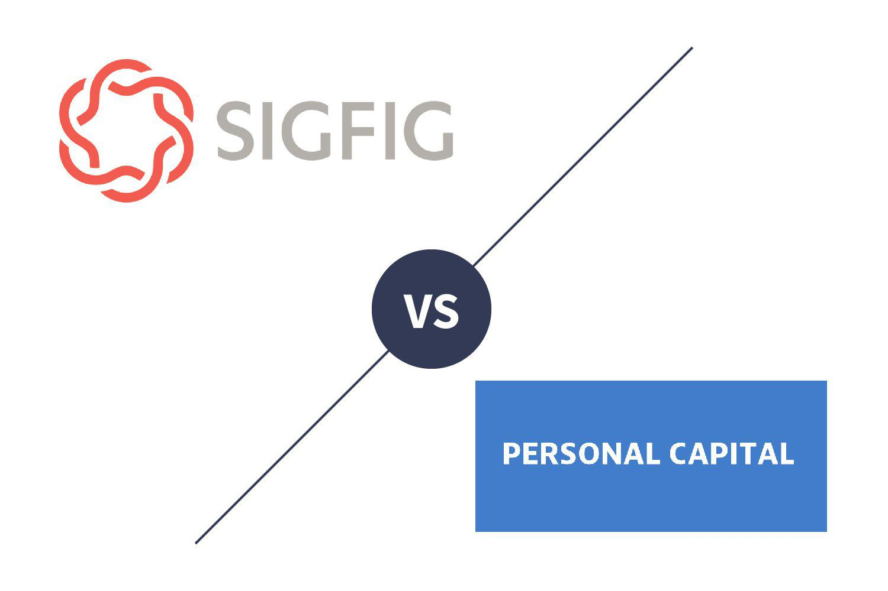

SigFig is a recognized entity in the financial technology sector, known for its innovation in the area of robo-advisory services. Founded in 2007, SigFig has evolved into a significant player by leveraging technology to democratize investment management. It offers a platform that combines the benefits of automated portfolio management with intelligent data analytics, serving both individual investors and financial institutions. SigFig’s strength lies in its use of cutting-edge technologies such as algorithmic trading (algod-trading), which plays a critical role in optimizing investment strategies and delivering value to users.

Algorithmic trading, or "algod-trading," refers to the use of computer algorithms to manage the trading of securities. This process involves pre-programmed instructions to execute trades based on various factors such as timing, price, and volume, thereby minimizing human intervention and enhancing precision. SigFig integrates these sophisticated algorithms into its robo-advisory platform, utilizing real-time market data to perform efficient portfolio adjustments and risk assessments. By automating these complex tasks, SigFig reduces the potential for human error, ensures more consistent performance, and adheres to the personalized investment strategies tailored to individual investor profiles.



The importance of reviewing robo-advisors like SigFig cannot be understated for modern investors. Traditional investment management is often constrained by high fees, subjective decision-making, and limited accessibility. Robo-advisors, on the other hand, offer a streamlined, cost-efficient alternative, providing continuous portfolio monitoring and adjustments that align with market trends and individual financial goals. As the financial landscape undergoes a transformation driven by technological advancements, understanding the offerings and efficacy of platforms like SigFig becomes essential. Investors today seek tools that not only manage wealth but also adapt dynamically to both challenges and opportunities within the market. Evaluating robo-advisors ensures that individuals can make informed decisions when selecting financial management solutions that best meet their unique needs and objectives.

## Table of Contents

## Understanding Robo-Advisors

Robo-advisors are digital platforms that provide automated, algorithm-driven financial planning services, with minimal human intervention. They utilize sophisticated algorithms and data analytics to manage investment portfolios on behalf of users. Since their inception in the early 2000s, robo-advisors have transformed the asset management landscape by democratizing access to investment services traditionally reserved for high-net-worth individuals.

### Definition and Role in Financial Planning

A robo-advisor typically consists of an online service equipped with automated algorithms that assess the user's investment goals, risk tolerance, and time horizon. Based on this information, the platform recommends a customized investment strategy and continually manages the portfolio. The fundamental role of robo-advisors in financial planning is to provide an affordable, efficient, and scalable solution for managing personal investments, making it accessible to a broader audience.

### Benefits Over Traditional Investment Methods

The adoption of robo-advisors offers several advantages over traditional investment management:

1. **Cost Efficiency**: Robo-advisors generally charge lower fees than traditional financial advisors. This cost efficiency stems from the reduced need for human labor and infrastructure.

2. **Accessibility**: With low minimum investment requirements, robo-advisors make professional portfolio management available to individuals from various financial backgrounds.

3. **Consistency and Objectivity**: Algorithms eliminate emotional biases that can affect human decision-making, ensuring consistent and objective management of investments.

4. **24/7 Availability**: Being digital platforms, robo-advisors are accessible at any time, providing real-time data and insights, which can be valuable for making informed decisions.

### Automated Investing and the Financial Technology Sector

The rise of automated investing through robo-advisors is part of a broader trend of technological advancement in the financial technology sector. This shift is characterized by the increasing use of [artificial intelligence](/wiki/ai-artificial-intelligence), [machine learning](/wiki/machine-learning), and big data analytics to enhance financial services.

Robo-advisors leverage these technologies to analyze vast amounts of market data and predict trends, optimizing investment strategies accordingly. This can be implemented in Python using libraries such as NumPy for numerical calculations and scikit-learn for machine learning models. Here's a simple example of using Python to model an investment portfolio based on historical data trends:

```python
import numpy as np
from sklearn.linear_model import LinearRegression

# Example data: annual returns for different asset classes
years = np.array([1, 2, 3, 4, 5]).reshape(-1, 1)
returns = np.array([0.05, 0.07, 0.08, 0.06, 0.09])

# Model predicting future returns based on historical data
model = LinearRegression()
model.fit(years, returns)
predicted_return = model.predict(np.array([6]).reshape(-1, 1))
print(f"Predicted return for year 6: {predicted_return[0]:.2f}")
```

In summary, robo-advisors have redefined the investment landscape by providing efficient, cost-effective, and accessible services through enhanced technological capabilities, catering to the growing demand for automated financial solutions.

## Features of SigFig

SigFig offers a streamlined account setup process designed to be user-friendly and efficient. To begin, potential users must provide basic personal information and complete a risk assessment questionnaire to help determine their investment preferences and risk tolerance. This initial evaluation is crucial as it informs the portfolio construction process, ensuring alignment with the user's financial goals. Users are required to link their existing financial accounts, after which SigFig imports and analyzes the data to provide a comprehensive financial overview.

Once the account is set up, SigFig employs an advanced portfolio construction service. This service utilizes modern portfolio theory to create diversified investment portfolios tailored to individual risk profiles. SigFig's approach is based on balancing risk and return, optimizing the combination of assets to minimize risk while targeting a desired level of return. The algorithm assesses historical performance, [volatility](/wiki/volatility-trading-strategies), and potential market conditions, providing recommendations that are regularly updated to adapt to changing financial landscapes.

SigFig offers a range of investment assets, predominantly focusing on exchange-traded funds (ETFs) due to their cost-effectiveness and diversification benefits. The platform supports flexibility in portfolio customization, allowing users to fine-tune their portfolios according to their preferences. While SigFig provides robust portfolio recommendations, users have the option to adjust asset allocations within certain parameters. However, customization options may be limited compared to some other platforms, with the focus remaining on maintaining the balance between risk and return.

Overall, SigFig's features are designed to provide a comprehensive, automated investment management experience, leveraging technology to maximize efficiency and user-centric service. These features aim to simplify financial management for users while delivering personalized, data-driven investment strategies.

## Algo-Trading with SigFig

SigFig's utilization of [algorithmic trading](/wiki/algorithmic-trading) is a cornerstone of its investment approach. Algorithmic trading, often shortened to algo-trading, involves the use of complex algorithms to automate trading decisions and execution. This practice is pivotal in executing large volumes of trades with minimal human intervention, ensuring efficiency and precision in investment decisions. SigFig leverages sophisticated algorithms to continuously analyze market trends, historical data, and real-time market conditions to optimize portfolio performance for its users.

The integration of artificial intelligence (AI) tools further enhances SigFig's algo-trading strategies. These tools enable the platform to process vast amounts of data at high speeds, significantly improving the decision-making process. For instance, machine learning algorithms can identify patterns and predict market movements more accurately than traditional methods. AI tools also facilitate dynamic portfolio adjustments, allowing SigFig to automatically rebalance portfolios in response to market changes, thus maintaining the desired level of risk and investment objectives.

Real-time data analysis is a significant advantage of SigFig's algorithmic strategies. By continuously monitoring market conditions, SigFig's algorithms can promptly capitalize on investment opportunities or mitigate potential losses. This capability ensures that users benefit from up-to-date investment decisions. For example, if a specific stock exhibits a sharp price drop due to unforeseen circumstances, SigFig's system might quickly analyze the context and decide whether to hold, sell, or buy additional shares depending on the overall portfolio strategy and risk management rules.

In addition to trade execution, algorithmic strategies facilitate cost savings by optimizing trade times and minimizing transaction costs. Algorithms assess factors such as [liquidity](/wiki/liquidity-risk-premium) and market volatility to determine the most cost-effective timing for trade execution. The result is not only a potentially higher return on investment for users but also a reduction in unnecessary expenses.

Overall, SigFig's incorporation of algo-trading and AI tools represents a significant advancement in the robo-advisory field, providing users with sophisticated, data-driven investment strategies that are constantly refined and optimized in real-time.

## Pros and Cons of Using SigFig

SigFig is a prominent player in the robo-advisor segment, offering a range of investment management services that leverage technology to optimize returns. One of the standout advantages of using SigFig is its low management fees. The platform typically charges a management fee of 0.25% annually, which is competitive when compared to traditional financial advisors who may charge around 1% to 2%. This cost efficiency makes SigFig attractive for cost-conscious investors seeking to maximize net returns.

Moreover, SigFig provides robust integrations with financial institutions, allowing users to connect and manage multiple accounts seamlessly. This feature contributes to a comprehensive view of one's entire financial landscape, facilitating informed decision-making. The platform's ability to aggregate data from various sources enhances its appeal to users who prioritize streamlined asset management.

However, SigFig is not without its drawbacks. One potential disadvantage is the account minimum requirement. SigFig mandates a minimum investment of $2,000, which might be a barrier for some new investors or those with limited initial capital. Additionally, some users may find the platform's customization options limited. While SigFig offers automated portfolio management, it does not provide extensive options for individuals who wish to have a significant degree of control over their investment decisions.

User feedback and satisfaction ratings shed light on the overall reception of SigFig. Many users appreciate the ease of use and the clarity of the financial insights provided. Survey results often highlight a high level of customer satisfaction, particularly concerning the platform's cost-effectiveness and user interface. However, some investors express a desire for more personalized investment strategies, indicating that while the algorithmic approach is beneficial for many, it may not suit every investor's unique needs.

In conclusion, SigFig offers several key advantages, including low fees and comprehensive account integration, appealing to modern investors looking for efficient asset management. Nevertheless, potential users should weigh these benefits against the platform's minimum investment requirement and limited customization features to determine if it aligns with their financial objectives.

## Tax Efficiency and Savings

SigFig integrates tax-loss harvesting into its investment management services, providing a valuable tool for reducing investors' tax liabilities. Tax-loss harvesting is the practice of selling securities at a loss to offset capital gains from other investments, thereby reducing the amount of taxable income. This feature can significantly enhance net returns by minimizing the taxes investors owe.

SigFig automatically performs tax-loss harvesting by continuously monitoring portfolio performance and identifying opportunities to realize losses without deviating from an investor's target asset allocation. After selling a losing investment, SigFig replaces it with a comparable asset to maintain the portfolio's risk and return profile. This ongoing process helps ensure that investors gain the maximum tax benefit while adhering to the wash-sale rule, which prohibits repurchasing the same or a substantially identical security within 30 days of the sale.

By leveraging tax-loss harvesting, SigFig assists investors in minimizing tax liabilities, particularly those in higher tax brackets who stand to benefit most from reduced capital gains. The feature is particularly advantageous for taxable accounts, where the tax impact on investment returns can be more significant compared to tax-advantaged accounts like IRAs or 401(k)s.

Investors can harness SigFig’s tax-efficient strategies by regularly reviewing their tax situation and aligning their investment strategy with their tax objectives. It is advisable to coordinate SigFig’s tax-loss harvesting efforts with personal tax planning conducted by a tax advisor to optimize the benefits. Understanding and making full use of this feature can result not only in immediate tax savings but also in compounding investment growth over time, enhancing long-term wealth accumulation.

## Security and Customer Support

SigFig employs a range of security measures to protect user data and investments, adhering to industry standards and ensuring that client information is securely handled. The platform utilizes Secure Socket Layer (SSL) technology to encrypt all transmitted data, safeguarding sensitive information from unauthorized access during online transactions. Additionally, SigFig follows stringent data protection protocols to comply with regulatory requirements, ensuring that investor data remains confidential and protected against breaches.

As part of their commitment to data security, SigFig offers two-[factor](/wiki/factor-investing) authentication (2FA) to provide an added layer of security beyond passwords. This feature requires users to verify their identity through an additional verification step, such as a code sent to their mobile device, enhancing the security of their accounts.

Customer support is a vital component of SigFig's service offering. The platform provides multiple channels for client assistance, including email support and access to financial advisors for certain account types. Compared to other robo-advisors, SigFig offers a more personalized level of service by allowing users to consult with actual financial professionals, which is not always available with competing platforms.

User experiences with SigFig’s customer service are generally positive, with many appreciating the efficiency and responsiveness of the support team. According to customer reviews and feedback, users find the support provided by SigFig to be helpful, particularly in resolving issues related to account management and technical inquiries. This level of customer satisfaction distinguishes SigFig from some of its competitors, who may rely heavily on automated responses and lack direct financial advisory services.

Overall, SigFig's blend of robust security measures and accessible customer support services positions it favorably within the robo-advisor market. By protecting user data and providing responsive client assistance, SigFig not only enhances user trust but also improves the overall customer experience.

## Conclusion

SigFig has emerged as a notable player in the ever-growing robo-advisor market, providing a range of services designed to streamline and enhance the investment process for users. The platform's offerings include an efficient account setup process, automated portfolio management, and tax-efficient investing features like tax-loss harvesting. These elements collectively position SigFig as an attractive option for those seeking automated investment solutions with a focus on modern technology integration.

SigFig caters to a wide array of investors, from beginners to more experienced individuals. Its low management fees and robust integration capabilities make it a compelling choice for cost-conscious investors looking for a convenient way to manage their portfolios. Additionally, the use of algorithmic trading strategies, powered by advanced AI tools, allows SigFig to provide real-time data analysis, enhancing the investment decision-making process. However, potential users should consider the platform's limitations, such as the account minimums and relatively limited customization options. This ensures a good match between their investment goals and SigFig's offerings.

For those contemplating whether SigFig is the right choice, it is crucial to evaluate their own financial objectives and risk tolerance. Factors such as desired portfolio size, investment goals, and preferences for human versus automated financial advice should be carefully considered. Ultimately, while SigFig provides a robust framework for automated investing, its suitability will largely depend on the individual investor's needs and objectives. Prospective users are encouraged to conduct thorough research and consider their long-term financial aspirations before committing to SigFig's robo-advisory services.

## FAQs

### FAQs

**What are the costs associated with SigFig?**

SigFig is known for its transparency and cost-effectiveness. It offers no management fees for accounts under $10,000, making it accessible for beginners (SigFig, n.d.). For accounts over $10,000, the platform charges a management fee of 0.25% per year, which is competitive in the robo-advisor market. There are no additional trading fees, as SigFig's portfolios are generally built using ETFs, which may have their own expense ratios.

**How safe is SigFig regarding user data and investments?**

SigFig implements advanced security measures to protect user data and investments. This includes employing bank-level encryption to safeguard personal and financial information. Furthermore, SigFig acts as an advisor and does not directly hold client funds. Instead, funds are held with established custodians like Charles Schwab, providing an additional level of security and reassurance to investors (SigFig, n.d.).

**How does SigFig assist in portfolio management and customization?**

SigFig uses a combination of algorithmic tools and personalized financial advice to manage and customize portfolios. When users sign up, they complete a detailed questionnaire that helps tailor portfolio recommendations according to their financial goals, risk tolerance, and investment horizon. SigFig's algorithms are then employed to continuously monitor and adjust the portfolio, ensuring optimal returns in line with the user’s stated objectives.

**What is the process for withdrawing funds from a SigFig account?**

To withdraw funds, users must initiate the request via their SigFig account dashboard. The process is designed to be straightforward; once a withdrawal is requested, it typically takes a few business days for the transaction to be processed by the custodial account (e.g., Charles Schwab). The timeline for completing withdrawals may vary depending on banking holidays or specific bank processing times.

**How can investors close their SigFig accounts?**

Investors wishing to close their SigFig account can do so by contacting the SigFig customer support team. The closure process involves selling off any remaining assets in the portfolio and transferring the cash to the linked bank account. Investors should be aware of any potential tax implications that might arise from selling their holdings before closing an account.

## References & Further Reading

[1]: Bardeen, R., Bengio, Y., & Kégl, B. (2011). ["Algorithms for Hyper-Parameter Optimization"](https://proceedings.neurips.cc/paper/2011/file/86e8f7ab32cfd12577bc2619bc635690-Paper.pdf). Advances in Neural Information Processing Systems 24.

[2]: Lopez de Prado, M. (2018). ["Advances in Financial Machine Learning"](https://www.amazon.com/Advances-Financial-Machine-Learning-Marcos/dp/1119482089). Wiley.

[3]: Aronson, D. R. (2006). ["Evidence-Based Technical Analysis: Applying the Scientific Method and Statistical Inference to Trading Signals"](https://onlinelibrary.wiley.com/doi/book/10.1002/9781118268315). Wiley.

[4]: Jansen, S. (2020). ["Machine Learning for Algorithmic Trading"](https://github.com/stefan-jansen/machine-learning-for-trading). Independently published.

[5]: Chan, E. P. (2008). ["Quantitative Trading: How to Build Your Own Algorithmic Trading Business"](https://github.com/ftvision/quant_trading_echan_book). Wiley.