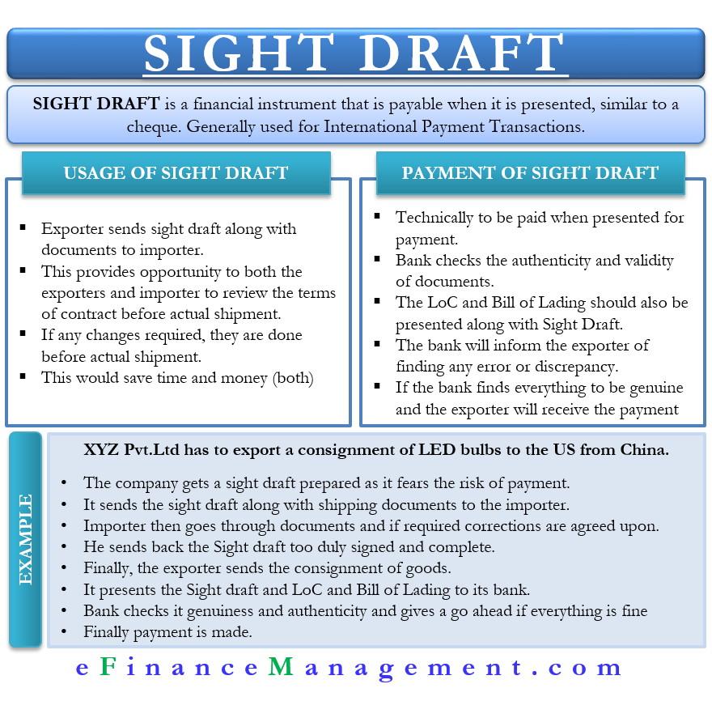

## Table of Contents

## What is a sight draft?

A sight draft is a type of bill of exchange that is payable immediately upon presentation to the person or company that owes the money. It is called a "sight" draft because the payment is due as soon as the draft is seen by the payer. This type of draft is commonly used in international trade to ensure that the seller gets paid before the buyer receives the goods.

In practice, the seller sends the sight draft along with the shipping documents to the buyer's bank. Once the bank sees the draft, it must pay the amount specified, and then it releases the documents to the buyer. This method provides security for the seller, as they are assured of payment before the buyer can take possession of the goods. However, it requires trust in the buyer's bank to honor the draft promptly.

## How does a sight draft work?

A sight draft is a type of bill that someone has to pay right away when they see it. Imagine you are selling something to someone far away. You want to make sure you get your money before they get your product. So, you send a sight draft along with the papers that show you shipped the product to the buyer's bank.

When the bank gets the sight draft, they have to pay you the money written on it. After they pay, they give the shipping papers to the buyer. This way, you know you will get paid because the bank has to pay you before the buyer can get the product. It's a safe way for sellers to do business, especially when they don't know the buyer well.

## What are the key components of a sight draft?

A sight draft has a few important parts that make it work. The first part is the amount of money that needs to be paid. This is clearly written on the draft so everyone knows how much is due. The second part is the name of the person or company that has to pay the money. This is called the drawee. The third part is the name of the person or company that will get the money, known as the payee.

The fourth part is the date when the draft is presented, which is important because the payment is due right away when the drawee sees it. The fifth part is the instructions or conditions for payment. These tell the bank exactly what to do when they get the draft. All these parts together make sure the seller gets paid before the buyer gets the goods, making the sight draft a useful tool in trade.

## Who are the parties involved in a sight draft?

A sight draft involves three main parties: the drawer, the drawee, and the payee. The drawer is the person or company that creates the sight draft. They are usually the seller who wants to get paid for the goods they are selling. The drawee is the person or company that has to pay the money when they see the draft. This is often the buyer's bank. The payee is the one who gets the money. In most cases, the payee is the same as the drawer, which means the seller gets the money directly.

The process works smoothly because each party has a clear role. When the drawer sends the sight draft to the drawee, the drawee must pay the amount written on the draft right away. After the drawee pays, they give the shipping documents to the buyer, who is often not directly involved in the sight draft but is important because they are the one who will ultimately receive the goods. This way, the drawer, or seller, is sure to get paid before the buyer gets the product.

## What is the difference between a sight draft and a time draft?

A sight draft and a time draft are both types of bills of exchange, but they work differently. A sight draft needs to be paid right away when the person or company that owes the money sees it. This means the payment is due immediately upon presentation. It's like saying, "Pay this now when you see it." This type of draft is used a lot in trade to make sure the seller gets paid before the buyer gets the goods.

On the other hand, a time draft allows the person or company that owes the money some time before they have to pay. Instead of paying right away, they can pay on a future date that is written on the draft. It's like saying, "You can pay this later on this specific date." This gives the buyer some time to arrange payment, which can be helpful but also means the seller has to wait longer to get their money.

## In what situations is a sight draft typically used?

A sight draft is often used when a seller wants to make sure they get paid before the buyer gets the goods. This is common in international trade where the seller and buyer might not know each other well. By using a sight draft, the seller can send the goods and the draft to the buyer's bank. The bank has to pay the seller right away when they see the draft, and then they give the shipping papers to the buyer. This way, the seller feels safe because they know they will get their money before the buyer gets the product.

Sight drafts are also useful when a seller wants to reduce the risk of not getting paid. For example, if a seller is sending expensive goods overseas, they might use a sight draft to protect themselves. The draft makes sure that the payment is made before the goods are released to the buyer. This method is especially helpful when the seller is dealing with new customers or in markets where trust might be an issue. By using a sight draft, the seller can do business with more confidence.

## How does a sight draft compare to other types of payment methods in international trade?

A sight draft is just one way to get paid in international trade, and it works differently from other methods. With a sight draft, the seller sends the draft and the shipping papers to the buyer's bank. The bank has to pay the seller right away when they see the draft, and then they give the papers to the buyer. This method is good for the seller because they get paid before the buyer gets the goods. But it needs the buyer's bank to be trusted to pay quickly.

Other ways to get paid in international trade include using a letter of credit, open account, or cash in advance. A letter of credit is like a promise from the buyer's bank to pay the seller if certain conditions are met. It's safer for the seller than a sight draft because the bank's promise is strong. An open account means the seller sends the goods and waits for the buyer to pay later. This is riskier for the seller because they might not get paid. Cash in advance is the safest for the seller because they get the money before sending the goods, but it's not as common because buyers don't like to pay before getting anything.

Each payment method has its own pros and cons. Sight drafts give the seller some safety but need the buyer's bank to be reliable. Letters of credit are safer for the seller but can be more complicated to set up. Open accounts are easier for the buyer but riskier for the seller. Cash in advance is the safest for the seller but might make buyers hesitant. The choice depends on how much risk the seller and buyer are willing to take and how well they trust each other.

## What are the advantages of using a sight draft?

Using a sight draft has some good points for the seller. It helps the seller feel safe because they get paid right away when the buyer's bank sees the draft. This means the seller doesn't have to wait and worry about getting their money. It's especially helpful when the seller is sending goods to someone they don't know well or to another country. The sight draft makes sure the seller gets paid before the buyer gets the goods, which lowers the risk of not getting paid.

Another advantage is that sight drafts are easier to use than some other payment methods. For example, setting up a letter of credit can be more complicated and take more time. With a sight draft, the seller just sends the draft and the shipping papers to the buyer's bank. If the bank is trusted, the seller can be sure they will get their money quickly. This makes the whole process smoother and faster, which is good for both the seller and the buyer.

## What are the potential risks or disadvantages of using a sight draft?

Using a sight draft has some risks for the seller. One big risk is that the seller has to trust the buyer's bank to pay right away when they see the draft. If the bank doesn't pay quickly or refuses to pay, the seller might have to wait a long time to get their money. This can be a problem, especially if the seller needs the money to keep their business running. Also, if the buyer's bank is in another country, there might be extra rules or delays that can make things harder for the seller.

Another disadvantage is that sight drafts can be less safe than other payment methods like a letter of credit. A letter of credit is a strong promise from the buyer's bank to pay the seller if certain conditions are met. With a sight draft, the seller doesn't have that strong promise. If something goes wrong, like the buyer's bank going bankrupt or the buyer not being able to pay, the seller might lose out. So, while sight drafts can be easier to use, they might not offer as much protection as other methods.

## How can one mitigate the risks associated with sight drafts?

One way to lower the risks of using sight drafts is to make sure you choose a good bank. The seller should pick a bank that is known for being reliable and quick to pay. It's also a good idea to check the bank's history and see if they have a good record of paying sight drafts on time. If the bank is in another country, the seller might want to talk to someone who knows about that country's banking rules to make sure there won't be any surprises.

Another way to reduce the risks is to use other payment methods along with the sight draft. For example, the seller could ask for a letter of credit as well. A letter of credit is like a strong promise from the buyer's bank to pay the seller if certain conditions are met. This can give the seller more safety. The seller could also ask for some money upfront before sending the goods. This way, even if something goes wrong with the sight draft, the seller will have already gotten some payment. By using these extra steps, the seller can feel more secure when using a sight draft.

## What legal considerations should be taken into account when using sight drafts?

When using sight drafts, it's important to understand the legal rules that apply. Different countries might have different laws about how sight drafts work. For example, some places might have rules about how long a bank has to pay a sight draft. The seller needs to know these rules so they don't get surprised by delays or other problems. Also, the seller should make sure the sight draft is written clearly and correctly. If it's not, the bank might not have to pay, and the seller could lose out.

Another legal thing to think about is what happens if the buyer or their bank can't pay. The seller should check if there are any laws that can help them get their money if the buyer's bank goes bankrupt or if the buyer doesn't have enough money. Sometimes, the seller might need to take legal action to get paid. It's a good idea for the seller to talk to a lawyer who knows about international trade and banking laws. This can help them understand their rights and make sure they are protected when using sight drafts.

## Can you provide case studies or real-world examples where sight drafts played a crucial role in transactions?

In one real-world example, a company in the United States wanted to sell machinery to a buyer in Brazil. They used a sight draft to make sure they got paid before the buyer got the machinery. The U.S. company sent the sight draft along with the shipping papers to the buyer's bank in Brazil. When the bank saw the draft, they paid the U.S. company right away. Then, they gave the shipping papers to the buyer in Brazil. This way, the U.S. company was sure they would get their money before the buyer in Brazil got the machinery.

Another example is a clothing manufacturer in China selling clothes to a retailer in Europe. The Chinese manufacturer used a sight draft to lower the risk of not getting paid. They sent the clothes and the sight draft to the retailer's bank in Europe. When the bank saw the draft, they paid the Chinese manufacturer immediately and then released the clothes to the retailer. This helped the Chinese manufacturer feel safe about selling to a new customer in Europe because they knew they would get their money before the retailer got the clothes.

## References & Further Reading

[1]: ["Advances in Financial Machine Learning"](https://www.amazon.com/Advances-Financial-Machine-Learning-Marcos/dp/1119482089) by Marcos Lopez de Prado

[2]: ["Machine Learning for Algorithmic Trading"](https://github.com/stefan-jansen/machine-learning-for-trading) by Stefan Jansen

[3]: ["Quantitative Trading: How to Build Your Own Algorithmic Trading Business"](https://www.amazon.com/Quantitative-Trading-Build-Algorithmic-Business/dp/1119800064) by Ernest P. Chan

[4]: Venter, G. G., & de Kock, J. E. (2007). ["Blockchain Technology and Its Potential Applications in the Financial Sector."](https://www.researchgate.net/publication/376051976_Blockchain_technology_and_application_an_overview) International Journal of Business and Economics

[5]: Hull, J. C. (2017). ["Options, Futures, and Other Derivatives"](https://www.semanticscholar.org/paper/Options%2C-Futures%2C-and-Other-Derivatives-Hull/89bdee500c8623864fc9eb7a471546aa713acc44) (9th Edition). Pearson.