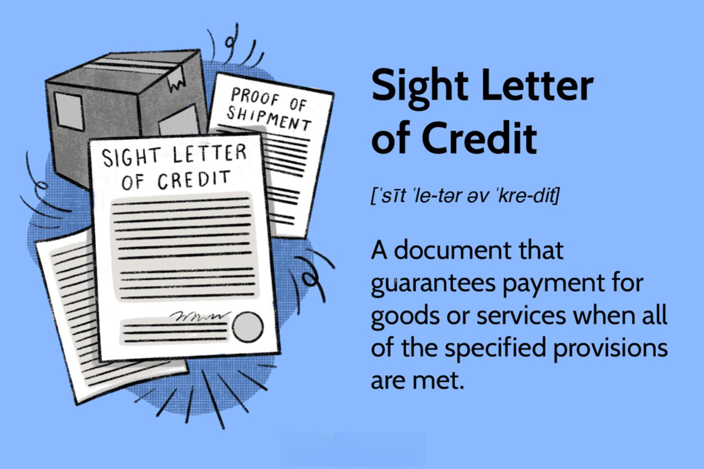

In today's globalized economy, international trade is a driving force behind economic growth and development. The exchange of goods, services, and capital across international borders foster economic cooperation and diversification. However, engaging in international trade comes with its own set of financial risks, such as currency fluctuations, credit risk, and political instability. To mitigate these risks, businesses often rely on financial instruments like sight letters of credit.

A sight letter of credit is an essential tool in international trade finance, providing a secure method of payment between buyers and sellers. It ensures that the seller receives payment promptly upon fulfilling the terms of the trade agreement, thus reducing the credit risk associated with international transactions. The utilization of sight letters of credit supplies a layer of confidence for sellers when dealing with overseas buyers, guaranteeing payment through the involvement of a financial institution, typically a bank.



Moreover, the interplay between traditional financial instruments such as sight letters of credit and modern technologies is becoming increasingly significant. Advancements in financial technologies, particularly algorithmic trading, are transforming the landscape of international trade finance. These technologies aim to streamline trade processes, enhance efficiency, and minimize human error.

By integrating sight letters of credit with the latest advancements in technology, businesses can achieve more secure and efficient operational mechanisms. Algorithmic trading, for instance, allows for the automation of trading decisions based on predefined criteria, which can be applied to trade finance to optimize payment processing and risk assessment. Consequently, understanding the role of sight letters of credit within the broader context of international trade finance and acknowledging the impact of technological advancements are crucial for navigating today's complex global economy.

## Table of Contents

## What is a Sight Letter of Credit?

A sight letter of credit is a financial instrument that assures payment following the presentation of the required documentation. Functioning as a payment tool in international transactions, it involves three key parties: the buyer, the issuing bank, and the seller. The buyer arranges a letter of credit with an issuing bank to favor the seller, committing to pay upon the presentation of specific documents by the seller. These documents generally include invoices, shipping details, and bills of lading, among others, signifying the fulfillment of the agreed terms.

The issuing bank plays a crucial role by guaranteeing payment to the seller, provided that all conditions are met as stipulated in the letter of credit. This mechanism reduces the transaction risk for sellers, offering reassurance of payment even when dealing with overseas or unfamiliar buyers. The immediate nature of the payment upon the presentation of compliant documents makes sight letters of credit particularly advantageous in smoothing out international trade operations and maintaining cash flow. Therefore, this financial tool not only ensures security but also fosters trust between parties engaged in cross-border trade.

## How Sight Letters of Credit Work

A sight letter of credit facilitates international trade by acting as a secure method of payment. Upon shipping goods, the seller is required to present specified documents to their bank. These documents typically include the bill of lading, commercial invoice, insurance certificate, and any other documents stipulated in the letter of credit. The seller's bank, also known as the advising bank, reviews these documents to ensure they conform to the requirements.

Once the advising bank has verified the documentation, it forwards them to the issuing bank, which represents the buyer. The issuing bank's role is crucial as it re-examines these documents against the terms specified in the letter of credit. This scrutiny ensures that the transaction meets all pre-defined conditions, offering a layer of protection to both the buyer and the seller. If discrepancies are found, the issuing bank may refuse payment until they are rectified, maintaining the integrity of the transaction.

The timeline for processing a sight letter of credit can vary, but it typically takes around five to ten business days from the time the documents are presented to the advising bank. This timeline encompasses the review, transfer, and approval processes by both banks involved. It's crucial to note that the efficiency of documentation handling plays a vital role. Any inconsistencies or errors can delay payment, thus emphasizing the importance of precise and accurate paperwork.

In summary, a sight letter of credit offers a structured framework for payment in international trade, relying heavily on the presentation of exact documentation to ensure prompt transaction settlement. This process underscores the importance of meticulous attention to detail in managing trade documents.

## Benefits of Using Sight Letters of Credit

Sight letters of credit provide several notable advantages in international trade, particularly regarding payment security and cash flow enhancement for sellers. By offering immediate payment upon the presentation of the required documentation, they alleviate the cash flow constraints that can occur in cross-border transactions. This capability is crucial for sellers who depend on timely payments to maintain their operational [liquidity](/wiki/liquidity-risk-premium) and manage financial planning effectively.

Moreover, sight letters of credit offer a high level of security for sellers by guaranteeing payment. When dealing with unfamiliar buyers or entering new markets, the risk of non-payment can be a significant concern. A sight letter of credit ensures that the issuing bank will release funds once the stipulated conditions are met, effectively transferring the payment risk from the seller to the bank. This transfer of risk helps build trust between trading partners, facilitating smoother business operations and fostering international trade relations.

The involvement of the issuing bank further mitigates potential credit risk associated with international sales. By acting as an intermediary, the bank ensures that all documents are thoroughly vetted before payment is processed. This scrutiny helps to prevent fraud and misunderstandings, adding another layer of protection for sellers. In practice, this reduces the likelihood of financial disputes and streamlines the transaction process, allowing businesses to focus more on growth and strategic planning rather than managing financial risks.

Overall, sight letters of credit are instrumental in enhancing the reliability and efficiency of international trade by offering prompt payments, securing transactions, and reducing credit risks.

## Implementing Sight Letters of Credit in International Trade

Sight letters of credit serve a pivotal role in international trade, particularly when transactions involve unfamiliar parties or high economic risks. Given their promise of immediate payment upon the presentation of correct documentation, these financial instruments are invaluable in settings characterized by low trust or elevated payment uncertainties.

Industries such as manufacturing, petrochemicals, and agriculture prominently use sight letters of credit. In these sectors, the production and transportation of goods often entail substantial upfront costs and long delivery timelines. For instance, a machinery manufacturer exporting equipment across continents might encounter uncertainties about a buyer's creditworthiness or political stability in the destination country. To address these challenges, the manufacturer can utilize a sight letter of credit, ensuring payment upon shipping and presentation of the necessary documents, thus safeguarding against non-payment risks.

The oil industry presents another typical scenario where sight letters of credit are advantageous. Given the massive scale of financial transactions and potential geopolitical disturbances, oil exporters frequently rely on these instruments. By doing so, they secure payment once the oil shipment is documented and dispatched, reducing the financial risk associated with possible buyer defaults or currency fluctuations.

In agricultural trade, exporters of perishable goods such as fruits or vegetables face distinct challenges related to product freshness and quick turnover. Sight letters of credit are crucial here, enabling farmers and distributors to obtain payment promptly after dispatch, thus maintaining liquidity and cash flow vital for their operations.

A real-world example from the textile industry further illustrates the application. A garment exporter in Bangladesh may supply products to a European retailer. Given the lack of direct experience with the retailer, the exporter mitigates risk through a sight letter of credit. After fulfilling the shipping terms and providing the required documentation, the exporter promptly receives payment from the retailer's issuing bank, bolstering trust and facilitating continued trade without financial uncertainties.

In summary, sight letters of credit offer a dependable mechanism for managing international trade risks, particularly in industries and transactions where trust levels are in question or where the cost of goods is high. Their adoption helps ensure expedited payment, maintain cash flows, and build business confidence, underpinning successful cross-border trade operations.

## Comparing Sight and Time Letters of Credit

A sight letter of credit (LC) and a time letter of credit (also known as a term or usance LC) serve to facilitate secure transactions in international trade by mitigating payment risks. However, they cater to different financial needs and offer distinct advantages.

A sight letter of credit ensures immediate payment to the seller upon presenting the necessary documentation that meets the letter's conditions. This type of LC is beneficial in situations where prompt cash flow is essential. It allows sellers to convert goods into cash quickly, thereby improving liquidity and reducing the risk of non-payment in dealings with foreign buyers.

In contrast, a time letter of credit permits payment to be deferred to a later date, specified in the contractual terms. This delay can range from 30 to 180 days or more, depending on the agreement. Time LCs are particularly advantageous when the buyer requires more time for the resale of goods before making the payment. The deferment aids buyers by aligning payment schedules with their cash flow forecasts, thus offering a period to generate revenue from the goods sold before settling the purchase amount.

The choice between sight and time letters of credit largely depends on the cash flow preferences and financial stability of each trading party. Sight LCs are favored when the seller prioritizes cash flow and mitigation of credit risk, while time LCs are useful when the buyer seeks flexible payment terms without immediate disbursement of cash.

For example, in industries with tight profit margins and rapid stock turnover, such as electronics or fashion, sight LCs provide a quick and secure payment mechanism. Alternatively, sectors where the buyer needs to stretch payment periods, like construction or heavy machinery, often prefer time LCs to better manage project-specific cash flows.

By comparing these two financial instruments, businesses can align their trade finance strategies with their operational and financial objectives, ensuring the selection of the most suitable tool for their specific transaction requirements.

## Algorithmic Trading and Trade Finance

Algorithmic trading refers to the execution of trades through pre-programmed instructions that consider variables such as timing, price, and [volume](/wiki/volume-trading-strategy) of an order. This method uses mathematical models and statistical analysis to maximize efficiency and profitability by making rapid trading decisions without the need for human intervention.

In the context of trade finance, the incorporation of [algorithmic trading](/wiki/algorithmic-trading) plays a pivotal role by streamlining the financial processes associated with international trade transactions. Sight letters of credit (LCs), a critical instrument in trade finance, can benefit significantly from these advancements. Algorithmic trading aids in reducing human errors and improving the accuracy and speed of processing these instruments. This can be particularly beneficial in cross-border transactions, where differing regulations and market conditions make human errors more likely.

By automating processes, algorithmic trading reduces the time needed for verification and execution of financial transactions. For instance, [machine learning](/wiki/machine-learning) algorithms can assess the risk associated with issuing an LC by analyzing various factors such as the creditworthiness of trading parties, historical transaction data, and market conditions. An example of a simple algorithm that could be employed in this context is:

```python
import numpy as np

# Dummy financial data
credit_rating = np.array([0.9, 0.75, 0.6])
historical_default_rates = np.array([0.01, 0.03, 0.05])
trade_volumes = np.array([1000, 2000, 3000])

# Algorithm for risk assessment
def calculate_risk(credit_rating, default_rate, volume):
    risk_score = (1 - credit_rating) * default_rate * volume
    return risk_score

# Calculate the risk for each scenario
risks = calculate_risk(credit_rating, historical_default_rates, trade_volumes)
print("Calculated Risks:", risks)
```

Such algorithms can offer insights into the level of risk inherent in a transaction, enabling banks to make informed decisions about issuing LCs more quickly.

Moreover, algorithmic platforms provide real-time data analysis, allowing stakeholders to monitor market trends and transactional behaviors continuously. This real-time capability equips companies to respond promptly to market shifts, adjusting their financing strategies rapidly and wisely.

The integration of algorithmic trading with traditional financial instruments like sight LCs represents the evolution of trade finance into a more efficient, transparent, and less error-prone discipline. This synergy ensures not just improved operational efficiency but also enhances the robustness of international trade finance operations, accommodating the growing complexity and volume of global trade.

## Conclusion

Sight letters of credit continue to play a fundamental role in ensuring secure transactions in international trade. These financial instruments offer reliability and security, which are crucial when cross-border transactions involve unfamiliar parties. As global trade volumes rise, integrating traditional finance tools like sight letters of credit with modern technological advancements, such as algorithmic trading, is becoming increasingly important. This fusion not only enhances the efficiency of trade finance operations but also minimizes risks and transaction times.

Traditional letters of credit offer security by guaranteeing payment upon presenting the proper documentation. However, as trade volumes expand, so do the complexities and risks associated with international transactions. Algorithmic trading, with its ability to process vast amounts of data and execute trades more precisely, offers a way to address these challenges. By automating trade decisions, reducing human error, and increasing operational efficiency, algorithmic trading provides a powerful complement to traditional trade finance instruments.

Incorporating algorithmic trading into sight letters of credit processes ensures faster verification and processing of documentation. It can also contribute to dynamic risk assessment and real-time monitoring of market conditions, further securing the transaction lifecycle. This integration fosters an environment where trade finance operations are more robust and adaptable to changing market dynamics, paving the way for smoother and more reliable international trade finance activities.

In conclusion, while sight letters of credit remain essential for secure international trade, the synergy with algorithmic trading and other financial technologies is critical. This integration not only enhances the security and reliability of transactions but also lays the groundwork for future advancements in trade finance. As international trade evolves, the continuous development and application of such technologies will be vital to maintaining efficient and secure global commerce.

## References & Further Reading

[1]: ["International Standard Banking Practice: ICC Publication No. 745E"](https://www.iccthailand.or.th/media/www/product/96458391543221356.pdf) by International Chamber of Commerce

[2]: ["Standby and Commercial Letters of Credit"](https://www.letterofcredit.biz/index.php/2018/10/18/what-are-the-differences-between-standby-letters-of-credit-and-commercial-letters-of-credit/) by Brooke Wunnicke, Paul S. Turner, and James G. Barnes

[3]: ["The Law and Practice of Documentary Letters of Credit"](https://www.amazon.com/Law-Practice-Documentary-Letters-Credit/dp/1841136735) by Peter Ellinger and Dora Neo

[4]: ["Algorithmic Trading: Winning Strategies and Their Rationale"](https://www.amazon.com/Algorithmic-Trading-Winning-Strategies-Rationale-ebook/dp/B00CY5HC0U) by Ernie Chan

[5]: ["Trade Finance: Principles and Practice"](https://assets.kpmg.com/content/dam/kpmg/sg/pdf/2018/01/Trade-and-Trade-Finance-Principles-and-Practice.pdf) by J. Craig Turton