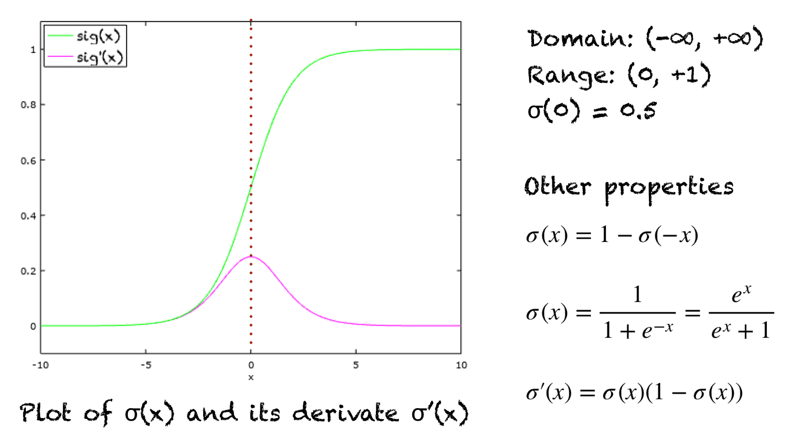

## Table of Contents

## What is the Sigmoid function in the context of machine learning?

The Sigmoid function is a type of mathematical function often used in machine learning, especially in neural networks. It's important because it helps turn numbers into probabilities. Imagine you have a number, and you want to know how likely something is to happen. The Sigmoid function can take that number and give you a value between 0 and 1. This is really useful in things like predicting if an email is spam or not, where you want a clear yes or no answer.

The formula for the Sigmoid function is pretty simple. It looks like this: $$ \sigma(x) = \frac{1}{1 + e^{-x}} $$. Here, \( x \) is your input number, \( e \) is a special number in math (about 2.718), and the function squashes \( x \) into a value between 0 and 1. If \( x \) is a big positive number, the output gets close to 1. If \( x \) is a big negative number, the output gets close to 0. This smooth curve makes it easy for computers to learn and adjust during training.

In code, you might see the Sigmoid function used like this:

```python
import numpy as np

def sigmoid(x):
    return 1 / (1 + np.exp(-x))
```

This piece of code shows how you can use the Sigmoid function in a programming language like Python. It's a handy tool that helps machines make decisions based on data, making it a key part of many [machine learning](/wiki/machine-learning) models.

## How is the Sigmoid function mathematically defined?

The Sigmoid function is a special type of mathematical function used a lot in machine learning. It's designed to take any number and turn it into a value between 0 and 1. This is really useful when you want to make predictions about things, like whether an email is spam or not. The formula for the Sigmoid function looks like this: $$ \sigma(x) = \frac{1}{1 + e^{-x}} $$. Here, \( x \) is the number you put into the function, and \( e \) is a special number in math, about 2.718. The function uses \( e \) to create a smooth curve that squashes \( x \) into a range between 0 and 1.

When you use the Sigmoid function, if \( x \) is a big positive number, the output gets really close to 1. If \( x \) is a big negative number, the output gets really close to 0. This makes it perfect for turning numbers into probabilities. For example, if you're trying to predict if it will rain, a high number might mean it's very likely to rain, and the Sigmoid function will turn that into a number close to 1. In programming, you might use the Sigmoid function like this:

```python
import numpy as np

def sigmoid(x):
    return 1 / (1 + np.exp(-x))
```

This piece of code shows how you can use the Sigmoid function in Python, making it easy to apply in machine learning models.

## What is the range of the Sigmoid function and why is it important?

The Sigmoid function squashes any number into a range between 0 and 1. This means no matter how big or small the number you put into it, the Sigmoid function will always give you a result that's between 0 and 1. The formula for the Sigmoid function is $$ \sigma(x) = \frac{1}{1 + e^{-x}} $$, where \( x \) is your number and \( e \) is a special number in math that's about 2.718.

This range of 0 to 1 is super important because it turns numbers into probabilities. Imagine you're trying to predict if it will rain tomorrow. A high number might mean it's very likely to rain, and the Sigmoid function will turn that into a number close to 1, which we can interpret as a high chance of rain. On the other hand, a low number might mean it's not likely to rain, and the Sigmoid function will give you a number close to 0, showing a low chance. This makes the Sigmoid function really useful in machine learning models where you need to make decisions based on how likely something is to happen.

## Can you explain how the Sigmoid function is used in logistic regression?

In logistic regression, the Sigmoid function is key to turning a linear equation into a probability. Imagine you're trying to predict if someone will buy a product based on their age and income. You create a linear equation that combines these factors, but to make a prediction, you need to turn that equation into a number between 0 and 1. That's where the Sigmoid function comes in. It takes the output of your linear equation and squashes it into a range from 0 to 1 using the formula $$ \sigma(x) = \frac{1}{1 + e^{-x}} $$. If the output of your linear equation is high, the Sigmoid function will give you a number close to 1, meaning it's very likely the person will buy the product. If the output is low, you'll get a number close to 0, meaning it's not likely.

In practice, this means you can use logistic regression to make yes or no predictions. For example, if you're trying to predict if an email is spam, the Sigmoid function helps you decide by giving you a probability. If the probability is over 0.5, you might classify the email as spam. If it's under 0.5, you'd classify it as not spam. Here's how you might use the Sigmoid function in a logistic regression model in Python:

```python
import numpy as np

def sigmoid(x):
    return 1 / (1 + np.exp(-x))

# Example linear equation output
linear_output = 2.5

# Apply the Sigmoid function
probability = sigmoid(linear_output)
print(f"The probability is: {probability}")
```

This code shows how the Sigmoid function can take the output of a linear equation and turn it into a probability, which is crucial for making predictions in logistic regression.

## What are the advantages of using the Sigmoid function in neural networks?

The Sigmoid function is really useful in neural networks because it helps turn numbers into probabilities. This is important because neural networks often need to make decisions based on how likely something is to happen. The Sigmoid function takes any number and squashes it into a range between 0 and 1 using the formula $$ \sigma(x) = \frac{1}{1 + e^{-x}} $$. This makes it perfect for tasks like predicting if an email is spam or not, where you want a clear yes or no answer based on how likely the email is to be spam.

Another advantage is that the Sigmoid function is smooth and continuous. This means it's easy for the [neural network](/wiki/neural-network) to learn and adjust during training. When the neural network is trying to figure out the best way to make predictions, it can use the Sigmoid function to make small changes and see how those changes affect the output. This smooth nature helps the network learn more effectively and make better predictions over time.

## What are the limitations or drawbacks of the Sigmoid function?

One major drawback of the Sigmoid function is that it can lead to a problem called "vanishing gradients" in neural networks. When the input to the Sigmoid function is very large or very small, the output gets really close to 1 or 0. This means the gradient (or slope) of the function becomes very small. During training, neural networks use these gradients to update their weights, but if the gradients are too small, the updates become tiny and the network learns very slowly. This can make training the network take a long time or even stop it from learning altogether.

Another limitation is that the Sigmoid function is not centered around zero. The output of the Sigmoid function always ranges from 0 to 1, which can make it hard for the neural network to learn. In neural networks, it's often helpful for the inputs to the next layer to be balanced around zero. This helps the network learn more efficiently because positive and negative values can cancel each other out. Since the Sigmoid function's output is always positive, it can make learning slower and less effective.

## How does the Sigmoid function contribute to the gradient descent algorithm?

The Sigmoid function plays a key role in the gradient descent algorithm by helping to calculate the gradients needed to update the weights in a neural network. When you use the Sigmoid function as the activation function in a neural network, it takes the input from the previous layer and turns it into a value between 0 and 1. This output is then used to compute the error of the network's predictions. The gradient descent algorithm uses this error to figure out how to adjust the weights to make the predictions more accurate. The derivative of the Sigmoid function, which is $$ \sigma'(x) = \sigma(x)(1 - \sigma(x)) $$, is crucial here because it tells the algorithm how much the output changes when the input changes. This helps the algorithm know how to adjust the weights to reduce the error.

However, the Sigmoid function can also cause problems with the gradient descent algorithm. When the input to the Sigmoid function is very large or very small, the output gets really close to 1 or 0. This means the derivative of the Sigmoid function becomes very small, leading to what's called "vanishing gradients." When the gradients are tiny, the updates to the weights during training become very small, which can slow down the learning process or even stop it altogether. This is why other activation functions like ReLU are often used instead of the Sigmoid function in deeper neural networks, as they help avoid the vanishing gradient problem and make training more efficient.

## What is the effect of the Sigmoid function on the vanishing gradient problem?

The Sigmoid function can make the vanishing gradient problem worse in neural networks. When you use the Sigmoid function, it takes any number and turns it into a value between 0 and 1 using the formula $$ \sigma(x) = \frac{1}{1 + e^{-x}} $$. If the input to the Sigmoid function is a very big positive or negative number, the output gets really close to 1 or 0. This means the derivative of the Sigmoid function, which is $$ \sigma'(x) = \sigma(x)(1 - \sigma(x)) $$, becomes very small. The derivative tells the neural network how much to change the weights during training, but if it's tiny, the updates to the weights are also tiny. This can make the neural network learn very slowly or even stop learning altogether.

To see how this works in practice, imagine you're training a neural network and using the Sigmoid function. During training, the network calculates the error of its predictions and uses the gradient descent algorithm to update the weights. The gradient descent algorithm relies on the derivative of the Sigmoid function to figure out how to adjust the weights. If the derivative is very small because the Sigmoid function's output is close to 0 or 1, the updates to the weights will be very small. This is why the Sigmoid function can lead to the vanishing gradient problem, making it hard for deep neural networks to learn effectively.

## How can the Sigmoid function be implemented in a programming language like Python?

The Sigmoid function is a useful tool in machine learning that turns any number into a value between 0 and 1. This is important because it can help turn numbers into probabilities. The formula for the Sigmoid function is $$ \sigma(x) = \frac{1}{1 + e^{-x}} $$. Here, \( x \) is the number you put into the function, and \( e \) is a special number in math that's about 2.718. If \( x \) is a big positive number, the output gets close to 1. If \( x \) is a big negative number, the output gets close to 0. This smooth curve makes it easy for computers to learn and adjust during training.

In Python, you can easily implement the Sigmoid function using the numpy library. The numpy library has a function called `exp` that can help calculate the exponential part of the Sigmoid formula. Here's how you can write the Sigmoid function in Python:

```python
import numpy as np

def sigmoid(x):
    return 1 / (1 + np.exp(-x))
```

This piece of code shows how you can use the Sigmoid function in a programming language like Python. It's a handy tool that helps machines make decisions based on data, making it a key part of many machine learning models.

## What are some alternatives to the Sigmoid function in neural networks?

In neural networks, the Sigmoid function is often replaced with other activation functions to avoid issues like the vanishing gradient problem. One popular alternative is the Rectified Linear Unit (ReLU) function. The ReLU function is simple and fast to compute. It outputs the input directly if it's positive, and zero otherwise. This can be written as $$ \text{ReLU}(x) = \max(0, x) $$. ReLU helps avoid the vanishing gradient problem because its derivative is either 0 or 1, which means the gradients don't get smaller as they move through the network. This makes training deep neural networks much easier and faster.

Another alternative is the Hyperbolic Tangent (tanh) function. The tanh function is similar to the Sigmoid function but it outputs values between -1 and 1 instead of 0 and 1. This can be written as $$ \tanh(x) = \frac{e^x - e^{-x}}{e^x + e^{-x}} $$. Because the tanh function is centered around zero, it can help the neural network learn more efficiently. The derivative of the tanh function is larger than that of the Sigmoid function, which can help avoid the vanishing gradient problem to some extent. However, like the Sigmoid function, tanh can still suffer from vanishing gradients in very deep networks.

In Python, you can implement these alternative activation functions easily. Here's how you might write the ReLU and tanh functions:

```python
import numpy as np

def relu(x):
    return np.maximum(0, x)

def tanh(x):
    return np.tanh(x)
```

These functions can be used in place of the Sigmoid function in neural networks to improve training and performance.

## Can you discuss any recent research or developments involving the Sigmoid function?

Recent research in machine learning has explored ways to improve the Sigmoid function or find alternatives to it. One interesting area is the development of adaptive activation functions. These functions can change during training to better fit the data. For example, some researchers have proposed a method called "Adaptive Sigmoid" where the function's parameters can be adjusted to prevent issues like the vanishing gradient problem. This approach aims to keep the benefits of the Sigmoid function, like its ability to turn numbers into probabilities, while making it more suitable for deep neural networks.

Another development involves combining the Sigmoid function with other techniques to enhance performance. For instance, some studies have looked at using the Sigmoid function in conjunction with batch normalization. Batch normalization helps stabilize the learning process by normalizing the inputs to each layer. When combined with the Sigmoid function, it can help mitigate the vanishing gradient problem by keeping the inputs in a range where the Sigmoid function's derivative is not too small. This combination has shown promise in improving the training of deep neural networks.

## How does the choice of the Sigmoid function impact the performance of deep learning models?

The Sigmoid function can affect how well [deep learning](/wiki/deep-learning) models perform, especially in terms of how fast they learn and how accurate their predictions are. The Sigmoid function turns any number into a value between 0 and 1 using the formula $$ \sigma(x) = \frac{1}{1 + e^{-x}} $$. This is helpful for turning numbers into probabilities, but it can cause problems in deep neural networks. When the input to the Sigmoid function is very big or very small, the output gets really close to 1 or 0. This makes the derivative of the Sigmoid function, which is $$ \sigma'(x) = \sigma(x)(1 - \sigma(x)) $$, become very small. During training, the neural network uses these derivatives to update its weights. If the derivatives are tiny, the updates are also tiny, which can make the network learn very slowly or even stop learning altogether. This is known as the vanishing gradient problem.

To deal with these issues, researchers and developers often choose different activation functions like ReLU or tanh for deep learning models. ReLU, for example, is simpler and faster to compute. It outputs the input directly if it's positive, and zero otherwise, which can be written as $$ \text{ReLU}(x) = \max(0, x) $$. ReLU helps avoid the vanishing gradient problem because its derivative is either 0 or 1, making it easier for deep neural networks to learn. The tanh function, on the other hand, outputs values between -1 and 1, which can be written as $$ \tanh(x) = \frac{e^x - e^{-x}}{e^x + e^{-x}} $$. Because tanh is centered around zero, it can help the neural network learn more efficiently. However, even tanh can still suffer from vanishing gradients in very deep networks. By choosing the right activation function, deep learning models can train faster and perform better.

## References & Further Reading

[1]: Haykin, S. (2008). ["Neural Networks and Learning Machines."](https://dai.fmph.uniba.sk/courses/NN/haykin.neural-networks.3ed.2009.pdf) 3rd Edition, Prentice Hall.

[2]: Bishop, C. M. (2006). ["Pattern Recognition and Machine Learning."](https://www.cs.uoi.gr/~arly/courses/ml/tmp/Bishop_book.pdf) Springer.

[3]: Goodfellow, I., Bengio, Y., & Courville, A. (2016). ["Deep Learning."](https://www.deeplearningbook.org/) MIT Press.

[4]: Murphy, K. P. (2012). ["Machine Learning: A Probabilistic Perspective."](https://www.cs.ubc.ca/~murphyk/MLbook/pml-toc-1may12.pdf) MIT Press.

[5]: Nwankpa, C., Ijomah, W., Gachagan, A., & Marshall, S. (2018). ["Activation Functions: Comparison of trends in Practice and Research for Deep Learning."](https://arxiv.org/abs/1811.03378) arXiv preprint arXiv:1811.03378.

[6]: Nielsen, M. (2015). ["Neural Networks and Deep Learning."](http://neuralnetworksanddeeplearning.com/) Determination Press.