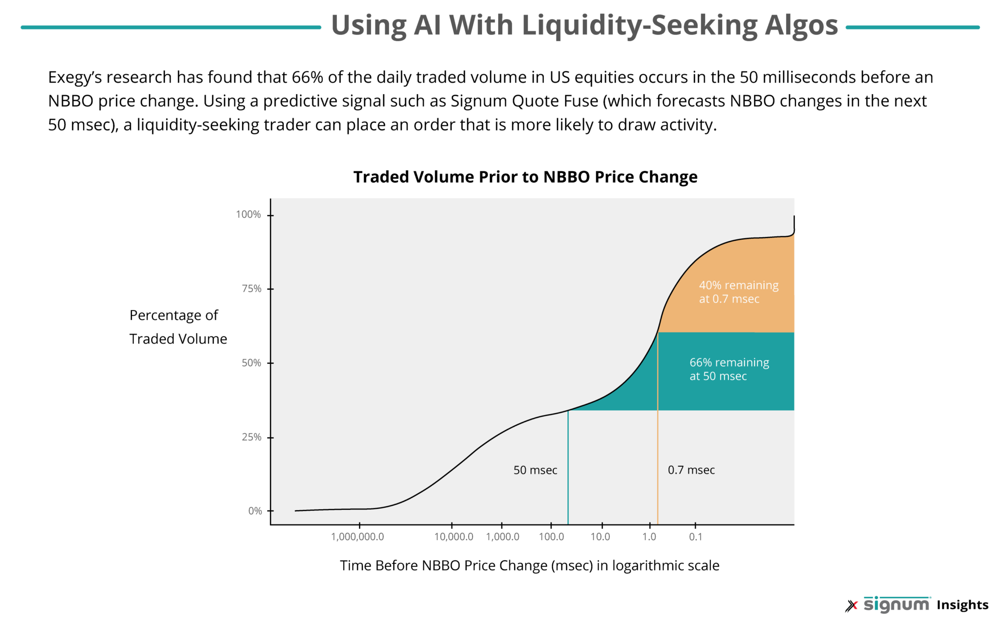

In the fast-paced world of financial markets, algorithmic trading has become an indispensable tool for traders and investors seeking a competitive advantage. The utilization of algorithms to execute trades with speed and precision has revolutionized the way financial transactions occur, enabling participants to react quickly to market changes. Signal-based execution strategies stand out as a key element within this framework, utilizing pre-defined mathematical models and computer algorithms to guide trading decisions.

These strategies function by generating trading signals based on specific market conditions and criteria, thereby facilitating the automated execution of buy or sell orders. Their primary objective is to eliminate human emotion from trading decisions, ensuring that trades are executed swiftly and efficiently. By adhering to a structured approach, traders can achieve consistency and potentially enhance their overall performance.



This article will explore the intricacies of signal-based execution strategies, examining how they operate, the advantages they provide, and some of the popular methods employed within the industry. Understanding these strategies is crucial, whether one is a seasoned trader or a newcomer, as they offer the potential to significantly improve trading outcomes. Signal-based strategies are not only about rapid execution but also about leveraging data and technology to make informed decisions that align with specific trading goals.

## Table of Contents

## Understanding Signal-Based Execution Strategies

Signal-based execution strategies utilize predetermined mathematical models and algorithms to produce trading signals, which dictate buying or selling actions in the financial markets. These strategies rely on specific conditions and criteria that have been predefined by the trader or system developer to automate the decision-making process. The principal aim is to execute trades efficiently and objectively, minimizing human emotional influences such as fear or greed, which can often bias trading decisions.

The concept of signal generation in algorithmic trading involves leveraging historical and real-time data to identify potential trading opportunities. This process can be exemplified through various technical indicators and statistical measures. For instance, a simple moving average (SMA) indicator may generate a buy signal when the price of an asset crosses above its moving average, suggesting a potential upward trend. Conversely, a sell signal might be generated if the price drops below the moving average, indicating a possible downward trend.

Mathematically, a basic signal generation can be portrayed as:

$$
\text{Signal} = 
  \begin{cases} 
  \text{Buy}, & \text{if } P_t > \text{SMA}(P_t, n) \\
  \text{Sell}, & \text{if } P_t < \text{SMA}(P_t, n)
  \end{cases}
$$

Where $P_t$ is the current price of the asset, and $\text{SMA}(P_t, n)$ represents the n-period simple moving average of the price.

Besides technical indicators, advanced signal-based strategies may incorporate [machine learning](/wiki/machine-learning) models. These models can analyze complex patterns and forecast future price movements based on a wide range of input variables, such as market sentiment, economic indicators, and other contextual data.

The execution of buy or sell orders based on generated signals involves the interaction between several components within an [algorithmic trading](/wiki/algorithmic-trading) system. Once a signal is generated, it is crucial to ensure that trades are executed swiftly and accurately, often within milliseconds, leveraging electronic trading platforms. This emphasis on speed and precision underlines the importance of technology in modern trading environments.

In essence, signal-based execution strategies aim to provide a systematic and disciplined approach to trading by eliminating subjective decision-making. This helps traders achieve consistency and reliability in their trading operations, aligning with their predefined trading objectives and risk management guidelines.

## Benefits of Signal-Based Strategies

Signal-based execution strategies in algorithmic trading offer several key advantages that enhance trading performance. One of the primary benefits is speed and accuracy. These strategies leverage sophisticated algorithms to rapidly analyze large volumes of market data and execute trades with precision. The execution speed, often within milliseconds, allows traders to capitalize on fleeting market opportunities that are beyond the reach of human reactivity.

Consistency is another significant advantage. By operating under predefined rules, signal-based strategies eliminate the emotional biases that often affect human decision-making. This consistent execution ensures that trades align with the strategic plan, reducing the influence of impulsive decisions that might lead to losses.

Automation plays a crucial role in reducing errors common in manual trading, such as incorrect order placement or oversight of trading opportunities. By automating the trading process, these strategies minimize the impact of human error and improve overall efficiency. This reduction in errors is particularly important in volatile markets where precise timing is crucial.

Backtesting is a critical component of signal-based strategies, allowing traders to assess the viability of their algorithms against historical market data before committing actual capital. Through [backtesting](/wiki/backtesting), traders can determine if a strategy would have been successful in the past, thereby providing a level of confidence in its potential future performance. Python, with libraries such as `pandas` and `numpy`, is often used for backtesting due to its robust data handling and mathematical capabilities. A simple example in Python could be:

```python
import pandas as pd

# Load historical data
data = pd.read_csv('historical_prices.csv')

# Define a simple moving average strategy
data['SMA_50'] = data['Close'].rolling(window=50).mean()
data['Position'] = 0  # 1 for buy, -1 for sell

# Generate signals
data.loc[data['Close'] > data['SMA_50'], 'Position'] = 1
data.loc[data['Close'] < data['SMA_50'], 'Position'] = -1

# Simulate returns
data['Returns'] = data['Close'].pct_change()
data['Strategy_Returns'] = data['Position'].shift(1) * data['Returns']

# Calculate cumulative strategy returns
cumulative_strategy_returns = (1 + data['Strategy_Returns']).cumprod()
print(cumulative_strategy_returns.tail())
```

In summary, signal-based execution strategies provide a technological edge in trading by ensuring speed, consistency, reduced errors, and the ability to backtest strategies efficiently. These advantages make them a vital component of modern trading systems, enabling traders to navigate complex markets with increased confidence.

## Components of Signal-Based Execution Systems

Signal-based execution systems are integral to algorithmic trading, providing the necessary structure to automate trades efficiently and accurately. The key components of these systems include the Data Feed, Strategy Engine, Execution Engine, and Risk Management Module.

**Data Feed**: A stable and high-quality source of real-time market data is essential for effective signal generation. This data includes various market metrics such as price, volume, and order book details, which are crucial for accurate analysis and decision-making. The integrity and latency of the data feed significantly impact the system's performance, with a focus on minimizing delays to gain timely insights into market conditions.

**Strategy Engine**: At the heart of signal-based execution systems is the Strategy Engine, responsible for processing incoming market data and identifying actionable trading signals. The engine employs mathematical models and predetermined algorithms to assess data against trading criteria, facilitating objective decision-making. This stage involves the application of quantitative techniques, such as statistical modeling, machine learning algorithms, and technical indicators, to pinpoint trading opportunities.

**Execution Engine**: The Execution Engine's role is to translate the trading signals generated by the Strategy Engine into executable market orders. This component ensures that the orders are aligned with optimal timing and market conditions to maximize trade effectiveness. The engine also handles different order types—such as market, limit, and stop orders—depending on the strategy's requirements, while maintaining low latency for quick execution.

**Risk Management Module**: A critical element of any trading system is its Risk Management Module, designed to safeguard the trading account by managing exposure and potential losses. This module typically implements stop-loss orders and position sizing rules to maintain risk within acceptable levels. By calculating the optimal number of shares or contracts to trade, it ensures diversification and prevents over-leveraging. Additionally, dynamic risk assessment techniques continuously evaluate potential market changes, facilitating prompt adjustments to risk parameters.

In summary, each component of signal-based execution systems plays a specialized role, collectively enabling seamless, precise, and risk-controlled trading automation. The synergy between reliable data acquisition, strategic decision-making, efficient execution, and robust risk management is vital for the success of algorithmic trading initiatives.

## Popular Signal-Based Execution Strategies

Trend Following: Trend following strategies are built on the concept of identifying and capitalizing on ongoing market trends. These strategies often use technical indicators such as Moving Averages (MA) to determine the direction of the trend. A simple moving average (SMA) indicator, for instance, calculates the average price of a security over a specific number of periods and can signal an upward or downward trend when the current price crosses above or below the moving average. Traders using [trend following](/wiki/trend-following) strategies typically enter positions in the direction of the prevailing trend and may employ techniques such as [breakout](/wiki/breakout-trading) trading to confirm trend reversals.

Mean Reversion: Mean reversion strategies are based on the assumption that prices and returns eventually move back towards their long-term mean or average. This concept is often utilized in trading by identifying overbought or oversold conditions where the price has deviated significantly from its historical average. Traders may use indicators such as the Relative Strength Index (RSI) or Bollinger Bands to detect these conditions. A mean reversion strategy might involve buying a security when its price is below the moving average and selling when it is above, capturing the profits as prices revert to the mean.

Statistical Arbitrage: This strategy exploits statistical patterns and correlations between related securities to profit from price discrepancies. A common approach is to implement pairs trading, which involves identifying pairs of stocks or other securities that historically move together. When their correlation diverges, one security is bought while the other is sold short, anticipating that the prices will converge. The overall goal is to capture the relative price movement without being exposed to broader market risk. Advanced statistical techniques and machine learning models are often employed to identify profitable [arbitrage](/wiki/arbitrage) opportunities.

Market Making: Market making strategies involve continuously quoting buy and sell prices for securities, thereby facilitating [liquidity](/wiki/liquidity-risk-premium) and profiting from the bid-ask spread. Market makers aim to buy at the bid price and sell at the ask price, generating profits from the difference while managing inventory risks. This strategy requires sophisticated algorithms to update prices in real time in response to market conditions, ensuring competitive pricing. Market makers often deploy limit orders and adjust their quotes dynamically based on [order book](/wiki/order-book-trading-strategies) information and [volume](/wiki/volume-trading-strategy). The success of a market-making strategy hinges on speed and automation to quickly respond to market changes and capture the spread consistently.

These strategies represent the breadth of techniques employed in signal-based algorithmic trading, each with distinct mechanisms and goals tailored to leverage specific market behaviors.

## Challenges and Considerations

In the ever-evolving landscape of financial markets, algorithmic trading presents a myriad of challenges and considerations for traders implementing signal-based execution strategies. 

Market Complexity poses a significant hurdle; developing algorithms that remain consistently profitable across diverse and dynamic market environments is inherently challenging. The complexity arises not only from the myriad factors influencing market behavior but also from the need to account for the interactions between these factors. As markets evolve, unforeseen correlations and dependencies may emerge, complicating the effectiveness of pre-designed strategies.

Another critical challenge is Overfitting. This occurs when a trading algorithm is excessively tailored to fit historical data, capturing noise instead of underlying market dynamics. Overfitting results in strategies that perform exceptionally well in backtests but falter during live trading, as they fail to adapt to new and unseen market conditions. Avoiding overfitting requires careful consideration during the strategy development phase, often involving techniques such as cross-validation, regularization, and the use of out-of-sample testing to ensure robustness.

Regulatory Compliance is a crucial consideration when deploying algorithmic trading strategies. Financial markets are heavily regulated, and algorithms must comply with the legal frameworks that govern trading activities. This involves adhering to rules related to market conduct, data privacy, and transparency. Regulations can vary significantly across jurisdictions, necessitating a thorough understanding of both local and international laws to avoid legal penalties.

Continuous Adaptation is essential for maintaining the efficacy of trading strategies. Markets are inherently dynamic, influenced by technological advancements, geopolitical events, and macroeconomic shifts. As a result, strategies that are successful today may become obsolete tomorrow. Continuous monitoring and refinement are required to adapt to evolving market conditions. This may involve recalibrating parameters, incorporating new data sources, or even redesigning the algorithm's core logic. An agile approach can help in quickly identifying underperformance and implementing necessary modifications to ensure continued success.

In summary, while signal-based execution strategies offer significant advantages in automating and optimizing trading decisions, they also present substantial challenges. Navigating these requires a keen understanding of market complexities, a disciplined approach to strategy development to mitigate overfitting, adherence to regulatory standards, and a commitment to continuous improvement and adaptation.

## Conclusion

Signal-based execution strategies in algorithmic trading offer extensive benefits and opportunities for traders and investors. By leveraging sophisticated algorithms and pre-defined rules, these strategies enable the automation of trading decisions, enhancing both speed and accuracy. However, successfully implementing these strategies necessitates a comprehensive understanding of the underlying complexities. The alignment of algorithmic models with real-world trading conditions is critical to minimize the risk of overfitting, where strategies may perform well on historical data but falter in live environments.

Continuous learning and adaptation are crucial in the rapidly evolving landscape of financial markets to maintain a competitive edge. As market conditions shift, algorithms may require adjustments to sustain their effectiveness. Therefore, traders must remain vigilant, regularly updating their strategies to account for new data and emerging trading patterns. This ongoing refinement process ensures that signal-based execution systems remain robust and responsive to market changes.

In summary, while signal-based strategies provide a powerful framework for enhancing trading efficacy, they demand a proactive approach to strategy development and management. For those prepared to commit to continuous education and strategic adaptation, these strategies present an invaluable asset in navigating the complexities of modern financial markets.

## References & Further Reading

[1]: ["Advances in Financial Machine Learning"](https://www.amazon.com/Advances-Financial-Machine-Learning-Marcos/dp/1119482089) by Marcos Lopez de Prado

[2]: ["Machine Learning for Algorithmic Trading, Second Edition: Predictive models to extract signals from market and alternative data for systematic trading strategies with Python"](https://github.com/stefan-jansen/machine-learning-for-trading) by Stefan Jansen

[3]: ["Quantitative Trading: How to Build Your Own Algorithmic Trading Business"](https://www.amazon.com/Quantitative-Trading-Build-Algorithmic-Business/dp/1119800064) by Ernest P. Chan

[4]: ["Evidence-Based Technical Analysis: Applying the Scientific Method and Statistical Inference to Trading Signals"](https://www.amazon.com/Evidence-Based-Technical-Analysis-Scientific-Statistical/dp/0470008741) by David Aronson

[5]: ["Algorithmic Trading: Winning Strategies and Their Rationale"](https://www.amazon.com/Algorithmic-Trading-Winning-Strategies-Rationale/dp/1118460146) by Ernie Chan

[6]: Engle, R. F. (2000). ["The econometrics of ultra-high-frequency data."](https://papers.ssrn.com/sol3/papers.cfm?abstract_id=225604) Econometrica, 68(1), 1-22.

[7]: Amir, R. & Lasfer, M. (2019). ["High-Frequency Trading and Market Quality: A Review and Flexible Modeling Approach."](https://www.tandfonline.com/doi/pdf/10.1080/15140326.2019.1692509) European Journal of Finance, 25(10), 917-923.