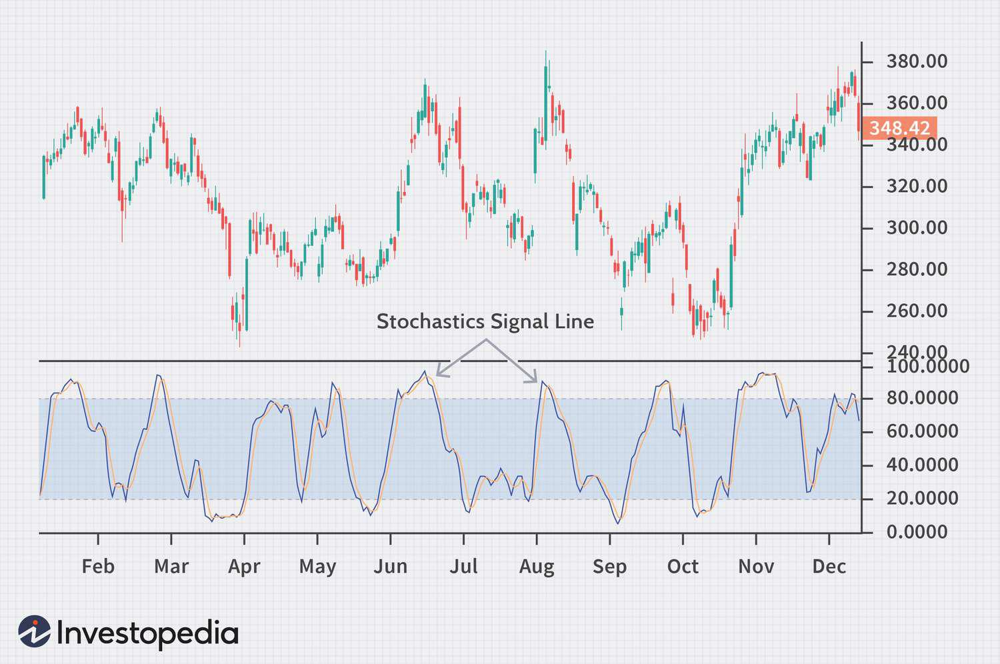

Algorithmic trading has revolutionized the financial trading industry by utilizing complex computational algorithms to execute trades at optimal times, thus maximizing efficiency and profitability. Central to this technological advancement are signal lines, which play a vital role in assisting traders to determine the most opportune moments to buy or sell assets. Signal lines are mathematical representations that help in the interpretation of market movements by smoothing out price data, hence allowing traders to focus on significant trends and reversals rather than short-term market noise.

Understanding how to calculate and effectively integrate signal lines into trading strategies can significantly enhance a trader’s ability to make informed decisions. Signal lines stem from technical indicators like Moving Averages (MAs) and the Moving Average Convergence Divergence (MACD). By providing clearer insights into market trends, these calculations enable traders to anticipate market movements with greater precision. For instance, in the MACD indicator, the signal line is often derived as the 9-day Exponential Moving Average (EMA) of the MACD line itself, providing a smoothed line that helps traders identify potential buy and sell signals.



This article explores signal lines in financial analysis and algo trading, providing comprehensive insights into their fundamental concepts, mathematical calculations, and practical implementations. Through understanding these elements, traders can enhance their strategies in an increasingly complex and fast-paced market environment.

## Table of Contents

## Understanding Signal Lines

Signal lines are an essential component of technical analysis in trading, derived from various technical indicators. They act as signals, triggering trading actions based on market data. Typically, signal lines are used in conjunction with other indicators such as Moving Averages (MA) and Moving Average Convergence Divergence (MACD) to enhance trading strategies by providing better insights into market trends and potential reversals.

A signal line aims to smooth out price data, distinguishing significant market movements from short-term fluctuations or noise. By filtering out this noise, traders can focus on critical market changes, which is crucial for making informed trading decisions.

### Technical Integration with Indicators

1. **Moving Averages (MA):** Signal lines often accompany moving averages, which provide simplified representations of price trends by averaging data points over a specific period. For instance, a short-term MA might have a 10-day period, while a longer-term one could extend over 50 or 200 days. The signal line can be a smoothed version of the moving average itself, offering a clearer picture of the trend's direction.

2. **Moving Average Convergence Divergence (MACD):** The MACD is a popular tool that comprises two elements: the MACD line and the signal line. The MACD line is constructed by subtracting the 26-day EMA (Exponential Moving Average) from the 12-day EMA. A 9-day EMA of the MACD line creates the signal line. This line is pivotal for identifying buy and sell signals; when the MACD line crosses above the signal line, it may indicate a buying opportunity, whereas crossing below suggests selling.

### Mathematical Formulation

Signal lines typically involve calculations that use historical price data. The EMA, for instance, gives more weight to recent prices and is computed as follows:

$$
EMA = \left(\frac{Price - Previous \, EMA}{N + 1}\right) + Previous \, EMA
$$

where $N$ is the number of periods over which the EMA is calculated.

### Practical Generation of Signal Lines

Understanding the generation of signal lines is vital for [algorithmic trading](/wiki/algorithmic-trading) strategies. The process includes selecting relevant datasets and calculating moving averages or other indicators. This data is continually updated as new market data becomes available, ensuring that trading signals respond to real-time changes.

In practice, traders or systems develop scripts and algorithms to automate these calculations. For example, Python libraries like Pandas and NumPy can be employed to handle large datasets and perform real-time calculations efficiently:

```python
import pandas as pd

def calculate_signal_line(prices, window=9):
    ewm = prices.ewm(span=window, adjust=False).mean()
    return ewm

# Example usage with a DataFrame containing price data
price_data = pd.DataFrame({'Close': [100, 101, 102, 103, 104]})
signal_line = calculate_signal_line(price_data['Close'])
print(signal_line)
```

In summary, signal lines are a pivotal tool for traders in analyzing and responding to market trends. Their ability to process and smooth financial data makes them indispensable in developing and executing trading strategies that require precise timing and strategic insight.

## Calculating Signal Lines

Signal line calculation is a fundamental aspect of technical analysis in algorithmic trading, which involves using historical price data and averages to derive actionable insights. A commonly used technique for calculating signal lines is found in the Moving Average Convergence Divergence (MACD) indicator. In the MACD, the signal line is often derived by taking a 9-day Exponential Moving Average (EMA) of the MACD line itself, serving as a smoothed series of values that helps identify potential reversals or continuations in price movements.

The calculation process begins by selecting appropriate data sets, which include historical prices of the asset in question. For the MACD signal line specifically, the calculation involves two key steps: determining the MACD line itself and then computing its 9-day EMA.

1. **Calculating the MACD Line:**
   The MACD line is the difference between the 12-day EMA and the 26-day EMA of the asset's closing prices:
$$
   \text{MACD Line} = \text{EMA}_{12} - \text{EMA}_{26}

$$

2. **Calculating the Signal Line:**
   Once the MACD line is obtained, the signal line is calculated as:
$$
   \text{Signal Line} = \text{EMA}_{9}(\text{MACD Line})

$$

This calculation can be efficiently automated using Python libraries such as Pandas and NumPy, which streamline the computation and updating of EMAs as new data becomes available. Here is a basic example of how these calculations can be implemented in Python:

```python
import pandas as pd

# Function to calculate EMA
def calculate_ema(data, period):
    return data.ewm(span=period, adjust=False).mean()

# Load historical price data
data = pd.DataFrame({'Close': [/* historical closing prices */]})

# Calculate MACD Line
data['EMA12'] = calculate_ema(data['Close'], 12)
data['EMA26'] = calculate_ema(data['Close'], 26)
data['MACD Line'] = data['EMA12'] - data['EMA26']

# Calculate Signal Line
data['Signal Line'] = calculate_ema(data['MACD Line'], 9)

# Display the calculated values
print(data[['MACD Line', 'Signal Line']].tail())
```

Incorporating automation ensures that traders are poised to react swiftly to emerging trends, which is crucial in fast-paced market environments. By leveraging these computational tools, traders can efficiently handle the large volumes of data necessary for calculating and updating signal lines, thereby enhancing their ability to execute timely trades.

## Applications in Algo Trading Strategies

Incorporating signal lines into algorithmic trading strategies serves as a crucial mechanism for enhancing decision-making processes. Signal lines work as triggers for executing trades, where the crossing of these lines with market indicators like Moving Average Convergence Divergence (MACD) typically signifies a moment to either buy or sell an asset. This automated approach significantly reduces the delay in human decision-making and ensures that traders can act swiftly on market changes, potentially improving profitability.

One of the primary applications of signal lines is in the automation of trading decisions. For instance, when the MACD line crosses above its signal line, a common strategy is to purchase assets, as this crossover is often interpreted as a bullish signal. Conversely, a downward crossover might indicate a selling opportunity. These automated decisions are based on predefined criteria, eliminating emotional bias, and rendering trading strategies more systematic.

Signal lines are frequently integrated into comprehensive trading algorithms that incorporate risk management protocols. Implementing tools like stop-loss orders along with signal lines can further refine trading strategies, as they help manage potential losses and maintain a favorable risk-reward ratio. Such integrations ensure that trades not only rely on technical signals but also adhere to defined risk parameters, enhancing the overall robustness of the trading strategy.

Backtesting constitutes another essential aspect of employing signal lines in algorithmic strategies. Traders use historical data to optimize the parameters of signal lines, assessing their performance over various market conditions. By simulating trades over past data, traders can adjust variables such as the length of the moving averages to establish the most effective settings. This optimization process aids in improving predictive accuracy and ensures that the strategy is well-suited for real-market application.

The adaptability of algorithmic systems allows for the continuous adjustment of signal line parameters aligned with market conditions and trader objectives. As market [volatility](/wiki/volatility-trading-strategies) and conditions can vary, dynamic adjustment of these parameters is crucial to maintain strategy relevance and effectiveness. A trader may alter the sensitivity of signal lines in response to heightened market volatility or shift their focus depending on longer-term investment goals versus short-term trading gains. Such adaptability ensures that the strategies remain competitive in diverse trading environments.

In summary, signal lines, when incorporated into algorithmic trading strategies, provide a structured framework for executing trades, optimizing performance, and integrating risk management. Understanding and leveraging these components can significantly enhance a trader's ability to navigate financial markets effectively.

## Challenges and Considerations

Signal lines, while beneficial in enhancing trading strategies, come with their own set of challenges that traders must navigate to use them effectively. One of the foremost challenges is their inherent lagging nature. Signal lines often reflect historical market data rather than predicting future trends, which can lead to decisions that are based on outdated information. This latency can be attributed to the fact that signal lines, such as those derived from Moving Average Convergence Divergence (MACD), rely on smoothed averages of past data. Consequently, traders might miss out on emerging market trends or reversals if they solely depend on these indicators for real-time trading decisions.

Moreover, an over-reliance on signal lines, without considering the broader market fundamentals, can lead to inaccurate predictions and misguided strategies. While signal lines help in filtering out market noise, crucial aspects like economic indicators, geopolitical events, and market sentiment can provide essential context that pure technical signals may overlook. Traders must therefore integrate signal lines with [fundamental analysis](/wiki/fundamental-analysis) to develop a well-rounded perspective on market movements.

Evaluating the impact of external factors, particularly during volatile market conditions, is another critical consideration when relying on signal lines. Volatility can cause abrupt market shifts that may not be immediately captured by signal lines, leading to potential trading losses. Traders need to be vigilant in adjusting their strategies to account for such sudden changes, balancing the reliability of signal lines with real-time market conditions.

Lastly, maintaining a competitive edge in algorithmic trading requires balancing computational efficiency with the accuracy of signal line calculations. Optimizing the algorithms to process data swiftly while ensuring the precision of signal outputs is crucial. For instance, dependency on libraries such as Pandas and NumPy in Python provides efficient ways to calculate Exponential Moving Averages (EMA) and other indicators that form the basis of signal lines. However, over-optimization can lead to scenarios where the model fits historical data well but performs poorly in live market conditions, a phenomenon known as overfitting.

Traders can use Python code to automate signal line calculations, which can help in balancing these considerations effectively. For example:

```python
import numpy as np
import pandas as pd

# Example of calculating a 9-day EMA for a signal line
def calculate_ema(prices, days):
    return prices.ewm(span=days, adjust=False).mean()

# Sample price data
price_data = pd.Series([125.4, 127.6, 129.8, 128.9, 130.2, 131.5])

# Calculate the 9-day EMA
signal_line = calculate_ema(price_data, days=9)
print(signal_line)
```

In conclusion, while signal lines are an integral component of algorithmic trading strategies, their effective application requires a nuanced approach that accounts for their limitations and integrates broader market considerations. By combining technical indicators with a robust understanding of external market factors, traders can harness the power of signal lines more effectively.

## Conclusion

Signal lines are essential components in financial analysis and algorithmic trading, providing traders with crucial insights that aid in making informed decisions. By mastering their calculation and strategic application, traders can improve their decision-making processes, potentially increasing the accuracy and profitability of their trading strategies. As financial markets continue to evolve with advancements in technology and algorithms, signal lines will remain a key element within effective trading strategies.

Continuous refinement of signal line usage, with careful consideration of market dynamics and trader objectives, is essential. This includes adapting signal line parameters to suit varying market conditions and employing appropriate risk management techniques to mitigate potential losses. The ability to adjust these parameters is supported by sophisticated algorithms, ensuring that traders are not confined to outdated models and can respond dynamically to changes in the market landscape.

A comprehensive understanding of signal lines extends beyond their basic definitions. It involves a recognition of the mathematical formulas that underpin them, such as the exponential moving average (EMA) used in calculating the signal line of the Moving Average Convergence Divergence (MACD) indicator. This understanding allows traders to design more nuanced and effective trading algorithms that leverage signal line data for optimal entry and [exit](/wiki/exit-strategy) points.

In conclusion, signal lines provide traders with the tools necessary to achieve consistent and profitable outcomes within the fast-paced world of financial trading. Their integration into algorithmic strategies, alongside robust risk management protocols, assists traders in navigating the complexities of the markets. By continually refining their application and leveraging technological advancements, traders can unlock the full potential of signal lines in their trading endeavors.

## References & Further Reading

[1]: Bergstra, J., Bardenet, R., Bengio, Y., & Kégl, B. (2011). ["Algorithms for Hyper-Parameter Optimization."](https://papers.nips.cc/paper/4443-algorithms-for-hyper-parameter-optimization) Advances in Neural Information Processing Systems 24.

[2]: ["Advances in Financial Machine Learning"](https://www.amazon.com/Advances-Financial-Machine-Learning-Marcos/dp/1119482089) by Marcos Lopez de Prado

[3]: ["Evidence-Based Technical Analysis: Applying the Scientific Method and Statistical Inference to Trading Signals"](https://www.amazon.com/Evidence-Based-Technical-Analysis-Scientific-Statistical/dp/0470008741) by David Aronson

[4]: ["Machine Learning for Algorithmic Trading"](https://github.com/stefan-jansen/machine-learning-for-trading) by Stefan Jansen

[5]: ["Quantitative Trading: How to Build Your Own Algorithmic Trading Business"](https://www.amazon.com/Quantitative-Trading-Build-Algorithmic-Business/dp/1119800064) by Ernest P. Chan