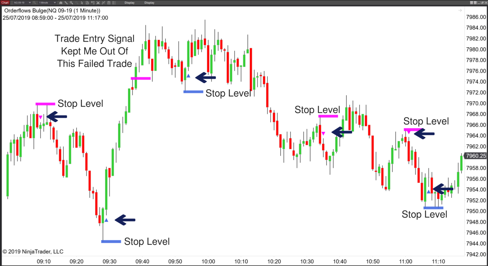

## Table of Contents

## What is signal order flow?

Signal order flow is a way that traders and investors use to understand how people are buying and selling stocks or other financial products. It's like watching the traffic of orders in the market. By looking at the signal order flow, traders can see if more people are wanting to buy or sell a certain stock, which can help them make better decisions about their own trades.

This information can be very helpful because it shows the real-time actions of other market participants. For example, if a trader sees a lot of buy orders coming in for a stock, it might mean that the price of the stock could go up soon. On the other hand, if there are many sell orders, the price might go down. By using signal order flow, traders try to predict what might happen next in the market and adjust their strategies accordingly.

## How does signal order flow differ from traditional order flow?

Signal order flow and traditional order flow both look at how people are buying and selling in the market, but they do it in different ways. Traditional order flow is all about watching the actual orders that come into the market. It's like keeping an eye on a list of all the buy and sell orders, seeing how many there are, and at what prices they are placed. This helps traders understand the supply and demand for a stock at any given moment.

Signal order flow, on the other hand, goes a step further. It not only looks at the orders but also tries to find patterns and signals within them. It's like trying to read between the lines of the order list to predict what might happen next. Traders using signal order flow might use special tools or algorithms to analyze the data and spot trends that aren't obvious just by looking at the raw orders. This can give them an edge in figuring out where the market might be headed.

## What are the main components of a signal order flow system?

A signal order flow system has a few main parts that work together to help traders understand the market better. The first part is data collection. This means gathering all the information about the buy and sell orders in the market. This data includes things like the price of each order, the time it was placed, and whether it's a buy or sell order. The system needs to collect this information quickly and accurately to be useful.

The second part is analysis. Once the system has all the order data, it uses special tools and algorithms to look for patterns and signals. These tools can help traders see things like if there are more buy orders than sell orders, or if the orders are coming in at certain times of the day. By analyzing this data, the system can give traders hints about what might happen next in the market. The last part is the user interface, which shows all this information in a way that's easy for traders to understand and use. This could be through charts, graphs, or alerts that tell traders when to buy or sell.

## How can signal order flows be used to improve trading strategies?

Signal order flows can help traders make better choices by showing them what other people are doing in the market. When traders see more buy orders coming in for a stock, they might decide to buy it too, hoping the price will go up. On the other hand, if they see a lot of sell orders, they might want to sell or avoid buying that stock. By looking at these signals, traders can guess where the market is heading and adjust their strategies to make more money or lose less.

Using tools that analyze signal order flows can also help traders spot patterns that they might miss just by looking at the orders. These tools can find out if certain times of the day are better for buying or selling, or if certain stocks always move in a certain way. By understanding these patterns, traders can plan their trades more carefully, like knowing when to enter or [exit](/wiki/exit-strategy) the market. This can lead to smarter trading decisions and better results over time.

## What are the common sources of signal data in order flows?

Signal data in order flows comes from many places. One common source is the stock exchanges themselves, like the New York Stock Exchange or NASDAQ. These exchanges keep track of all the buy and sell orders that come in for stocks and other financial products. Traders can get this data directly from the exchanges or through special services that collect and organize it.

Another source of signal data is from brokers and trading platforms. When people place orders through these platforms, the platforms can see all the details about those orders. They might share this data with traders who use their services or sell it to companies that analyze it. This helps traders see what other people are doing in the market and make better decisions.

Sometimes, signal data also comes from other traders or market participants. For example, some traders might share their own order data with others or use special tools that track what big investors are doing. This kind of data can give traders more clues about where the market might be going. By putting all these sources together, traders can get a fuller picture of the market's order flow and use it to improve their trading strategies.

## How do signal order flows impact market liquidity?

Signal order flows can help make the market more liquid by showing traders where the buying and selling is happening. When traders see a lot of buy or sell orders coming in, they might want to join in, which means more people are trading. More trading means more [liquidity](/wiki/liquidity-risk-premium), because there are more buyers and sellers ready to trade at any time. This can make it easier for everyone to buy or sell without big changes in the price.

On the other hand, signal order flows can sometimes make the market less liquid. If traders see a lot of sell orders and think the price will go down, they might decide to wait before trading. This can slow down the market because fewer people are willing to buy or sell right away. So, while signal order flows can help traders make better choices, they can also change how much people want to trade, which affects market liquidity.

## What are the technological requirements for implementing a signal order flow system?

To set up a signal order flow system, you need good computers and fast internet. The computers need to be strong enough to handle a lot of data quickly. They have to collect information about buy and sell orders from places like stock exchanges and brokers. This data comes in fast, so the computers need to be fast too. They also need a lot of storage to keep all the data they collect. The internet connection has to be fast and reliable so the system can get the latest information without delays.

The system also needs special software to analyze the data and find patterns. This software uses math and special rules to look at the orders and figure out what they mean. It can show this information in charts or graphs that are easy for traders to understand. The software might also send alerts to traders when it sees something important. To make all this work smoothly, the system needs to be well-designed and regularly updated to keep up with changes in the market.

## Can you explain the role of algorithms in processing signal order flows?

Algorithms play a big part in processing signal order flows. They are like smart helpers that look at all the buy and sell orders coming into the market. These orders come in very fast, and there are a lot of them, so it's hard for people to keep up. Algorithms can handle this data quickly and find patterns that humans might miss. They use math to figure out if there are more buy orders than sell orders, or if the orders are coming in at certain times of the day. This helps traders see what other people are doing and make better guesses about where the market might go next.

Once the algorithms find these patterns, they can show the information in a way that's easy for traders to understand. They might use charts, graphs, or even send alerts when something important happens. This makes it easier for traders to use the signal order flow information in their trading strategies. By using algorithms, traders can make smarter choices about when to buy or sell, which can help them make more money or lose less.

## What are the potential risks associated with relying on signal order flows?

Relying on signal order flows can be risky because the information might not always be right. Sometimes, the data can be wrong or delayed, which can make traders make bad choices. For example, if the system says there are a lot of buy orders but the data is old, the price might not go up like the trader expects. Also, other traders might try to trick the market by placing fake orders, which can make the signal order flow look different from what's really happening.

Another risk is that traders might start to depend too much on signal order flows and not think for themselves. If everyone is using the same signals to make decisions, it can make the market move in ways that are hard to predict. This can lead to big swings in prices, which can be dangerous for traders. It's important for traders to use signal order flows as just one part of their strategy and not the only thing they look at.

## How do regulatory frameworks affect the use of signal order flows in trading?

Regulatory frameworks can have a big impact on how traders use signal order flows. Governments and financial watchdogs set rules to make sure the market is fair and safe. These rules can say how traders can get and use order data, and they might need to report what they're doing. If the rules are strict, it can be harder for traders to use signal order flows because they might not be able to get all the data they want or they might have to be careful about how they use it.

On the other hand, good regulations can also help traders by making the market more transparent. When everyone follows the same rules, it's easier to trust the data and use it to make good trading decisions. But traders always need to keep up with changes in the rules because what's allowed today might not be allowed tomorrow. This means they have to be ready to change how they use signal order flows to stay within the law.

## What advanced techniques can be used to analyze signal order flow data?

One advanced technique for analyzing signal order flow data is machine learning. This is like teaching a computer to learn from the data it sees. The computer can look at lots of past orders and find patterns that are hard for people to see. It can then use these patterns to guess what might happen next in the market. This can help traders make better decisions because the computer can find things that humans might miss.

Another technique is called high-frequency trading. This means using very fast computers to buy and sell things in the market very quickly. These computers can look at signal order flow data in real-time and make trades in just a few seconds. This can be good because it lets traders take advantage of small changes in the market. But it can also be risky because the market can move very fast, and if the computer makes a mistake, it can lose money quickly.

A third technique is using complex algorithms to look at different kinds of data at the same time. These algorithms can mix signal order flow data with other information, like news or economic reports. By looking at all this data together, the algorithms can give traders a better idea of what's happening in the market. This can help them make smarter trades because they have more information to work with.

## How might future developments in technology influence the evolution of signal order flows?

Future technology could make signal order flows even better by making computers faster and smarter. As computers get better, they can handle more data faster. This means they can look at more orders and find patterns quicker. New technology like [artificial intelligence](/wiki/ai-artificial-intelligence) (AI) could help too. AI can learn from the data and get better at finding patterns over time. This could make it easier for traders to predict what the market will do next and make smarter trades.

Also, new ways of sharing data could change how signal order flows work. If more data becomes available in real-time, traders could see what's happening in the market right away. This could make the market more open and fair. But it could also make things more complicated because there would be more data to look at. Traders would need even better tools to handle all this information and use it to make good decisions.

## What are the challenges and considerations?

Order flow analysis, while offering significant advantages in [algorithmic trading](/wiki/algorithmic-trading), is accompanied by several challenges that traders must address. One primary challenge stems from the sheer [volume](/wiki/volume-trading-strategy) and velocity of high-frequency data, which can be overwhelming. Handling such data requires sophisticated and efficient data processing systems capable of real-time analysis. Traditional data storage and processing methods may fall short, thus necessitating the implementation of cutting-edge technologies such as distributed computing systems and specialized database solutions.

Another challenge arises from market anomalies and manipulative practices like spoofing, where traders place large orders to manipulate market prices without intending to execute them. Such strategies can create deceptive signals in order flow data, leading to potentially erroneous trading decisions. This necessitates robust signal validation mechanisms that can filter out false signals. Statistical techniques, [machine learning](/wiki/machine-learning) models, or rule-based frameworks can be employed to detect and mitigate the impact of such irregularities.

Transaction costs and latency also significantly influence the effectiveness of order flow-based strategies. High-frequency trading ([HFT](/wiki/high-frequency-trading-strategies)) strategies, particularly those dependent on minuscule price changes, can be adversely affected by transaction costs, which erode profit margins. Accurate accounting and prediction of these costs are essential to maintain profitability. Algorithmic traders often use cost functions to model and minimize these expenses:

$$
\text{Total Cost} = (\text{Fixed Costs} + \text{Variable Costs}) + (\text{Execution Price} - \text{Mid-Market Price})
$$

Moreover, latency, or the time delay experienced in data transmission and execution, can distort order flow signals. Minimizing latency involves optimizing network infrastructure and employing high-speed data processing solutions. Trading systems often require proximity to exchange servers, or co-location, to reduce the time taken for orders to be submitted and executed.

Addressing these challenges is vital for leveraging the full potential of order flow in algorithmic trading. Traders must implement comprehensive strategies that combine technical, analytical, and infrastructural approaches to mitigate risks inherent in utilizing order flow data.

## References & Further Reading

[1]: Bergstra, J., Bardenet, R., Bengio, Y., & Kégl, B. (2011). ["Algorithms for Hyper-Parameter Optimization."](https://papers.nips.cc/paper/4443-algorithms-for-hyper-parameter-optimization) Advances in Neural Information Processing Systems 24.

[2]: ["Advances in Financial Machine Learning"](https://www.amazon.com/Advances-Financial-Machine-Learning-Marcos/dp/1119482089) by Marcos Lopez de Prado

[3]: ["Evidence-Based Technical Analysis: Applying the Scientific Method and Statistical Inference to Trading Signals"](https://www.amazon.com/Evidence-Based-Technical-Analysis-Scientific-Statistical/dp/0470008741) by David Aronson

[4]: ["Machine Learning for Algorithmic Trading"](https://github.com/stefan-jansen/machine-learning-for-trading) by Stefan Jansen

[5]: ["Quantitative Trading: How to Build Your Own Algorithmic Trading Business"](https://books.google.com/books/about/Quantitative_Trading.html?id=j70yEAAAQBAJ) by Ernest P. Chan