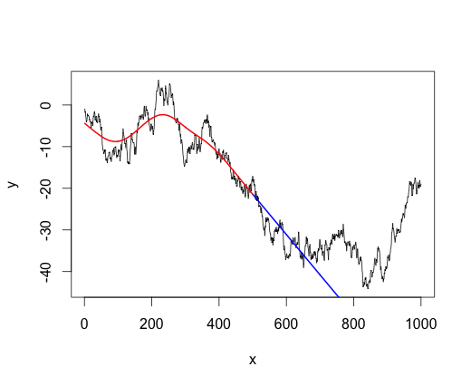

## Table of Contents

## What is signal processing and how does it relate to trading?

Signal processing is a way to take information from things like sound or pictures, and change it or make it clearer. It's like when you adjust the volume on your radio to hear the music better. In computers, signal processing uses math to find patterns or important parts of the information.

In trading, signal processing is used to look at lots of numbers about stocks or other things people buy and sell. Traders use it to find patterns in these numbers that can help them decide when to buy or sell. It's like trying to predict the weather by looking at past weather data, but with money instead of rain. This can help traders make better choices and maybe make more money.

## What are the basic types of signals used in trading?

In trading, signals are like clues that help traders decide when to buy or sell. There are two main types of signals: technical signals and fundamental signals. Technical signals come from looking at charts and numbers about how prices have moved in the past. Traders use things like moving averages or other patterns to guess where prices might go next. It's like looking at the trail a hiker left to see where they might be going.

Fundamental signals, on the other hand, come from looking at the actual health and news about a company or the economy. This can include things like how much money a company is making, news about new products, or even big events like elections. Traders use this information to decide if a company's stock is a good buy or if it's time to sell. It's like checking the weather report before deciding if it's a good day for a picnic.

Both types of signals help traders make decisions, but they look at different kinds of information. Technical signals focus on numbers and patterns, while fundamental signals focus on the real-world stuff that can affect prices. By using both, traders can get a fuller picture of what might happen next in the market.

## How can signal processing help in identifying trading opportunities?

Signal processing can help traders find good times to buy or sell by looking at lots of data and finding patterns. It's like using a magnifying glass to see tiny details that you might miss otherwise. Traders use special math to clean up the data and make it easier to see what's important. For example, if a stock's price goes up and down a lot, signal processing can help smooth out those ups and downs to show the overall trend. This can help traders spot when a stock might be about to go up or down in a big way.

By using signal processing, traders can also compare different stocks or markets to see how they move together. This can help them find times when one stock might be a better buy than another. For instance, if signal processing shows that two stocks usually move in opposite directions, a trader might buy one and sell the other to make money no matter which way the market goes. This way, signal processing gives traders more tools to find opportunities that they might not see just by looking at the numbers.

## What are the common tools and software used for signal processing in trading?

Traders use many tools and software to help with signal processing in trading. Some popular ones are MATLAB, Python with libraries like NumPy and Pandas, and R. These tools help traders take lots of numbers about stocks and make them easier to understand. They can use these tools to clean up the data, find patterns, and even make predictions about what might happen next. For example, traders might use Python to write code that looks at stock prices over time and figures out if a stock is going up or down.

There are also special software programs made just for trading, like MetaTrader and NinjaTrader. These programs come with built-in tools for signal processing that make it easy for traders to see important information. They can use these programs to set up alerts that tell them when it's a good time to buy or sell. These software programs often have charts and graphs that show the data in a way that's easy to understand, helping traders make quick decisions. By using these tools, traders can spend less time looking at numbers and more time making smart trades.

## How does noise affect signal processing in trading, and how can it be mitigated?

Noise in trading is like static on a radio - it's the random stuff that makes it hard to hear the clear signal. In trading, noise can come from small price changes that don't mean much, or from news and rumors that cause short-term ups and downs. This noise can make it tough for traders to see the real trends and patterns in the data. If a trader can't tell the difference between noise and the important signals, they might make bad decisions about when to buy or sell.

To deal with noise, traders use signal processing techniques to clean up the data. They use things like moving averages to smooth out the ups and downs, making it easier to see the bigger picture. They also use filters to take out the noise and focus on the important parts of the data. By doing this, traders can make better guesses about where prices might go next. It's like turning down the static on the radio so you can hear the music more clearly.

## What are the differences between technical analysis and signal processing in trading?

Technical analysis and signal processing in trading are both ways to look at stock data, but they do it a bit differently. Technical analysis is like looking at a map of where prices have been to guess where they might go next. Traders use charts and special patterns to find out if a stock is going up or down. They might look at things like moving averages or support and resistance levels to make their decisions. It's like trying to predict the weather by looking at past weather patterns.

Signal processing, on the other hand, uses math to clean up and make sense of the data. It's like using a special tool to take out the static from a radio so you can hear the music better. Traders use signal processing to smooth out the ups and downs in stock prices and find the real trends. They use things like filters and algorithms to take out the noise and focus on the important parts of the data. This can help them make better guesses about where prices might go next.

Both technical analysis and signal processing help traders make decisions, but they do it in different ways. Technical analysis is more about looking at charts and patterns, while signal processing is more about using math to clean up the data. By using both, traders can get a fuller picture of what might happen next in the market.

## How can signal processing be used to optimize trading strategies?

Signal processing can help traders make their trading strategies better by cleaning up the data they use to make decisions. It's like using a special tool to take out the static from a radio so you can hear the music better. Traders use signal processing to smooth out the ups and downs in stock prices and find the real trends. By doing this, they can see the important patterns more clearly and make better guesses about where prices might go next. This can help them decide when to buy or sell, making their trading strategies more successful.

For example, a trader might use signal processing to look at lots of data about a stock and find out if it's going up or down over time. They can use special math to take out the noise and focus on the important parts of the data. This can help them set up rules for when to buy or sell, based on what the data is telling them. By using signal processing, traders can make their strategies more accurate and make more money. It's like having a clearer map to follow when you're trying to find your way.

## What are the advanced algorithms used in signal processing for high-frequency trading?

In high-frequency trading, traders use really fast computers and special math to make quick decisions about buying and selling. One of the advanced algorithms they use is called the Kalman Filter. This algorithm helps traders guess where stock prices might go next by looking at lots of data and figuring out which parts are important. It's like trying to predict where a ball will land by watching how it's been moving. The Kalman Filter helps traders see through the noise and focus on the real trends, making their trading decisions faster and more accurate.

Another algorithm used in high-frequency trading is called the Fourier Transform. This algorithm helps traders break down the data into different parts, like separating colors in a rainbow. By doing this, traders can see patterns in the data that they might miss otherwise. For example, they might find out that a stock's price goes up and down in a certain way every day. By understanding these patterns, traders can make quick trades to take advantage of them. It's like finding hidden clues in a puzzle to solve it faster.

## How do machine learning and AI enhance signal processing in trading?

Machine learning and AI help make signal processing in trading even better. They're like smart helpers that learn from lots of data to find patterns that humans might miss. In trading, [machine learning](/wiki/machine-learning) algorithms can look at tons of information about stocks and figure out which signals are the most important. They can learn from past trades to see what worked and what didn't, and then use that knowledge to make better guesses about where prices might go next. This means traders can make smarter decisions about when to buy or sell, helping them make more money.

AI also helps by making signal processing faster and more accurate. It can clean up the data and take out the noise, so traders can see the real trends more clearly. AI can do this really quickly, which is important in high-frequency trading where every second counts. By using AI, traders can set up rules for buying and selling that are based on what the data is telling them. This helps them make trades that are more likely to be successful. It's like having a super-smart friend who can help you find your way through a tricky maze.

## What are the ethical considerations and potential risks of using signal processing in trading?

Using signal processing in trading can bring up some big questions about what's right and wrong. One big worry is that some traders might use these fancy tools to get an unfair advantage over others. This can make the market less fair, where only people with the best tech and the most money can win. It's like a race where some people get to start way ahead of everyone else. Another concern is that if everyone starts using the same signal processing methods, it could make the market less stable. If lots of traders make the same move at the same time because their computers told them to, it could cause big price swings that hurt everyone.

There are also risks to think about when using signal processing in trading. One risk is that the data might be wrong or incomplete, leading traders to make bad decisions. It's like trying to solve a puzzle with missing pieces. Another risk is that the algorithms might make mistakes or be tricked by other traders who know how they work. This can lead to big losses if traders rely too much on their computers without understanding what's going on. It's important for traders to use these tools carefully and always keep an eye on what's happening in the market.

## How can one evaluate the performance of signal processing techniques in trading?

To figure out if signal processing techniques are working well in trading, you need to look at how much money they help you make and how often they get things right. Traders usually use numbers like return on investment (ROI) and the Sharpe ratio to see if their strategies are making good profits compared to the risks they're taking. ROI tells you how much money you made compared to what you started with, while the Sharpe ratio shows if the extra money you made was worth the extra risk. By looking at these numbers over time, traders can see if their signal processing techniques are helping them make smart trades or if they need to change something.

Another way to check the performance of signal processing in trading is by looking at how often the signals are right. This is called the accuracy rate. If a signal says a stock will go up and it does, that's a good signal. But if it's wrong a lot, then it might not be very helpful. Traders also look at something called the hit rate, which is how often their trades make money. By keeping track of these things, traders can see if their signal processing techniques are finding good trading opportunities or if they need to find a better way to do things.

## What are the future trends and developments expected in signal processing for trading?

In the future, signal processing for trading is expected to get even better with the help of new technology. One big trend is the use of more advanced machine learning and [artificial intelligence](/wiki/ai-artificial-intelligence). These smart tools can learn from huge amounts of data to find patterns that humans might miss. They can also make decisions faster and more accurately, which is really important in high-frequency trading where every second counts. As these technologies keep getting better, traders will be able to make even smarter decisions about when to buy and sell, helping them make more money.

Another trend is the use of more real-time data. Right now, traders use data that's a little bit old, but in the future, they'll be able to use information that's happening right now. This will help them react to changes in the market even faster. Also, as more people start using signal processing, there will be a bigger focus on making sure it's used in a fair way. This means coming up with rules to make sure everyone has a fair chance in the market, and not just the people with the best technology. By keeping an eye on these trends, traders can stay ahead of the game and make the most of what signal processing has to offer.

## What are the techniques and methodologies used in signal processing?

Signal processing methodologies are integral to [algorithmic trading](/wiki/algorithmic-trading), serving as the foundation for extracting meaningful information from market data. Several techniques are employed to improve the clarity and predictive capability of trading signals.

**Filtering**

Filtering plays a crucial role in signal processing by eliminating noise and emphasizing essential data components. The Moving Average Filter is one of the simplest and most effective techniques, calculating the average of data points over a specified period. This method smooths out short-term fluctuations, allowing for better trend identification. Mathematically, a simple moving average (SMA) for a dataset $X$ with a window size $n$ is given by:

$$
\text{SMA}_t = \frac{1}{n} \sum_{i=t-n+1}^{t} X_i
$$

Another widely used technique, the Kalman Filter, is more sophisticated, providing real-time estimates and predictions of dynamic systems. It recursively estimates the state of a variable by minimizing the mean of the squared errors. This method is particularly beneficial for systems with noise and uncertainty, such as financial markets.

**Spectrum Analysis**

Spectrum analysis, involving the study of frequency components in market data, relies heavily on tools like the Fast Fourier Transform (FFT). FFT converts time-domain data into frequency-domain data, revealing periodicities and underlying cycles in financial signals. This technique assists traders in isolating dominant frequencies within market movements, enabling identification of cyclical patterns and potential future behaviors. 

Implementing FFT in Python is straightforward using libraries such as NumPy:

```python
import numpy as np

# Sample market data
data = np.random.normal(size=100)

# Fast Fourier Transform
fft_result = np.fft.fft(data)

# Frequency components
frequencies = np.fft.fftfreq(len(data))
```

**Machine Learning**

Machine learning techniques, including both supervised and unsupervised learning, have transformed signal processing in trading. Supervised learning models, trained on labeled datasets, are crucial for predictive analytics, identifying trends, and optimizing trading strategies. Algorithms such as Decision Trees, Random Forests, and Neural Networks are commonly used. Unsupervised learning, on the other hand, helps uncover hidden patterns and correlations within data without explicit labels, utilizing methods like clustering and dimensionality reduction.

```python
from sklearn.ensemble import RandomForestClassifier

# Sample feature set and labels
features = np.random.rand(100, 5)
labels = np.random.randint(2, size=100)

# Random Forest Classifier for predictive modeling
model = RandomForestClassifier(n_estimators=100)
model.fit(features, labels)
```

**Wavelet Transform**

The wavelet transform is a versatile tool for analyzing non-stationary signals, which are typical in volatile financial markets. Unlike FFT, wavelet transforms decompose signals into different frequency components while maintaining time localization. This time-frequency representation aids in identifying localized market anomalies and transient features.

The continuous wavelet transform (CWT) is expressed as:

$$
W(a, b) = \frac{1}{\sqrt{|a|}} \int_{-\infty}^{\infty} x(t) \psi^*\left(\frac{t-b}{a}\right) \, dt
$$

where $a$ and $b$ are the scaling and translation parameters, respectively, and $\psi$ is the mother wavelet.

These signal processing methodologies offer robust frameworks for creating and refining trading strategies, enabling traders to make informed decisions by efficiently extracting critical insights from complex financial datasets.

## References & Further Reading

[1]: ["The Signal Processing in Finance and Machine Learning"](https://ieeexplore.ieee.org/book/7470479) by E. A. Capobianco, in "High Frequency Trading, Controversy and Decision-Making," IntechOpen, 2018.

[2]: Lopez de Prado, M. (2018). ["Advances in Financial Machine Learning"](https://www.amazon.com/Advances-Financial-Machine-Learning-Marcos/dp/1119482089). Wiley.

[3]: Aronson, D. R. (2007). ["Evidence-Based Technical Analysis: Applying the Scientific Method and Statistical Inference to Trading Signals"](https://www.amazon.com/Evidence-Based-Technical-Analysis-Scientific-Statistical/dp/0470008741). Wiley.

[4]: Jansen, S. (2018). ["Machine Learning for Algorithmic Trading: Predictive Models to Extract Signals from Market and Alternative Data for Systematic Trading Strategies with Python"](https://github.com/stefan-jansen/machine-learning-for-trading). Packt Publishing.

[5]: Chan, E. P. (2009). ["Quantitative Trading: How to Build Your Own Algorithmic Trading Business"](https://github.com/ftvision/quant_trading_echan_book). Wiley.

[6]: Hastie, T., Tibshirani, R., & Friedman, J. (2009). ["The Elements of Statistical Learning"](https://link.springer.com/book/10.1007/978-0-387-84858-7). Springer Series in Statistics.