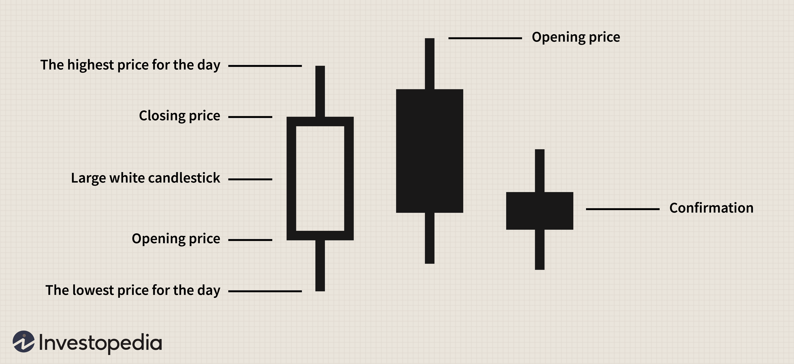

## Table of Contents

## What is the Dark Cloud Cover pattern?

The Dark Cloud Cover is a bearish reversal pattern that appears in candlestick charting. It signals that a bullish trend might be ending and a bearish trend could start. The pattern forms over two days. On the first day, there is a strong bullish candle, showing that prices went up a lot. On the second day, a bearish candle opens above the high of the first day's candle but closes below the midpoint of the first day's candle. This shows that the buyers are losing control and sellers are starting to take over.

This pattern is important because it can help traders decide when to sell or short a stock. When they see the Dark Cloud Cover, it might be a good time to get out of a long position or start a short position. However, traders should not just rely on this pattern alone. They should look at other signs and indicators to make sure the trend is really changing. It's always a good idea to use more than one tool when making trading decisions.

## How does the Dark Cloud Cover pattern form on a chart?

The Dark Cloud Cover pattern forms over two days on a candlestick chart. On the first day, you see a big green candle. This means the price went up a lot that day. The green candle shows that buyers were in control and the market was bullish. The top of the green candle is the highest price of the day, and the bottom is the lowest price.

On the second day, a red candle appears. This red candle opens above the top of the first day's green candle. But as the day goes on, the price starts to fall. By the end of the day, the red candle closes below the middle of the first day's green candle. This shows that sellers are starting to take over and the bullish trend might be ending. The pattern looks like a dark cloud coming over the previous day's gains, which is why it's called the Dark Cloud Cover.

## What does the Dark Cloud Cover pattern signify in trading?

The Dark Cloud Cover pattern is a sign that the market might be changing from a bullish trend to a bearish one. It shows up on a chart over two days. On the first day, you see a big green candle, which means the price went up a lot. This tells us that buyers were in control and the market was doing well. But on the second day, a red candle appears. This red candle starts above the top of the green candle from the first day but ends up closing below the middle of that green candle. This shows that sellers are starting to take over and the good times for buyers might be ending.

Traders use the Dark Cloud Cover pattern to help them decide when to sell or short a stock. When they see this pattern, it might be a good time to get out of a long position or start a short position. But traders should not just rely on this pattern alone. They should look at other signs and indicators to make sure the trend is really changing. It's always a good idea to use more than one tool when making trading decisions.

## Can you explain the psychology behind the Dark Cloud Cover pattern?

The Dark Cloud Cover pattern shows us what traders are thinking during a change in the market. On the first day, everyone is happy because the price goes up a lot. This big green candle means buyers are in charge and they think the market will keep going up. They are confident and keep buying, pushing the price higher and higher.

But then, on the second day, things start to change. The price opens even higher than the day before, which makes the buyers even more excited at first. But as the day goes on, the price starts to fall. By the end of the day, the price closes much lower than it started, below the middle of the first day's green candle. This red candle tells us that sellers are starting to take over. They think the price has gone up too much and it's time to sell. This change in thinking from buyers to sellers is what makes the Dark Cloud Cover pattern important. It shows us that the market might be turning from a happy, bullish trend to a worried, bearish one.

## How reliable is the Dark Cloud Cover pattern as a bearish signal?

The Dark Cloud Cover pattern is a good sign that the market might be turning bearish, but it's not perfect. It works best when the market has been going up for a while and the pattern shows up at the top of that trend. Traders look at how strong the candles are and where the pattern shows up on the chart to decide if it's a good signal. But even if the pattern looks right, it's smart to check other signs and indicators too. That way, traders can be more sure that the market is really changing.

No pattern is right all the time, and the Dark Cloud Cover is no different. Sometimes it might look like the market is going to go down, but then it keeps going up instead. That's why it's important for traders to use the Dark Cloud Cover along with other tools. By looking at more than one thing, traders can make better choices and not just rely on one pattern. So, while the Dark Cloud Cover can be a helpful sign, it's best used as part of a bigger plan for trading.

## What are the key criteria for identifying a valid Dark Cloud Cover pattern?

To spot a real Dark Cloud Cover pattern, you need to look at two days on a chart. On the first day, you see a big green candle. This means the price went up a lot that day, showing that buyers were in charge and the market was doing well. The green candle should be strong, meaning it has a long body, and it should come after the price has been going up for a while.

On the second day, a red candle shows up. This red candle opens above the top of the first day's green candle, which makes it look like the price might keep going up. But as the day goes on, the price starts to fall. By the end of the day, the red candle closes below the middle of the first day's green candle. This shows that sellers are starting to take over and the good times for buyers might be ending. The pattern is stronger if the second day's red candle closes near the low of the day, showing a lot of selling pressure.

## How should a trader confirm a Dark Cloud Cover pattern before making a trade?

Before making a trade based on a Dark Cloud Cover pattern, a trader should look at other signs to make sure the pattern is real. They should check the [volume](/wiki/volume-trading-strategy) of trades. If the volume is high on the second day when the red candle appears, it means more people are selling, which makes the pattern stronger. Traders should also look at other technical indicators like the Relative Strength Index (RSI) or Moving Averages. If these indicators also show that the market might be turning bearish, it adds more proof that the Dark Cloud Cover pattern is a good sign to trade on.

It's also important for traders to think about what's happening in the market and the world. News and events can change how people feel about buying and selling. If there's bad news that could make prices go down, it might make the Dark Cloud Cover pattern more likely to be right. Traders should also look at the bigger picture of the market trend. If the pattern shows up after a long time of prices going up, it's more likely to be a good sign that the trend is changing. By looking at all these things together, traders can feel more sure about making a trade based on the Dark Cloud Cover pattern.

## What are common mistakes traders make when using the Dark Cloud Cover pattern?

One common mistake traders make with the Dark Cloud Cover pattern is relying on it too much without checking other signs. They see the pattern and think it's time to sell right away, but they don't look at the volume, other indicators, or what's happening in the market. This can lead to bad trades because the pattern alone might not be enough to tell if the market is really turning bearish.

Another mistake is not waiting for the right time to trade. Some traders jump in as soon as they see the pattern, even if it's not at the top of a bullish trend. The Dark Cloud Cover works best when it shows up after prices have been going up for a while. If traders don't wait for the right moment, they might miss out on better chances to make money.

Lastly, traders sometimes forget to set stop-loss orders when they trade based on the Dark Cloud Cover pattern. A stop-loss order helps limit losses if the trade doesn't go as planned. Without it, traders can lose more money than they planned if the market doesn't turn bearish like the pattern suggested.

## How can the Dark Cloud Cover pattern be used in conjunction with other technical indicators?

Traders can use the Dark Cloud Cover pattern with other technical indicators to make better trading decisions. One way is to look at the volume when the pattern shows up. If the volume is high on the second day, it means more people are selling, which makes the pattern stronger. Another good indicator to check is the Relative Strength Index (RSI). If the RSI is above 70 and then starts to go down when the Dark Cloud Cover appears, it's a sign that the market might be getting too high and could start to fall. Moving Averages can also help. If the price is above a long-term moving average but starts to fall below a shorter-term one after the pattern, it adds more proof that the market trend might be changing.

It's also smart to look at the bigger picture of the market trend. If the Dark Cloud Cover pattern shows up after a long time of prices going up, it's more likely to be a good sign that the trend is turning bearish. Traders should also pay attention to what's happening in the world and any news that could affect the market. If there's bad news that could make prices go down, it might make the Dark Cloud Cover pattern more likely to be right. By using the Dark Cloud Cover pattern with these other tools, traders can feel more sure about making a trade and avoid common mistakes like relying on the pattern alone.

## What are the differences between the Dark Cloud Cover and similar bearish reversal patterns?

The Dark Cloud Cover and the Bearish Engulfing pattern are both signs that the market might be turning from going up to going down. They both show up over two days. In the Dark Cloud Cover, the first day has a big green candle, and the second day starts above the top of that green candle but ends up closing below the middle of it. This shows that sellers are starting to take over. In the Bearish Engulfing pattern, the first day also has a green candle, but the second day's red candle is bigger and completely covers the first day's green candle. This shows even stronger selling pressure than the Dark Cloud Cover.

Another similar pattern is the Evening Star. This pattern takes three days to form. The first day has a green candle, the second day has a small candle that can be green or red, and the third day has a red candle that closes below the middle of the first day's green candle. The Evening Star shows a slower change from a bullish to a bearish trend compared to the Dark Cloud Cover. While the Dark Cloud Cover and Bearish Engulfing patterns happen over two days, the Evening Star takes three days to show the same thing. Each pattern gives traders a different sign to watch for when deciding to sell or short a stock.

## How does the effectiveness of the Dark Cloud Cover pattern vary across different markets?

The Dark Cloud Cover pattern works differently in different markets like stocks, [forex](/wiki/forex-system), and commodities. In the stock market, it can be a good sign that a stock's price might start to go down if it shows up after a long time of going up. But stocks can be affected by news and events, so the pattern might not always work as expected. In the forex market, where currencies are traded, the Dark Cloud Cover can also be useful, but it's important to look at other signs too because forex markets can be influenced by things like interest rates and economic reports.

In the commodities market, the Dark Cloud Cover pattern might not be as reliable because commodity prices can be affected by things like weather, supply and demand, and global events. Traders in this market need to be careful and use the pattern along with other tools to make sure it's a good sign to trade on. No matter which market you're trading in, it's always a good idea to use the Dark Cloud Cover pattern with other indicators and to think about what's happening in the world that could change prices.

## What advanced strategies can traders employ using the Dark Cloud Cover pattern for risk management and profit maximization?

Traders can use the Dark Cloud Cover pattern to manage risk by setting stop-loss orders. When they see the pattern and decide to sell or short a stock, they can set a stop-loss order above the high of the first day's green candle. This way, if the price goes up instead of down, the stop-loss order will help them limit their losses. Traders can also use the pattern to adjust their positions. If they are already in a long position and see the Dark Cloud Cover, they might decide to sell part of their position to lock in some profits and reduce risk, while keeping the rest to see if the bearish trend plays out.

For profit maximization, traders can use the Dark Cloud Cover pattern along with other indicators like the RSI or moving averages. If the RSI is showing that the market is overbought and the Dark Cloud Cover appears, it could be a strong signal to sell or short. Traders can also look at support and resistance levels. If the second day's red candle closes near a key support level, it might be a good time to enter a short position, aiming for profits as the price falls further. By combining the Dark Cloud Cover with other tools and strategies, traders can make more informed decisions and increase their chances of making money.

## What are the trading strategies for Dark Cloud Cover?

Trading the dark cloud cover pattern requires strategic planning for entry and [exit](/wiki/exit-strategy) points to effectively leverage its signaling potential. Successful trading of this pattern involves a thorough analysis that confirms the pattern's occurrence alongside other technical indicators. One such strategy is to corroborate the dark cloud cover with indicators like volume or the Relative Strength Index (RSI). Increased volume during the bearish candle can validate the pattern, indicating enhanced market participation and thus reinforcing the possibility of a trend reversal. Similarly, an overbought condition indicated by a high RSI can strengthen the bearish implications of the dark cloud cover, suggesting a decline.

Managing risks is crucial when trading the dark cloud cover. To mitigate against unexpected bullish reversals, traders are advised to set a stop-loss order above the high of the pattern. This acts as a protective measure, limiting potential losses should the anticipated downtrend fail to materialize. A stop-loss can be calculated as:

$$
\text{Stop-loss} = \text{High of the bearish candle} + \text{buffer (e.g., 1\% of its range)}
$$

Exiting positions strategically is essential once the dark cloud cover pattern is confirmed. Traders should be prepared to close their positions if the price continues to move downward, indicating the continuation of the bearish trend. Additionally, setting predefined profit targets helps in securing gains. These targets can be set based on support levels, previous price patterns, or a fixed percentage of the entry price. An example of a simple exit strategy in Python might include an automatic closing of a position when a specific profit target is reached:

```python
def exit_trade(current_price, entry_price, profit_target_percentage):
    profit_target = entry_price * (1 - profit_target_percentage / 100)
    if current_price <= profit_target:
        return "Exit trade"
    return "Hold position"

# Example usage:
entry_price = 100
current_price = 95
profit_target_percentage = 5
decision = exit_trade(current_price, entry_price, profit_target_percentage)
print(decision)
```

This approach allows traders to capitalize on bearish signals while managing risks efficiently. Balancing confirmation, risk management, and strategic exits contributes to more effective trading practices with the dark cloud cover pattern.

## References & Further Reading

[1]: Bulkowski, T. (2008). ["Encyclopedia of Candlestick Charts"](https://onlinelibrary.wiley.com/doi/book/10.1002/9781119202288). Wiley Trading.

[2]: Pring, M. J. (2002). ["Technical Analysis Explained: The Successful Investor's Guide to Spotting Investment Trends and Turning Points"](https://www.amazon.com/Technical-Analysis-Explained-Fifth-Successful/dp/0071825177). McGraw-Hill.

[3]: Elder, A. (1993). ["Trading for a Living: Psychology, Trading Tactics, Money Management"](https://www.amazon.com/Trading-Living-Psychology-Tactics-Management/dp/0471592242). Wiley.

[4]: Murphy, J. J. (1999). ["Technical Analysis of the Financial Markets: A Comprehensive Guide to Trading Methods and Applications"](https://archive.org/details/technicalanalysi0000murp). New York Institute of Finance.

[5]: Bandy, T. (2007). ["Quantitative Trading Systems: Practical Methods for Designing, Testing, and Implementing Systems"](https://www.scribd.com/document/468056722/Quantitative-Trading-Systems-Bandy-2007-pdf).  Blue Owl Press.