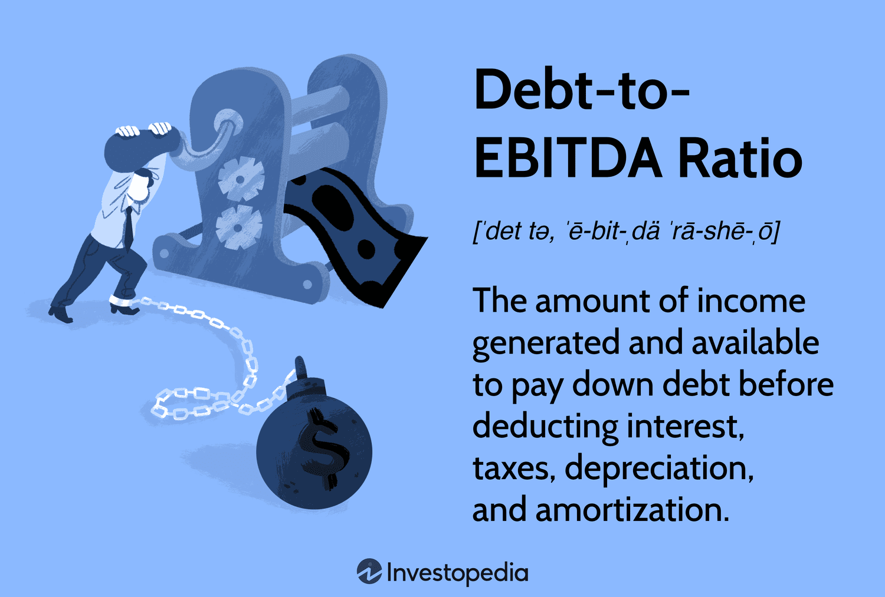

## Table of Contents

## What is the Debt/EBITDA ratio?

The Debt/EBITDA ratio is a way to measure how much debt a company has compared to its earnings. It stands for Debt to Earnings Before Interest, Taxes, Depreciation, and Amortization. This ratio helps investors and analysts understand if a company can pay off its debt with the money it makes before accounting for certain expenses.

A lower Debt/EBITDA ratio usually means a company is in a better financial position because it has less debt relative to its earnings. For example, if a company has a ratio of 2, it means it could theoretically pay off all its debt in 2 years if it used all its EBITDA for that purpose. A higher ratio might suggest the company is riskier because it could take longer to pay off the debt, which could be a concern for investors.

## How is the Debt/EBITDA ratio calculated?

To calculate the Debt/EBITDA ratio, you need to know two things: the total debt of the company and its EBITDA. The total debt includes all the money the company owes, like loans and bonds. EBITDA stands for Earnings Before Interest, Taxes, Depreciation, and Amortization. It's a way to measure a company's profit before taking out some expenses. To find the ratio, you simply divide the total debt by the EBITDA.

For example, if a company has a total debt of $100 million and its EBITDA is $25 million, the Debt/EBITDA ratio would be $100 million divided by $25 million, which equals 4. This means it would take the company 4 years to pay off its debt if it used all its EBITDA to do so. The ratio helps investors see if a company is managing its debt well. A lower ratio is usually better because it shows the company has less debt compared to its earnings.

## What does the Debt/EBITDA ratio indicate about a company's financial health?

The Debt/EBITDA ratio tells us how well a company can handle its debt. It compares the total debt of a company to its earnings before interest, taxes, depreciation, and amortization (EBITDA). A lower ratio means the company has less debt compared to its earnings, which is good. It shows the company can pay off its debt faster if it needs to. For example, a ratio of 2 means the company could pay off all its debt in 2 years using its EBITDA.

A higher Debt/EBITDA ratio can be a warning sign. It means the company has a lot of debt compared to its earnings, which could be risky. If the ratio is high, it might take the company a long time to pay off its debt, and this could worry investors. They might think the company is not managing its money well. So, a lower ratio is usually better for showing that a company is in good financial health.

## Why is the Debt/EBITDA ratio important for investors in junk bonds?

The Debt/EBITDA ratio is very important for investors in junk bonds because it helps them see how risky a company's debt is. Junk bonds are bonds from companies that have a higher chance of not paying back their debt. These companies often have more debt than safer companies. By looking at the Debt/EBITDA ratio, investors can see if a company can pay off its debt with its earnings. A lower ratio means the company might be able to pay off its debt faster, which is less risky for investors.

Investors in junk bonds need to be careful because these bonds can be risky. The Debt/EBITDA ratio helps them decide if the risk is worth it. If the ratio is high, it means the company has a lot of debt compared to its earnings, and it might take a long time to pay off that debt. This could make the bond riskier. But if the ratio is low, it might mean the company is in a better position to pay back its debt, making the bond less risky. So, the Debt/EBITDA ratio is a key tool for investors to understand the financial health of companies issuing junk bonds.

## What is considered a high Debt/EBITDA ratio in the context of junk bonds?

In the world of junk bonds, a high Debt/EBITDA ratio is usually seen as anything above 4 or 5. This means the company has a lot of debt compared to its earnings. For investors, a high ratio like this is a warning sign. It shows that the company might take a long time to pay off its debt, which makes the bond riskier. Investors need to be careful because junk bonds are already riskier than other bonds.

The exact number that is considered high can change depending on the industry and the overall economy. But in general, if the Debt/EBITDA ratio is over 4 or 5, it means the company might struggle to pay back its debt. This is important for investors to know because it helps them decide if the risk of investing in junk bonds is worth it. A lower ratio would be better, showing the company can handle its debt more easily.

## How does the Debt/EBITDA ratio differ for investment-grade versus junk bonds?

The Debt/EBITDA ratio is used differently for investment-grade bonds and junk bonds. Investment-grade bonds are from companies that are seen as safer because they have a lower risk of not paying back their debt. For these bonds, a Debt/EBITDA ratio of around 2 to 3 is usually considered okay. It shows the company can handle its debt well. Investors in investment-grade bonds like to see a lower ratio because it means the company is financially healthy and less risky.

On the other hand, junk bonds are from companies that are riskier and have a higher chance of not paying back their debt. For junk bonds, a Debt/EBITDA ratio above 4 or 5 is often seen as high. This means the company has a lot of debt compared to its earnings, and it might take a long time to pay it off. Investors in junk bonds need to be careful and look at the Debt/EBITDA ratio to decide if the risk is worth it. A higher ratio in junk bonds can be a warning sign that the company might struggle to pay back its debt.

## Can the Debt/EBITDA ratio predict the likelihood of default for junk bonds?

The Debt/EBITDA ratio can give investors a clue about how likely a company is to default on its junk bonds. This ratio shows how much debt a company has compared to its earnings before some expenses. A high ratio, like above 4 or 5, means the company has a lot of debt and might take a long time to pay it off. This can be a warning sign that the company might struggle to pay back its debt, making it more likely to default.

However, the Debt/EBITDA ratio is just one piece of the puzzle. Other things like the company's cash flow, the overall economy, and how well the company is doing in its industry also matter. So while a high Debt/EBITDA ratio can suggest a higher risk of default, it's not the only thing investors should look at. They need to consider all these factors together to get a full picture of the risk.

## What are the limitations of using the Debt/EBITDA ratio as a sole metric for junk bond analysis?

The Debt/EBITDA ratio is helpful for looking at junk bonds, but it has some limits if you use it by itself. One big problem is that it doesn't tell you everything about a company's money situation. It only shows debt compared to earnings before some expenses, but it doesn't look at things like cash flow, which is important for paying back debt. Also, the ratio doesn't think about how the economy is doing or what's happening in the company's industry. These things can change how risky a bond is.

Another thing to remember is that different industries have different normal Debt/EBITDA ratios. What might be a high ratio in one industry could be normal in another. So, just looking at the ratio without knowing the industry can be misleading. Plus, the ratio doesn't show if a company has other ways to pay its debts, like selling assets or getting new loans. So, while the Debt/EBITDA ratio can give you a quick idea of risk, it's better to use it with other information to really understand if a junk bond is a good investment.

## How has the Debt/EBITDA ratio's significance evolved in junk bond markets over the past decade?

Over the past decade, the Debt/EBITDA ratio has become more important in the junk bond market. Investors are using it more to check how risky a company's debt is. This is because there have been more junk bonds issued, and they want a quick way to see if a company can handle its debt. The ratio helps them see if a company's earnings are enough to pay off its debt. If the ratio is high, like above 4 or 5, it means the company might struggle to pay back its debt, which makes the bond riskier.

Also, the way people look at the Debt/EBITDA ratio has changed a bit. Because of economic ups and downs, like the 2008 financial crisis and the 2020 pandemic, investors have become more careful. They now use the ratio along with other information to get a full picture of a company's financial health. Even though the ratio is still very useful, investors know it's not perfect and they need to look at other things too, like cash flow and what's happening in the industry, to make better decisions about junk bonds.

## What other financial ratios should be considered alongside the Debt/EBITDA ratio when analyzing junk bonds?

When looking at junk bonds, the Debt/EBITDA ratio is helpful, but it's good to look at other financial ratios too. One important ratio is the Interest Coverage Ratio. This ratio shows if a company can pay the interest on its debt with its earnings. A high Interest Coverage Ratio means the company is doing well and can easily pay its interest. A low ratio means the company might struggle to pay interest, which is risky. Another useful ratio is the Debt/Equity Ratio. This ratio compares a company's debt to its equity, which is the money from shareholders. A high Debt/Equity Ratio means the company is using a lot of debt to grow, which can be risky if things go wrong.

Also, the Current Ratio is important to check. This ratio shows if a company can pay its short-term debts with its short-term assets. A high Current Ratio means the company has enough money to pay its bills, which is good. A low ratio means the company might have trouble paying its short-term debts. Lastly, the Cash Flow to Debt Ratio is another good one to look at. This ratio shows if a company's cash flow is enough to pay its debt. A high ratio means the company has enough cash to handle its debt, which is less risky for investors. By looking at these ratios along with the Debt/EBITDA ratio, investors can get a better idea of how risky a junk bond is.

## How do changes in economic conditions affect the interpretation of the Debt/EBITDA ratio in junk bonds?

Changes in economic conditions can make a big difference in how we look at the Debt/EBITDA ratio for junk bonds. When the economy is doing well, companies usually make more money, which can make their Debt/EBITDA ratio look better. Investors might feel less worried about high debt if they think the company's earnings will keep going up. But if the economy starts to go down, companies might make less money, and their Debt/EBITDA ratio could get worse. This makes investors more worried because it means the company might have a harder time paying back its debt.

Because of this, investors need to think about the economy when they look at the Debt/EBITDA ratio. If there's a chance of a recession or other economic problems, a high Debt/EBITDA ratio can be a bigger warning sign. It might mean the company is at a higher risk of not being able to pay its debts. So, while the Debt/EBITDA ratio is important, it's even more useful when you also think about what's happening in the economy.

## What advanced statistical models incorporate the Debt/EBITDA ratio to assess junk bond risk?

Advanced statistical models that assess junk bond risk often use the Debt/EBITDA ratio as one of several key inputs. These models might include regression analysis, which helps predict how likely a company is to default on its debt. In these models, the Debt/EBITDA ratio is combined with other financial ratios and economic indicators to create a more complete picture of risk. For example, a model might use the Debt/EBITDA ratio along with the Interest Coverage Ratio and the company's cash flow to better understand how well a company can handle its debt.

Another type of model that might use the Debt/EBITDA ratio is a [machine learning](/wiki/machine-learning) model. These models can look at a lot of data, including the Debt/EBITDA ratio, to find patterns that help predict defaults. They might also consider things like industry trends and economic conditions. By using machine learning, these models can learn from past data and improve their predictions over time. This helps investors make smarter decisions about which junk bonds to buy, based on a detailed analysis of risk.

## What is the Debt/EBITDA Ratio and how can it be understood?

The Debt/EBITDA ratio is a fundamental financial metric used to evaluate a company’s ability to manage and repay its debt. This ratio compares a company’s total debt with its Earnings Before Interest, Taxes, Depreciation, and Amortization (EBITDA), serving as an indicator of how many years it would take for a company to pay back its debt if net debt and EBITDA are held constant. The formula for calculating the Debt/EBITDA ratio is:

$$
\text{Debt/EBITDA Ratio} = \frac{\text{Total Debt}}{\text{EBITDA}}
$$

### Components of the Formula

**Total Debt:** This component includes all of a company’s short-term and long-term liabilities. It encompasses loans, bonds, and other forms of debt, excluding operational liabilities such as accounts payable. An accurate assessment of total debt provides a comprehensive understanding of all financial obligations that a company must meet.

**EBITDA:** Earnings Before Interest, Taxes, Depreciation, and Amortization is a measure of a company's overall financial performance and is used as an alternative to net income in some circumstances. It eliminates the effects of financing and accounting decisions, offering a clearer picture of operational profitability.

### Significance of the Ratio

The Debt/EBITDA ratio is critical for assessing a company’s solvency and financial health. A lower ratio typically suggests that a company is less risky, as it indicates that the company produces a sufficient amount of income to cover its debts. Conversely, a higher ratio may imply greater financial risk; the company may struggle to meet its debt obligations, particularly if EBITDA decreases.

### Insights into Debt Servicing Ability

By evaluating the Debt/EBITDA ratio, investors and analysts can gauge a company’s capability to service its debt. A company with a manageable Debt/EBITDA ratio is considered to be in a position to meet its debt obligations without jeopardizing its financial stability. This ratio helps in understanding the company’s leverage and its earnings potential relative to its debt, which is crucial for credit analysis and investment decision-making. 

In conclusion, the Debt/EBITDA ratio offers valuable insights into a company's financial health by combining debt levels and earnings capacity. Stakeholders can use this tool to assess whether a company is operating within its means and to identify potential financial risks associated with its debt levels.

## References & Further Reading

[1]: Fridson, M. S., & Garman, M. F. (2001). ["Junk Bonds: A Guide to High-Yield Debt Markets."](https://www.semanticscholar.org/paper/Determinants-of-Spreads-on-New-High-Yield-Bonds-Fridson-Garman/7bf6e27179ea6f1277465347f204c640c15ceb7d) Wiley Finance.

[2]: Damodaran, A. (2012). ["Investment Valuation: Tools and Techniques for Determining the Value of Any Asset."](https://www.amazon.com/Investment-Valuation-Tools-Techniques-Determining/dp/111801152X) Wiley.

[3]: Fabozzi, F. J., & Mann, S. V. (2011). ["The Handbook of Fixed Income Securities."](https://www.mhebooklibrary.com/doi/book/10.1036/9781260473902) McGraw-Hill Education.

[4]: White, H., & Granger, C. W. J. (2011). ["The Handbook of International Financial Terms."](https://link.springer.com/referenceworkentry/10.1057/978-1-349-95189-5_2513) Oxford University Press.

[5]: Fitch, T. P. (2010). ["Dictionary of Banking Terms."](https://books.google.com/books/about/Dictionary_of_Banking_Terms.html?id=TuwJAQAAMAAJ) Barron's Educational Series.