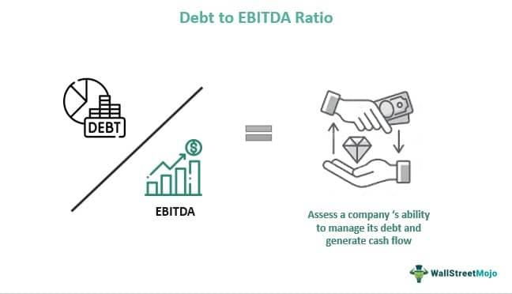

The Debt/EBITDA ratio stands as a critical metric in financial analysis, playing a key role in evaluating a company's financial health and its ability to manage and repay its debts. This ratio measures the extent of a company's debt in relation to its earnings before interest, taxes, depreciation, and amortization (EBITDA). By comparing these elements, the ratio offers insights into how efficiently a company can cover its debt obligations through its operating profits.

One significant application of the Debt/EBITDA ratio is in assessing the risk associated with investing in high-yield, high-risk junk bonds. Companies issuing junk bonds typically hold lower credit ratings, indicating a higher likelihood of default. Thus, understanding the Debt/EBITDA ratio is crucial for investors as it helps determine the financial stability and risk level of such issuers. A high ratio might signal potential difficulties in servicing debt, influencing credit ratings and thereby impacting a company's ability to raise capital.

Investment decisions are heavily swayed by this metric, as investors use it to gauge the solvency and financial robustness of prospective investment targets. The lower the Debt/EBITDA ratio, the better positioned a company is to withstand financial pressures and maintain operations without being over-leveraged.

In addition to its traditional uses, the Debt/EBITDA ratio is increasingly relevant in modern algorithmic trading strategies. Algorithms leverage this metric to enhance trading strategies, screening stocks, and assessing risk profiles to optimize investment portfolios. The application of predictive modeling using the Debt/EBITDA ratio helps in making informed, data-driven decisions in fast-paced trading environments.

Overall, the Debt/EBITDA ratio is indispensable for financial analysts, investors, and traders. It provides a quantitative basis for assessing financial health and guides strategic investment decisions, balancing risk and potential returns. In the coming sections, the article will explore these themes in detail, providing a comprehensive understanding of this critical financial metric.

## Table of Contents

## Understanding the Debt/EBITDA Ratio

The Debt/EBITDA ratio is a fundamental financial metric used to evaluate a company’s ability to manage and repay its debt. This ratio compares a company’s total debt with its Earnings Before Interest, Taxes, Depreciation, and Amortization (EBITDA), serving as an indicator of how many years it would take for a company to pay back its debt if net debt and EBITDA are held constant. The formula for calculating the Debt/EBITDA ratio is:

$$
\text{Debt/EBITDA Ratio} = \frac{\text{Total Debt}}{\text{EBITDA}}
$$

### Components of the Formula

**Total Debt:** This component includes all of a company’s short-term and long-term liabilities. It encompasses loans, bonds, and other forms of debt, excluding operational liabilities such as accounts payable. An accurate assessment of total debt provides a comprehensive understanding of all financial obligations that a company must meet.

**EBITDA:** Earnings Before Interest, Taxes, Depreciation, and Amortization is a measure of a company's overall financial performance and is used as an alternative to net income in some circumstances. It eliminates the effects of financing and accounting decisions, offering a clearer picture of operational profitability.

### Significance of the Ratio

The Debt/EBITDA ratio is critical for assessing a company’s solvency and financial health. A lower ratio typically suggests that a company is less risky, as it indicates that the company produces a sufficient amount of income to cover its debts. Conversely, a higher ratio may imply greater financial risk; the company may struggle to meet its debt obligations, particularly if EBITDA decreases.

### Insights into Debt Servicing Ability

By evaluating the Debt/EBITDA ratio, investors and analysts can gauge a company’s capability to service its debt. A company with a manageable Debt/EBITDA ratio is considered to be in a position to meet its debt obligations without jeopardizing its financial stability. This ratio helps in understanding the company’s leverage and its earnings potential relative to its debt, which is crucial for credit analysis and investment decision-making. 

In conclusion, the Debt/EBITDA ratio offers valuable insights into a company's financial health by combining debt levels and earnings capacity. Stakeholders can use this tool to assess whether a company is operating within its means and to identify potential financial risks associated with its debt levels.

## Role of Debt/EBITDA in Credit Ratings and Junk Bonds

The Debt/EBITDA ratio is a vital metric in determining a company's creditworthiness and financial stability, especially in the context of credit ratings and junk bonds. A high Debt/EBITDA ratio generally indicates that a company is heavily leveraged, which can be a red flag to credit rating agencies. These agencies scrutinize the ratio because a higher level of debt relative to earnings suggests increased financial risk, potentially leading to downgrades in credit ratings. A downgrade in credit ratings can significantly affect a company's ability to raise capital, as investors may perceive the company as a higher risk, demanding higher interest rates or avoiding investment altogether.

Credit rating agencies such as Moody's, S&P Global, and Fitch Ratings use the Debt/EBITDA ratio as a critical [factor](/wiki/factor-investing) in their assessments of a company's financial health. A lower ratio is typically favored, indicating the company's stronger ability to manage its debt load with its earnings. Conversely, a higher ratio may reflect potential difficulties in servicing debt, especially under adverse market conditions or economic downturns. For instance, companies with a Debt/EBITDA ratio exceeding a certain threshold (such as 4.0) may be perceived as riskier, prompting a review of their credit ratings.

Junk bonds, or high-yield bonds, are typically issued by companies with lower credit ratings. For these companies, the Debt/EBITDA ratio becomes a crucial metric in evaluating their financial viability. Investors in junk bonds demand higher returns due to the increased risk associated with these investments. A key component of this assessment involves analyzing the Debt/EBITDA ratio to understand the company's potential for financial distress. A relatively high ratio in this context might suggest that a company is more likely to default on its obligations, affecting its ability to raise new capital or refinance existing debt.

For example, a company with a Debt/EBITDA ratio of 5.5 may be viewed with caution by credit rating agencies when evaluating its junk bonds. The agencies will closely monitor other financial indicators and market conditions to determine if the company's earnings growth trajectory can sustainably reduce its debt levels. This assessment helps investors gauge whether the yields offered by junk bonds adequately compensate for the likelihood of default.

In conclusion, the Debt/EBITDA ratio serves as a fundamental tool for credit rating agencies in assessing a company's creditworthiness and plays a significant role in the evaluation of junk bonds. High levels of debt relative to earnings can lead to credit rating downgrades, limiting a company's funding opportunities and increasing borrowing costs. This ratio is indispensable for investors, enabling them to make informed decisions regarding the risk and return profile of high-yield investments.

## Investment Strategies Using Debt/EBITDA Ratio

Investors often rely on the Debt/EBITDA ratio as a fundamental tool to gauge a company's financial stability and its capacity to manage debt effectively. This ratio provides a snapshot of how much debt a company has in relation to its earnings before interest, taxes, depreciation, and amortization. A lower ratio indicates a healthier financial position, suggesting that a company generates sufficient earnings to cover its debt obligations, while a higher ratio may raise concerns about financial risk and potential difficulties in servicing debt.

### Industry Considerations

The acceptability of particular Debt/EBITDA ratios can vary significantly across industries due to inherent financial structures and business models. For instance, in capital-intensive industries such as telecommunications and utilities, a higher Debt/EBITDA ratio might be more tolerable. These sectors often require substantial upfront investments in infrastructure, thus accumulating more debt relative to earnings. Conversely, industries such as technology or software typically maintain lower ratios, as they require less capital expenditure and thus incur lower debt levels.

For example:

- **Telecommunications** might have acceptable ratios ranging from 3x to 4x.
- **Utilities** may also fall in a similar range due to steady and predictable cash flows.
- **Technology** firms, however, often aim for ratios below 2x to reflect a conservative debt management approach.

### Balancing Risk and Return

Investors utilize the Debt/EBITDA ratio to strike a balance between the potential risks and returns of investing in a company. A higher ratio can suggest greater risk, as it may indicate potential challenges in servicing debt, especially if earnings fluctuate. However, it can also signal the opportunity for higher returns if the company leverages its debt effectively for growth and expansion. Conversely, a lower ratio typically implies lower financial risk but possibly limited growth opportunities due to conservative leverage.

Investors conduct a comprehensive analysis, often incorporating other financial metrics in conjunction with the Debt/EBITDA ratio, to make sound investment decisions. For instance, an investor might accept a higher ratio if they believe the company's earnings will grow sufficiently to improve the ratio over time. On the other hand, in more stable industries or economic environments, investors might prefer companies with lower ratios to ensure stability and minimizing financial distress.

In practice, using the Debt/EBITDA ratio involves assessing the economic context, industry norms, and company-specific strategies to evaluate the risk-return profile effectively. The ratio serves as a crucial metric in building diversified portfolios that align with an investor's risk tolerance and financial goals. Employing a nuanced analysis that considers the Debt/EBITDA ratio alongside other indicators can significantly enhance investment strategies, offering insights into a company's operational efficiency, debt management, and overall financial health.

## Algorithmic Trading and Debt/EBITDA Ratio

Algorithmic trading has revolutionized financial markets by employing sophisticated mathematical and statistical models to execute trades at speeds and frequencies unimaginable to human traders. One critical component of these algorithms for evaluating the financial health of companies is the Debt/EBITDA ratio.

Trading algorithms integrate the Debt/EBITDA ratio as a screening tool to assess stocks' financial risk before executing trades. By filtering companies with varying Debt/EBITDA ratios, algorithms identify firms that either pose potential investments or warrant caution due to their leveraged positions. For instance, a high Debt/EBITDA ratio could signal that a company might struggle to meet its debt obligations, thus posing a higher risk that consumers of trading algorithms should avoid when aiming for lower-risk investments.

Incorporating the Debt/EBITDA ratio into predictive models aids traders by refining strategies based on probable future states of companies’ financial stability. These models forecast potential price movements and assess the systemic risk within portfolios containing higher risk securities such as junk bonds. Predictive modeling benefits from using this ratio by crafting strategies that account for varying debt levels, enabling traders to make informed decisions on adjusting their portfolio allocations.

An example of the effective use of the Debt/EBITDA ratio in [algorithmic trading](/wiki/algorithmic-trading) involves its role in factor-based trading strategies. Algorithms that account for various financial and market factors often include the Debt/EBITDA ratio to fine-tune their stock selection process. Factor investing strategies may seek to generate returns by selecting stocks that demonstrate financial prudence, evidenced by favorable Debt/EBITDA ratios, amid market [volatility](/wiki/volatility-trading-strategies).

Furthermore, historical case studies provide insight into the deployment of the Debt/EBITDA ratio within algorithmic frameworks. For example, during the aftermath of the 2008 financial crisis, firms with manageable Debt/EBITDA ratios were often favored in algorithmic stock selections, as these companies were perceived to be in a position to withstand economic downturns better than their higher-leverage counterparts.

Overall, the use of the Debt/EBITDA ratio in algorithmic trading fosters an automated yet robust approach to portfolio management, allowing for strategy adaptation based on financial signal analysis. As algorithms evolve, the integration of financial metrics like the Debt/EBITDA ratio will likely become increasingly sophisticated, reflecting deeper analyses and contributing to more nuanced trading decisions.

## Examples and Industry Benchmarks

The Debt/EBITDA ratio is a critical tool for examining a company's financial health, with its impact clearly observable across various industries. Real-world examples show significant variation in Debt/EBITDA ratios, reflecting the financial strategies and stress levels of distinct business sectors.

For instance, in the telecommunications industry, companies like AT&T have historically displayed high Debt/EBITDA ratios. As of 2023, AT&T's ratio hovered around 3.0 to 3.5, indicating substantial leverage but not an immediate threat to its solvency due to predictable cash flows and stable revenue streams. The telecommunications sector often supports higher ratios because of its significant capital requirements and steady income flow from subscription models.

Conversely, in the technology industry, where firms typically enjoy rapid growth with less debt reliance, companies such as Apple maintain much lower Debt/EBITDA ratios, generally below 1.0. This implies a robust financial position and significant capacity to manage debt, contributing to strong credit ratings and investor confidence.

Industrial sectors, such as manufacturing, may exhibit Debt/EBITDA ratios ranging from 2.0 to 3.0, as seen with companies like General Electric. This reflects a moderate level of leverage, driven by large capital expenditures but offset by predictable cash flows from long-term contracts.

In contrast, retail companies like Macy's may experience fluctuating Debt/EBITDA ratios depending on economic conditions and consumer spending patterns. These ratios can range significantly due to the cyclical nature of retail, with ratios often climbing above 3.0 during times of financial stress or heavy investment in expansion.

These examples underscore how industry benchmarks are vital in assessing the financial stability of companies. Investors often compare a company's Debt/EBITDA ratio against industry averages to evaluate its financial health. For instance, a technology company with a ratio significantly above its industry average might signal heightened risk, while a retail firm with a lower-than-average ratio could suggest conservative debt management.

In assessing such variations, it's essential for investors to not only consider the Debt/EBITDA ratio in isolation but also in conjunction with industry-specific factors. Economic cycles, regulatory environments, and technological advancements can all influence the appropriateness of different Debt/EBITDA thresholds. Thus, understanding these benchmarks aids investors in making informed decisions about a company's financial resilience and potential for long-term success.

## Limitations of the Debt/EBITDA Ratio

The Debt/EBITDA ratio, while a valuable tool for assessing a company's financial health, has inherent limitations that investors and analysts must consider. Sole reliance on this ratio can lead to an incomplete understanding of a company's financial position. One primary limitation is the potential for manipulation through accounting practices. 

EBITDA, or Earnings Before Interest, Taxes, Depreciation, and Amortization, can be adjusted to present a more favorable financial outlook. Companies might engage in practices such as reclassifying operating expenses or recognizing revenue earlier to inflate EBITDA values artificially, thereby reducing the Debt/EBITDA ratio. Such manipulations make the company's debt burden appear more manageable than it actually is, misleading investors about its true risk profile. Therefore, the EBITDA component is subjective and may vary significantly based on accounting choices, impacting the overall reliability of the ratio.

Moreover, the Debt/EBITDA ratio fails to provide a comprehensive evaluation of a company's financial health on its own. It primarily focuses on the company's earnings capacity relative to its debt, overlooking factors such as [liquidity](/wiki/liquidity-risk-premium), asset quality, and cash flow dynamics. For instance, a company with a low Debt/EBITDA ratio might still face liquidity issues if it has substantial short-term obligations or poor working capital management. Conversely, a company with a higher ratio might be more financially stable if it generates significant cash flow from operations.

Thus, it is essential to use the Debt/EBITDA ratio in conjunction with other financial metrics to gain a more holistic view of a company's financial stability. Metrics such as the Current Ratio, Quick Ratio, Cash Flow to Debt Ratio, and Return on Equity (ROE) can provide additional insights into liquidity, operational efficiency, and profitability. This multifaceted approach allows investors and analysts to cross-verify and ensure that any investment decision is informed by a well-rounded understanding of the company’s financial health. In summary, while the Debt/EBITDA ratio is a key metric in financial analysis, its limitations necessitate its use alongside other measures for a thorough financial assessment.

## Conclusion

The Debt/EBITDA ratio stands as a fundamental tool in assessing the financial health of companies, particularly in understanding the intricacies of junk bonds. This ratio serves as a vital indicator of a company's ability to manage its debt effectively, providing insight into potential financial distress. When evaluating high-yield, high-risk investments such as junk bonds, the Debt/EBITDA ratio helps investors gauge the issuer's solvency and repayment capacity. 

Moreover, its application extends beyond traditional financial analysis. In the sphere of algorithmic trading, the Debt/EBITDA ratio enhances trading strategies by allowing algorithms to screen for financial risk, aligning investment decisions with risk management objectives. This integration demonstrates its utility in constructing robust, data-driven trading models.

However, relying solely on the Debt/EBITDA ratio may not provide a comprehensive picture of a company's financial state. Investors and analysts are encouraged to adopt a multi-faceted approach, using this ratio in conjunction with other financial metrics. By combining it with additional indicators and financial data, stakeholders can achieve a nuanced and thorough analysis, ultimately leading to more informed and effective investment strategies. This balanced approach mitigates the limitations inherent in any single metric and supports better decision-making in complex financial landscapes.

## References & Further Reading

[1]: Fridson, M. S., & Garman, M. F. (2001). ["Junk Bonds: A Guide to High-Yield Debt Markets."](https://www.semanticscholar.org/paper/Determinants-of-Spreads-on-New-High-Yield-Bonds-Fridson-Garman/7bf6e27179ea6f1277465347f204c640c15ceb7d) Wiley Finance.

[2]: Damodaran, A. (2012). ["Investment Valuation: Tools and Techniques for Determining the Value of Any Asset."](https://www.amazon.com/Investment-Valuation-Tools-Techniques-Determining/dp/111801152X) Wiley.

[3]: Fabozzi, F. J., & Mann, S. V. (2011). ["The Handbook of Fixed Income Securities."](https://www.mhebooklibrary.com/doi/book/10.1036/9781260473902) McGraw-Hill Education.

[4]: White, H., & Granger, C. W. J. (2011). ["The Handbook of International Financial Terms."](https://link.springer.com/referenceworkentry/10.1057/978-1-349-95189-5_2513) Oxford University Press.

[5]: Fitch, T. P. (2010). ["Dictionary of Banking Terms."](https://books.google.com/books/about/Dictionary_of_Banking_Terms.html?id=TuwJAQAAMAAJ) Barron's Educational Series.