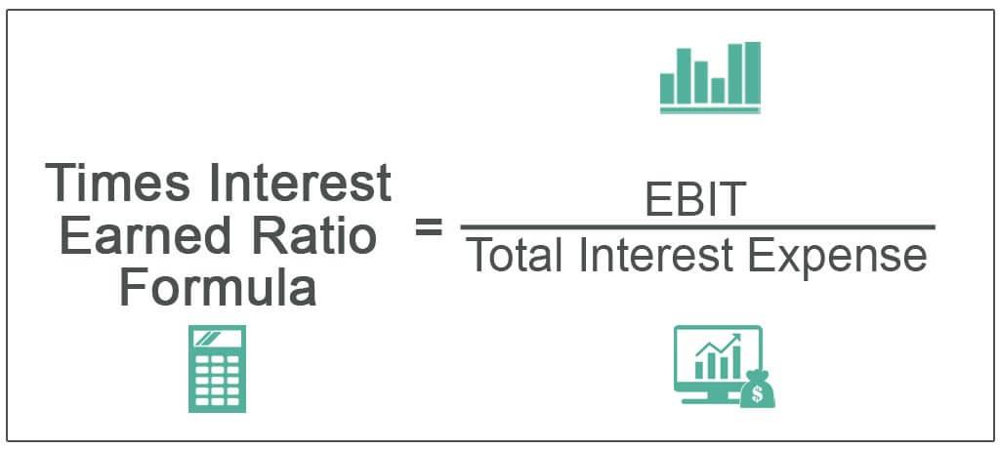

Financial analysis is a critical component of business management, serving as the foundation for sound decision-making and strategic planning. It involves the systematic examination of financial data, enabling businesses to evaluate performance, assess solvency, and make informed predictions about future growth. One of the pivotal tools in financial analysis is the Times Interest Earned (TIE) Ratio, which plays a vital role in debt management. The TIE Ratio is a measure of a company’s ability to meet its debt obligations, calculated by dividing a company’s earnings before interest and taxes (EBIT) by its interest expense. This ratio provides insights into a company’s financial health, indicating how many times the company can cover its interest obligations with its earnings. A higher TIE Ratio suggests a robust capacity to manage debt, which is a positive indicator of solvency.

In assessing a company's solvency and its ability to meet debt obligations, the TIE Ratio is indispensable. Solvency refers to a company’s ability to meet its long-term debts and financial obligations. By offering a quantitative measure of debt management capacity, the TIE Ratio aids investors, creditors, and management in evaluating financial risk and making decisions that align with the organization’s financial strategy. This assessment supports the creation of financial strategies that are sustainable and growth-oriented, ensuring that companies remain solvent even as market conditions fluctuate.



Algorithmic trading, an advanced domain in modern finance, utilizes computer programs to execute trading orders with pre-defined criteria. This approach is gaining traction due to its ability to process massive datasets at high speeds, enabling traders and financial institutions to optimize trading strategies and react swiftly to market changes. Financial ratios like the TIE Ratio are integral to these algorithms, serving as inputs that influence trading decisions and market predictions.

The objective of this article is to explore the intersection of financial analysis, the TIE Ratio, debt management, and algorithmic trading. By comprehensively understanding how these elements interact, businesses and financial professionals can leverage them for enhanced decision-making and strategic planning. The integration of traditional financial metrics with cutting-edge technology in trading signals a pivotal shift in financial strategy execution, promising a future where data-driven analysis is central to corporate finance.

## Table of Contents

## Understanding Times Interest Earned Ratio

The Times Interest Earned (TIE) Ratio is a critical financial metric used to assess a company's ability to meet its debt obligations. This ratio provides insight into how effectively a company can cover its interest expenses from its earnings before interest and taxes (EBIT). The TIE Ratio is calculated using the formula:

$$
\text{TIE Ratio} = \frac{\text{EBIT}}{\text{Interest Expense}}
$$

A higher TIE Ratio indicates a company is in a strong position to pay its interest obligations, while a lower ratio may signal potential challenges in meeting debt commitments. This metric is especially important for investors and creditors as it reflects the financial health and sustainability of the company.

The significance of the Times Interest Earned Ratio lies in its ability to convey the company's margin of safety in covering interest payments. A high ratio suggests a robust earnings buffer that protects against potential fluctuations in revenue or profit, thus offering reassurance about the company's solvency and operational stability. Conversely, a low TIE Ratio implies tight margins and a greater risk of financial distress, which could lead to limited borrowing capacity or future solvency issues.

In comparing the TIE Ratio with other financial ratios, it offers a distinct perspective. For instance, the Debt-to-Equity Ratio measures a company's financial leverage and the proportion of debt versus equity financing. It provides insight into the long-term financial structure but lacks the short-term operational performance details that TIE offers. Similarly, the Current Ratio assesses short-term [liquidity](/wiki/liquidity-risk-premium) by comparing current assets and liabilities, focusing on immediate solvency rather than the company's capacity to honor interest obligations through operating performance, as examined by the TIE Ratio.

Consider the following illustrative example: A company reports an EBIT of $500,000 and an annual interest expense of $100,000. The TIE Ratio is calculated as follows:

$$
\text{TIE Ratio} = \frac{500,000}{100,000} = 5
$$

This result indicates that the company earns five times its interest obligations, suggesting a comfortable leverage cushion and the ability to withstand economic downturns or unexpected financial setbacks. In practice, maintaining a TIE Ratio significantly above 1 is advisable to ensure that a company can meet its interest expenses consistently, even in times of reduced income or profitability.

## The Role of TIE in Debt Management

The Times Interest Earned (TIE) ratio is a critical metric in assessing a company’s capability to manage its debt obligations effectively. A high TIE ratio indicates that a company has a significant buffer between its earnings and interest expenses, which highlights its ability to pay interest on outstanding debt without compromising its financial stability. A robust TIE ratio fosters confidence among creditors and investors, suggesting that the company is less likely to default on its interest payments.

### Impact of TIE on Borrowing Power and Creditworthiness

The TIE ratio is a key determinant of a company's borrowing power and creditworthiness. Financial institutions and lenders often evaluate the TIE ratio when assessing the risk profile of a company. A higher TIE ratio generally implies stronger financial health, making it easier for a company to secure loans or credit at favorable terms. Conversely, a low TIE ratio could signal potential financial distress, prompting lenders to impose stricter borrowing terms or even reject loan applications.

### Influence on Corporate Finance Decisions

Corporate finance decisions are heavily influenced by the TIE ratio. A high TIE may encourage a company to pursue growth opportunities funded by debt, as their ability to service this debt is well-supported by their earnings. In contrast, a low TIE might lead companies to adopt more conservative financial strategies, such as reducing leverage or focusing on improving operational efficiency to enhance their earnings before interest and taxes (EBIT).

### Limitations of Relying Solely on TIE

While the TIE ratio is a valuable tool for assessing debt management, relying solely on it for financial analysis has limitations. It does not account for a company's liquidity position or its ability to generate cash flows, which are crucial aspects of managing debt. Moreover, the TIE ratio does not offer insights into future risks or potential changes in a company’s operating environment. Consequently, it should be used in conjunction with other financial ratios, such as debt-to-equity and current ratios, to provide a more comprehensive view of a company's financial health.

### Maintaining a Balanced TIE for Sustainable Debt Management

A balanced TIE ratio is essential for sustainable debt management. Companies should aim for a TIE ratio that is neither too high nor too low. An excessively high TIE ratio could imply that the company is under-leveraging, potentially missing out on growth and expansion opportunities through strategic borrowing. Conversely, a very low TIE ratio might indicate over-leveraging and increased financial risk. Achieving and maintaining a balanced TIE ratio ensures that companies can efficiently manage their debt while remaining agile and responsive to market opportunities.

## Implications of TIE in Financial Analysis

The Times Interest Earned (TIE) Ratio is a critical indicator for investors and creditors aiming to understand company risk. The TIE ratio, calculated as Earnings Before Interest and Taxes (EBIT) divided by Interest Expense, measures a company's ability to meet its debt obligations. A higher TIE suggests that a company can comfortably cover its interest expenses, signifying lower risk for creditors and potential investors.

Industry standards significantly affect the interpretation of the TIE ratio. In certain industries, high levels of debt might be common, leading to lower average TIE ratios. Conversely, industries with lower debt dependency might exhibit higher averages. Hence, industry benchmarks are vital for accurately assessing whether a company's TIE ratio is indicative of financial stability or concern.

Performance benchmarking involves comparing a company's TIE ratio against those of similar companies or industry averages. This comparison helps stakeholders identify whether the company has a competitive edge or may be overleveraged. A consistent or improving TIE over time can demonstrate strong financial management, whereas declining TIE ratios could suggest financial stress or increasing risk.

Fluctuations in TIE can be early indicators of financial health or distress. A rising TIE typically signifies improved profitability or reduced debt burden, both positive signals. On the other hand, a declining TIE might indicate reduced operational efficiency or increased financial leverage, necessitating further analysis.

To get a comprehensive view of corporate solvency, the TIE ratio should be used alongside other financial metrics. Key ratios such as the Debt-to-Equity Ratio, Current Ratio, and Quick Ratio provide complementary insights. For example, while the TIE offers a view of interest coverage, the Debt-to-Equity Ratio provides a perspective on the overall leverage, and the Current Ratio assesses short-term liquidity. Using a combination of these metrics allows for a nuanced analysis of a company's financial standing, aiding decision-makers in identifying potential risks and opportunities effectively.

## Algo Trading and Financial Ratios

Algorithmic trading, often referred to as algo trading, leverages computer algorithms to execute trading strategies at remarkable speed and with precision, minimizing manual intervention. The roots of algo trading stretch back to the late 20th century, but its importance has surged in the digital age due to advances in computational power and data analytics. Today, algo trading is a cornerstone in modern finance, given its ability to process vast amounts of data and execute trades in milliseconds, responding swiftly to market conditions.

In developing effective algo trading strategies, financial ratios, such as the Times Interest Earned (TIE) Ratio, play a crucial role. These ratios provide insights into a company's financial stability and performance, which can be essential in forming an algorithm's decision-making process. The TIE ratio, specifically, offers information regarding a firm's ability to cover its debt obligations with its earnings. Integrating such data into algorithms can aid in predicting market movements and optimizing trading decisions.

Artificial intelligence (AI) and [machine learning](/wiki/machine-learning) have further enriched the algo trading landscape by utilizing these financial ratios. Algorithms can analyze historical data, identify patterns, and predict potential future shifts in the market. For example, if a set of companies shows improved TIE ratios, an algorithm might predict sector growth and adjust investment strategies accordingly. This predictive capability facilitates the optimization of trading by preemptively adjusting portfolios to align with anticipated market trends.

A practical illustration of integrating TIE calculations into trading algorithms involves coding systems that continuously monitor financial data releases and adjust positions based on predefined criteria. Here's a simplified Python example of how TIE could be used in algorithmic decision-making:

```python
def calculate_tie(ebit, interest_expense):
    return ebit / interest_expense

def trading_strategy(company_data):
    for company in company_data:
        tie = calculate_tie(company['ebit'], company['interest_expense'])
        if tie > 2:  # Example threshold
            print(f"Consider increasing position in {company['name']}.")
        elif tie < 1:
            print(f"Consider reducing position in {company['name']}.")

company_data = [
    {'name': 'Company A', 'ebit': 1000000, 'interest_expense': 400000},
    {'name': 'Company B', 'ebit': 500000, 'interest_expense': 600000},
]

trading_strategy(company_data)
```

This code exemplifies a basic strategy where the algorithm evaluates each company's TIE and recommends trading actions based on thresholds, illustrating the blend of financial analysis with trading algorithms.

Looking ahead, the fusion of financial ratios and technological advancements is poised to significantly advance trading strategies. As AI continues to evolve, algorithms are expected to become more sophisticated, incorporating a broader array of financial metrics and macroeconomic indicators. This integration promises to enhance predictive accuracy and enable the development of more nuanced trading strategies. The convergence of financial analysis with technology will likely lead to more robust and adaptive trading systems, promoting efficiency and responsiveness in financial markets.

## Conclusion

The Times Interest Earned (TIE) Ratio is an essential component in financial analysis and debt management, primarily serving to gauge a company's ability to honor its debt commitments. By assessing how many times a company's earnings before interest and taxes (EBIT) can cover its interest expenses, TIE provides valuable insight into financial health, creditworthiness, and risk. This ratio plays a critical role in investment decisions and aids creditors and investors in evaluating the potential risk associated with lending or investing in a company.

Algorithmic trading, on the other hand, represents a significant advancement in financial strategies, leveraging computation to make real-time trading decisions. The intersection of TIE and [algorithmic trading](/wiki/algorithmic-trading) showcases the potential for financial ratios to feed into algorithms, enhancing predictive capabilities and optimizing market strategies. By integrating TIE into such algorithms, traders can assess a company's risk more accurately and adjust their trading strategies accordingly.

Balanced financial analysis becomes paramount in corporate decision-making, with TIE serving as a pivotal metric among others. It underscores the necessity for firms to maintain a comprehensive view of their financial stance, enabling them to navigate their debt management and investment decisions more effectively. The inclusion of TIE and similar ratios in robust financial planning is essential for achieving long-term stability and growth. Encouraging businesses to adopt a balanced and data-driven approach ensures that they are better equipped to face financial challenges and can capitalize on opportunities in the ever-evolving economic landscape. By harnessing TIE and financial ratios, companies can formulate informed strategies, mitigate risks, and ultimately foster financial resilience.

## References & Further Reading

[1]: Bing, L. (2020). ["Financial Ratios: A Guide"](https://corporatefinanceinstitute.com/resources/accounting/financial-ratios/). Wiley Finance Series.

[2]: Asness, C. S., et al. (2001). ["Do Hedge Funds Hedge?"](https://papers.ssrn.com/sol3/papers.cfm?abstract_id=252810) The Journal of Portfolio Management, 28(1).

[3]: Fabozzi, F. J., & Drake, P. P. (Eds.). (2009). ["The Complete Guide to Understanding and Using the Times Interest Earned Ratio."](https://en.wikipedia.org/wiki/Financial_risk_management) Handbook of Finance.

[4]: Lo, A. W., & MacKinlay, A. C. (1999). ["A Non-Random Walk Down Wall Street."](https://www.jstor.org/stable/j.ctt7tccx) Princeton University Press.

[5]: Hull, J. (2017). ["Risk Management and Financial Institutions"](https://books.google.com/books/about/Risk_Management_and_Financial_Institutio.html?id=1J1QDwAAQBAJ). Wiley Finance Series.