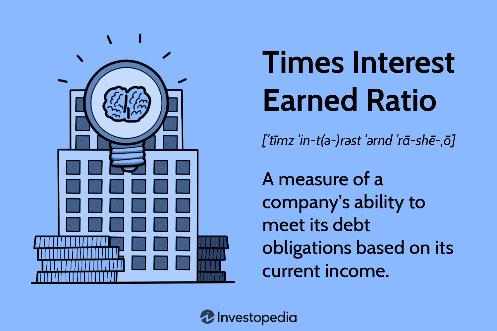

## Table of Contents

## What is the Times Interest Earned (TIE) ratio?

The Times Interest Earned (TIE) ratio is a financial measure that shows how well a company can pay its interest expenses on its debt. It is calculated by dividing a company's earnings before interest and taxes (EBIT) by its interest expenses. A higher TIE ratio means the company is in a better position to meet its interest obligations, which is a good sign for investors and creditors.

This ratio is important because it helps people understand if a company is making enough money to cover the cost of borrowing. If the TIE ratio is low, it might mean the company is struggling to pay its interest, which could be a warning sign. On the other hand, a high TIE ratio suggests that the company is financially healthy and can easily handle its debt payments.

## How is the Times Interest Earned ratio calculated?

The Times Interest Earned (TIE) ratio is figured out by taking a company's earnings before interest and taxes (EBIT) and dividing it by the interest expenses the company has to pay. EBIT is like the money a company makes before it pays any interest on loans or taxes to the government. Interest expenses are the costs of borrowing money.

This calculation helps show if a company can comfortably pay the interest on its debts. If the TIE ratio is high, it means the company is doing well and can easily cover its interest payments. But if the ratio is low, it might mean the company is having trouble and could struggle to pay its debts.

## Why is the Times Interest Earned ratio important for businesses?

The Times Interest Earned (TIE) ratio is really important for businesses because it helps them see if they can pay the interest on their loans. This ratio tells a business if it's making enough money to cover the cost of borrowing. If the TIE ratio is high, it means the business is doing well and can easily handle its debt payments. But if the ratio is low, it might mean the business is struggling and could have trouble paying its debts.

Knowing the TIE ratio is also helpful for people who might want to lend money to the business or invest in it. If a business has a high TIE ratio, lenders and investors feel more confident because it shows the business can pay back its loans. A low TIE ratio can be a warning sign for lenders and investors, making them think twice before giving money to the business. So, the TIE ratio is a key number that helps everyone understand how financially healthy a business is.

## What does a high Times Interest Earned ratio indicate about a company's financial health?

A high Times Interest Earned (TIE) ratio shows that a company is in good financial shape. It means the company is making a lot more money than it needs to pay the interest on its loans. When a company's TIE ratio is high, it's a sign that the business is doing well and can easily handle its debt payments. This makes the company look strong and reliable to people who might want to lend it money or invest in it.

Having a high TIE ratio also gives the company more freedom to make important decisions. It can take on new projects or expand its business without worrying too much about debt. This can help the company grow and become even more successful. So, a high TIE ratio is a good thing for a company because it shows it's financially healthy and has a solid future ahead.

## How does a high TIE ratio affect a company's ability to borrow money?

A high Times Interest Earned (TIE) ratio makes it easier for a company to borrow money. When lenders see a high TIE ratio, they feel more confident that the company can pay back the loans. This is because the high ratio shows the company is making enough money to cover its interest payments and then some. So, lenders are more likely to give the company money at better interest rates because they see it as a safer bet.

Having a high TIE ratio can also help a company get bigger loans. Lenders might be willing to lend more money because they believe the company can handle larger debts. This can be really helpful for a company that wants to grow or start new projects. A high TIE ratio shows the company is financially strong, which makes it easier to get the money it needs to keep moving forward.

## Can a high TIE ratio be misleading, and if so, how?

Yes, a high TIE ratio can be misleading sometimes. It might look like the company is doing great because it can pay its interest easily, but there could be other problems. For example, if the company's earnings are high just for a short time because of a one-time event, the TIE ratio might look good but not show the real situation. Also, if the company is using a lot of its earnings to pay interest, it might not have enough money left for other important things like growing the business or fixing problems.

Another way a high TIE ratio can be misleading is if the company is using accounting tricks to make its earnings look better. They might be moving money around or using other methods to make their numbers look good on paper, but this doesn't mean the company is really doing well. It's important to look at other financial numbers and understand the whole picture before deciding if a high TIE ratio really means the company is in good shape.

## What industries typically have higher Times Interest Earned ratios and why?

Industries that usually have higher Times Interest Earned ratios are ones that make a lot of money and don't need to borrow much. For example, technology companies often have high TIE ratios because they can make big profits from their products and services. They also might not need to borrow as much money because they can use their profits to grow their business. Another industry with high TIE ratios is pharmaceuticals. These companies can have high earnings from selling medicines and treatments, and they often have steady income which helps them pay interest easily.

On the other hand, industries like utilities and real estate might also have high TIE ratios, but for different reasons. Utility companies, like those that provide electricity or water, have high TIE ratios because they have stable earnings from customers who need their services all the time. This steady income helps them cover their interest payments. Real estate companies can have high TIE ratios if they own properties that bring in a lot of rent money, which they can use to pay off their loans. So, industries with high TIE ratios are often those with strong, steady earnings and less need for borrowing.

## How does the TIE ratio compare to other financial ratios in assessing a company's solvency?

The Times Interest Earned (TIE) ratio is one way to see if a company can pay the interest on its loans. It's a good measure because it shows how much money a company makes compared to what it needs to pay in interest. But it's not the only way to check a company's solvency. Other ratios, like the Debt to Equity ratio, look at how much a company owes compared to what it owns. This can tell you if a company is using too much borrowed money, which might be risky.

Another important ratio is the Interest Coverage Ratio, which is similar to the TIE ratio but can be used in different ways. The Interest Coverage Ratio also looks at earnings before interest and taxes (EBIT) but might include other adjustments. The Current Ratio and Quick Ratio are also useful. They show if a company has enough money to pay its short-term debts. Each of these ratios gives a different view of a company's financial health, and using them together gives a fuller picture than using just one.

So, while the TIE ratio is helpful for understanding if a company can pay its interest, it's best to look at it along with other ratios. This way, you can get a better idea of how strong a company is and if it can handle its debts over time. No single ratio tells the whole story, but together, they help you see if a company is on solid ground or if it might be in trouble.

## What are the historical trends in TIE ratios for major industries?

Over the years, TIE ratios have shown different trends in major industries. For example, in the technology industry, TIE ratios have generally been high. This is because tech companies often have big profits from their products and services. They also don't need to borrow as much money because they can use their profits to grow. In the early 2000s, tech companies saw their TIE ratios drop during the dot-com bubble burst, but they bounced back and have stayed high as the industry grew stronger.

In the utility industry, TIE ratios have been more stable. Utility companies, like those that provide electricity or water, have steady income from customers who need their services all the time. This steady income helps them keep their TIE ratios high, even during tough economic times. However, during the 2008 financial crisis, some utility companies saw their TIE ratios dip slightly because of higher borrowing costs, but they recovered quickly.

The pharmaceutical industry has also shown strong TIE ratios historically. These companies often have high earnings from selling medicines and treatments, which helps them easily cover their interest payments. During the late 1990s and early 2000s, pharmaceutical companies had very high TIE ratios due to strong sales of blockbuster drugs. More recently, as patents expired and new drugs came to market, there have been some fluctuations, but overall, the industry has maintained solid TIE ratios.

## How do economic cycles impact the Times Interest Earned ratio?

Economic cycles can change the Times Interest Earned ratio a lot. When the economy is doing well, companies usually make more money. This means their earnings before interest and taxes (EBIT) go up, which can make their TIE ratio higher. They can pay the interest on their loans more easily because they're making more money. But when the economy is not doing well, like during a recession, companies might make less money. Their EBIT goes down, and it can be harder for them to pay the interest on their loans. This can make their TIE ratio lower, which might worry lenders and investors.

Different industries can feel the effects of economic cycles in different ways. For example, industries like technology and consumer goods might see their TIE ratios drop a lot during a bad economy because people buy less of their products. But industries like utilities and healthcare might not see as big a drop in their TIE ratios. This is because people still need electricity, water, and medicine even when the economy is bad. So, while economic cycles can impact the TIE ratio, the size of the impact can be different for each industry.

## What are the limitations of using the TIE ratio as a sole measure of financial stability?

Using the TIE ratio by itself to check a company's financial stability can be tricky. The TIE ratio only looks at how well a company can pay the interest on its loans. It doesn't tell you about other important things like if the company can pay back the actual loan amount or if it has enough money to keep running day-to-day. Also, the TIE ratio can be affected by one-time events or accounting tricks, which might make a company look better or worse than it really is. So, if you only use the TIE ratio, you might miss other signs that the company is in trouble or doing well.

It's also important to know that the TIE ratio doesn't show the whole picture of a company's financial health. For example, a company might have a high TIE ratio but still be struggling because it has a lot of other debts or costs. Or, a company might have a low TIE ratio but be okay because it has other ways to make money or pay its bills. That's why it's better to look at the TIE ratio along with other financial ratios and information. This way, you can get a fuller understanding of how stable a company really is.

## How can companies improve their Times Interest Earned ratio?

Companies can improve their Times Interest Earned ratio by making more money. They can do this by selling more of their products or services, or by finding ways to make their business more efficient. For example, they might cut costs or find cheaper ways to make their products. When a company makes more money, its earnings before interest and taxes (EBIT) go up. This makes the TIE ratio higher because the company can pay the interest on its loans more easily.

Another way to improve the TIE ratio is by reducing the amount of debt a company has. If a company pays off some of its loans, it will have less interest to pay. This makes the TIE ratio go up because the company's interest expenses go down. Companies can also try to get loans with lower interest rates. When they pay less interest, it's easier for them to cover their interest payments with their earnings. Both of these ways can help a company have a better TIE ratio and show that it's in a stronger financial position.

## What is the Times Interest Earned Ratio and how do you understand it?

The Times Interest Earned (TIE) Ratio is a critical financial metric used to assess a company's ability to meet its debt obligations. This ratio provides insight into how effectively a company can cover its interest expenses from its earnings before interest and taxes (EBIT). The TIE Ratio is calculated using the formula:

$$
\text{TIE Ratio} = \frac{\text{EBIT}}{\text{Interest Expense}}
$$

A higher TIE Ratio indicates a company is in a strong position to pay its interest obligations, while a lower ratio may signal potential challenges in meeting debt commitments. This metric is especially important for investors and creditors as it reflects the financial health and sustainability of the company.

The significance of the Times Interest Earned Ratio lies in its ability to convey the company's margin of safety in covering interest payments. A high ratio suggests a robust earnings buffer that protects against potential fluctuations in revenue or profit, thus offering reassurance about the company's solvency and operational stability. Conversely, a low TIE Ratio implies tight margins and a greater risk of financial distress, which could lead to limited borrowing capacity or future solvency issues.

In comparing the TIE Ratio with other financial ratios, it offers a distinct perspective. For instance, the Debt-to-Equity Ratio measures a company's financial leverage and the proportion of debt versus equity financing. It provides insight into the long-term financial structure but lacks the short-term operational performance details that TIE offers. Similarly, the Current Ratio assesses short-term [liquidity](/wiki/liquidity-risk-premium) by comparing current assets and liabilities, focusing on immediate solvency rather than the company's capacity to honor interest obligations through operating performance, as examined by the TIE Ratio.

Consider the following illustrative example: A company reports an EBIT of $500,000 and an annual interest expense of $100,000. The TIE Ratio is calculated as follows:

$$
\text{TIE Ratio} = \frac{500,000}{100,000} = 5
$$

This result indicates that the company earns five times its interest obligations, suggesting a comfortable leverage cushion and the ability to withstand economic downturns or unexpected financial setbacks. In practice, maintaining a TIE Ratio significantly above 1 is advisable to ensure that a company can meet its interest expenses consistently, even in times of reduced income or profitability.

## References & Further Reading

[1]: Bing, L. (2020). ["Financial Ratios: A Guide"](https://corporatefinanceinstitute.com/resources/accounting/financial-ratios/). Wiley Finance Series.

[2]: Asness, C. S., et al. (2001). ["Do Hedge Funds Hedge?"](https://papers.ssrn.com/sol3/papers.cfm?abstract_id=252810) The Journal of Portfolio Management, 28(1).

[3]: Fabozzi, F. J., & Drake, P. P. (Eds.). (2009). ["The Complete Guide to Understanding and Using the Times Interest Earned Ratio."](https://en.wikipedia.org/wiki/Financial_risk_management) Handbook of Finance.

[4]: Lo, A. W., & MacKinlay, A. C. (1999). ["A Non-Random Walk Down Wall Street."](https://www.jstor.org/stable/j.ctt7tccx) Princeton University Press.

[5]: Hull, J. (2017). ["Risk Management and Financial Institutions"](https://books.google.com/books/about/Risk_Management_and_Financial_Institutio.html?id=1J1QDwAAQBAJ). Wiley Finance Series.