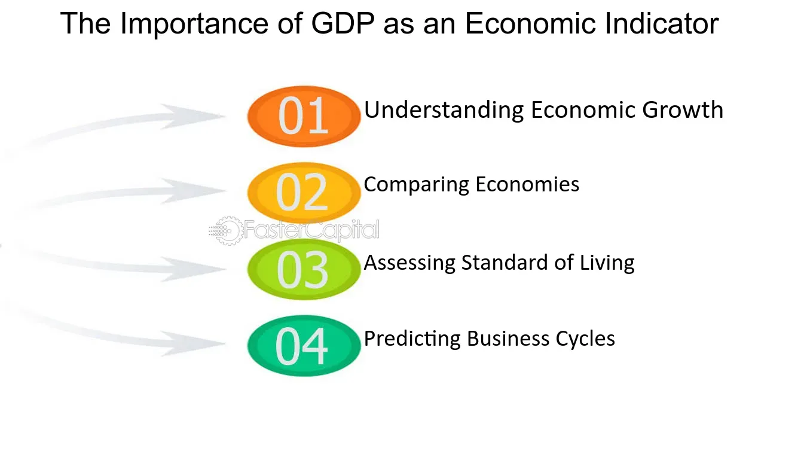

## Table of Contents

## What is GDP?

GDP stands for Gross Domestic Product. It is the total value of all goods and services produced within a country's borders in a specific time period, usually a year. GDP helps us understand how well a country's economy is doing. If the GDP is growing, it means the economy is getting bigger and more things are being produced.

There are different ways to calculate GDP. One way is to add up the value of all final goods and services produced. This means we only count the value of the final product, not the parts that go into making it. Another way is to add up all the money spent on goods and services in the country. This includes spending by consumers, businesses, the government, and money from other countries.

GDP is important because it gives us a big picture of the economy. It helps governments and businesses make decisions. But, it's not perfect. GDP doesn't tell us everything about how people are doing. For example, it doesn't show if the wealth is shared fairly or if people are happy. So, while GDP is a useful tool, it's just one part of understanding an economy.

## How is GDP calculated?

GDP can be calculated in three main ways: the production approach, the income approach, and the expenditure approach. The production approach adds up the value of all goods and services produced in a country. This method focuses on the output and makes sure not to count the value of intermediate goods, which are used to make final products, more than once. The income approach adds up all the income earned by everyone in the country, including wages, profits, and taxes minus subsidies. This way, it looks at the money people and businesses make from producing goods and services.

The expenditure approach, which is the most commonly used method, adds up all the spending on goods and services within the country. This includes four main parts: consumer spending, which is what people spend on things like food and clothes; business spending on things like new factories and equipment; government spending on things like schools and roads; and net exports, which is the value of a country's exports minus its imports. By adding up all these different types of spending, we get the total GDP. Each of these methods should theoretically give the same GDP number, but in practice, there can be small differences due to data collection and other factors.

## Why is GDP important for a country?

GDP is important for a country because it shows how big and healthy the economy is. When the GDP goes up, it means more goods and services are being made, and people are spending more money. This can mean that businesses are doing well, and more jobs might be created. Governments use GDP to make decisions about things like taxes and spending on public services like schools and hospitals. If the GDP is growing, the government might feel good about spending more money on these things.

But GDP is not perfect. It doesn't tell us everything about how people are living. For example, it doesn't show if the money is shared fairly among everyone or if people are happy. It also doesn't count things like volunteer work or taking care of family, which are important but don't have a price tag. So, while GDP is a useful tool to understand the economy, it's just one part of the picture. Other things, like how people feel about their lives and the environment, are also important to consider.

## What are the different types of GDP?

There are three main types of GDP: nominal GDP, real GDP, and GDP per capita. Nominal GDP is the total value of all goods and services produced in a country using current prices. This means if prices go up because of inflation, the nominal GDP will also go up, even if the amount of goods and services stays the same. Real GDP, on the other hand, adjusts for inflation. It uses prices from a base year to show how much the economy is growing in terms of actual output, not just higher prices. This gives a better idea of how the economy is really doing.

GDP per capita is another important type of GDP. It is calculated by dividing the total GDP of a country by its population. This gives us an idea of how much each person in the country would get if the GDP were shared equally. GDP per capita helps us compare the economic well-being of different countries, because it takes into account the size of the population. A country with a high GDP might not have a high GDP per capita if it has a large population.

## How does GDP affect the standard of living?

GDP can affect the standard of living because it shows how much a country is producing. When GDP goes up, it usually means more jobs and more money for people to spend on things they need and want. This can make life better because people can buy more food, better homes, and have more fun. But, it's not just about having more money. If the GDP grows, the government might have more money to spend on things like schools and hospitals, which can also make life better for everyone.

But, GDP doesn't tell the whole story about how people are living. Even if the GDP is high, not everyone might be doing well. If the money is not shared fairly, some people might still be poor or unhappy. Also, GDP doesn't count things like clean air or time spent with family, which are important for a good life. So, while a growing GDP can help improve the standard of living, it's just one part of the picture. Other things, like how fair the society is and how people feel about their lives, are also important.

## What are the limitations of GDP as an economic indicator?

GDP is a useful tool to measure how big an economy is, but it has some limitations. One big problem is that GDP doesn't show if the money is shared fairly among people. A country might have a high GDP, but if a few people have most of the money, many others might still be poor. GDP also doesn't count things that are important but don't have a price, like volunteer work or spending time with family. These things can make life better but aren't included in GDP numbers.

Another limitation is that GDP doesn't tell us about the environment. If a country cuts down a lot of trees to make more products, the GDP might go up, but the environment gets worse. Also, GDP doesn't show if people are happy or feel good about their lives. Someone might have a lot of money but still be unhappy. So, while GDP is good for understanding how much an economy is producing, it doesn't give the full picture of how well people are doing or how sustainable the growth is.

## How does GDP growth relate to economic development?

GDP growth is often seen as a sign of economic development. When GDP grows, it means that a country is producing more goods and services. This can lead to more jobs and more money for people to spend. Businesses might invest more, and the government might have more money to spend on things like schools and hospitals. All these things can make life better for people and help a country develop.

But, GDP growth is not the same as economic development. Economic development is about more than just making more money. It's about improving the quality of life for everyone in the country. GDP doesn't show if the money is shared fairly or if people are happy. It also doesn't count things like a clean environment or good health, which are important for development. So, while GDP growth can help with economic development, it's just one part of the story.

## Can GDP be used to compare the economic performance of different countries?

GDP can be used to compare the economic performance of different countries, but it has to be done carefully. When we look at the GDP of different countries, we need to think about things like the size of the country and the number of people living there. For example, a big country with a lot of people might have a high GDP, but that doesn't mean each person is doing well. To get a better idea, we can use GDP per capita, which divides the total GDP by the number of people in the country. This way, we can see how much money each person would get if the GDP were shared equally.

But even GDP per capita has its limits. It doesn't tell us if the money is shared fairly among people or if everyone has a good life. Some countries might have a high GDP per capita, but still have a lot of poor people. Also, GDP doesn't count things like clean air, good health, or happiness, which are important for comparing how well countries are doing. So, while GDP can help us understand some parts of a country's economy, it's not the whole story. We need to look at other things too to really compare how different countries are doing.

## What role does GDP play in government policy-making?

GDP is really important for governments when they make decisions about policies. When the GDP is growing, it means the country is making more stuff and people are spending more money. This can make the government feel good about spending more on things like schools, hospitals, and roads. If the GDP is not growing, the government might need to be careful with money and think about how to help the economy grow. They might change taxes or spend money in different ways to try and make the GDP go up.

But, GDP is not perfect. It doesn't tell the whole story about how people are doing. For example, it doesn't show if everyone is getting a fair share of the money or if people are happy. So, while GDP is a big part of what governments look at when making policies, they also need to think about other things. Things like how fair the society is, how people feel about their lives, and how the environment is doing are also important. Governments need to use GDP along with other information to make the best decisions for everyone.

## How does GDP impact global economic relations?

GDP impacts global economic relations because it shows how big and strong a country's economy is. When a country has a high GDP, other countries might want to trade with it more. They might also invest money in that country because they think it's a good place to make more money. Countries with high GDPs can also help other countries by giving them money or resources. This can make them important in global politics and help them have more say in how the world works.

But, GDP is not the only thing that matters in global economic relations. Countries also look at other things like how fair the economy is and how people are living. A country with a high GDP might not be a good partner if it doesn't treat its people well or if it's not good for the environment. So, while GDP is important, countries need to think about many things when they decide how to work together. This helps them make the world a better place for everyone.

## What are the criticisms of using GDP as a measure of national well-being?

People often criticize using GDP as a measure of national well-being because it doesn't show the whole picture of how people are doing. GDP only counts the value of goods and services made in a country, but it doesn't tell us if the money is shared fairly. A country might have a high GDP, but if a few people have most of the money, many others might still be poor. GDP also doesn't count things that are important but don't have a price, like volunteer work, spending time with family, or having clean air. These things can make life better but aren't included in GDP numbers.

Another problem with GDP is that it doesn't show if people are happy or feel good about their lives. Someone might have a lot of money but still be unhappy. GDP also doesn't take into account the environment. If a country cuts down a lot of trees to make more products, the GDP might go up, but the environment gets worse. So, while GDP is good for understanding how much an economy is producing, it doesn't give the full picture of how well people are doing or how sustainable the growth is.

## How have alternative measures to GDP been developed and why?

People have come up with other ways to measure how well a country is doing because GDP doesn't tell the whole story. One popular alternative is the Human Development Index (HDI), which was made by the United Nations. The HDI looks at things like how long people live, how much they know, and how much money they have. This helps us see if people are living good lives, not just if the country is making a lot of stuff. Another measure is the Genuine Progress Indicator (GPI), which tries to count things that make life better but don't have a price, like clean air and time spent with family. It also takes away things that make life worse, like pollution and crime.

These alternative measures were created because people wanted a better way to understand how well a country is doing. GDP only looks at how much money is being made, but it doesn't show if everyone is getting a fair share or if people are happy. It also doesn't count important things like the environment or health. By using measures like HDI and GPI, we can get a fuller picture of what life is like for people in a country. This helps governments and others make better decisions about how to help everyone live better lives.

## What is the relationship between Gross Domestic Product and Economic Growth?

Gross Domestic Product (GDP) is a fundamental measure of a country's economic performance, representing the total monetary value of all finished goods and services produced within a country's borders in a specific time period. It is a critical indicator for assessing the economic health of a nation and serves as a benchmark for economic analysis and comparison.

### Calculation Methods of GDP

There are three primary methods for calculating GDP: production (or output) approach, income approach, and expenditure approach. Each of these methods offers a unique perspective on the economic activities within a country.

1. **Production (Output) Method**: This method calculates GDP by summing the value added at each stage of production. Value added is the difference between the value of outputs (goods/services) and the value of intermediate inputs (raw materials, services).
$$
   \text{GDP}_{\text{Production}} = \sum (\text{Value of Output} - \text{Value of Intermediate Consumption})

$$

2. **Income Method**: This approach calculates GDP by summing up all incomes earned by factors of production in the economy, including wages, rents, interests, and profits.
$$
   \text{GDP}_{\text{Income}} = \text{Wages} + \text{Rent} + \text{Interest} + \text{Profit} + \text{Taxes} - \text{Subsidies}

$$

3. **Expenditure Method**: GDP is computed by totaling the expenditures on all finished goods and services produced within a country. It is typically represented by the formula:
$$
   \text{GDP}_{\text{Expenditure}} = C + I + G + (X - M)

$$

   where $C$ represents consumption, $I$ stands for investment, $G$ is government spending, and $(X - M)$ denotes net exports (exports minus imports).

### Importance of GDP as a Measure of Economic Health

GDP is a key indicator for evaluating the economic health and performance of a country. A growing GDP signifies a healthy, expanding economy, while a declining GDP may indicate economic troubles. The importance of GDP lies in its ability to:

- **Assess Economic Performance**: GDP provides a broad measure of overall economic activity and performance.
- **Guide Policy-Making**: Policymakers use GDP data to inform fiscal and monetary policies, aiming to stimulate growth or curb inflation as necessary.
- **Inform Investment Decisions**: Investors analyze GDP trends to evaluate the economic environment, making decisions about where to allocate resources based on the trajectory of economic growth.
- **Enable International Comparisons**: By standardizing GDP calculations, countries can be compared economically, providing insights into relative productivity and living standards.

### GDP's Role in Investment and Policy-Making Decisions

GDP plays a crucial role in shaping both investment and policy-making decisions. Investors rely on GDP data to assess the economic landscape, using growth rates to predict potential business cycles and adjust portfolio allocations accordingly. For policymakers, GDP serves as a guide to economic health, influencing decisions on interest rates, taxation, government spending, and regulatory measures.

While GDP remains an indispensable tool for gauging economic progress, it does have limitations, such as its inability to account for income distribution, environmental degradation, and the uncounted informal economy. Despite these shortcomings, GDP remains a central element in economic analysis, driving both strategic investment and policy development.

In summary, understanding GDP and its measurement methodologies is essential for comprehending the broader economic picture, enabling well-informed economic and investment strategies.

## What are the key indicators for the economic pulse?

Consumer Price Index (CPI), Producer Price Index (PPI), and unemployment rates are vital economic indicators that offer insights into the economy's overall health and trajectory.

### Consumer Price Index (CPI)

CPI measures the average change over time in the prices paid by urban consumers for a market basket of consumer goods and services. It is a critical indicator for evaluating inflationary trends within an economy. Inflation, when calculated using CPI, highlights how living costs are evolving, which can influence consumer spending behavior, wage negotiations, and monetary policy decisions made by central banks. In mathematical terms, the CPI is typically calculated as:

$$
\text{CPI} = \left( \frac{\text{Cost of Basket in Current Year}}{\text{Cost of Basket in Base Year}} \right) \times 100
$$

A rising CPI indicates inflationary pressures, while a declining CPI suggests deflation.

### Producer Price Index (PPI)

PPI measures the average change over time in the selling prices received by domestic producers for their output. Unlike CPI, which focuses on the prices paid by consumers, PPI looks at what producers get, which can often serve as a leading indicator for CPI as changes in PPI trickle down to consumer prices. PPI data is crucial for understanding the direction of future retail price changes and assessing production cost trends. An increase in PPI suggests that input costs are rising for producers, potentially leading to increased consumer prices, barring any compression in producers' profit margins.

### Unemployment Rates

The unemployment rate is the percentage of the labor force that is jobless and actively seeking employment. It serves as a coincident indicator, providing real-time data about economic performance. High unemployment rates can indicate economic distress, as they can lead to reduced consumer spending and slower economic growth. Conversely, low unemployment rates usually signal a robust economy, often leading to inflationary pressures due to increased demand for goods and services. The unemployment rate can be calculated using the formula:

$$
\text{Unemployment Rate} = \left( \frac{\text{Number of Unemployed}}{\text{Labor Force}} \right) \times 100
$$

### Comprehensive Economic Insights

The combined analysis of CPI, PPI, and unemployment rates provides a nuanced view of economic conditions. CPI and PPI together inform about current inflationary trends, while unemployment rates highlight labor market conditions. These indicators collectively aid in assessing the economic pulse and aiding policymakers, economists, and traders in developing informed perspectives and strategies. Understanding these indicators helps in anticipating central bank monetary policies, such as [interest rate](/wiki/interest-rate-trading-strategies) adjustments, which further influence economic activities and financial market responses.

## References & Further Reading

1. **"Economic Indicators: Understand Them or Pay The Price" by Bernard Baumohl** - This book is a comprehensive guide to understanding the role of economic indicators in assessing economic performance and predicting future economic conditions. It provides detailed explanations and real-world examples that can enhance your understanding of both GDP and other vital indicators like CPI and unemployment rates.

2. **"Gross Domestic Product: A Brief but Affectionate History" by Diane Coyle** - This book offers an insightful analysis of GDP, its calculation methods, and its importance as a measure of economic health. Coyle critically examines GDP's strengths and limitations, proposing a more nuanced understanding of economic development.

3. **"Algorithmic Trading: Winning Strategies and Their Rationale" by Ernie Chan** - For an introduction to the world of algorithmic trading and its reliance on economic data, Chan's book provides practical insights into the development and implementation of algorithmic trading systems, including strategies that utilize economic indicators.

4. **"Macroeconomics" by N. Gregory Mankiw** - This textbook is a staple for understanding the broader economic environment, offering in-depth coverage of various macroeconomic indicators, including GDP. Mankiw's work explains how these indicators impact investment and policy-making decisions.

5. **"Beyond GDP: Measuring What Counts for Economic and Social Performance" by Joseph E. Stiglitz, Jean-Paul Fitoussi, Martine Durand** - Stiglitz and his co-authors explore the limitations of GDP as a measure of economic health, advocating for alternative metrics that offer a more holistic view of economic well-being.

6. **"Instruments of Monetary Policy" by Benjamin M. Friedman** - This paper provides insights into how economic indicators influence monetary policy, which is crucial for understanding market dynamics and the role of different economic metrics in shaping investment strategies.

7. **Research Papers from the National Bureau of Economic Research (NBER)** - The NBER is a leading resource for recent studies on economic indicators and algorithmic trading. Their extensive range of working papers and published articles can offer deeper insights into cutting-edge research in these areas.

8. **Python for Finance: Analyze Big Financial Data" by Yves Hilpisch** - This book is highly recommended for those interested in applying Python programming to the analysis of economic data, an essential skill for implementing algorithmic trading strategies effectively. 

9. **"The Handbook of Economic Indicators for Policy Making" by United Nations** - This handbook provides guidelines on how economic indicators are used in policy-making. It is essential for understanding the relationship between various indicators and their impact on economic strategy development. 

These resources offer foundational knowledge and advanced insights into economic indicators and [algorithmic trading](/wiki/algorithmic-trading), essential for both novice and experienced practitioners in financial markets.

