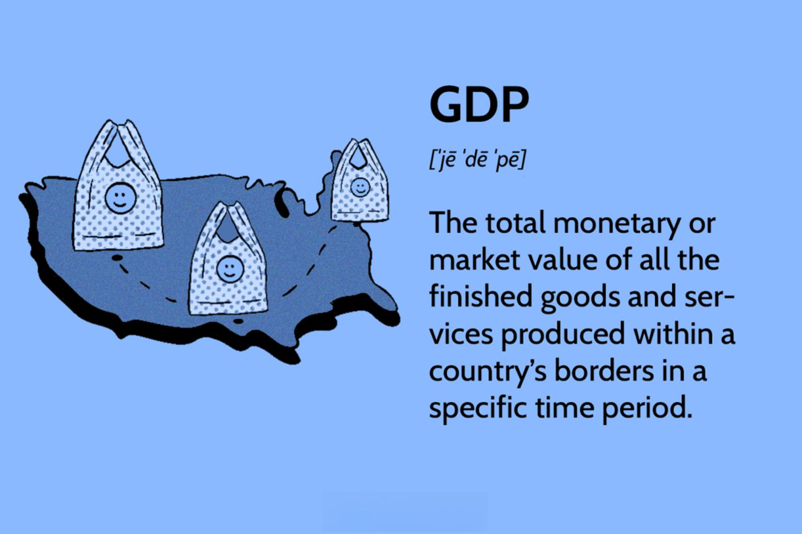

Economic indicators are vital tools used by policymakers, analysts, and investors to assess the health and trajectory of financial markets and the broader economy. They serve as signals about the economic environment's current state and future direction, profoundly influencing economic growth. Among these indicators, Gross Domestic Product (GDP) stands out as a primary measure of a country's economic activity and health. GDP quantifies the total value of all goods and services produced over a specific period, offering insights into economic performance and growth potential.

GDP is widely regarded as the cornerstone of economic analysis due to its comprehensive nature. It is pivotal for government and central bank policymakers, enabling them to craft fiscal and monetary policies that foster economic stability and growth. Additionally, businesses and investors closely monitor GDP figures to make informed decisions about investments, expansions, and market strategies. A robust GDP growth rate is typically associated with a healthy economy, driving investments and policy decisions that further stimulate expansion.



Algorithmic trading has emerged as a transformative force in financial markets, fundamentally altering how trades are executed. This trading method relies heavily on economic indicators, including GDP, for formulating strategies and making real-time decisions. Algorithmic trading systems, which use complex mathematical models and algorithms, process vast amounts of economic data to identify patterns and predict market movements. These systems execute trades at speeds and volumes impossible for human traders, leveraging economic indicators to optimize profitability and manage risk.

Algorithmic trading relies on timely and accurate economic data to anticipate market fluctuations and adjust trading strategies accordingly. For instance, significant changes in GDP figures can precipitate swift shifts in market sentiment, prompting algorithmic traders to adjust portfolios or exploit short-term price movements. This reliance underscores the critical importance of economic indicators in not only assessing economic health but also shaping dynamic trading strategies that respond to evolving market conditions.

## Table of Contents

## Understanding Economic Indicators

Economic indicators are essential statistical measures that provide insights into the economic performance and future economic activity of a country or region. These indicators are vital for economists, investors, policymakers, and business leaders as they provide context for assessing economic conditions, implementing monetary policy, and making informed business or investment decisions.

### Definition and Importance

Economic indicators are quantitative metrics that reflect a country's economic stability and health. They come in various forms, including data on employment, inflation, industrial production, and consumer spending. These indicators are crucial as they guide decision-making processes across various sectors of the economy. By analyzing changes in these indicators over time, stakeholders can forecast economic trends, gauge economic progress, and determine appropriate fiscal or monetary policies.

### Categories of Economic Indicators

Economic indicators are commonly classified into three categories based on their timing in relation to the economic cycle: leading, lagging, and coincident indicators.

1. **Leading Indicators**: These indicators change before the economy starts to follow a particular pattern or trend. They are predictive by nature and are used to anticipate future economic activities. Examples include stock market returns, manufacturing orders, and new business startups. Leading indicators help in predicting economic conditions, allowing businesses and governments to take proactive measures.

2. **Lagging Indicators**: Unlike leading indicators, lagging indicators change after the economy has already begun following a particular trend. They confirm patterns that have previously formed. Common lagging indicators include unemployment rates, corporate profits, and labor costs. By analyzing lagging indicators, analysts confirm whether the predicted changes from leading indicators have occurred.

3. **Coincident Indicators**: These indicators move in line with the current economic conditions. They provide real-time data about the state of the economy. Examples include Gross Domestic Product (GDP), retail sales, and industrial production. Coincident indicators are valuable for assessing the current economic environment at any given time.

### Usage in Predicting Economic Conditions

Economic indicators are fundamental tools for predicting economic conditions. By combining various indicators, analysts can develop models to forecast economic trends and cycles. Here's a simple illustration of using Python to analyze economic indicators:

```python
import pandas as pd
import matplotlib.pyplot as plt

# Suppose we have a DataFrame `economic_data` with columns 'Leading', 'Lagging', 'Coincident'
# representing different economic indicators over time

# Load the data
economic_data = pd.read_csv('economic_data.csv')

# Plot the indicators to visualize their relationship to the economic cycle
plt.figure(figsize=(10, 6))
plt.plot(economic_data['Date'], economic_data['Leading'], label='Leading Indicator')
plt.plot(economic_data['Date'], economic_data['Lagging'], label='Lagging Indicator')
plt.plot(economic_data['Date'], economic_data['Coincident'], label='Coincident Indicator')
plt.xlabel('Date')
plt.ylabel('Indicator Value')
plt.title('Economic Indicators Over Time')
plt.legend()
plt.show()
```

This code snippet visualizes how each category of economic indicators can be tracked over time, providing insights into past, current, and potential future economic performance. By analyzing such data, stakeholders can adjust their policies and strategies to mitigate risks and capitalize on potential economic shifts.

## Gross Domestic Product and Economic Growth

Gross Domestic Product (GDP) is a fundamental measure of a country's economic performance, representing the total monetary value of all finished goods and services produced within a country's borders in a specific time period. It is a critical indicator for assessing the economic health of a nation and serves as a benchmark for economic analysis and comparison.

### Calculation Methods of GDP

There are three primary methods for calculating GDP: production (or output) approach, income approach, and expenditure approach. Each of these methods offers a unique perspective on the economic activities within a country.

1. **Production (Output) Method**: This method calculates GDP by summing the value added at each stage of production. Value added is the difference between the value of outputs (goods/services) and the value of intermediate inputs (raw materials, services).
$$
   \text{GDP}_{\text{Production}} = \sum (\text{Value of Output} - \text{Value of Intermediate Consumption})

$$

2. **Income Method**: This approach calculates GDP by summing up all incomes earned by factors of production in the economy, including wages, rents, interests, and profits.
$$
   \text{GDP}_{\text{Income}} = \text{Wages} + \text{Rent} + \text{Interest} + \text{Profit} + \text{Taxes} - \text{Subsidies}

$$

3. **Expenditure Method**: GDP is computed by totaling the expenditures on all finished goods and services produced within a country. It is typically represented by the formula:
$$
   \text{GDP}_{\text{Expenditure}} = C + I + G + (X - M)

$$

   where $C$ represents consumption, $I$ stands for investment, $G$ is government spending, and $(X - M)$ denotes net exports (exports minus imports).

### Importance of GDP as a Measure of Economic Health

GDP is a key indicator for evaluating the economic health and performance of a country. A growing GDP signifies a healthy, expanding economy, while a declining GDP may indicate economic troubles. The importance of GDP lies in its ability to:

- **Assess Economic Performance**: GDP provides a broad measure of overall economic activity and performance.
- **Guide Policy-Making**: Policymakers use GDP data to inform fiscal and monetary policies, aiming to stimulate growth or curb inflation as necessary.
- **Inform Investment Decisions**: Investors analyze GDP trends to evaluate the economic environment, making decisions about where to allocate resources based on the trajectory of economic growth.
- **Enable International Comparisons**: By standardizing GDP calculations, countries can be compared economically, providing insights into relative productivity and living standards.

### GDP's Role in Investment and Policy-Making Decisions

GDP plays a crucial role in shaping both investment and policy-making decisions. Investors rely on GDP data to assess the economic landscape, using growth rates to predict potential business cycles and adjust portfolio allocations accordingly. For policymakers, GDP serves as a guide to economic health, influencing decisions on interest rates, taxation, government spending, and regulatory measures.

While GDP remains an indispensable tool for gauging economic progress, it does have limitations, such as its inability to account for income distribution, environmental degradation, and the uncounted informal economy. Despite these shortcomings, GDP remains a central element in economic analysis, driving both strategic investment and policy development.

In summary, understanding GDP and its measurement methodologies is essential for comprehending the broader economic picture, enabling well-informed economic and investment strategies.

## Limitations of GDP as a Measure of Economic Health

Gross Domestic Product (GDP) has long served as a primary measure of economic health by quantifying the total value of goods and services produced over a specific period. Despite its widespread use, GDP has several limitations that restrict its ability to fully capture the nuances of economic wellbeing. 

1. **Income Distribution**: A critical limitation of GDP is its inability to reflect how income is distributed among a population. GDP can increase significantly while income inequality widens, indicating that economic gains are not necessarily equitably shared. For instance, a country experiencing robust GDP growth could still have a significant portion of its population living in poverty if the benefits are disproportionately concentrated among the wealthy. 

2. **Environmental Impacts**: GDP does not account for environmental degradation or the depletion of natural resources. It can increase with economic activities that harm the environment, such as deforestation or pollution-intensive industrialization, without deducting the corresponding ecological costs. Consequently, nations might report high GDP figures while simultaneously suffering from substantial environmental challenges, which can undermine long-term economic sustainability and quality of life.

3. **Informal Economy**: GDP typically measures activities within the formal economy, thereby excluding the substantial portion of economic activity that occurs informally. In many developing countries, the informal sector constitutes a significant share of economic output and employment. This can lead to substantial underestimation of economic activity and potential misguidance in policy-making as informal transactions, including small-scale retail, unregistered jobs, and barter trade, remain uncounted.

Given these limitations, there is a push towards incorporating alternative metrics that provide a more comprehensive picture of economic health. 

- **Gross National Product (GNP)**: GNP extends the concept of GDP by including the value of goods and services produced by a country's residents, regardless of the location. GNP can offer additional insights, particularly for countries with significant income earned from abroad.

- **Total Factor Productivity (TFP)**: TFP considers how efficiently and effectively economic inputs are being used to produce output, essentially measuring productivity. It addresses GDP's failure to account for technological progress and other factors that contribute to economic growth beyond just resource accumulation.

These alternative indicators aim to furnish a holistic understanding of economic performance, emphasizing sustainability, equity, and productivity. Integrating these measures with GDP can equip policymakers with a more nuanced and comprehensive toolkit to assess economic health beyond mere output levels.

## Algo Trading and Economic Indicators

Algorithmic trading, often referred to as algo trading, leverages computer algorithms to execute trades based on pre-defined criteria and complex mathematical models. This trading approach is heavily reliant on real-time economic data, which plays a crucial role in shaping the algorithms' decision-making processes.

### Role of Economic Data in Algorithmic Trading

Economic indicators form the backbone of the algorithms used in algo trading systems. These indicators include data such as GDP, consumer price index (CPI), producer price index (PPI), unemployment rates, and more. The analysis of these data points allows traders to automate decision-making processes and execute trades at speeds and frequencies impossible for human traders. Economic data is critical as it provides signals about an economy’s health, influencing asset prices, interest rates, and market sentiment.

Algo trading systems are designed to process large volumes of data at high speeds. These systems employ economic indicators to predict market movements, often capitalizing on micro-trends and instantaneously reacting to data releases. For instance, a sudden change in unemployment rates might trigger a series of buy or sell orders across different sectors, as these rates often influence consumer spending and economic growth.

### Utilization of Economic Indicators in Trading Strategies

Modern algo trading systems meticulously scan economic calendars for upcoming announcements. Algorithms are programmed to recognize patterns and execute trades based on the anticipated impact of these announcements. This approach is often employed in high-frequency trading ([HFT](/wiki/high-frequency-trading-strategies)), where even the slightest market movements can result in notable profits.

A typical trading strategy might involve the use of moving averages or other technical indicators alongside economic data to determine entry and [exit](/wiki/exit-strategy) points. For example, consider a simple moving average crossover strategy integrated with GDP announcements. In Python, such a strategy could be implemented as follows:

```python
import pandas as pd

# Simulated GDP data and stock prices
data = pd.DataFrame({
    'GDP_Change': [0.2, 0.4, -0.1, 0.3, 0.1],
    'Stock_Price': [100, 102, 101, 105, 107]
})

# Calculate moving averages
data['MA_Fast'] = data['Stock_Price'].rolling(window=2).mean()
data['MA_Slow'] = data['Stock_Price'].rolling(window=3).mean()

# Trading signals based on moving average crossover and GDP data
data['Signal'] = 0
data.loc[(data['GDP_Change'] > 0) & (data['MA_Fast'] > data['MA_Slow']), 'Signal'] = 1 # Buy signal
data.loc[(data['GDP_Change'] < 0) & (data['MA_Fast'] < data['MA_Slow']), 'Signal'] = -1 # Sell signal

print(data)
```

This code calculates fast and slow moving averages of stock prices and uses GDP changes to trigger trading signals. A positive change in GDP coupled with a fast moving average crossing above a slow moving average results in a buy signal. Conversely, a negative GDP change with a fast moving average crossing below a slow moving average signals a sell.

### Examples and Case Studies

A noteworthy instance of algo trading is seen during non-farm payroll announcements in the United States, which provide insights into employment and economic strength. Algo trading systems quickly analyze the deviation of reported numbers from forecasts, engaging in buy or sell orders within milliseconds of the announcement.

Similarly, [interest rate](/wiki/interest-rate-trading-strategies) announcements by central banks can cause significant market [volatility](/wiki/volatility-trading-strategies). Algo traders pre-program their strategies to take advantage of these rapid price changes, optimizing trade timing and execution.

In conclusion, the integration of economic indicators into [algorithmic trading](/wiki/algorithmic-trading) systems represents a sophisticated method to navigate financial markets. By utilizing predictive models and real-time data analysis, algo trading enhances efficiency and accuracy, providing traders with the ability to capture opportunities in dynamic economic landscapes.

## Key Indicators for Economic Pulse

Consumer Price Index (CPI), Producer Price Index (PPI), and unemployment rates are vital economic indicators that offer insights into the economy's overall health and trajectory.

### Consumer Price Index (CPI)

CPI measures the average change over time in the prices paid by urban consumers for a market basket of consumer goods and services. It is a critical indicator for evaluating inflationary trends within an economy. Inflation, when calculated using CPI, highlights how living costs are evolving, which can influence consumer spending behavior, wage negotiations, and monetary policy decisions made by central banks. In mathematical terms, the CPI is typically calculated as:

$$
\text{CPI} = \left( \frac{\text{Cost of Basket in Current Year}}{\text{Cost of Basket in Base Year}} \right) \times 100
$$

A rising CPI indicates inflationary pressures, while a declining CPI suggests deflation.

### Producer Price Index (PPI)

PPI measures the average change over time in the selling prices received by domestic producers for their output. Unlike CPI, which focuses on the prices paid by consumers, PPI looks at what producers get, which can often serve as a leading indicator for CPI as changes in PPI trickle down to consumer prices. PPI data is crucial for understanding the direction of future retail price changes and assessing production cost trends. An increase in PPI suggests that input costs are rising for producers, potentially leading to increased consumer prices, barring any compression in producers' profit margins.

### Unemployment Rates

The unemployment rate is the percentage of the labor force that is jobless and actively seeking employment. It serves as a coincident indicator, providing real-time data about economic performance. High unemployment rates can indicate economic distress, as they can lead to reduced consumer spending and slower economic growth. Conversely, low unemployment rates usually signal a robust economy, often leading to inflationary pressures due to increased demand for goods and services. The unemployment rate can be calculated using the formula:

$$
\text{Unemployment Rate} = \left( \frac{\text{Number of Unemployed}}{\text{Labor Force}} \right) \times 100
$$

### Comprehensive Economic Insights

The combined analysis of CPI, PPI, and unemployment rates provides a nuanced view of economic conditions. CPI and PPI together inform about current inflationary trends, while unemployment rates highlight labor market conditions. These indicators collectively aid in assessing the economic pulse and aiding policymakers, economists, and traders in developing informed perspectives and strategies. Understanding these indicators helps in anticipating central bank monetary policies, such as interest rate adjustments, which further influence economic activities and financial market responses.

## Impact of Economic Announcements on Markets

Scheduled economic announcements significantly influence market volatility, as they provide insights into the economic health and future fiscal policies of a nation. These announcements, which often include data on Gross Domestic Product (GDP), unemployment rates, Consumer Price Index (CPI), and others, can lead to abrupt price movements in financial markets. The anticipation and release of such data create fluctuating dynamics, impacting stocks, bonds, foreign exchange, and commodities markets.

### Influence on Market Volatility

Economic announcements convey essential information that dictates investor sentiment and market trends. For instance, an unexpected rise in GDP may signal economic strength, encouraging investments and driving stock prices up. Conversely, a higher-than-anticipated unemployment rate might hint at economic sluggishness, leading to declining stock prices.

The volatility induced by these announcements stems largely from the disparity between expected and actual data. Market participants often form expectations based on models, analyst forecasts, and historical data. When actual figures deviate from these expectations, it triggers recalibration of asset prices, resulting in rapid market movements. The extent of volatility depends on the surprise element in the announcement and its perceived impact on future economic conditions.

### Strategies for Navigating Market Volatility

Traders employ several strategies to mitigate risks associated with economic announcements:

1. **Pre-Announcement Positioning**: By monitoring economic calendars, traders can position themselves in the market ahead of announcements. This involves analyzing consensus estimates and current economic trends to anticipate the announcement's potential impact.

   ```python
   # Example: Using Python to calculate expected market movement
   import numpy as np

   # Simulated data
   expected_gdp = 2.5  # Expected GDP growth rate
   actual_gdp = np.random.uniform(1.5, 3.5)  # Simulated actual GDP

   # Calculating the deviation
   deviation = actual_gdp - expected_gdp

   print(f"Expected GDP: {expected_gdp}%, Actual GDP: {actual_gdp:.2f}%, Deviation: {deviation:.2f}%")
   ```

2. **Hedging**: Traders often use derivatives like options and futures to hedge against unexpected market movements. By adopting positions that benefit from volatility, traders can offset potential losses in their primary investments.

3. **Algorithmic Trading**: The use of algorithms allows traders to quickly analyze large datasets and execute trades within milliseconds of an announcement. Algorithms can be programmed to respond to specific data points, automating the trading process and minimizing emotional reactions.

4. **Scalping**: This short-term strategy involves taking advantage of small price movements immediately after an announcement. Scalpers enter and exit positions quickly, leveraging market inefficiencies during periods of heightened volatility.

5. **Technical Analysis**: In volatile markets, technical indicators such as Bollinger Bands, Relative Strength Index (RSI), and Moving Averages can provide critical insights. By studying price charts and patterns, traders can predict potential market movements post-announcement.

Understanding the relationship between economic announcements and market reactions is crucial for effective trading. While the inherent unpredictability of markets makes it impossible to eliminate risk entirely, employing strategic approaches can mitigate adverse impacts and capitalize on opportunities arising from economic news.

## Conclusion

Understanding economic indicators is fundamental for anyone involved in trading and economic analysis, as these indicators provide insight into the current and future state of an economy. They inform traders and analysts about potential market movements, allowing them to make more informed decisions. For example, Gross Domestic Product (GDP), as a primary economic indicator, offers a snapshot of a country's economic health. It helps investors and policymakers understand the scale of economic output, influencing investment decisions and economic policies.

GDP, along with other indicators such as Consumer Price Index (CPI), Producer Price Index (PPI), and unemployment rates, forms the backbone of many trading strategies. These indicators, categorized as leading, lagging, or coincident, can each play distinct roles in predicting economic conditions. For instance, CPI, a leading indicator, can forecast inflationary trends, prompting traders to adjust their positions in commodities or currencies accordingly.

The relationship between these economic indicators and algorithmic trading exemplifies their critical role in modern financial systems. Algorithmic trading systems capitalize on these indicators by using them in quantitative models to execute trades with precision and speed. This reliance highlights the importance of timely and accurate economic data, as it directly influences market volatility and trading outcomes.

In summary, economic indicators are essential tools for navigating the complexities of global markets. Their ability to provide real-time insights into economic trends makes them indispensable for shaping effective trading strategies. Understanding these indicators enables traders and analysts to anticipate market changes more effectively, thus becoming better equipped to adapt to the fast-paced financial environment.

## References & Further Reading

1. **"Economic Indicators: Understand Them or Pay The Price" by Bernard Baumohl** - This book is a comprehensive guide to understanding the role of economic indicators in assessing economic performance and predicting future economic conditions. It provides detailed explanations and real-world examples that can enhance your understanding of both GDP and other vital indicators like CPI and unemployment rates.

2. **"Gross Domestic Product: A Brief but Affectionate History" by Diane Coyle** - This book offers an insightful analysis of GDP, its calculation methods, and its importance as a measure of economic health. Coyle critically examines GDP's strengths and limitations, proposing a more nuanced understanding of economic development.

3. **"Algorithmic Trading: Winning Strategies and Their Rationale" by Ernie Chan** - For an introduction to the world of algorithmic trading and its reliance on economic data, Chan's book provides practical insights into the development and implementation of algorithmic trading systems, including strategies that utilize economic indicators.

4. **"Macroeconomics" by N. Gregory Mankiw** - This textbook is a staple for understanding the broader economic environment, offering in-depth coverage of various macroeconomic indicators, including GDP. Mankiw's work explains how these indicators impact investment and policy-making decisions.

5. **"Beyond GDP: Measuring What Counts for Economic and Social Performance" by Joseph E. Stiglitz, Jean-Paul Fitoussi, Martine Durand** - Stiglitz and his co-authors explore the limitations of GDP as a measure of economic health, advocating for alternative metrics that offer a more holistic view of economic well-being.

6. **"Instruments of Monetary Policy" by Benjamin M. Friedman** - This paper provides insights into how economic indicators influence monetary policy, which is crucial for understanding market dynamics and the role of different economic metrics in shaping investment strategies.

7. **Research Papers from the National Bureau of Economic Research (NBER)** - The NBER is a leading resource for recent studies on economic indicators and algorithmic trading. Their extensive range of working papers and published articles can offer deeper insights into cutting-edge research in these areas.

8. **Python for Finance: Analyze Big Financial Data" by Yves Hilpisch** - This book is highly recommended for those interested in applying Python programming to the analysis of economic data, an essential skill for implementing algorithmic trading strategies effectively. 

9. **"The Handbook of Economic Indicators for Policy Making" by United Nations** - This handbook provides guidelines on how economic indicators are used in policy-making. It is essential for understanding the relationship between various indicators and their impact on economic strategy development. 

These resources offer foundational knowledge and advanced insights into economic indicators and algorithmic trading, essential for both novice and experienced practitioners in financial markets.

