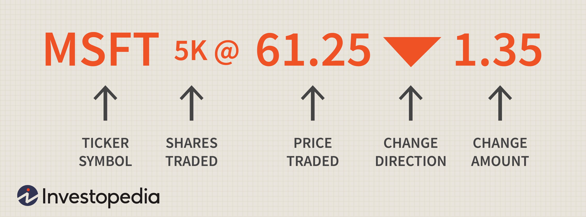

The world of finance has experienced significant transformation due to technological advancements, giving rise to new terms and concepts that are pivotal in understanding the current financial environment. As technology reshapes the financial landscape, concepts like stock prices, market value, corporate finance, and algorithmic trading have gained prominence. These elements are vital for comprehending the mechanics of modern financial markets and the processes that contribute to corporate value creation.

Stock prices serve as an indicator of a company's financial health and its potential for growth, reflecting investor perceptions and market sentiment. Market value, often referred to as market capitalization, is a crucial metric that represents a company's size and value in the financial market, calculated as the product of the stock price and the total number of outstanding shares. Together, these metrics provide insights into a company's standing and its attractiveness to investors.

Corporate finance plays a foundational role in managing financial resources, making investment decisions, and developing strategies that enhance company value. Its influence extends to maintaining strong stock prices and market value through sound financial practices, which can lead to positive media and analyst coverage.

Meanwhile, algorithmic trading has emerged as a modern approach to executing trades, utilizing pre-defined rules to conduct transactions at high speeds and volumes. This method enhances market liquidity and reduces human error, contributing significantly to competitive stock pricing and market value improvement.

This article examines the interactions between these key financial components, illustrating how they underpin the operation of contemporary financial markets. Understanding these relationships is essential for navigating the complex world of finance and identifying opportunities for value creation within corporations.

## Table of Contents

## Understanding Stock Prices and Market Value

Stock prices serve as a fundamental indicator of a company’s financial health and its potential for growth. These prices are essentially the value that traders are willing to pay for a share of the company’s stock in the open market. A higher stock price typically signifies strong investor confidence and expectations of future profitability and growth. Investors often analyze stock prices to assess the viability of investing in a particular company, as these prices encapsulate myriad factors such as revenue generation, competitive positioning, and market opportunities.

Market value, commonly referred to as market capitalization, is an essential metric used to estimate a company's size and economic standing within its industry. It is calculated by multiplying the current stock price by the total number of outstanding shares. The formula for market capitalization is represented as:

$$
\text{Market Capitalization} = \text{Stock Price} \times \text{Total Outstanding Shares}
$$

This calculation offers a snapshot of a company’s market size and its perceived value relative to competitors. A high market capitalization often indicates a company with considerable resources, influence, and potential stability, rendering it more attractive to institutional investors and analysts.

The perceptions reflected in a company’s stock price stem from numerous factors, including its financial performance, earnings reports, news concerning the industry and economic conditions, and even broad market trends. When investors perceive a company as capable of [earning](/wiki/earning-announcement), growing its profits, and maintaining competitive advantages, this optimism is often translated into a higher stock price.

High stock prices enhance the market value of a company, making it appealing to potential investors seeking to capitalize on the company’s growth prospects. A consistently high market value can also improve a company’s financial flexibility, enabling it to raise capital more easily through equity issuance. Thus, understanding stock prices and market value is crucial for investors and analysts who assess a company's investment potential. The dynamic relationship between stock prices and market value serves as a cornerstone of modern financial analysis, influencing everything from investment decisions to corporate strategies.

## The Role of Corporate Finance

Corporate finance serves as the backbone of a company's financial management, encompassing various strategies and processes aimed at maximizing shareholder value. Central to corporate finance are investment decisions, funding strategies, and the management of capital structure. These components collectively influence a company's ability to maintain robust stock prices and a substantial market value.

Investment decisions involve the allocation of financial resources to projects or assets that offer the highest potential returns relative to their risk. This requires a comprehensive evaluation of potential investment opportunities and meticulous planning to ensure that chosen projects align with the company's strategic goals. Firms often employ techniques such as Net Present Value (NPV) and Internal Rate of Return (IRR) to assess the viability of investments. The NPV formula, defined as:

$$
\text{NPV} = \sum \frac{R_t}{(1 + i)^t} - C_0
$$

where $R_t$ is the net cash inflow during the period $t$, $i$ is the discount rate, and $C_0$ is the initial investment, helps in determining whether an investment will generate value for shareholders.

Funding strategies are critical in securing the necessary capital to finance investments. Companies must decide between debt and equity financing, weighing the benefits and costs of each approach. Debt financing may offer tax advantages and does not dilute ownership but increases financial risk due to mandatory interest payments. Equity financing, while more costly due to the expected return on equity, does not impose mandatory repayment obligations. A balanced capital structure, typically represented as the proportion of debt and equity, is crucial for minimizing the cost of capital while maintaining operational flexibility.

Managing capital structure thus involves striking an optimal balance between debt and equity to support business operations and growth initiatives. The capital structure impacts financial ratios like the debt-to-equity ratio, which investors and analysts closely monitor. A sound capital structure enhances a company's creditworthiness and its appeal to potential investors.

Effective financial management extends beyond internal operations and affects external perceptions. Companies known for their robust corporate finance practices often attract favorable media coverage and analyst endorsements, contributing to an elevated market value. This external validation can lead to increased stock demand and, consequently, higher stock prices.

In summary, the principles and practices of corporate finance are indispensable for maintaining financial health and driving the value creation process. Companies adept at managing their financial strategies are likely to achieve sustained success and favorable market positioning.

## Algorithmic Trading: A Modern Approach

Algorithmic trading utilizes sophisticated computer algorithms to execute a large [volume](/wiki/volume-trading-strategy) of trades with high speed and precision. This trading methodology operates based on pre-configured rules and criteria, designed to optimize trade execution and returns while minimizing costs and risks. The use of algorithms reduces human error and eliminates emotional biases that often impact trading decisions, leading to more disciplined and potentially profitable market activities.

One of the primary benefits of [algorithmic trading](/wiki/algorithmic-trading) is its capacity to enhance market [liquidity](/wiki/liquidity-risk-premium). By automatically executing trades in response to market conditions, algorithmic trading can create a more fluid market environment. This liquidity is crucial in narrowing the bid-ask spreads, facilitating better price discovery, and making the markets more efficient.

Several well-established strategies are commonly used in algorithmic trading:

1. **Arbitrage**: This involves simultaneously buying and selling an asset in different markets to exploit price discrepancies and secure risk-free profits. Algorithms can quickly detect mispricings across various exchanges and execute trades faster than manual intervention.

2. **Trend-Following**: This strategy capitalizes on market trends by identifying and following directions of stock prices. Moving averages, channel breakouts, and other technical indicators are frequently programmed into the trading algorithms to systematically capture price trends.

3. **Execution-Based Strategies**: These strategies, such as Volume Weighted Average Price (VWAP) and Time Weighted Average Price (TWAP), focus on executing orders in a manner that minimizes the impact on stock prices. VWAP axes the average price a security has traded at throughout the day, pivoted on both volume and price. Meanwhile, TWAP spreads out trades evenly over a set time period, thus reducing market impact.

The efficiency and precision offered by algorithmic trading can lead to more competitive stock pricing and improved market valuations. By leveraging these algorithms, traders can react swiftly to market dynamics, often achieving superior execution prices compared to manual trading. This automated approach not only optimizes the transaction costs but can also strategically position firms to capitalize on market opportunities.

However, it is important to note that while algorithmic trading offers numerous advantages, it necessitates robust risk management practices and constant oversight to address the complexities and potential instabilities that it might introduce.

## Impact of Algorithmic Trading on Markets

Algorithmic trading is a significant advancement in financial markets, providing unparalleled speed and accuracy in executing trades. These trades are guided by sophisticated algorithms that make autonomous decisions based on a set of pre-defined quantitative analyses. The high-frequency nature of algorithmic trading has led to increased market liquidity, as it enhances the efficiency with which buy and sell orders are matched.

However, the introduction of algorithmic trading has also brought several challenges to market stability. One major concern is the occurrence of "flash crashes," where markets experience a very rapid decline in prices followed by a quick recovery, often within minutes. These events are typically caused by the sudden and massive liquidation of assets triggered by algorithmic trades. Such incidents can undermine investor confidence, as they introduce an element of unpredictability in the markets.

Another issue associated with algorithmic trading is market [volatility](/wiki/volatility-trading-strategies). The rapid execution of large volumes of trades can lead to exaggerated price movements, particularly during periods of low liquidity or unexpected news events. The algorithms, designed to capitalize on order imbalances or minor price disparities, can, at times, inadvertently amplify price swings rather than stabilize them.

Regulatory bodies express concerns over the potential for AI collusion, where trading algorithms might inadvertently align and manipulate market prices. This can occur when multiple algorithms, responding to the same market signals, execute large trades simultaneously. The result can be substantial and untimely shifts in prices, which may disadvantage retail investors and small market participants.

To mitigate these risks, regulators are increasingly scrutinizing algorithmic trading practices. They are considering measures such as imposing circuit breakers to halt trading during extreme market fluctuations, requiring more transparency in algorithmic strategies, and developing systems to monitor and prevent potential price manipulations. Enhanced oversight aims to ensure that algorithmic trading contributes positively to market efficiency without compromising its integrity.

## The Synergy Between Different Financial Elements

A holistic financial strategy combines stock price movements, market value assessments, algorithmic trading efficiency, and corporate finance to enhance corporate performance. By understanding each element's contribution, companies can craft strategies that align these components harmoniously.

Stock price movements provide insight into investor sentiment and perceived value, influencing corporate decision-making in areas like [capital raising](/wiki/hedge-fund-capital-raising) and mergers. Market value assessments offer a snapshot of a company's financial stature, critically informing investment analysis and strategic positioning.

Algorithmic trading brings precision and speed to market operations, enhancing liquidity and reducing costs associated with human intervention. Through strategies such as [arbitrage](/wiki/arbitrage) and trend-following, algorithmic trading can stabilize stock prices, reflecting well-structured corporate strategies sooner in the market.

Corporate finance underpins the entire framework by ensuring optimal capital allocation, maintaining an efficient capital structure, and facilitating strategic investment decisions. Sound corporate finance practices enable sustainable growth, supporting robust stock prices and market valuation.

The integration of these financial elements allows companies to anticipate market trends and navigate challenges effectively. For instance, leveraging algorithmic trading insights for better market timing can mitigate risks and capitalize on fleeting opportunities.

As financial markets continuously evolve, a proficient understanding and application of these critical components can confer substantial competitive advantages. By maintaining a strategic edge, companies ensure resilience and growth, adapting to the shifts in global financial landscapes.

## Conclusion

Navigating the intricate world of financial markets necessitates a comprehensive understanding of the interplay between stock prices, market value, corporate finance, and algorithmic trading. Each of these components plays a pivotal role in shaping financial strategies and outcomes. Stock prices serve as indicators of company performance, reflecting investor sentiment and potential future earnings. Market value provides a quantitative measure of a company’s size and influence, essential for assessing its standing within the competitive landscape.

Corporate finance is integral, as it involves decisions that affect the deployment of resources to maximize shareholder value. Effective management of investment, funding, and capital structure decisions enables companies to maintain robust stock prices and market value. Algorithmic trading further transforms the financial landscape by enhancing trade execution speed and efficiency, reducing human error, and increasing market liquidity.

Embracing technology, while mitigating associated risks, is crucial for thriving in future financial environments. The adoption of algorithmic systems, underpinned by sophisticated data analytics and [machine learning](/wiki/machine-learning), is reshaping traditional trading paradigms. However, challenges such as market volatility and potential manipulation require vigilant regulatory oversight and strategic adaptation.

Investors and corporations must adapt by employing strategic insights derived from the interconnectedness of stock prices, market value, corporate finance, and algorithmic trading. This holistic approach ensures resilience and growth amidst evolving financial landscapes. As financial markets continue to evolve, those who integrate these elements successfully will likely secure competitive advantages and achieve sustainable financial success.

## References & Further Reading

[1]: ["Technical Analysis of the Financial Markets: A Comprehensive Guide to Trading Methods and Applications"](https://www.amazon.com/Technical-Analysis-Financial-Markets-Comprehensive/dp/0735200661) by John J. Murphy

[2]: Harris, L. (2003). ["Trading and Exchanges: Market Microstructure for Practitioners."](https://www.amazon.com/Trading-Exchanges-Market-Microstructure-Practitioners/dp/0195144708) Oxford University Press.

[3]: Aldridge, I. (2013). ["High-Frequency Trading: A Practical Guide to Algorithmic Strategies and Trading Systems."](https://onlinelibrary.wiley.com/doi/pdf/10.1002/9781119203803.fmatter) Wiley Trading.

[4]: Bodie, Z., Kane, A., & Marcus, A.J. (2013). ["Investments"](https://books.google.com/books/about/EBOOK_Investments_Global_edition.html?id=BMsvEAAAQBAJ), 10th Edition, McGraw-Hill Education.

[5]: Engle, R.F., & Russell, J.R. (1998). ["Autoregressive Conditional Duration: A New Model for Irregularly Spaced Transaction Data."](https://www.jstor.org/stable/2999632) Journal of Finance.