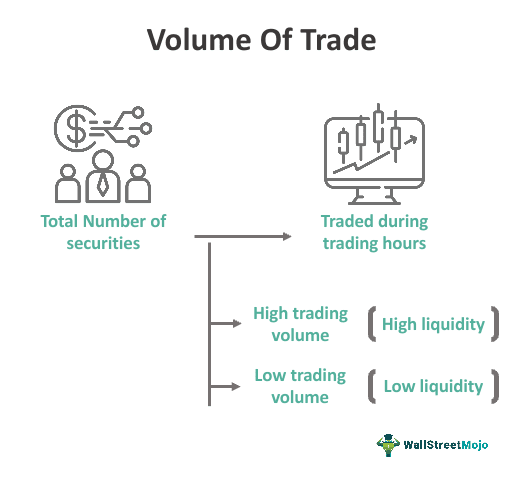

The stock market is a complex and dynamic environment where numerous factors influence prices and trading decisions. One of the key indicators of market activity is stock or trade volume, which reflects the total number of shares traded over a specific period. Stock volume is often used by traders and investors to gain insights into the liquidity and movement of securities within the market. A comprehensive understanding of stock volume can be crucial in discerning market trends and gauging investor sentiment.

Stock volume holds significance as a market indicator due to its capacity to provide insights into the level of interest or activity surrounding particular stocks or the market as a whole. High trading volumes typically indicate strong investor interest or movement, often accompanying key price trends. Conversely, low volumes may suggest a lack of enthusiasm or limited trading activity, potentially signaling market stagnation or the absence of significant news.



Moreover, stock volume plays a critical role in algorithmic trading, where computer algorithms execute trades based on predefined criteria. Traders leverage stock volume data to backtest strategies, optimize algorithms, and enhance trade execution efficiencies. Recognizing patterns in trade volume can improve decision-making processes and reduce market impact costs, making it an invaluable tool for developing robust investment strategies.

By examining the significance of trade volume and its implications in various investing approaches, this article aims to provide a comprehensive understanding of the dynamics of stock volume and its practical applications in the stock market.

## Table of Contents

## Understanding Stock Volume

Stock volume represents the total number of shares that are traded within a specific period, commonly over a single trading day. It plays a crucial role as a barometer of market activity and liquidity, reflecting the frequency with which a stock is exchanged between buyers and sellers. High stock volume typically signals robust investor interest and suggests that more participants are active in trading a particular stock. Conversely, low volume might indicate less market activity or interest in that stock, potentially pointing to narrower demand or supply.

In terms of calculation, stock volume is a straightforward metric. It is simply the sum of individual buy and sell transactions of shares over the specified period. For instance, if a stock is bought and sold 1,000 times in a day, the daily stock volume would be 1,000 shares.

One crucial differentiation is between stock [volume](/wiki/volume-trading-strategy) and dollar volume. While stock volume counts the number of shares traded, dollar volume offers a broader perspective by taking into account the total dollar value of trades made, calculated as the number of shares traded multiplied by the share price. The formula for dollar volume (DV) can be expressed as:

$$
\text{DV} = \sum (\text{Price of each trade} \times \text{Number of shares traded})
$$

Understanding this distinction is vital, as a high stock volume might not always equate to significant financial movement if the stock's price is low. On the other hand, a smaller volume of a higher-priced stock might represent substantial financial activity.

Stock exchange platforms and financial data providers regularly publish these volume figures, enabling investors to assess [liquidity](/wiki/liquidity-risk-premium) conditions and potential entry or [exit](/wiki/exit-strategy) points based on aggregated market sentiment. A comprehensive understanding of stock volume helps traders and investors to identify trends, validate price movements, and gauge the strength or weakness of a market trend. Thus, stock volume is not only a measure of activity but also an essential tool for interpreting market dynamics.

## The Importance of Stock Volume as a Market Indicator

Stock volume is a vital component of financial market analysis, offering insights into price trends, liquidity, and potential [volatility](/wiki/volatility-trading-strategies). A significant indicator of market sentiment and activity, stock volume can support the validation of price movements. For instance, when a price increase aligns with high trading volume, it often signals robust investor interest, potentially indicating a strong bullish trend. This is because increased volume confirms that more participants are engaging with the stock, bolstering the credibility of the price movement.

Moreover, volume functions as a [momentum](/wiki/momentum) indicator, aiding in the identification of potential trend reversals or continuations. A surge in volume might precede a reversal, suggesting that new information has entered the market, influencing traders’ decisions. Conversely, when a continuing trend is supported by rising volume, it can affirm the momentum, providing confidence in the trend's persistence.

High trading volume also translates to better liquidity. Liquidity is crucial for traders as it facilitates smoother entry and exit from positions without significantly impacting the stock's price. In liquid markets, large trades can be executed with minimal price disruption, allowing for more efficient trading strategies. This contrasts starkly with low-volume stocks, which tend to exhibit greater volatility. In such cases, even minor trades can result in large price swings due to the limited number of buyers and sellers.

Understanding these facets of stock volume is critical for making informed trading decisions. Traders and investors must consider volume alongside price movements to distinguish genuine trends from potential anomalies or market noise. For instance, a price surge in a low-volume environment may not have the same significance as one in a high-volume context, where the movement is supported by widespread market participation.

Stock volume is, therefore, a linchpin in financial analysis, providing crucial information that helps in interpreting market dynamics, assessing liquidity conditions, and managing risk. By integrating volume analysis with other indicators, such as technical and fundamental factors, investors can enhance their decision-making processes, ultimately leading to more robust investment strategies.

## Volume in Algorithmic Trading

Algorithmic trading utilizes sophisticated computer algorithms to execute trades according to predefined rules, frequently employing strategies that require rapid decisions, often termed high-frequency trading ([HFT](/wiki/high-frequency-trading-strategies)) strategies. A pivotal element in these algorithms is stock volume, which offers crucial data for optimizing and [backtesting](/wiki/backtesting) trading models. By analyzing stock volume, algorithms can assess liquidity and volatility, two critical factors in financial markets that influence trade execution and timing.

Trade volume data is indispensable for backtesting algorithms, providing historical contexts to ensure that trading strategies are robust and effective under various market conditions. For example, an algorithm might be designed to enter a trade only when the trade volume exceeds a certain threshold, indicating sufficient liquidity and reduced risk of significant price impact. Backtesting these criteria against historical volume data allows traders to evaluate the potential performance of their strategies.

Algorithms typically incorporate volume patterns when determining trade entry and exit points. For instance, an algorithm might interpret a sudden spike in volume as an indicator of increased interest, either buying or selling, and adjust its trading posture accordingly. Volume analysis helps algorithms to predict potential market movements and volatility, adapting trading strategies dynamically to capitalize on temporary opportunities or mitigate risks.

Furthermore, analyzing trade volume can enhance trade execution efficacy by minimizing market impact costs. Market impact costs arise when the act of buying or selling a significant amount of shares affects market prices. By timing trades based on volume analysis, algorithms aim to execute large trades in high-volume periods, thereby spreading the trade influence across many transactions. This approach ensures minimal deviation from the expected execution price, preserving the strategy’s profitability.

In summary, stock volume is integral to [algorithmic trading](/wiki/algorithmic-trading), influencing both strategic design and tactical execution. Through meticulous analysis of volume patterns, algorithms can optimize trade timing and size, enhancing overall trade performance while reducing execution risks and costs.

## Volume Patterns and Their Interpretations

High volume during upward price movements often signals a bullish trend, indicating strong buyer interest and potential for continued price elevation. Conversely, substantial volume during downward movements can affirm a bearish trend, reflecting significant selling pressure. Traders and analysts frequently observe these volume patterns to predict market sentiment and potential price trajectories.

Volume spikes frequently occur around key events, such as corporate announcements or significant market news, which can substantially influence future price actions. These spikes represent heightened investor activity and can lead to volatile price adjustments, underscoring the importance of contextual analysis for accurate interpretation.

Common volume patterns include breakouts, which occur when the price moves beyond a defined resistance or support level with accompanying high volume. This pattern suggests that a new trend may be forming. False breakouts, on the other hand, manifest when prices briefly surpass a resistance or support level but then retreat, often characterized by lower follow-up volume.

To gain a comprehensive understanding of potential market moves, traders frequently combine volume data with other technical indicators. Moving averages, for example, smooth price data to identify consistent trends, while the Relative Strength Index (RSI) offers insights into overbought or oversold conditions. By integrating these indicators with volume analysis, traders enhance their predictive accuracy and decision-making in the stock market, enabling more informed and strategic investments.

## Strategic Use of Stock Volume

Investors can harness stock volume effectively to refine their trading strategies, primarily by using volume data to control position sizes and optimize timing for market entry and exit. By assessing relative volume, traders can spot unusual market activity, which may highlight potential trade opportunities. Relative volume is measured by comparing current trading volume to prior averages over a specific period, often revealing sudden interest or concern about a stock that merits closer examination.

High trading volume typically results in tighter bid-ask spreads, which translates to enhanced trading efficiency. Tighter spreads mean lower transaction costs for buying and selling securities, thereby improving the profitability of trades. Stocks with consistently high volume are generally more liquid, allowing investors to enter and exit positions with minimal impact on the stock’s price.

Incorporating volume analysis with robust due diligence and a blend of fundamental and technical analysis can significantly enhance long-term investment outcomes. For example, [fundamental analysis](/wiki/fundamental-analysis) might include assessing a company's financial health, market position, and future growth potential. Technical analysis, meanwhile, can use volume data to identify patterns and trends. A common technique involves integrating volume with other indicators, like moving averages, to validate trend strength.

Here's a simple Python code snippet to calculate relative volume for a stock:

```python
import pandas as pd

def calculate_relative_volume(data):
    # Assuming data is a DataFrame with 'Volume' and 'Date' columns
    data['Average_Volume'] = data['Volume'].rolling(window=20).mean()  # 20-day moving average
    data['Relative_Volume'] = data['Volume'] / data['Average_Volume']
    return data

# Example usage
data = pd.DataFrame({
    'Date': pd.date_range(start='2022-01-01', periods=30, freq='B'),
    'Volume': [100, 150, 120, 130, 160, 170, 140, 180, 200, 165, 230, 210, 195, 175, 160, 180, 190, 185, 200, 210, 220, 215, 205, 225, 230, 240, 245, 235, 255, 260]
})

result = calculate_relative_volume(data)
print(result[['Date', 'Volume', 'Relative_Volume']])
```

This code calculates the 20-day average volume and determines the relative volume by dividing the current day’s volume by this average. By identifying relative volume spikes, investors can uncover stocks experiencing increased attention which might suggest future price movements.

To succeed, investors should leverage volume data not in isolation but as a component of a broader strategy that includes both qualitative and quantitative analyses. This approach ensures a comprehensive evaluation of the potential risks and rewards associated with investment opportunities.

## Common Misconceptions About Stock Volume

Stock volume, a widely tracked metric in financial markets, is often misunderstood. One prevalent misconception is that high volume is synonymous with bullish activity. However, high volume can occur regardless of market direction. For example, during a downward trend, high volume may indicate panic selling or increased participation from short sellers. Conversely, in an upward trend, it could signify buying pressure or short covering. Therefore, context is essential when interpreting volume levels.

Low volume is also frequently misinterpreted. While a stock with low volume might initially appear to lack interest, it can signal a lack of liquidity or be undervalued, neglected by larger market participants. These stocks may present opportunities if underlying fundamentals support a re-evaluation.

Another misconception is that volume spikes are definitive indicators of significant price movements. Volume spikes can result from various market events, such as earnings reports, geopolitical news, or economic data releases. While they often coincide with price volatility, they are not foolproof predictors of future trends. Traders must analyze context, such as prevailing market conditions and sentiment, to discern the true implications.

Understanding these common misconceptions is crucial for integrating volume into trading strategies effectively. By recognizing that high volume does not inherently equate to bullishness, acknowledging that low volume can hide potential opportunities, and correctly interpreting volume spikes, traders can make better-informed decisions.

## Conclusion

Stock volume is an essential component of market analysis, providing valuable insights into market sentiment and potential price movements. It acts as a barometer of trading activity, reflecting the intensity and direction of investor participation. Understanding stock volume can enhance trading strategies by providing context to price trends and aiding in the identification of significant market signals.

While stock volume is an important indicator, it should not be used in isolation. Integrating volume data with other technical indicators, such as moving averages and the Relative Strength Index (RSI), can result in more robust trading strategies. This multi-faceted approach enables traders and investors to paint a fuller picture of market conditions and potential price trajectories.

Algorithmic traders, in particular, find value in understanding volume dynamics. Algorithms can be programmed to recognize volume patterns, using them to make informed decisions about trade entries and exits. Awareness of volume helps in optimizing the performance of trading algorithms, reducing market impact costs, and improving execution quality.

Investors should remain aware of common misconceptions associated with stock volume, such as the assumption that high volume always indicates bullish activity. By avoiding these pitfalls and employing best practices in volume analysis, investors can leverage stock volume as a powerful tool in the stock market. Ultimately, a deep understanding of stock volume, coupled with comprehensive market analysis, can significantly enhance the effectiveness of investment strategies.

## References & Further Reading

[1]: Bergstra, J., Bardenet, R., Bengio, Y., & Kégl, B. (2011). ["Algorithms for Hyper-Parameter Optimization."](https://dl.acm.org/doi/10.5555/2986459.2986743) Advances in Neural Information Processing Systems 24.

[2]: ["Advances in Financial Machine Learning"](https://www.amazon.com/Advances-Financial-Machine-Learning-Marcos/dp/1119482089) by Marcos Lopez de Prado

[3]: ["Evidence-Based Technical Analysis: Applying the Scientific Method and Statistical Inference to Trading Signals"](https://www.amazon.com/Evidence-Based-Technical-Analysis-Scientific-Statistical/dp/0470008741) by David Aronson

[4]: ["Machine Learning for Algorithmic Trading"](https://github.com/stefan-jansen/machine-learning-for-trading) by Stefan Jansen

[5]: ["Quantitative Trading: How to Build Your Own Algorithmic Trading Business"](https://www.amazon.com/Quantitative-Trading-Build-Algorithmic-Business/dp/1119800064) by Ernest P. Chan