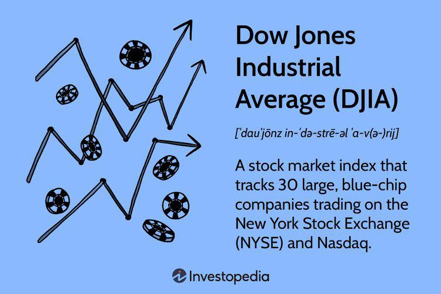

In today's fast-paced financial world, the Dow Jones Industrial Average (DJIA) serves as a benchmark for the stock market's overall performance. Established in 1896 by Charles Dow, the DJIA is one of the most recognized and oldest stock market indices. It comprises 30 significant publicly-owned companies, chosen to reflect the American economy's industrial backbone. This index operates as a crucial indicator that investors, analysts, and economists utilize to assess prevailing market trends and economic health in the United States.

The DJIA's significance extends beyond its historical roots. As a price-weighted index, it emphasizes the stocks with higher market prices, thus impacting its overall movement, a factor of critical importance for market participants who aim to understand shifts in market dynamics. This weightage mechanism is calculated by summing the prices of all 30 stocks and dividing by the Dow Divisor, a figure adjusted for changes such as stock splits and spinoffs to maintain the index's continuity.

With the development and proliferation of technology, particularly over the past few decades, algorithmic trading has grown exponentially. This form of trading leverages advanced mathematical models and automated software to perform trading decisions at speeds and frequencies far beyond human capabilities. It has become a cornerstone of stock market operations, profoundly influencing how trades are executed on platforms worldwide, including impacts on indices such as the DJIA. 

Algorithmic trading's integration into financial systems allows for the swift execution of trades, minimizing transaction costs and reducing human error, thereby enhancing market efficiency. Its rise poses both challenges and opportunities within financial markets. By exploring the dynamics between the Dow Jones and algorithmic trading, it becomes evident how these technological advancements contribute to the evolving landscape of investment and market strategy.

Understanding these elements can provide investors with insights into market movements and potential investment opportunities. As financial technologies continue to advance, comprehending their interaction with traditional market indicators like the DJIA is essential for making informed investment decisions. This article will explore the intricate relationship between the Dow Jones, algorithmic trading, and broader financial markets, providing a comprehensive overview that is crucial for navigating today's complex investment environment.

## Table of Contents

## Understanding the Dow Jones Industrial Average

The Dow Jones Industrial Average (DJIA) is a prominent stock market index known for reflecting the performance of 30 large, publicly-owned companies based in the United States. It was established by Charles Dow in 1896 and has since become one of the oldest and most recognized equity indices worldwide. The DJIA plays a crucial role in the financial landscape as it provides insights into the health and overall trends of the US stock market.

The DJIA comprises companies from a diverse range of sectors, including technology, consumer goods, and financial services. This sectoral variety ensures that the index captures a broad spectrum of the economy, making it a valuable tool for investors and analysts looking to understand market movements. The composition of the index is periodically reviewed and updated to reflect changes in the market and the economy.

A defining characteristic of the DJIA is its price-weighted nature. This means that the influence of each stock on the index is proportional to its price, rather than its market capitalization. As a result, stocks with higher prices have a more significant impact on the index's movement. This can lead to outcomes where a price change in a single high-priced stock can significantly affect the overall index, unlike market-capitalization-weighted indices, which are influenced more by companies with larger market values. The formula used to calculate the DJIA is:

$$
\text{DJIA} = \frac{\sum \text{Price of all 30 stocks}}{\text{Dow Divisor}}
$$

Here, the "Dow Divisor" is a constant that is adjusted periodically. This adjustment helps maintain the continuity of the index value when events like stock splits or component changes occur.

The DJIA is closely monitored by investors, analysts, and economists who use it as a barometer for the health of the economy and to make informed decisions about investments. Changes in the index can signal shifts in economic conditions, investor sentiment, and global financial climates. Overall, the Dow Jones Industrial Average serves as a fundamental indicator of the economic trajectory and investment climate of the United States.

## The Rise of Algorithmic Trading in Financial Markets

Algorithmic trading, often known as algo trading, utilizes sophisticated algorithms to automate the process of buying and selling financial instruments. These algorithms are designed to make trading decisions at speeds and frequencies that are impossible for a human trader to achieve. The core principle behind [algorithmic trading](/wiki/algorithmic-trading) is to execute orders faster, minimize transaction costs, and eliminate human emotions from trading decisions, enhancing overall efficiency in the markets.

The growth of algorithmic trading over the past few decades has been substantial. Technological advancements, especially in computing power and data processing, have enabled algos to execute trades with remarkable speed. Today, algorithmic trading is estimated to account for a significant portion of trades in prominent financial markets worldwide. For instance, according to a report by the TABB Group, algorithmic trading represents approximately 50% to 60% of overall trading [volume](/wiki/volume-trading-strategy) in U.S. equity markets.

Algorithmic trading strategies vary widely, from simple to highly complex. One basic form involves executing trades based on predefined criteria such as market price changes or volume spikes. More complex strategies might incorporate quantitative models that analyze vast data sets to predict future price movements. These sophisticated models often use techniques from statistical analysis, [machine learning](/wiki/machine-learning), and [artificial intelligence](/wiki/ai-artificial-intelligence) to enhance predictive accuracy and performance.

While algorithmic trading offers several advantages, it also carries potential risks that must be managed carefully. The speed and scale of algo trading can contribute to increased market [volatility](/wiki/volatility-trading-strategies). One notable example is the "flash crash" of May 6, 2010, when the Dow Jones Industrial Average dropped nearly 1,000 points within minutes before recovering swiftly. Analysis later indicated that high-frequency trading, a subset of algorithmic trading, played a significant role in amplifying the volatility during this incident.

To mitigate such risks, regulatory measures and safeguards, including the implementation of circuit breakers in stock exchanges, have been introduced. These mechanisms are designed to temporarily halt trading if prices move too rapidly, allowing time for the market to stabilize and reducing the potential for abrupt market disruptions.

In conclusion, the rise of algorithmic trading marks a pivotal shift in how financial markets operate. Its integration into trading practices improves market efficiency and [liquidity](/wiki/liquidity-risk-premium) but requires careful regulation and oversight to safeguard against its inherent challenges. As technology continues to evolve, algorithmic trading is likely to play an even greater role in shaping the future dynamics of global financial markets.

## Impact of Algorithmic Trading on the Dow Jones

Algorithmic trading significantly influences the Dow Jones Industrial Average (DJIA) and other major indices through its high-speed and efficiency-driven operations. These trades, executed in fractions of a second, can cause rapid movements and fluctuations in the DJIA. This speed allows algorithmic traders to capitalize on short-term market inefficiencies or opportunities, which, in turn, affects the liquidity and volatility of stocks within the index.

The efficiency of algorithmic trading lies in its ability to process vast amounts of data and execute orders at speeds unattainable by human traders. This rapid execution can lead to increased market liquidity, as more buy and sell orders are placed on the market swiftly. However, it also contributes to heightened volatility, as large volumes of trades can occur in a very short timeframe, amplified by the trend-following nature of some algorithms.

Market participants leveraging algorithmic strategies can influence short-term price movements, sometimes creating feedback loops. For example, if algorithms detect a significant movement in stock prices, they may trigger additional trades, further exacerbating price swings. This scenario can be a double-edged sword: while it increases market activity, it also risks enhancing volatility, potentially destabilizing the market.

To mitigate the risks associated with rapid algorithmic trades, financial markets have implemented several mechanisms. One such measure is the use of circuit breakers, which temporarily halt trading if prices move excessively within a short period. Circuit breakers aim to provide a cooling-off time, allowing human judgment to supplement algorithmic decision-making and thereby prevent market crashes driven by rapid automated trading.

Despite these safeguards, the pervasive use of algorithmic trading still necessitates vigilant monitoring by regulatory bodies and market participants. Authorities like the U.S. Securities and Exchange Commission (SEC) continuously evaluate the systemic implications of algorithmic trading and adjust regulatory frameworks accordingly. Effective oversight ensures that the benefits of algorithmic trading—such as increased efficiency and reduced transaction costs—are realized while minimizing potential adverse impacts on market stability.

## Benefits and Risks of Algorithmic Trading

Algorithmic trading, often referred to as algo trading, plays a pivotal role in modern financial markets by enhancing market efficiency. It achieves this primarily by increasing liquidity and narrowing bid-ask spreads. This mechanized form of trading allows for the rapid execution of orders, leveraging algorithms to find the best possible prices and execute trades with minimal delay. Consequently, markets become more efficient, benefiting both individual and institutional investors by providing more accurate pricing and reducing trading costs.

One of the core advantages of algorithmic trading is its ability to backtest strategies on historical data. This capability enables traders and financial institutions to optimize their strategies by quantitatively assessing their performance against past market conditions. By employing historical data, traders can simulate trades and refine strategies before deploying them in real-time markets, thereby enhancing decision-making and potentially improving returns.

However, despite these advantages, algorithmic trading also introduces notable risks. The reliance on automated systems can lead to technical glitches or systemic errors, which, if unchecked, may have significant repercussions. Additionally, the market has witnessed events known as "flash crashes," where indices experience sudden and steep declines in value, often triggered by malfunctions or unintended algorithm interactions. A prominent example of this is the May 6, 2010 flash crash, during which the Dow Jones Industrial Average plunged and then partially recovered within minutes. While algorithms can magnify liquidity and efficiency, their failures can also swiftly propagate volatility across financial markets.

Therefore, balancing the benefits and risks of algorithmic trading is crucial to maintaining market stability and protecting investors. The financial industry continues to implement safeguards such as circuit breakers, which halt trading if extreme volatility is detected. Additionally, regulatory bodies are constantly enhancing oversight to mitigate potential risks associated with rapid, high-frequency trades. As trading technology continues to evolve, ongoing vigilance and adaptation of risk management practices will be essential in maximizing the advantages of algorithmic trading while safeguarding against its inherent risks.

## Future of Financial Markets with Algorithmic Trading

The future of financial markets is intrinsically linked to the advancements in technology, with algorithmic trading playing a pivotal role in shaping this landscape. As technology evolves, the integration of artificial intelligence (AI) and machine learning (ML) in trading strategies is becoming increasingly prominent. These technologies enhance algorithmic trading by enabling more sophisticated data analysis, thereby creating opportunities for personalized and predictive trading strategies. For instance, machine learning algorithms can analyze vast amounts of historical data to identify patterns and trends that humans might overlook, allowing traders to make more informed decisions.

The potential for tailored investment strategies is expanding as AI and ML can process and analyze large datasets to provide insights specific to individual investors. This includes factors such as risk tolerance, investment horizon, and market conditions. These personalized strategies not only optimize returns but also align investments with the specific goals and preferences of the investor.

However, the rise of advanced algorithmic trading necessitates a robust regulatory framework to ensure market stability and investor protection. Effective regulation is essential to maximize the benefits of algorithmic trading while minimizing risks such as systemic errors or flash crashes. Regulatory bodies are tasked with setting standards that govern the use of complex algorithms in trading practices, ensuring transparency and fairness in the market.

Investors, both large institutional players and individual retail traders, can expect significant changes in the way trading is conducted. The increased use of AI and ML in trading will demand a shift in skills required for market participants, emphasizing data analysis and technical proficiency. As these technologies continue to evolve, they promise to redefine market dynamics, offering new tools and techniques to navigate the complexities of modern financial markets.

This technological progression in trading promises a future where financial markets are more efficient, dynamic, and inclusive. Continued advancements and adaptations will be necessary for investors to leverage these innovations effectively, allowing them to capitalize on emerging opportunities while safeguarding against potential risks.

## Conclusion

Understanding the interplay between the Dow Jones, financial markets, and algorithmic trading is essential for today’s investors. The Dow Jones Industrial Average (DJIA) remains a critical indicator of market health and trends, providing a benchmark that reflects the dynamics of U.S. equity markets. Algorithmic trading, with its capacity for high-speed and automated decision-making, has integrated deeply into the fabric of these markets. This integration presents opportunities and challenges, requiring a fine balance between harnessing technological advancements and managing associated risks.

Algorithmic trading significantly enhances market efficiency by increasing liquidity and helping to narrow bid-ask spreads, allowing investors to execute trades swiftly and at favorable prices. The sophisticated algorithms employed can process vast amounts of data, identify patterns, and execute trades in milliseconds. This speed and precision not only optimize trading outcomes but also help in maintaining market stability during periods of high activity. However, it is crucial to recognize the risks inherent in automated systems, including the potential for technical failures and systemic issues that could result in events such as flash crashes.

Given these dual aspects of algorithmic trading, staying informed and vigilant is indispensable for investors navigating today's financial landscape. As financial technology continues to evolve, with advancements in artificial intelligence and machine learning poised to further expand capabilities, adaptability becomes a key asset. Investors who keep abreast of trends in algorithmic trading are better positioned to make informed choices and leverage emerging opportunities effectively. By understanding the complexities and potential of these systems, investors can maintain a competitive edge in the stock market, ensuring that they remain proactive in a rapidly advancing marketplace. 

Ultimately, the ongoing development of algorithmic trading and its regulation will shape the future of financial markets. Investors, both large and small, must prioritize education and awareness, ensuring they are prepared to meet the challenges and capitalize on the benefits of these technological advancements.

## References & Further Reading

[1]: Jones, C. M. (2013). ["What Do We Know About High-Frequency Trading?"](https://papers.ssrn.com/sol3/papers.cfm?abstract_id=2236201) Columbia Business School Research Paper No. 13-11.

[2]: ["Advances in Financial Machine Learning"](https://www.amazon.com/Advances-Financial-Machine-Learning-Marcos/dp/1119482089) by Marcos Lopez de Prado

[3]: Aldridge, I. (2013). ["High-Frequency Trading: A Practical Guide to Algorithmic Strategies and Trading Systems."](https://books.google.com/books/about/High_Frequency_Trading.html?id=8QpIsVUMhmEC) Wiley.

[4]: ["Quantitative Trading: How to Build Your Own Algorithmic Trading Business"](https://www.amazon.com/Quantitative-Trading-Build-Algorithmic-Business/dp/1119800064) by Ernest P. Chan

[5]: Narang, R. (2014). ["Inside the Black Box: The Simple Truth About Quantitative Trading."](https://www.amazon.com/Inside-Black-Box-Quantitative-Trading/dp/0470432063) Wiley. 

[6]: Fabozzi, F. J., Focardi, S. M., & Rachev, S. T. (2007). ["The Basics of Algorithmic Trading and Portfolio Management."](https://onlinelibrary.wiley.com/doi/book/10.1002/9781118856406) John Wiley & Sons.

[7]: SEC. (2010). ["Findings Regarding the Market Events of May 6, 2010."](https://www.sec.gov/news/studies/2010/marketevents-report.pdf) Report of the Staffs of the CFTC and SEC to the Joint Advisory Committee on Emerging Regulatory Issues.