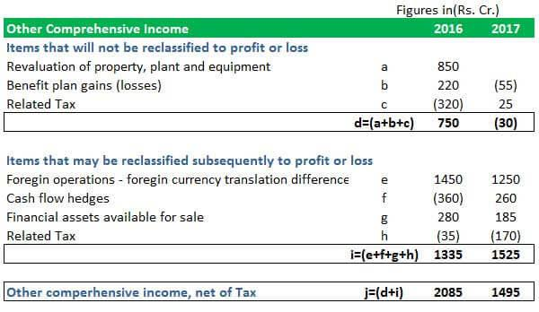

In the fast-evolving world of finance, understanding the nuances of financial statements is crucial for investors, analysts, and businesses. Financial statements serve as formal records that encapsulate a business's financial activities and its position at a given time, offering invaluable insights into its performance and potential. Among the various components of these statements, the term 'Other Comprehensive Income' (OCI) often appears, but many may wonder what it signifies and why it holds importance. OCI encompasses those revenues, expenses, gains, and losses that are excluded from a company's net income, which can significantly affect a company's reported financial condition without impacting its bottom line directly.

Investors and analysts must grasp the intricacies of OCI to obtain a complete picture of a company's financial health. Items included in OCI typically involve foreign currency translation adjustments, changes in unrealized gains or losses on hedging instruments, and remeasurements of defined benefit plans. These elements offer a broader view of the economic decisions and market conditions influencing a company.



Parallel to developments in financial statement analysis, the rise of algorithmic trading, often abbreviated as algo trading, has profoundly impacted financial markets. Algo trading leverages computer programs and complex algorithms to execute trades at speeds and volumes far beyond human capability. This approach allows for heightened precision and efficiency in processing vast datasets, contributing to increased market liquidity and reduced transaction costs. However, it also introduces complexities, such as new market dynamics and regulatory challenges that analysts and traders need to understand.

This article aims to connect the concepts of Other Comprehensive Income and algorithmic trading, providing insights into how they interact within accounting and trading contexts. By combining a thorough understanding of OCI with the strategic use of algo trading, professionals can enhance their financial analysis, thereby making more informed and effective investment decisions. By the conclusion of this read, you should have a clear understanding of how other comprehensive income and algorithmic trading affect financial analysis and decision-making, equipping you to navigate the evolving financial landscape effectively.

## Table of Contents

## Understanding Financial Statements

Financial statements are formal records that capture the financial activities and position of a business, individual, or entity. They serve as a crucial tool for various stakeholders, including investors, analysts, and management, by providing comprehensive data necessary to assess performance and make informed financial decisions. The core components of financial statements are the balance sheet, income statement, cash flow statement, and the statement of changes in equity. Each component plays a distinctive role in presenting a full picture of an entity's financial health.

The balance sheet, also known as the statement of financial position, offers a snapshot of a company's financial standing at a specific point in time. It lists the entity’s assets, liabilities, and equity, providing insight into what the company owns and owes. The equation that underpins the balance sheet is:

$$
\text{Assets} = \text{Liabilities} + \text{Equity}
$$

This equation highlights the relationship between the company's resources and the claims against those resources by creditors and equity holders.

The income statement, often referred to as the profit and loss statement, details the company's financial performance over a period. It includes revenues, expenses, and profits or losses, helping stakeholders evaluate profitability and operational efficiency. The income statement's fundamental formula is:

$$
\text{Net Income} = \text{Revenues} - \text{Expenses}
$$

Net income is a critical indicator of a company's profitability and is used extensively in financial analysis and valuation models.

The cash flow statement provides a comprehensive account of cash inflows and outflows, segmented into operating, investing, and financing activities. This statement is vital for understanding how a company generates and utilizes cash, which is essential for maintaining [liquidity](/wiki/liquidity-risk-premium) and financing growth. It ensures that profits reflected in the income statement align with actual cash movements.

Lastly, the statement of changes in equity, sometimes called the statement of retained earnings, illustrates changes in the owners' interest in the company. It accounts for items such as new share issuances, dividend payments, and other comprehensive income (OCI) adjustments. This statement reveals how the company’s activities over a period affect shareholder value.

Each of these components is indispensable for modern financial analysis. They collectively provide necessary insights into a company's operational success, financial stability, and future prospects. A robust understanding of these financial statements is foundational for assessing a company's overall health and sets the stage for deeper analysis into specific elements like Other Comprehensive Income (OCI), which can further elucidate a company's financial dynamics beyond the standard profitability metrics.

## Decoding Other Comprehensive Income

Other Comprehensive Income (OCI) encompasses a variety of financial elements that are not included within the traditional boundaries of net income on a typical income statement. Unlike items directly impacting net earnings, OCI items are recorded in the equity section of a company’s balance sheet, contributing to the overall computation of comprehensive income. This creates a more extensive picture of a company's financial activities by encompassing components that might indicate changes in the financial health of the business but are not part of the day-to-day operating performance.

Key components usually recorded as OCI include foreign currency translation adjustments, which arise due to fluctuations in exchange rates affecting foreign operations. Additionally, unrealized gains or losses on certain types of investments, such as available-for-sale securities, are common OCI items. These represent potential but not yet realized impacts on the company’s financial position due to market value changes in financial assets. Pension plan gains and losses are another critical element, reflecting actuarial gains or losses from changes in pension plan dynamics, which affect future retirement benefit obligations.

The influence of OCI components on a company's financial condition extends beyond the direct implications of typical operational earnings. For instance, significant unrealized losses recorded as OCI might suggest an underlying issue in the company's investment portfolio, potentially signaling future impairments if market conditions do not improve. Similarly, large foreign currency translation impacts could hint at substantial exposure to international markets, influencing risk management and hedging strategies.

By including OCI in the overall financial analysis, investors and analysts can achieve a more comprehensive understanding of a company's financial health and potential future risks or opportunities. This broader view allows stakeholders to recognize and evaluate the final touches of economic conditions and strategic decisions influencing the company's trajectory.

## The Rise of Algorithmic Trading

Algorithmic trading, often referred to as algo trading, is a modern technique that leverages computer programs and algorithms to execute trades with remarkable precision and speed. Unlike traditional trading methods that rely heavily on human decision-making, [algorithmic trading](/wiki/algorithmic-trading) allows for the processing of vast volumes of data to make informed trading decisions almost instantaneously. This approach is designed to capitalize on even the smallest price inefficiencies in the market, thus maximizing potential returns.

The advantages of algorithmic trading are multifaceted. At its core, it enhances trading accuracy by reducing human error, which is particularly beneficial in high-frequency trading environments where decisions are made in fractions of a second. Additionally, algo trading enables the simultaneous analysis of huge datasets. Traders can incorporate complex mathematical models and statistical methods to identify profitable trade opportunities. An example is the use of the Black-Scholes formula for options pricing, enabling algorithms to make real-time adjustments based on market developments:

$$
C = S_0 N(d_1) - X e^{-rt} N(d_2)
$$

Where:
- $C$ is the call option price
- $S_0$ is the current stock price
- $X$ is the strike price
- $r$ is the risk-free interest rate
- $t$ is the time to expiration
- $N$ is the cumulative distribution function of the standard normal distribution
- $d_1$ and $d_2$ are intermediate calculations based on market variables

The transformation brought about by algo trading has been profound, contributing to increased liquidity in the financial markets. This liquidity is essential as it facilitates smoother transactions, allowing for quicker entry and [exit](/wiki/exit-strategy) positions without causing significant price swings. Moreover, the widespread adoption of algorithmic trading has led to a significant reduction in transaction costs. Automation minimizes the need for manual intervention, thereby streamlining operations and lowering the associated costs of executing trades.

Despite these advantages, algorithmic trading introduces several new complexities and challenges, particularly regarding market dynamics and regulatory environments. The increased speed and [volume](/wiki/volume-trading-strategy) of trades can contribute to market [volatility](/wiki/volatility-trading-strategies), as seen in events like the Flash Crash of 2010, where rapid, automated trading led to a temporary but dramatic drop in the value of US stocks. Additionally, the opaque nature of some algorithmic strategies makes regulatory oversight more challenging, prompting the development of more sophisticated monitoring and compliance measures.

For modern traders and financial analysts, a deep understanding of algorithmic trading's role and implications is crucial. Adapting to this rapidly evolving landscape offers both challenges and opportunities. The integration of technological advancements with traditional financial analysis is essential for staying competitive in today’s fast-paced financial markets. Mastering the nuances of algorithmic trading allows professionals to not only improve their own trading strategies but also to contribute to the development of more efficient and stable market environments.

## The Interplay Between Financial Statements and Algo Trading

Algorithmic trading, known for its reliance on computational power and speed, leverages financial statement data to develop precise and effective trading strategies. This integration enhances decision-making processes by allowing traders to create algorithms that interpret financial data, including Other Comprehensive Income (OCI), thus uncovering strategic insights. The importance of accurate financial statement interpretation cannot be overstated, as it plays a critical role in identifying financial trends and anomalies that algorithms can exploit for competitive advantage.

OCI, representing parts of a company's financial performance excluded from the income statement, provides a nuanced view of a company's financial health. Traders who incorporate OCI into their algorithmic strategies can gain insights into elements such as foreign currency transaction gains/losses, unrealized gains/losses on securities, and pension plan gains/losses. These components, although not part of the net income, influence market perceptions and stock valuations significantly. 

Here is a simplified Python snippet for parsing financial statement data, which could feed into such algorithms:

```python
import pandas as pd

# Load sample financial data
data = pd.read_csv('financial_statements.csv')

# Extracting OCI-related data 
oci_data = data[['foreign_currency_gains', 'unrealized_securities_gains', 'pension_plan_gains']]

# Sample calculation for total OCI
data['total_oci'] = oci_data.sum(axis=1)

# Complex trading strategies would utilize this data further
strategies = create_trading_strategy(data['total_oci'])
```

The convergence of finance and technology means professionals must now adeptly navigate both disciplines. Mastery in interpreting financial statements enhances trading algorithms' efficacy, translating strategic insights into profitable trades. As algorithmic trading becomes more sophisticated, the need for accurate data interpretation grows, ensuring algorithms are not only faster but smarter in leveraging financial trends.

Enhancing the interface between financial analysis and algorithmic trading leads to the development of robust strategies that capital markets can capitalize on. With ongoing advancements in technology, particularly in AI and [machine learning](/wiki/machine-learning), these strategies are set to become increasingly predictive and insightful, paving the way for innovations in trading methodologies. In this dynamic environment, professionals with dual expertise in finance and technology are poised to excel, driving both market progress and personal career advancement.

## The Future of Financial Analysis and Algo Trading

The future of financial analysis and algorithmic trading is poised for significant transformation as advanced technologies continue to integrate into these areas. The convergence of algorithmic methodologies with traditional financial analysis is expected to proliferate, driven by emerging technologies such as [artificial intelligence](/wiki/ai-artificial-intelligence) (AI) and machine learning (ML).

AI and ML are set to enhance the capabilities of trading algorithms by enabling them to process vast amounts of data and improve predictive accuracy. These technologies can analyze complex market patterns and generate insights that are not immediately apparent to traditional analytical methods. For instance, machine learning algorithms can continuously learn and adapt from new data to refine trading strategies in real time.

Moreover, sophisticated analysis tools are expected to emerge, providing traders and analysts with enhanced functionalities for data interpretation and decision-making. These tools will likely feature robust predictive capabilities, allowing for more accurate forecasts of market movements. As an illustration, a predictive model using AI might analyze historical price movements alongside external factors such as news sentiment or macroeconomic indicators to forecast future asset prices.

Staying competitive in this rapidly evolving environment necessitates ongoing education and adaptation. Financial professionals must update their technical skills and knowledge to leverage technological advancements. This might include acquiring proficiency in programming languages like Python, which is widely used for data analysis and algorithm development. A simple example of a Python script to calculate moving averages, a common technique in financial analysis, is:

```python
import pandas as pd

# Assume 'data' is a DataFrame containing stock prices with a 'Price' column
def calculate_moving_average(data, window_size):
    return data['Price'].rolling(window=window_size).mean()

# Example usage
stock_data = pd.DataFrame({'Price': [100, 102, 101, 105, 107]})
moving_average = calculate_moving_average(stock_data, window_size=3)
print(moving_average)
```

In the future financial ecosystem, professionals who are well-versed in both financial analysis and algorithmic trading will play pivotal roles. Their ability to navigate and synthesize insights from both disciplines will be crucial in shaping innovative trading strategies and financial solutions. Continuous learning, adaptive thinking, and cross-disciplinary expertise will be essential for leading and succeeding in this dynamic landscape. As technological advancements redefine conventional boundaries, such professionals will be at the forefront of driving change and capitalizing on new opportunities in finance.

## Conclusion

Financial statements and algorithmic trading hold significant positions within the landscape of contemporary financial management. In particular, a comprehensive grasp of Other Comprehensive Income (OCI) enhances the depth and accuracy of financial analysis. OCI, by incorporating elements such as foreign currency translation adjustments and unrealized gains or losses on investment securities, provides a broader perspective on a company's financial health beyond the traditional income statement metrics.

Algorithmic trading, meanwhile, continues to redefine market dynamics. Its capacity for executing trades with speed and precision, coupled with its ability to analyze extensive data sets, offers substantial opportunities for market participants. However, this technological advancement also introduces challenges, such as increased market volatility and the need for robust regulatory frameworks.

For professionals in finance, it is crucial to integrate both financial and technological insights. Mastery of traditional financial analysis must be complemented with an understanding of algorithmic techniques and their implications. This dual expertise is pivotal in making informed decisions and maintaining a competitive edge in today's market.

Moreover, as the landscape of finance and trading is in constant flux, ongoing learning and adaptability are paramount. Engaging with emerging technologies such as artificial intelligence and machine learning can further enhance analytical capabilities and predictive accuracy in trading strategies. Being proactive in education and skill development will position professionals to effectively navigate and succeed in the evolving financial ecosystem.

## References & Further Reading

[1]: ["International Financial Reporting Standards (IFRS 9) and the Impact on Other Comprehensive Income"](https://www.ifrs.org/issued-standards/list-of-standards/ifrs-9-financial-instruments/) by International Financial Reporting Standards (IFRS) Foundation.

[2]: ["Algorithmic Trading and DMA: An Introduction to Direct Access Trading Strategies"](https://archive.org/details/algorithmictradi0000john) by Barry Johnson.

[3]: ["Financial Reporting and Analysis: Using Financial Accounting Information"](https://archive.org/details/financialreporti00gibs) by Charles H. Gibson.

[4]: ["Algorithmic Trading: Winning Strategies and Their Rationale"](https://www.wiley.com/en-us/Algorithmic+Trading%3A+Winning+Strategies+and+Their+Rationale-p-9781118460146) by Ernie Chan.

[5]: ["Machine Learning in Finance: From Theory to Practice"](https://www.amazon.com/Machine-Learning-Finance-Theory-Practice/dp/3030410676) by Matthew F. Dixon, Igor Halperin, and Paul Bilokon.