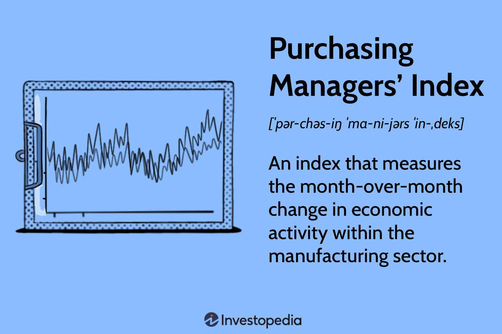

Understanding economic indicators is crucial for traders, especially in making informed decisions in the financial markets. Among these indicators, the Purchasing Managers' Index (PMI) stands out due to its ability to offer timely insights into the economic health of both manufacturing and service sectors. This index is not just a mere number; it serves as a reflection of economic vitality and business sentiment, capturing the pulse of industry performance before more comprehensive data is available.

The PMI is derived from surveys of purchasing managers, focusing on variables such as new orders, inventory levels, production, supplier deliveries, and employment rates. A PMI reading above 50 indicates expansion in the relevant sector, while a reading below this threshold suggests contraction. This makes the PMI a critical tool for traders who need to discern subtle economic shifts and potential market directions.



In the financial markets, particularly in forex trading and algorithmic trading, understanding and leveraging the PMI can significantly impact trading strategies. The PMI's real-time, monthly updates provide traders with the opportunity to adjust their strategies based on current economic conditions, helping them anticipate and respond to market developments before they fully materialize.

The interplay between PMI and market behavior is intricate, influenced by numerous factors such as geopolitical events, fiscal policies, and other economic indicators. Consequently, the PMI should not be viewed in isolation but rather as part of a broader analytical framework that traders can use to enhance their decision-making and optimize their market engagements.

This article will explore the PMI's multifaceted role in business activity and algorithmic trading, while highlighting how understanding its nuances can shape market trends and guide trading strategies. By equipping market participants with comprehensive knowledge about the PMI, traders can effectively harness this index to improve their trading outcomes and maintain a strategic edge in the ever-evolving financial markets.

## Table of Contents

## What is the Purchasing Managers' Index (PMI)?

The Purchasing Managers' Index (PMI) is an essential economic indicator used to assess the conditions prevailing in the manufacturing and service sectors. It is derived from surveys that capture the views of purchasing managers on several key aspects of business activity such as new orders, inventory levels, production, supplier deliveries, and employment rates. These surveys are collated to formulate the PMI, which provides a quick snapshot of industry vitality and business outlook.

The PMI is presented as a numerical index that operates on a scale from 0 to 100. A reading above 50 signifies expansion in the sector, reflecting increased business activity or improvement in economic health. Conversely, a PMI reading below 50 indicates contraction, suggesting a downturn or reduced activity in the sector. This scale facilitates straightforward interpretation of the data, making it a valuable tool for analysts and investors.

One of the most significant features of the PMI is its ability to provide a timely view of economic conditions, often preceding the release of more comprehensive government [statistics](/wiki/bayesian-statistics). The regular monthly frequency of PMI releases allows market participants to assess the economic climate and business sentiment effectively and efficiently. Consequently, the PMI serves as an early indicator of economic performance, providing crucial insights for economic planning and investment decision-making. 

References for further understanding of PMI in practical application include resources like IHS Markit and the Institute for Supply Management (ISM), which are key organizations responsible for compiling PMI data in various regions. Their publications often provide insights into monthly PMI figures and their implications for economic activities.

## How Does the PMI Work?

The Purchasing Managers' Index (PMI) operates as a crucial economic gauge by leveraging structured surveys designed for purchasing managers across a spectrum of industries. These surveys are meticulously crafted to capture an array of parameters that reflect the economic landscape. The main components include new orders, production output, supplier delivery times, inventory levels, and employment conditions. Each of these elements contributes to constructing a comprehensive view of sectoral health.

In practice, the PMI is determined by assigning a weight to each survey response, culminating in a single, weighted numerical value. Mathematically, this involves aggregating the weighted responses to compute an index value. The formula for the index can be represented as:

$$
\text{PMI} = \left( \frac{\sum (\text{Weighted Component Scores})}{\text{Total Weights}} \right) \times 100
$$

The resultant PMI operates on a scale ranging from 0 to 100. A reading above 50 typically signifies an expansion in the sector, reflecting positive economic progression, while a value below 50 suggests contraction, indicating a downturn in economic activity. This bifurcation aids in promptly identifying economic trends.

The real-time nature of PMI data imparts its significance as an indispensable tool for discerning market sentiment and strategizing investment maneuvers. Investors and analysts can adjust their positions by monitoring PMI fluctuations, which offer timely insights into economic conditions. The PMI serves as an early-warning system, enabling market participants to anticipate shifts in economic dynamics before more comprehensive government data becomes available. This proactive stance allows traders and investors to refine their strategies, aligning with evolving market conditions and capitalizing on emerging opportunities.

## Importance of PMI for Forex Traders

The Purchasing Managers' Index (PMI) is a critical economic indicator that [forex](/wiki/forex-system) traders use to anticipate shifts in economic conditions. It acts as an early signal to identify potential trends in currency markets. When PMI readings are above 50, it generally indicates economic expansion within a country's manufacturing or service sectors. Such expansion often correlates with the appreciation of the country's currency due to the positive economic outlook. Conversely, PMI readings below 50 suggest contraction, which can lead to currency depreciation as market participants perceive economic weakness.

For forex traders, the monthly release of PMI data provides essential insights into market dynamics well before other comprehensive economic data is available. This timely access to new information enables traders to better anticipate market movements and adjust their positions accordingly. Comparing PMI readings across different countries also allows traders to gauge relative economic health, assisting in identifying strong versus weak currencies for trading opportunities.

The formula underpinning this index involves the aggregation of sub-indices covering new orders, output, employment, suppliers' delivery times, and stock levels. It is weighted as follows:

$$
\text{PMI} = \left( \frac{\text{New Orders} + \text{Output} + \text{Employment} + (100 - \text{Supplier Deliveries}) + \text{Stock of purchases}}{5} \right)
$$

This formula underlines the index's focus on capturing a comprehensive picture of economic conditions, enabling forex traders to make informed decisions. By continually monitoring PMI data, traders can optimize their strategies to align with market expectations and capitalize on emerging economic trends.

## Incorporating PMI into Trading Strategies

Traders can harness the Purchasing Managers' Index (PMI) trends across different countries to strategically position their currency trades. By observing these trends, traders identify periods of economic expansion or contraction, which can signal opportune times to enter or [exit](/wiki/exit-strategy) currency positions. For instance, a PMI reading above 50, indicative of expansion, could suggest strengthening economic conditions and potential currency appreciation, whereas a reading below 50 might flag possible currency depreciation.

To effectively incorporate PMI data into trading strategies, it is beneficial to blend it with other pivotal economic indicators such as Gross Domestic Product (GDP) growth and employment figures. This multi-indicator approach enables a more comprehensive assessment of economic health. GDP growth data can provide insights into the overall economic performance, while employment figures reflect labor market conditions. By synthesizing these data points, traders can better gauge the macroeconomic environment, enriching their trading decisions.

Automating the analysis of PMI data through tools like Python enhances precision and efficiency in developing robust trading strategies. Python's versatile libraries, such as Pandas for data manipulation and Matplotlib or Seaborn for visualization, facilitate the rapid processing and interpretation of large datasets. The following Python script demonstrates how traders might automate PMI data analysis to support their trading decisions:

```python
import pandas as pd
import matplotlib.pyplot as plt

# Load PMI data from a CSV file
pmi_data = pd.read_csv('pmi_data.csv')

# Simple visualization of PMI trends over time
pmi_data.plot(x='Date', y='PMI', title='PMI Trends', kind='line')
plt.xlabel('Date')
plt.ylabel('PMI')
plt.axhline(y=50, color='r', linestyle='--', label='Expansion Threshold')
plt.legend()
plt.show()

# Calculate the rolling mean of PMI to identify trends
pmi_data['Rolling_Mean'] = pmi_data['PMI'].rolling(window=3).mean()

# Identify buy (expansion) or sell (contraction) signals based on PMI
pmi_data['Signal'] = pmi_data['PMI'].apply(lambda x: 'Buy' if x > 50 else 'Sell')

# Print the data with the new signals for trade decisions
print(pmi_data[['Date', 'PMI', 'Signal']])
```

This script provides a basic framework for visualizing PMI trends and generating trading signals based on PMI thresholds. More advanced algorithms could incorporate [machine learning](/wiki/machine-learning) models to predict future PMI outcomes and optimize trade entry and exit points. By leveraging automation, traders can reduce manual analysis time, allowing for prompt, data-driven trading decisions.

## The Role of PMI in Algorithmic Trading

Algorithmic trading utilizes sophisticated algorithms to process market data and manage trading activities with precision and speed. The integration of the Purchasing Managers' Index (PMI) into these algorithms enhances their capacity to respond swiftly to economic data, facilitating data-driven decision-making in financial markets.

Algorithms are designed to analyze PMI data upon release, which signifies business activity and economic health. When PMI data is released, algorithms evaluate whether the value indicates expansion (greater than 50) or contraction (less than 50) in the manufacturing or service sectors. This immediate analysis impacts the adjustment of trading positions to align with current economic conditions. For example, a PMI indicating strong economic expansion may prompt algorithmic systems to take long positions in equities or currencies associated with robust growth scenarios, while a lower PMI may suggest a shift to defensive or short positions.

The advantage of using PMI in [algorithmic trading](/wiki/algorithmic-trading) lies in its ability to remove emotional biases, ensuring decisions are processed based on quantitative data. Automated trading systems can parse the PMI data, along with other economic indicators, at speeds unattainable by human traders. By executing trades with increased accuracy and reduced latency, algorithmic trading decreases reliance on human intervention, significantly enhancing the efficiency of the trading process.

Consider a simple Python script illustrating how PMI data could be utilized:

```python
def adjust_positions(pmi_value):
    if pmi_value > 50:
        print("Market Expansion: Consider Long Positions")
    elif pmi_value < 50:
        print("Market Contraction: Consider Short Positions")
    else:
        print("Neutral PMI: Hold Current Positions")

# Example of a PMI data point input
pmi_data = 53  # Example PMI reading
adjust_positions(pmi_data)
```

The above code functions as a basic decision-making tool that suggests trading actions based on PMI readings. Though simplistic, it demonstrates the fundamental logic behind more complex trading algorithms.

In conclusion, the incorporation of PMI data into algorithmic trading systems empowers traders to make faster, more informed decisions, enhancing the overall trading strategy's adaptability and responsiveness to economic shifts.

## PMI and Market Volatility

Purchasing Managers' Index (PMI) releases are pivotal moments in financial markets, often contributing to significant market [volatility](/wiki/volatility-trading-strategies). These indicators can deviate from market forecasts, ushering unexpected movements in asset prices. Such fluctuations are primarily driven by the PMI's reflection of prevailing economic conditions which influence traders' perceptions and subsequent trading behaviors.

The tendency for PMI figures to diverge from predictions underscores the necessity for traders to integrate risk management tools in their strategies. Instruments such as stop-loss and take-profit orders serve as vital components in limiting exposure to adverse market movements. A stop-loss order automatically sells a security when it drops to a certain price, mitigating potential losses. Conversely, a take-profit order secures profits by triggering a sale when an asset reaches a specified price, precluding gains from being eroded by further market volatility.

To effectively navigate the turbulence induced by PMI announcements, market participants must keenly understand the expectations surrounding upcoming PMI releases. This involves analyzing consensus forecasts, which are derived from averaging multiple analysts' predictions, and comparing these with previous data. Such an approach allows traders to anticipate potential market reactions and adjust their strategies accordingly.

Below is a Python script example that traders could use to model potential outcomes of PMI variations:

```python
def evaluate_pmi_impact(pmi_forecast, actual_pmi, current_price):
    if actual_pmi > pmi_forecast:
        expected_direction = 'appreciate'
        potential_price_change = 0.01  # assumes a 1% price increase
    elif actual_pmi < pmi_forecast:
        expected_direction = 'depreciate'
        potential_price_change = -0.01  # assumes a 1% price decrease
    else:
        expected_direction = 'neutral'
        potential_price_change = 0.0

    projected_price = current_price * (1 + potential_price_change)
    return expected_direction, projected_price

# Example usage:
current_market_price = 100
pmi_forecast = 52
actual_pmi = 50
direction, new_price = evaluate_pmi_impact(pmi_forecast, actual_pmi, current_market_price)

print(f"Market is expected to {direction}. Projected new price: {new_price}")
```

This simple model provides a preliminary framework to assist traders in projecting the market sentiment alterations in response to PMI discrepancies. Traders can refine such models to fit more complex market conditions by integrating other economic indicators and employing statistical methods to back-test against historical data.

Ultimately, while PMI releases can substantially affect market dynamics, adept use of these insights, strengthened by appropriate risk management strategies, will equip traders to handle volatility effectively and make informed trading decisions.

## Conclusion

The Purchasing Managers' Index (PMI) serves as a vital instrument for assessing economic health and predicting market directions. It distills complex economic data into a comprehensible format, enabling traders and investors to gauge sectoral trends and anticipate shifts in the financial landscape. However, while PMI is invaluable in its insight, relying solely on this indicator may not capture the broader economic picture. It's crucial to integrate PMI with other economic indicators, such as Gross Domestic Product (GDP) growth and employment figures, to form a holistic understanding of economic conditions.

Mastering the intricacies of PMI enhances trading strategies and decision-making processes. A nuanced comprehension of PMI data can inform better anticipation of market movements, allowing for more effective risk management and strategic planning. Traders equipped with PMI knowledge can better position themselves, leveraging this data to navigate market volatility and optimize trading outcomes. By integrating PMI insights with those from other economic indicators, traders can develop a robust framework for making informed decisions, ultimately improving the success rate of their trading strategies.

## References & Further Reading

For a comprehensive understanding of the Purchasing Managers' Index (PMI), sources such as IHS Markit and the Institute for Supply Management (ISM) offer authoritative information and updates. These organizations conduct the surveys that form the basis of PMI data, providing insights into manufacturing and service sector health. IHS Markit's reports are particularly valuable for understanding global trends, while ISM offers detailed analyses from a U.S. perspective.

FXStreet is an excellent resource for real-time financial news and analysis, including the impact of PMI on currency markets. Their coverage helps traders assess market conditions and adjust strategies based on economic indicators like PMI.

For more scholarly perspectives, exploring academic literature on macroeconomic indicators and their effects on foreign exchange markets can deepen understanding. Research on macroeconomic announcements offers insights into how events like PMI releases influence forex trading strategies. Studies often highlight the significance of PMI as a leading indicator, reflecting economic expansions or contractions that can predict currency shifts.

These resources combine practical market insights with theoretical perspectives, providing a solid foundation for leveraging PMI in trading strategies.

