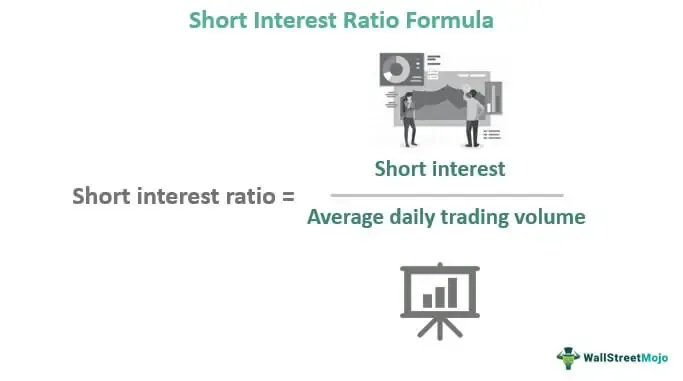

In today's fast-paced financial environment, the ability to navigate complex markets is crucial for investment success. This article explores the interplay between financial markets, investing, short interest, and algorithmic trading, offering insights into how these components contribute to the ever-evolving landscape of modern trading strategies. 

Financial markets, encompassing stocks, bonds, forex, and derivatives, form the backbone of the global economy. They facilitate the exchange of capital, provide liquidity, and serve as a barometer for economic health. Understanding these markets' inner workings and the driving forces behind their fluctuations is essential for anyone looking to make informed investment decisions.



Investing, at its core, is the allocation of resources with the expectation of generating returns. It involves a multitude of assets, from traditional stocks and bonds to mutual funds and exchange-traded funds (ETFs). Each investment vehicle carries its own set of risks and rewards, necessitating a strong grasp of risk management and strategic planning to build a balanced and diversified portfolio.

Short interest is a key metric within stock markets, reflecting the volume of shares that investors have sold short. It can serve as a barometer for market sentiment and potential volatility, especially when viewed alongside other indicators. A significant short interest might suggest investor pessimism or a potential for "short squeezes," where rapid price increases force short sellers to cover their positions at a loss.

Algorithmic trading, often regarded as the future of investing, employs computer algorithms to execute trades at speeds and frequencies beyond human capability. These algorithms harness data analytics and machine learning to identify patterns and optimize trading strategies, offering advantages in speed, efficiency, and consistency. However, they also present unique challenges and risks, raising questions about market fairness, transparency, and ethical considerations.

The interconnectedness of these concepts forms the foundation for contemporary trading strategies. Short interest data can influence algorithmic trading models, affecting how trades are executed and impacting market dynamics. In this article, we aim to provide a comprehensive understanding of how these elements interact, enabling investors to better navigate the complexities of today's financial landscape. By doing so, we hope to equip readers with the knowledge and tools needed to adapt and thrive in an ever-changing world of finance.

## Table of Contents

## Understanding Financial Markets

Financial markets are integral to the global economy, serving as platforms where financial instruments, such as stocks, bonds, currencies, and derivatives, are bought and sold. These markets play crucial roles in price discovery, [liquidity](/wiki/liquidity-risk-premium) provision, risk transfer, and capital allocation. Through the various transactions facilitated, financial markets help determine the value of securities, allow for the efficient flow of funds from savers to borrowers, and distribute risk among participants.

### Types of Financial Markets

1. **Stock Markets**: Stock markets are venues where shares of publicly listed companies are traded. They function as primary markets for new issues through Initial Public Offerings (IPOs) and secondary markets for trading existing shares. Major stock exchanges like the New York Stock Exchange (NYSE) and Nasdaq are critical in enabling companies to raise capital and providing investors with a platform to buy and sell equity.

2. **Bond Markets**: Also known as debt markets, bond markets allow entities, including governments and corporations, to raise capital by issuing debt securities. Bonds are obligations that pay interest over time and return the principal at maturity. The bond market is vital for providing the funds necessary for public spending and corporate investment.

3. **Forex Markets**: The foreign exchange (forex) market facilitates the trading of currencies and is crucial for international trade and investment. It is the largest and most liquid financial market globally, with transactions occurring electronically over-the-counter between participants worldwide. Exchange rates set in the forex market determine the relative value of currencies.

4. **Derivatives Markets**: Derivatives are financial contracts whose value depends on an underlying asset, such as commodities, currencies, or interest rates. These include options, futures, and swaps, among others. Derivatives markets enable risk management and speculative opportunities by allowing participants to hedge or assume risk.

### Role in the Global Economy

Financial markets drive economic growth by enabling capital formation and fostering corporate and entrepreneurial activity. They facilitate the flow of funds across borders, contributing to global economic integration. By providing mechanisms for risk-sharing, financial markets support economic stability and innovation.

### Technological Transformation

Modern technology is significantly transforming financial markets. Advances in computing power, data analytics, and communication networks have led to the rise of [algorithmic trading](/wiki/algorithmic-trading), where computer algorithms execute trades at high speeds. This has increased market efficiency and liquidity but also introduced challenges such as flash crashes and systemic risks due to erroneous algorithmic trading strategies.

Digital platforms, blockchain technologies, and cryptocurrencies are also reshaping markets by enabling decentralized trading and seamless cross-border transactions. These innovations promise reduced transaction costs and enhanced transparency but require new regulatory frameworks.

### Challenges and Opportunities

Today's financial markets face several challenges, including regulatory changes, geopolitical tensions, and the environmental impact of trading activities. Market participants must adapt to evolving regulations that aim to enhance transparency and reduce systemic risks.

Opportunities arise from ongoing technological advancements, offering new ways to enhance trading strategies, improve risk management, and reach global participants. As markets continue to evolve, staying informed and adaptable is crucial for investors looking to capitalize on emerging trends and navigate uncertainties.

## Basics of Investing

Investing is the process of allocating resources, typically capital, with the expectation of generating an income or profit. The primary objective of investing is to build wealth over time while maintaining a balance between risk and reward based on individual financial goals and risk tolerance. In the context of financial markets, investing involves the purchase of assets, such as stocks, bonds, or real estate, that are expected to increase in value or provide returns in the form of interest, dividends, or capital gains.

Investment vehicles are varied, each with unique characteristics and risks. Stocks represent ownership in a company and entitle the holder to a share of the company's profits and assets. They can offer substantial returns, but they also come with the risk of loss, as stock prices can be volatile. Bonds are debt securities issued by corporations or governments that pay interest over time and return the principal upon maturity. They are generally considered safer than stocks but often provide lower returns.

Mutual funds pool money from multiple investors to purchase a diversified portfolio of stocks, bonds, or other securities. They offer investors access to professional management and diversification but come with management fees and other costs. Exchange-Traded Funds (ETFs) are similar to mutual funds but trade on stock exchanges like individual stocks. This allows for more flexibility in trading and typically lower fees, making them a popular choice for individual investors.

Risk management is a crucial aspect of investing, as it involves identifying, assessing, and prioritizing risks followed by coordinated efforts to minimize, monitor, and control the probability or impact of unfortunate events. Effective risk management ensures that investors do not take on more risk than they can handle, safeguarding their portfolios against significant losses. Techniques such as asset allocation, diversification, and hedging are commonly utilized to manage risk.

Investment strategies vary widely and cater to different types of investors. Growth investing focuses on companies expected to grow faster than the market average, appealing to investors seeking capital appreciation. Value investing involves selecting undervalued stocks with strong fundamentals, appealing to those looking for bargains. Income investing concentrates on securities that provide steady income streams, such as dividend stocks or bonds, attracting those who prioritize regular cash flow.

Diversification is the practice of spreading investments across various financial instruments, industries, and other categories to reduce exposure to any single asset or risk. By investing in a mix of asset classes and securities, investors can minimize the impact of poor performance by any one investment on the overall portfolio. The goal is to achieve a balanced portfolio that can weather market [volatility](/wiki/volatility-trading-strategies) while providing stable returns.

To implement diversification in a balanced investment portfolio, investors often allocate assets using a mix of stocks, bonds, and other investments based on their risk tolerance and investment horizon. A conventional approach might involve a higher percentage of stocks for long-term growth in a younger investor's portfolio and a greater concentration of bonds for capital preservation in a retiree's portfolio. This strategy maximizes the benefits of diversification: potential for high returns while mitigating risks.

 to Short Interest

Short interest represents the total number of shares that have been sold short by investors but not yet covered or closed out. This metric is of significant interest in the stock market as it reflects investor sentiment regarding a particular stock. Typically, a high short interest indicates that a substantial number of investors believe the stock's price will decline, potentially signaling a bearish outlook. Conversely, a low short interest may suggest that investors have a more bullish stance.

### Calculation and Interpretation 

Short interest is calculated as the total number of shares sold short but not yet repurchased. It is often expressed as a percentage of the total outstanding shares, known as the "short interest ratio" or "days to cover". This ratio is calculated using the formula:

$$
\text{Short Interest Ratio} = \frac{\text{Total Shares Short}}{\text{Average Daily Trading Volume}}
$$

Investors and analysts employ short interest data to gauge the market sentiment surrounding a stock. A rising short interest may indicate growing pessimism, while a declining short interest can suggest increasing optimism. However, interpretations should be contextual, taking into account broader market conditions and company-specific factors.

### Strategies and Risks Associated with Short Selling 

Short selling involves borrowing shares and selling them on the market with the expectation of repurchasing them at a lower price. While this strategy can yield high returns in bearish markets, it carries significant risks. If the stock price rises instead of falls, short sellers can incur unlimited losses. This risk is exemplified by the need to buy back shares at potentially higher prices to cover the short sale, resulting in potentially steep financial losses.

One primary risk associated with short selling is a "short squeeze," which occurs when a heavily shorted stock's price begins to rise. This can force short sellers to cover their positions by purchasing shares, further driving up the price.

### Impact of High Short Interest on Market Dynamics 

High short interest in a stock can lead to increased volatility. As short sellers cover their positions, this can result in rapid price increases, causing significant market shifts. Such dynamics can create opportunities and challenges for different types of investors. While some may see it as a chance to enter or [exit](/wiki/exit-strategy) positions profitably, others may face substantial losses due to unexpected price movements.

A high short interest can also fuel speculative trading, where traders might bet on a potential short squeeze, leading to increased buying activity that propels the stock price higher.

### Notable Historical Short Squeezes

One of the most notable short squeezes in history involved Volkswagen in 2008. As Porsche revealed its stake in Volkswagen, the stock price surged, catching many short sellers off guard and causing a significant market upheaval. More recently, the 2021 GameStop short squeeze drew widespread attention, where retail investors coordinated to buy the stock, driving its price sharply upward and forcing many institutional investors to cover short positions at substantial losses.

These examples illustrate the profound impact that short interest and related market dynamics can have, highlighting the risks and rewards inherent in short selling practices. Understanding these elements is crucial for traders and investors aiming to navigate complex market environments effectively.

## Algo Trading: The Future of Investing

Algorithmic trading, often referred to as algo trading, is a method of executing orders using automated pre-programmed trading instructions. These algorithms, typically implemented in software, execute trades at high speeds and with precision, often based on complex mathematical models and formulas. Algo trading plays a significant role in modern financial markets, providing a means for institutional investors and hedge funds to manage large volumes of trade efficiently and effectively.

The core of algorithmic trading lies in the use of algorithms to analyze vast datasets, identify trading opportunities, and execute trades with minimal human intervention. These algorithms can process information much faster than human traders, executing thousands of trades in seconds. The technology behind algo trading primarily involves high-speed internet connections, powerful computing facilities, and sophisticated software that can react to real-time market data. Additionally, these systems often incorporate [machine learning](/wiki/machine-learning) techniques and data analytics to refine and optimize trading strategies.

There are several advantages to algorithmic trading. Firstly, the speed at which trades are executed is unparalleled, with algorithms capable of placing orders within milliseconds. This speed allows traders to capitalize on fleeting market opportunities more effectively than manual trading. Secondly, algorithmic trading enhances efficiency by minimizing the potential for human error. Algorithms operate based on predefined criteria, ensuring consistent application of trading strategies. Lastly, the consistency of algorithmic trading is a significant advantage, as algorithms follow their programmed logic without deviation, reducing emotional decision-making prone to affect human traders.

Despite its advantages, algorithmic trading is not without challenges and risks. One significant challenge is the reliance on complex models, which may not always correctly predict market movements, leading to substantial financial losses. Technical failures, such as glitches in software or connectivity issues, can result in unintended trades or missed opportunities. Furthermore, algorithmic trading can contribute to increased market volatility, as high-speed trades may exacerbate price swings.

Ethical considerations also arise with the use of algorithmic trading. The rapid and often opaque nature of these trades can disadvantage traditional investors, raising concerns about fairness and market access. There is also the potential for algorithms to be used maliciously, such as through manipulation of market prices, which could undermine overall market integrity.

The regulatory landscape surrounding algorithmic trading is evolving to address these challenges. Regulatory bodies are implementing rules to ensure transparency and stability in markets dominated by algorithmic trades. For example, traders may be required to submit their algorithms for review to prevent market manipulation, and there are ongoing discussions about implementing measures to slow down trading to mitigate flash crashes.

In conclusion, while algorithmic trading represents the future of investing due to its speed, efficiency, and consistency, it also poses challenges and ethical considerations that require careful management through robust regulatory frameworks. As technology continues to evolve, so will the sophistication of these algorithms, necessitating ongoing dialogue between market participants and regulators to ensure fair and stable financial markets.

## The Interplay Between Short Interest and Algo Trading

Algorithmic trading, commonly known as algo trading, leverages mathematical models and pre-programmed trading instructions to execute orders at speeds and frequencies that are beyond the capabilities of any human trader. When applied to short interest data, these algorithms can unearth unique opportunities and make more precise market predictions.

Algo trading strategies that exploit short interest data utilize the concept that high levels of short interest often signal potential market movements due to the underlying bearish sentiment among investors. Short interest, defined as the total number of shares of a particular stock that have been sold short but have not yet been closed out, can play a pivotal role in forecasting market shifts. Traders can use this data to implement contrarian strategies, such as anticipating short squeezes, where prices rise suddenly as short sellers cover their positions.

### Data Analytics and Machine Learning

A cornerstone of exploiting short interest through algo trading lies in the sophisticated use of data analytics and machine learning algorithms. These advanced techniques facilitate the identification of patterns and correlations that may be missed by conventional analysis. Machine learning models, for instance, can process vast datasets to discern historical patterns between short interest spikes and subsequent price movements.

A basic machine learning model might involve features such as current short interest, historical short interest trends, trading [volume](/wiki/volume-trading-strategy), and volatility to predict price movements. Using Python, a simple linear regression might look like:

```python
from sklearn.linear_model import LinearRegression
import numpy as np

# Features: Short interest, trading volume, historical volatility
X = np.array([[0.15, 200000, 0.8], [0.18, 300000, 1.0], [0.22, 250000, 0.9]])
# Target: Subsequent price movement
y = np.array([2.5, -1.0, 3.0])

model = LinearRegression().fit(X, y)
prediction = model.predict(np.array([[0.25, 350000, 1.2]]))

print("Predicted price movement:", prediction)
```

### Enhanced Market Predictions

The amalgamation of short interest data with algo trading enables enhanced market predictions by delivering real-time analyses and forecasts. This integration is powered by the continuous influx of data and the real-time processing capabilities inherent in algorithmic systems. 

A significant advantage of this approach is the ability to anticipate potential short squeezes, where a heavily shorted stock's price significantly climbs, forcing short sellers to cover their positions, further driving up the price. By predicting such events, algorithms can engage in timely trades to capitalize on rapid price increases.

### Examples of Successful Strategies

Numerous hedge funds and trading firms have utilized strategies that incorporate short interest data. For example, the 2021 GameStop short squeeze became an iconic case of how massive short interest data can lead to substantial market movements. Algo trading strategies that identified and acted on this short interest derived significant financial gains during the rapid escalation in the stock’s price.

### Innovation and Research

The continued evolution of algo trading harnessing short interest data is underpinned by ongoing innovation in data science and financial research. Advancements in machine learning technologies such as [deep learning](/wiki/deep-learning) models and [reinforcement learning](/wiki/reinforcement-learning) are being explored to enhance predictive accuracy and develop more robust trading algorithms. Additionally, academic and industry research frequently tackles the challenges of integrating [alternative data](/wiki/best-alternative-data) sources and refining algorithms to cope with the increasing complexity of financial markets.

In summary, the interplay between algo trading and short interest data holds significant potential for generating alpha and improving market efficiency. As technological capabilities continue to advance, this area is likely to yield even more sophisticated and effective trading strategies.

## Risk Management and Regulatory Considerations

Risk management is a cornerstone of effective trading, particularly in the complex realms of short interest and algorithmic trading. The inherent volatility and unpredictable nature of financial markets necessitate robust strategies to protect investments and maintain market integrity.

**Common Risks in Short Interest and Algo Trading**

Short interest involves borrowing shares to sell them with the intention of repurchasing them at a lower price, a strategy fraught with risks. One central risk is the "short squeeze," where a stock's price rises unexpectedly, forcing short sellers to buy back at higher prices, leading to further price escalation. For algo trading, the primary risks include technical failures, algorithmic errors, and data inaccuracies. The "flash crash" of 2010 exemplifies such risks, where rapid sell-offs triggered by algorithmic trades led to a dramatic market drop within minutes.

Mitigating these risks requires comprehensive strategies. For short interest, maintaining appropriate margin levels and employing stop-loss orders can shield against sudden market reversals. In algorithmic trading, [backtesting](/wiki/backtesting) algorithms extensively, continuous monitoring, and having fail-safes like circuit breakers can reduce technical risks.

**Regulatory Framework**

The regulation of short selling and algo trading is critical to ensuring market fairness and efficiency. Short selling is governed by regulations such as the SEC's Rule 201 in the United States, which curtails short selling when a stock's price drops significantly. This prevents abusive practices that could exaggerate price declines. 

Algorithmic trading, meanwhile, falls under various regulations depending on the jurisdiction. In the U.S., it is subject to requirements by the SEC and FINRA, focusing on maintaining fair trading practices and preventing market manipulation. The European Union’s MiFID II mandates that high-frequency trading firms register with authorities, ensuring oversight and minimizing systemic risk.

**Transparency and Accountability**

Transparency is crucial in mitigating risks associated with these trading practices. Accurate and timely reporting of short interest data allows investors to understand market sentiment and make informed decisions. Algorithmic trading entities often need to disclose their strategies and algorithms to regulators to ensure compliance and prevent manipulative practices.

Accountability mechanisms, such as post-trade reporting and audit trails, further bolster market integrity. These measures help trace trade executions back to their algorithms, ensuring firms adhere to fair trading practices.

**Recent Regulatory Changes**

In recent years, regulations have evolved to address changing market dynamics. After episodes of extreme volatility, such as the GameStop short squeeze in early 2021, regulatory bodies have scrutinized short sales data reporting and have contemplated tighter controls to ensure transparency.

Similarly, for algo trading, ongoing advancements in monitoring technologies have led to improved surveillance capabilities. This results in more stringent checks on algorithmic strategies to prevent market abuses. These regulatory enhancements aim to strengthen market resilience and protect investors, ensuring that the benefits of financial innovation do not come at the cost of stability and fairness.

In conclusion, while technologies and strategies in financial markets continue to evolve, the foundational principles of risk management and regulatory oversight remain critical. A rigorous approach to managing risks and complying with regulations not only safeguards individual investments but also contributes to the overall stability and integrity of financial markets.

## Conclusion

Throughout this article, we explored the intricate dynamics of financial markets, the principles of investing, the implications of short interest, and the pivotal role of algorithmic trading or algo trading. These components are integral to understanding the complex architecture of modern financial markets. The convergence of these elements underscores the importance of having a nuanced grasp of their interplay for successful investment strategies.

In today's financial environment, staying informed and adaptable is crucial for investors. Market structures and trading methods are continually evolving, influenced by technological advancements and shifting economic landscapes. This requires investors and traders to maintain a proactive approach, consistently updating their knowledge and strategies to navigate these changes effectively.

For those aiming to broaden their understanding, the next logical step would be to engage with advanced learning resources. This might include academic courses on financial engineering, [books](/wiki/algo-trading-books) on investment strategies, and workshops on algorithmic trading. Engaging with online platforms like Coursera, edX, or specialized trading courses can offer valuable insights into these areas.

Looking to the future, the landscape of financial markets and investing is poised for rapid transformation. The integration of [artificial intelligence](/wiki/ai-artificial-intelligence) (AI) and machine learning in trading strategies presents unprecedented opportunities for enhanced market predictions and investment outcomes. Coupled with the growing influence of decentralized finance (DeFi) and blockchain technologies, these developments could redefine the traditional confines of investing. As these innovations unfold, the emphasis on transparency, ethical considerations, and regulatory compliance will be paramount in sustaining market integrity and fostering investor confidence. Such future advancements promise to make financial markets more accessible, efficient, and responsive to the global economy's needs.

## References & Further Reading

[1]: ["Algorithms for Hyper-Parameter Optimization"](https://papers.nips.cc/paper/4443-algorithms-for-hyper-parameter-optimization.pdf) by J. Bergstra, R. Bardenet, Y. Bengio, & B. Kégl, Advances in Neural Information Processing Systems 24, 2011.

[2]: ["Advances in Financial Machine Learning"](https://www.amazon.com/Advances-Financial-Machine-Learning-Marcos/dp/1119482089) by Marcos Lopez de Prado, 2018.

[3]: ["Evidence-Based Technical Analysis: Applying the Scientific Method and Statistical Inference to Trading Signals"](https://www.amazon.com/Evidence-Based-Technical-Analysis-Scientific-Statistical/dp/0470008741) by David Aronson, 2006.

[4]: ["Machine Learning for Algorithmic Trading"](https://github.com/PacktPublishing/Machine-Learning-for-Algorithmic-Trading-Second-Edition) by Stefan Jansen, 2020.

[5]: ["Quantitative Trading: How to Build Your Own Algorithmic Trading Business"](https://books.google.com/books/about/Quantitative_Trading.html?id=j70yEAAAQBAJ) by Ernest P. Chan, 2009.