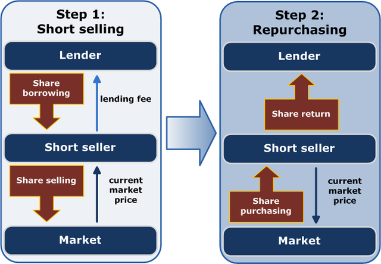

## Table of Contents

## What is short interest and how is it defined in financial markets?

Short interest is a term used in financial markets to describe the total number of shares of a particular stock that investors have sold short but have not yet covered or closed out. When someone sells a stock short, they are essentially betting that the price of the stock will go down. They do this by borrowing shares from a broker and selling them on the market, with the intention of buying them back later at a lower price to return to the broker, pocketing the difference as profit.

Short interest is often expressed as a number of shares or as a percentage of the company's total float, which is the number of shares available for public trading. This figure is important because it can give investors an idea of how bearish, or negative, the market sentiment is towards a particular stock. A high short interest might indicate that many investors believe the stock's price will fall, while a low short interest might suggest the opposite. Tracking changes in short interest over time can also provide insights into market trends and potential price movements.

## How is short interest calculated and reported?

Short interest is calculated by adding up all the shares of a stock that have been sold short and not yet bought back. This information comes from the records of brokers who lend out shares for short selling. To find the short interest for a specific stock, these numbers are collected and totaled. The short interest can be shown as a number of shares or as a percentage of the stock's total float, which is the number of shares available for the public to trade.

The short interest is reported by financial organizations like stock exchanges and financial data providers. In the United States, for example, the Financial Industry Regulatory Authority (FINRA) releases short interest data twice a month, on the second and fourth Fridays. This data helps investors understand how many people are betting against a stock. By looking at these reports, investors can see if the short interest is going up or down, which can give them clues about what other investors think will happen to the stock's price in the future.

## What does a high short interest indicate about a stock?

A high short interest indicates that a lot of investors think the price of a stock will go down. When many people sell a stock short, it means they are betting against it. They borrow the stock and sell it, hoping to buy it back later at a lower price. So, if a stock has a high short interest, it shows that there is a lot of negative thinking about its future. This can make the stock seem riskier because if everyone is betting it will fall, it might actually happen.

However, a high short interest can also lead to something called a short squeeze. This happens when the stock price starts to go up instead of down. The people who sold the stock short now have to buy it back to cover their positions, but if the price keeps rising, they might lose money. This rush to buy back the stock can push the price even higher. So, while a high short interest usually means people think the stock will drop, it can sometimes lead to big price jumps if the situation changes.

## How can short interest affect a stock's price?

Short interest can affect a stock's price in a few ways. When a lot of people are betting against a stock by short selling it, it can make other investors nervous. They might think there's a good reason so many people are betting the price will go down, so they might sell their shares too. This extra selling can push the stock's price lower. So, a high short interest can sometimes make a stock's price drop because it shows that many people think the stock will go down.

But, there's another thing that can happen with high short interest called a short squeeze. If the stock's price starts to go up instead of down, the people who shorted the stock might start to panic. They need to buy back the shares they borrowed to cover their short positions, but if the price keeps going up, they might lose money. This rush to buy back the stock can make the price go up even more. So, even though high short interest usually means people think the stock will drop, it can sometimes make the price jump if things change and a short squeeze happens.

## What is a short squeeze and how is it related to short interest?

A short squeeze happens when a stock's price starts to go up instead of down, and people who have bet against the stock by short selling it start to panic. When you short sell a stock, you borrow it and sell it, hoping to buy it back later at a lower price. But if the price goes up, you lose money. So, if the price keeps going up, these people need to buy the stock back quickly to stop losing more money. This rush to buy back the stock can push the price even higher.

A short squeeze is related to short interest because it's more likely to happen when a lot of people have shorted a stock. The short interest shows how many people are betting against the stock. If the short interest is high, it means a lot of people are in the same situation, waiting to buy back the stock. So, if something makes the price go up, like good news about the company, all these people might start buying at the same time, causing a short squeeze. This can make the stock's price jump a lot in a short time.

## How do investors use short interest data to make trading decisions?

Investors use short interest data to figure out what other people think about a stock. If the short interest is high, it means a lot of people are betting the stock's price will go down. This can make an investor think twice before buying the stock because it might mean there's a good reason so many people are betting against it. On the other hand, if the short interest is low, it might mean most people think the stock's price will go up or stay the same. By looking at short interest, investors can get a sense of the market's mood towards a stock.

Sometimes, investors use short interest data to look for stocks that might be good for a short squeeze. If a stock has a very high short interest and something happens to make the price go up, like good news about the company, a lot of people might need to buy the stock back at once. This can make the price jump a lot. So, some investors try to find stocks with high short interest and then buy them if they think the price might go up soon. This way, they can make money from the short squeeze.

## What are the risks associated with short selling and high short interest?

Short selling and high short interest come with big risks. When you short sell, you borrow a stock and sell it, hoping to buy it back later at a lower price. But if the price goes up instead, you lose money. The more the price goes up, the more you lose. This can be a big problem because, unlike buying a stock where the most you can lose is what you paid for it, with short selling, your losses can keep growing if the price keeps going up. It's like a hole that gets deeper the longer you're in it.

High short interest also adds to the risk. If a lot of people have shorted a stock, it means a lot of people are betting the price will go down. But if something happens to make the price go up, like good news about the company, all these people might rush to buy the stock back at the same time. This can cause a short squeeze, where the price jumps a lot very quickly. If you're one of the people who shorted the stock, you could lose a lot of money fast. So, high short interest can make things even riskier because it can lead to big price swings that are hard to predict.

## How does short interest vary across different sectors and market conditions?

Short interest can be different in different sectors and can change depending on what's happening in the market. Some sectors, like tech or finance, might have more short interest because they can be riskier or have more ups and downs. People might bet against these stocks more often because they think the prices could drop. Other sectors, like utilities or consumer goods, might have less short interest because they're seen as more stable and less likely to have big price changes.

Market conditions also play a big role in how much short interest there is. When the market is doing well and people are feeling good about the economy, there might be less short interest because fewer people are betting against stocks. But if the market is going down or people are worried about a recession, short interest might go up because more people might think stock prices will fall. So, short interest can tell us a lot about what people think will happen in different sectors and how they feel about the market overall.

## What historical examples illustrate the impact of short interest on market events?

One famous example of short interest affecting the market is the 2008 financial crisis. During that time, a lot of people were betting against banks and financial companies because they thought these stocks would go down. The short interest in these stocks was very high. When the crisis hit and these stocks did start to fall, it made things even worse. The high short interest made the prices drop faster and deeper, which added to the panic and made the crisis even more severe.

Another example is the GameStop short squeeze in early 2021. GameStop, a video game store, had a lot of people betting against it because they thought the company was not doing well. The short interest was really high. But then, a group of people on the internet decided to buy a lot of GameStop stock to try to make the price go up. When the price did start to go up, the people who had shorted the stock panicked and started buying it back to stop losing money. This caused a short squeeze, making the stock price jump from around $20 to over $400 in just a few weeks. It showed how high short interest can lead to big price swings if things change suddenly.

## How do regulatory bodies monitor and regulate short interest?

Regulatory bodies keep an eye on short interest to make sure everything is fair and to stop people from doing things that could hurt the market. In the United States, the Financial Industry Regulatory Authority (FINRA) is one of the groups that watches short interest. They make sure that brokers are following the rules when they lend out shares for short selling. They also collect data about how many shares of each stock have been sold short and share this information with the public twice a month. This helps everyone see what's going on and can stop people from trying to hide what they're doing.

Sometimes, regulators also step in to stop short selling from getting out of control. For example, during big market problems, they might put rules in place to slow down short selling. They do this to stop people from making the market go down even more by betting against stocks too much. By keeping an eye on short interest and making rules when needed, regulatory bodies help keep the market stable and fair for everyone.

## What advanced metrics, beyond basic short interest, can provide deeper insights into market sentiment?

Besides just looking at how many people are betting against a stock, there are other ways to get a better idea of what people think about the market. One way is to look at the short interest ratio, which is also called days to cover. This tells you how many days it would take for everyone who shorted a stock to buy it back, based on how many shares are traded each day. If this number is high, it means a lot of people are betting against the stock and it might take a long time for them to buy back their shares. This can make the stock more likely to have a big price jump if something good happens and people start buying it back quickly.

Another useful metric is the short interest as a percentage of the float. The float is the number of shares that are available for people to buy and sell. If a lot of the float is being shorted, it means a big part of the stock is being bet against. This can show that a lot of people think the stock's price will go down. But, if the short interest as a percentage of the float is low, it might mean most people think the stock's price will stay the same or go up. By looking at these advanced metrics, investors can get a clearer picture of what other people think about a stock and make better decisions about what to do with their money.

## How can algorithmic trading strategies incorporate short interest data for better performance?

Algorithmic trading strategies can use short interest data to make better guesses about what might happen to a stock's price. By looking at how many people are betting against a stock, these strategies can spot when a stock might be ready for a big price jump or drop. For example, if a stock has a very high short interest and something good happens to make the price go up, the strategy might buy the stock quickly to take advantage of a short squeeze. On the other hand, if the short interest is high and nothing changes, the strategy might decide to sell the stock or bet against it too, thinking the price will go down.

These strategies can also use more advanced metrics like the short interest ratio and the short interest as a percentage of the float to get a better idea of the market's mood. The short interest ratio tells how many days it would take for everyone who shorted a stock to buy it back. If this number is high, it might mean the stock is more likely to have a big price change if something good happens. The short interest as a percentage of the float shows how much of the stock is being bet against. By putting these pieces of information together, [algorithmic trading](/wiki/algorithmic-trading) strategies can make smarter choices about when to buy or sell, helping them to do better in the market.

## What are the basics of investing?

Investing is the process of allocating resources, typically capital, with the expectation of generating an income or profit. The primary objective of investing is to build wealth over time while maintaining a balance between risk and reward based on individual financial goals and risk tolerance. In the context of financial markets, investing involves the purchase of assets, such as stocks, bonds, or real estate, that are expected to increase in value or provide returns in the form of interest, dividends, or capital gains.

Investment vehicles are varied, each with unique characteristics and risks. Stocks represent ownership in a company and entitle the holder to a share of the company's profits and assets. They can offer substantial returns, but they also come with the risk of loss, as stock prices can be volatile. Bonds are debt securities issued by corporations or governments that pay interest over time and return the principal upon maturity. They are generally considered safer than stocks but often provide lower returns.

Mutual funds pool money from multiple investors to purchase a diversified portfolio of stocks, bonds, or other securities. They offer investors access to professional management and diversification but come with management fees and other costs. Exchange-Traded Funds (ETFs) are similar to mutual funds but trade on stock exchanges like individual stocks. This allows for more flexibility in trading and typically lower fees, making them a popular choice for individual investors.

Risk management is a crucial aspect of investing, as it involves identifying, assessing, and prioritizing risks followed by coordinated efforts to minimize, monitor, and control the probability or impact of unfortunate events. Effective risk management ensures that investors do not take on more risk than they can handle, safeguarding their portfolios against significant losses. Techniques such as asset allocation, diversification, and hedging are commonly utilized to manage risk.

Investment strategies vary widely and cater to different types of investors. Growth investing focuses on companies expected to grow faster than the market average, appealing to investors seeking capital appreciation. Value investing involves selecting undervalued stocks with strong fundamentals, appealing to those looking for bargains. Income investing concentrates on securities that provide steady income streams, such as dividend stocks or bonds, attracting those who prioritize regular cash flow.

Diversification is the practice of spreading investments across various financial instruments, industries, and other categories to reduce exposure to any single asset or risk. By investing in a mix of asset classes and securities, investors can minimize the impact of poor performance by any one investment on the overall portfolio. The goal is to achieve a balanced portfolio that can weather market [volatility](/wiki/volatility-trading-strategies) while providing stable returns.

To implement diversification in a balanced investment portfolio, investors often allocate assets using a mix of stocks, bonds, and other investments based on their risk tolerance and investment horizon. A conventional approach might involve a higher percentage of stocks for long-term growth in a younger investor's portfolio and a greater concentration of bonds for capital preservation in a retiree's portfolio. This strategy maximizes the benefits of diversification: potential for high returns while mitigating risks.

 to Short Interest

Short interest represents the total number of shares that have been sold short by investors but not yet covered or closed out. This metric is of significant interest in the stock market as it reflects investor sentiment regarding a particular stock. Typically, a high short interest indicates that a substantial number of investors believe the stock's price will decline, potentially signaling a bearish outlook. Conversely, a low short interest may suggest that investors have a more bullish stance.

### Calculation and Interpretation 

Short interest is calculated as the total number of shares sold short but not yet repurchased. It is often expressed as a percentage of the total outstanding shares, known as the "short interest ratio" or "days to cover". This ratio is calculated using the formula:

$$
\text{Short Interest Ratio} = \frac{\text{Total Shares Short}}{\text{Average Daily Trading Volume}}
$$

Investors and analysts employ short interest data to gauge the market sentiment surrounding a stock. A rising short interest may indicate growing pessimism, while a declining short interest can suggest increasing optimism. However, interpretations should be contextual, taking into account broader market conditions and company-specific factors.

### Strategies and Risks Associated with Short Selling 

Short selling involves borrowing shares and selling them on the market with the expectation of repurchasing them at a lower price. While this strategy can yield high returns in bearish markets, it carries significant risks. If the stock price rises instead of falls, short sellers can incur unlimited losses. This risk is exemplified by the need to buy back shares at potentially higher prices to cover the short sale, resulting in potentially steep financial losses.

One primary risk associated with short selling is a "short squeeze," which occurs when a heavily shorted stock's price begins to rise. This can force short sellers to cover their positions by purchasing shares, further driving up the price.

### Impact of High Short Interest on Market Dynamics 

High short interest in a stock can lead to increased volatility. As short sellers cover their positions, this can result in rapid price increases, causing significant market shifts. Such dynamics can create opportunities and challenges for different types of investors. While some may see it as a chance to enter or [exit](/wiki/exit-strategy) positions profitably, others may face substantial losses due to unexpected price movements.

A high short interest can also fuel speculative trading, where traders might bet on a potential short squeeze, leading to increased buying activity that propels the stock price higher.

### Notable Historical Short Squeezes

One of the most notable short squeezes in history involved Volkswagen in 2008. As Porsche revealed its stake in Volkswagen, the stock price surged, catching many short sellers off guard and causing a significant market upheaval. More recently, the 2021 GameStop short squeeze drew widespread attention, where retail investors coordinated to buy the stock, driving its price sharply upward and forcing many institutional investors to cover short positions at substantial losses.

These examples illustrate the profound impact that short interest and related market dynamics can have, highlighting the risks and rewards inherent in short selling practices. Understanding these elements is crucial for traders and investors aiming to navigate complex market environments effectively.

## References & Further Reading

[1]: ["Algorithms for Hyper-Parameter Optimization"](https://papers.nips.cc/paper/4443-algorithms-for-hyper-parameter-optimization.pdf) by J. Bergstra, R. Bardenet, Y. Bengio, & B. Kégl, Advances in Neural Information Processing Systems 24, 2011.

[2]: ["Advances in Financial Machine Learning"](https://www.amazon.com/Advances-Financial-Machine-Learning-Marcos/dp/1119482089) by Marcos Lopez de Prado, 2018.

[3]: ["Evidence-Based Technical Analysis: Applying the Scientific Method and Statistical Inference to Trading Signals"](https://www.amazon.com/Evidence-Based-Technical-Analysis-Scientific-Statistical/dp/0470008741) by David Aronson, 2006.

[4]: ["Machine Learning for Algorithmic Trading"](https://github.com/PacktPublishing/Machine-Learning-for-Algorithmic-Trading-Second-Edition) by Stefan Jansen, 2020.

[5]: ["Quantitative Trading: How to Build Your Own Algorithmic Trading Business"](https://books.google.com/books/about/Quantitative_Trading.html?id=j70yEAAAQBAJ) by Ernest P. Chan, 2009.