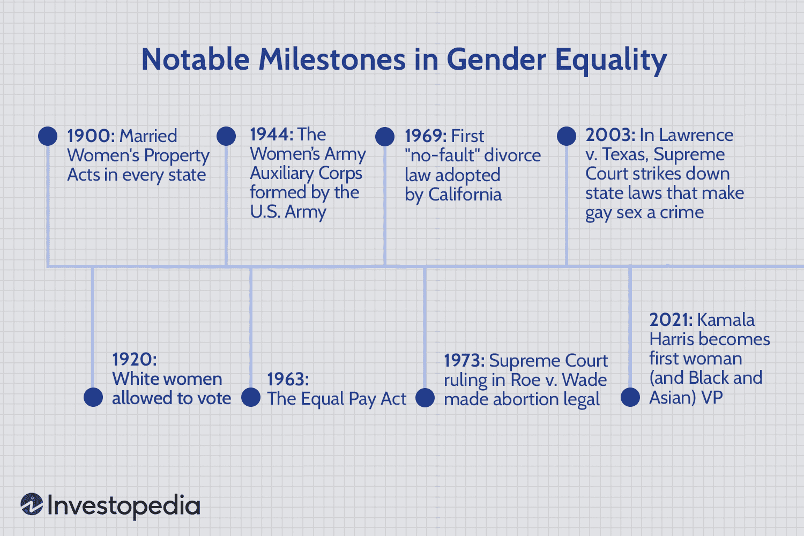

In an era where social issues remain at the forefront of global discussions, equal rights and gender equality continue to play crucial roles in driving societal progress. These principles underpin efforts to create equitable societies where opportunities and resources are accessible to all individuals, irrespective of gender. As societies worldwide push for these ideals, the landscape of various industries, particularly financial markets, is evolving in tandem.

Financial markets have seen profound changes with the advent of technology-driven strategies like algorithmic trading. This form of trading employs computer algorithms to automate and optimize trading decisions, offering advantages such as faster execution, enhanced liquidity, and the capacity to incorporate vast, complex data sets. With the increased sophistication of these markets, algorithmic trading has become a potent force, reshaping how investments are approached and managed.



This article highlights the intersection of gender equality and the shifting dynamics of algorithmic trading. It seeks to illuminate how advocating for equal rights can instigate inclusive progress across multiple sectors, particularly in finance. The promotion of gender equality is not only a matter of justice and fairness but also a strategic driver of economic growth. By integrating diverse perspectives and talents, industries can unleash innovative potential that benefits society as a whole.

We will also examine the implications of gender equality within financial markets and its broader impacts on economic prosperity. Ensuring that both men and women have equal opportunities in finance, including algorithmic trading platforms, promises to enhance not just individual success but the overall functionality and fairness of economic systems. The inclusive growth spurred by gender equality can contribute to more stable and innovative economies, ultimately driving positive societal change across the globe.

## Table of Contents

## Historical Milestones in Gender Equality

Throughout history, numerous milestones have significantly advanced women's rights and gender equality. One of the earliest significant legal reforms was the Married Women's Property Act of 1848. This act was crucial as it allowed women to own and control property in their own right, challenging the legal doctrine of coverture, where a married woman's rights and obligations were subsumed by those of her husband. The Act marked a fundamental shift towards acknowledging women's agency and financial independence.

The trajectory of gender equality continued to gain [momentum](/wiki/momentum) with the passage of the 19th Amendment to the United States Constitution in 1920, granting women the right to vote. This seminal moment represented a monumental shift in political recognition and empowerment of women, encapsulating decades of suffrage movements across the globe. The amendment was not just a victory for women's rights but also for the broader democratic ideals of equality and representation.

Another historic development was the passage of the Equal Pay Act of 1963 in the United States. This act aimed to abolish wage disparity based on gender, addressing one of the most entrenched economic inequalities. By legally mandating equal pay for equal work, it sought to dismantle gender-based discrimination in the workforce. Despite its landmark status, challenges in enforcement and persistent wage gaps indicate ongoing struggles in this area.

These historical milestones highlight significant progress in the struggle for gender equality, reflecting society's evolving acknowledgment of the importance of equal rights. However, they also underscore the complexities and challenges that remain in achieving true equality. Legislative advances often require robust enforcement mechanisms and cultural shifts to translate into meaningful change. Therefore, while these achievements mark critical progress, they remind us of the ongoing efforts needed to construct a fully equitable society.

## The Social and Economic Impact of Gender Equality

Gender equality transcends its ethical significance, proving to be a potent driver of economic growth and societal advancement. The empowerment of women and assurance of equal rights foster enhancements across various societal domains, encompassing health care, education, and workforce participation. By guaranteeing women equitable access to education and employment opportunities, nations unlock a broader spectrum of talents and potentials, leading to a more productive and innovative workforce.

Empirical studies highlight the positive ripple effects experienced by communities and societies at large when women excel in the economic sphere. For instance, women often reinvest their earnings into their families and communities, promoting better health outcomes and educational attainment for future generations. This cycle of investment can be represented simply as follows:

$$
I = E \times R
$$

where $I$ denotes the investment into community welfare, $E$ is the earnings by women, and $R$ signifies the reinvestment rate.

Countries demonstrating a strong dedication to gender equality frequently achieve superior economic and social outcomes. For example, reports by the World Economic Forum and McKinsey & Company underscore that gender-diverse leadership teams are associated with enhanced company performance, contributing to more substantial economic growth. These studies indicate that closing the global gender gap in workforce participation could potentially add trillions of dollars to the global GDP.

In conclusion, the fostering of gender equality not only fulfills a moral obligation but also serves as a fundamental mechanism for driving comprehensive societal progress and economic development. Countries that embrace gender parity are often rewarded with economic resilience and prosperity, affirming the crucial role of gender equality in shaping a stable and innovative future.

## The Role of Algorithmic Trading in Modern Markets

Algorithmic trading, propelled by advancements in technology and sophisticated data analytics, has fundamentally transformed financial markets. This approach relies on the use of computer algorithms to execute trading orders, leveraging fast data processing and high-frequency decision-making. Historically, trading was constrained by human limitations in speed and data analysis, but algorithmic methods have overcome these barriers, enabling trades to occur at speeds and frequencies beyond human capability.

One of the primary benefits of [algorithmic trading](/wiki/algorithmic-trading) is its ability to execute trades faster than traditional manual methods. Algorithms can evaluate multiple market conditions and execute trades within milliseconds, capitalizing on transient price inefficiencies that would be imperceptible to human traders. This increased execution speed is often facilitated by co-location services, where trading servers are placed in close proximity to stock exchange servers, minimizing latency.

Liquidity is another benefit provided by algorithmic trading. By enabling a high [volume](/wiki/volume-trading-strategy) of transactions, algorithms contribute to deeper markets where assets can be bought and sold quickly without causing significant price changes. This improved market [liquidity](/wiki/liquidity-risk-premium) is beneficial to all market participants, ensuring smoother and more efficient trading activities.

Furthermore, algorithmic trading holds the potential for higher returns by implementing complex trading strategies. Sophisticated algorithms can process large datasets, identifying patterns and anomalies that can inform profitable trades. Strategies may include high-frequency trading ([HFT](/wiki/high-frequency-trading-strategies)), statistical arbitrages, and market-making. These strategies leverage mathematical models and statistical analysis, often utilizing [machine learning](/wiki/machine-learning) techniques for predictive analytics.

Despite these benefits, several challenges accompany the proliferation of algorithmic trading. One significant concern is the risk of market [volatility](/wiki/volatility-trading-strategies). Algorithms, by design, can initiate a large number of trades in a short time, which may lead to rapid market fluctuations if many traders employ similar strategies. Such volatility was evident in the 2010 "Flash Crash," where markets plunged precipitously within minutes, primarily due to algorithmic activities.

Moreover, the complexity of these systems necessitates stringent regulatory oversight. Ensuring fair and orderly markets requires monitoring for manipulative practices such as spoofing or layering, where algorithms create deceptive market signals. Regulatory bodies, like the U.S. Securities and Exchange Commission (SEC) and the European Securities and Markets Authority (ESMA), continue to evolve their frameworks to address these issues.

Understanding the dynamic environment created by algorithmic trading is crucial for formulating inclusive policies that encourage gender equality within financial sectors. As algorithms dominate trading desks, it is essential that diversity in algorithm design and strategy execution reflects a variety of perspectives and experiences. This diversity can only be achieved through policies that promote equal representation and access within the financial technology sphere, ensuring that the benefits and challenges of algorithmic trading are addressed comprehensively and equitably.

## Gender Representation in Finance and Trading

Despite the strides made towards gender equality, women continue to be notably underrepresented in finance and trading sectors. According to a report by Oliver Wyman in 2020, women hold only 20% of executive committee positions in financial services firms.[^1] This underrepresentation can be attributed to a combination of cultural biases, a dearth of mentorship, and unequal opportunities within these industries.

Cultural biases have historically influenced the perception of women's roles in finance, curbing their access to career advancement. Research indicates that societal norms and stereotypes often dissuade women from pursuing careers in such traditionally male-dominated fields.[^2] Additionally, the lack of visible role models and mentors can hinder women's professional growth, as mentorship plays a crucial role in career development and skill enhancement.

Unequal opportunities further compound the problem, where women encounter barriers not faced by their male counterparts. This includes limited access to high-profile projects, less network support, and disparity in training and advancement opportunities.[^3] According to a study by the Boston Consulting Group, women are often evaluated based on past accomplishments, while men are assessed on potential, thus exacerbating gender inequality in promotions and career progression.[^4]

Efforts to bridge the gender gap in finance and trading are vital to unlocking diverse talents and perspectives. Organizations stand to gain significantly from adopting inclusive hiring practices that emphasize diversity. Such practices not only enhance an organization's innovative capacity but also contribute positively to its financial performance.[^5]

Creating a supportive environment is pivotal for encouraging women's participation at all levels. This can be achieved by implementing policies that promote work-life balance, instituting gender-neutral job descriptions, and actively combating unconscious biases in recruitment and evaluation processes. Companies like Goldman Sachs and JP Morgan have implemented targeted programs to improve gender diversity by setting recruitment targets and fostering women's networks.[^6]

In summary, addressing the gender disparity in finance and trading requires a concerted effort to dismantle cultural biases, provide mentorship, and ensure equal opportunities for women. By doing so, the industry can fully capitalize on the potential that a diversified workforce offers.

[^1]: Oliver Wyman. (2020). *Women in Financial Services 2020*. Retrieved from Oliver Wyman website: https://www.oliverwyman.com
[^2]: Heilman, M. E. (2012). Gender stereotypes and workplace bias. *Research in Organizational Behavior, 32*, 113-135.
[^3]: Catalyst. (2018). *The Female Talent Pipeline in Finance*. Retrieved from Catalyst website: https://www.catalyst.org
[^4]: Boston Consulting Group. (2017). *What’s Holding Women Back in Finance?* Retrieved from BCG website: https://www.bcg.com
[^5]: McKinsey & Company. (2018). *Delivering through Diversity*. Retrieved from McKinsey website: https://www.mckinsey.com
[^6]: Goldman Sachs. (2021). *Diversity and Inclusion Overview*. Retrieved from Goldman Sachs website: https://www.goldmansachs.com

## Strategies to Promote Gender Equality in Finance

Implementing effective strategies to promote gender equality in the finance sector is essential for fostering an inclusive and diverse workforce. Equal pay policies and inclusive leadership programs are foundational steps to instigate change within organizations. These initiatives ensure that women receive compensation equivalent to their male counterparts for the same work, addressing systemic inequities in salary structures.

Mentorship and networking opportunities significantly impact women’s advancement in financial careers. Mentors provide valuable guidance, helping women navigate career challenges and develop leadership skills. Networking events facilitate connections with industry leaders and peers, broadening professional horizons and fostering collaborations.

Corporate accountability and transparency are crucial in promoting a culture of equality. By regularly reporting on gender representation and pay equity, organizations can hold themselves accountable and demonstrate their commitment to equitable practices. Transparent data facilitates the identification of disparities, allowing companies to address issues more effectively.

Leveraging data and analytics plays a critical role in understanding and addressing gender disparities. Advanced data analysis techniques enable organizations to scrutinize recruitment, retention, and promotion patterns. By identifying biases and trends, companies can implement targeted interventions to promote gender balance. Python, a versatile programming language, can be employed to analyze workforce data:

```python
import pandas as pd

# Load workforce data
data = pd.read_csv("workforce_data.csv")

# Analyze gender representation
gender_representation = data['gender'].value_counts(normalize=True) * 100

# Analyze pay disparities
pay_disparity = data.groupby('gender')['salary'].mean()

# Output results
print("Gender Representation (%):\n", gender_representation)
print("Average Salary by Gender:\n", pay_disparity)
```

By embracing these strategies, the finance sector can make significant strides toward eliminating gender disparities, paving the way for a more equitable and prosperous economic future.

## Conclusion

Achieving gender equality is not merely a desirable goal but a fundamental necessity for fostering robust economic and social progress. Gender equality has been shown to have wide-ranging effects on economic development. By ensuring that women have equal representation and opportunities, industries can benefit from diverse perspectives and skill sets, leading to enhanced decision-making and innovation. This principle is critical in finance, where algorithmic trading continues to be a transformative force in modern markets.

Algorithmic trading, with its reliance on advanced technology and data analytics, offers a unique opportunity to address gender disparities. The landscape of financial markets is evolving rapidly, and with it, the potential to implement inclusive practices that promote gender equality is significant. Ensuring that women are equally represented and given opportunities to lead and innovate within this sphere is imperative. This can be achieved through targeted initiatives, such as mentorship programs and inclusive hiring practices, that specifically address the challenges women face in breaking into and advancing within the industry.

The finance sector has the potential to become a beacon of diversity and inclusion by actively promoting gender equality. When financial entities embrace policies that support equal opportunities, they not only benefit from a greater pool of talent but also set a standard for other sectors to follow. Inclusive environments in finance lead to enhanced performance and workplace satisfaction, setting the stage for increased innovation and competitiveness.

Ultimately, fostering gender equality contributes to global economic stability and spurs innovation, benefiting societies as a whole. By dismantling barriers to equal participation and fostering environments that support diversity, we pave the way for more sustainable economic growth and development. The finance industry's ongoing evolution, with algorithmic trading at its forefront, represents both a challenge and an opportunity to implement equitable practices that offer significant benefits to all stakeholders. Pursuing gender equality is therefore not just about justice and fairness; it is a strategic imperative that can drive economic prosperity and social welfare on a global scale.

## References & Further Reading

[1]: Oliver Wyman. (2020). ["Women in Financial Services 2020."](https://www.oliverwyman.com/our-expertise/hubs/gender-diversity-in-financial-services.html) Oliver Wyman.

[2]: McKinsey & Company. (2018). ["Delivering through Diversity."](https://www.mckinsey.com/capabilities/people-and-organizational-performance/our-insights/delivering-through-diversity) McKinsey & Company.

[3]: Heilman, M. E. (2012). ["Gender stereotypes and workplace bias."](https://www.sciencedirect.com/science/article/pii/S0191308512000093) Research in Organizational Behavior, 32, 113-135.

[4]: Catalyst. (2018). ["The Female Talent Pipeline in Finance."](https://journals.sagepub.com/doi/full/10.1177/1932202X17735305) Catalyst.

[5]: Boston Consulting Group. (2017). ["What’s Holding Women Back in Finance?"](http://media-publications.bcg.com/22feb2017-mix-that-matters.pdf) Boston Consulting Group.

[6]: Sanders, M., Zeng, J., Boris Groysberg, and Yo-Jud Cheng. (2017). ["Gender Diversity and Corporate Performance."](https://www.hbs.edu/faculty/Pages/item.aspx?num=53726) Harvard Business Review.

[7]: Khan, K., & Rubin, E. (2011). ["High-Frequency Trading – Examining the Implications for the Economy."](https://link.springer.com/article/10.1007/s10803-009-0830-4) Economic Affairs, 31(2), 38–40.