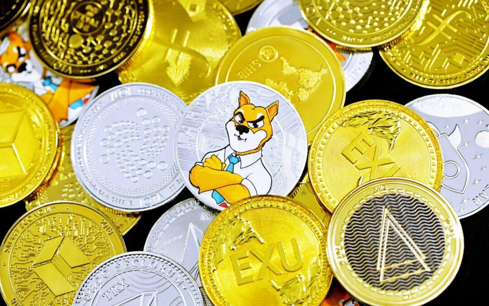

## Table of Contents

## What are cryptocurrencies?

Cryptocurrencies are a type of digital money that you can use to buy things online. They are different from regular money because they are not controlled by banks or governments. Instead, they use something called blockchain technology, which is like a big, secure list of all the transactions that have ever happened. This makes it hard for anyone to cheat or steal the money.

People use cryptocurrencies for many reasons. Some people like them because they can send money to anyone in the world quickly and cheaply. Others think that cryptocurrencies might become more valuable in the future, so they buy them as an investment. The most famous cryptocurrency is Bitcoin, but there are many others like Ethereum, Litecoin, and Dogecoin.

## What makes a cryptocurrency significant?

A cryptocurrency becomes significant mainly because of how many people use it and trust it. When a lot of people start using a cryptocurrency, it becomes more valuable. This is because more people want to buy it, and more places accept it as payment. For example, Bitcoin became significant because it was the first cryptocurrency and many people started using it. As more people used it, more businesses started accepting it, which made it even more popular.

Another thing that makes a [cryptocurrency](/wiki/cryptocurrency) significant is how it is used. Some cryptocurrencies, like Ethereum, are not just for buying things. They can also be used to create and run special programs called smart contracts. These programs can do things automatically, like paying someone when they finish a job. This makes the cryptocurrency more useful and attracts more people to use it. So, the more useful a cryptocurrency is, the more significant it becomes.

## What is Ethereum and how does it differ from Bitcoin?

Ethereum is a type of cryptocurrency, like Bitcoin, but it does more than just being money. It was created by a person named Vitalik Buterin in 2015. Ethereum has its own money called Ether, which people can use to buy things or trade. But what makes Ethereum special is that it can also run special programs called smart contracts. These are like automatic agreements that can do things like paying someone when they finish a job, without needing a middleman like a bank.

The big difference between Ethereum and Bitcoin is what they can do. Bitcoin is mainly used as a way to send and receive money without a bank. It's like digital cash. Ethereum, on the other hand, is like a big computer that anyone can use to run programs. This makes Ethereum more flexible because people can use it to create all sorts of new things, like new types of money or games that work on the internet. So while Bitcoin is good for simple money stuff, Ethereum can do a lot more because of its smart contracts.

## Can you explain what Ripple (XRP) is and its primary use?

Ripple, also known as XRP, is another type of cryptocurrency. It was created by a company called Ripple Labs. The main goal of Ripple is to make it easier and faster for banks and other big financial companies to send money around the world. Unlike Bitcoin or Ethereum, which anyone can use, Ripple is mostly used by banks and financial institutions. They use it to move money quickly and cheaply between different countries.

Ripple works a bit differently from other cryptocurrencies. It uses a special system that helps banks process payments faster. Instead of waiting days for money to move from one country to another, Ripple can do it in seconds. This is really helpful for banks because it saves them time and money. So, while Bitcoin and Ethereum are more for regular people, Ripple is focused on making the big financial world work better.

## What is Litecoin and why was it created?

Litecoin is a type of cryptocurrency that was created in 2011 by a person named Charlie Lee. It is similar to Bitcoin, but it was made to be faster and cheaper to use. One big difference is that Litecoin can handle more transactions in a shorter amount of time than Bitcoin. This makes it easier for people to send and receive Litecoin quickly. Another difference is that Litecoin uses a different way to create new coins, which is called "scrypt" instead of the "SHA-256" that Bitcoin uses. This was done to make it easier for regular people to mine Litecoin, not just big companies with special computers.

Litecoin was created because the people who made it wanted to improve on some of the things they saw as problems with Bitcoin. They wanted a cryptocurrency that was easier to use for everyday things, like buying a coffee or paying for a meal. By making transactions faster and cheaper, Litecoin aimed to be more practical for regular people. Over time, Litecoin has become known as the "silver" to Bitcoin's "gold," meaning it's a good alternative that works well alongside Bitcoin.

## How does Cardano (ADA) aim to improve upon existing cryptocurrencies?

Cardano, also known as ADA, is a cryptocurrency that was created to be better and safer than other cryptocurrencies. The people who made Cardano wanted to solve some of the problems they saw in other cryptocurrencies like Bitcoin and Ethereum. They did this by using a lot of science and math to make sure that Cardano is secure and can grow over time. They call this approach "evidence-based" because they use research to guide how they build Cardano. This makes it different from other cryptocurrencies, which might not have the same focus on research.

One big way Cardano aims to improve is by being more fair and open. They use a special system called Ouroboros, which is a way to make sure that everyone who has Cardano can help run the network. This is different from Bitcoin, where you need a lot of special computers to help run the network. Cardano also wants to be easier to use for creating smart contracts, like Ethereum, but with less chance of mistakes. By focusing on being fair, safe, and easy to use, Cardano hopes to be a better choice for people who want to use cryptocurrencies in their everyday life.

## What is the unique selling point of Binance Coin (BNB)?

Binance Coin, or BNB, is a cryptocurrency made by a company called Binance. The special thing about BNB is that it is used on the Binance exchange, which is a place where people can buy and sell other cryptocurrencies. When you use BNB to pay for things on Binance, like trading fees, you get a discount. This makes it cheaper for people to use the Binance exchange, which is why a lot of people like to use BNB.

Another cool thing about BNB is that it can be used for more than just paying fees on Binance. The people who made BNB have also created other things that you can use BNB for, like a special app store where you can buy things with BNB. They are always coming up with new ways to use BNB, which makes it more useful and valuable. So, BNB is not just a coin, but a whole system that keeps growing and adding new things for people to use.

## What role does Stellar (XLM) play in cross-border payments?

Stellar, also known as XLM, is a cryptocurrency that helps people and businesses send money across different countries quickly and cheaply. It was created to make international payments easier, especially for people who don't have easy access to banks. When you use Stellar to send money to another country, it can be done in seconds, and it costs a lot less than using regular banks. This is really helpful for people who need to send money to family or friends in other countries without spending a lot on fees.

Stellar works by connecting banks, payment systems, and people all over the world into one big network. This network uses XLM, the Stellar cryptocurrency, to make the payments happen. Because Stellar is designed to be fast and cheap, it can help make the world a more connected place. It's like a bridge that lets money flow easily from one country to another, making life easier for a lot of people.

## How does Chainlink (LINK) facilitate smart contracts?

Chainlink, or LINK, helps smart contracts work better by connecting them to real-world information. Smart contracts are special programs that can do things automatically, like paying someone when they finish a job. But these programs need to know what's happening in the real world to work right. That's where Chainlink comes in. It uses something called "oracles" to get information from outside the internet, like the weather or stock prices, and then gives that information to the smart contracts. This way, the smart contracts can make decisions based on real data.

For example, imagine a smart contract that pays farmers when it rains. The contract needs to know if it actually rained to pay the farmers. Chainlink can get that rain data from weather stations and tell the smart contract. This makes the smart contract more useful because it can work with real-world events. By helping smart contracts use real data, Chainlink makes them more trustworthy and helpful for all sorts of things, like insurance, finance, and even games.

## What are the key features of Polkadot (DOT) that make it significant?

Polkadot, or DOT, is a special kind of cryptocurrency that helps different blockchains work together. Imagine blockchains like different islands, and Polkadot is like a bridge that connects them. This is important because it lets different cryptocurrencies and apps talk to each other, making them more useful. For example, if you have a game on one blockchain and a payment system on another, Polkadot can help them work together so you can pay for things in the game easily.

Another key feature of Polkadot is that it lets people create their own blockchains. These new blockchains can be made to do specific things, like running a new kind of app or game. This makes Polkadot very flexible because it can grow and change as people come up with new ideas. By connecting different blockchains and letting people build new ones, Polkadot helps make the world of cryptocurrencies more connected and useful for everyone.

## How does Solana (SOL) achieve high transaction speeds?

Solana, or SOL, is a cryptocurrency that can handle a lot of transactions very quickly. It does this by using a special way of working that's different from other cryptocurrencies. Instead of having everyone on the network agree on every transaction one by one, Solana uses something called "proof of history." This is like a special clock that helps everyone on the network know when things happened without having to check with everyone else. This makes it much faster because the network can process transactions without waiting for everyone to agree.

Another thing that helps Solana go fast is how it groups transactions together. It can handle thousands of transactions in one go, which is like doing a bunch of chores at the same time instead of one by one. This way, even if there are a lot of people using Solana at the same time, it can still keep up and process everything quickly. By using these smart ways of working, Solana can do a lot more transactions per second than many other cryptocurrencies, making it a good choice for people who need things to happen fast.

## What advanced technologies are being used by newer cryptocurrencies like Tezos (XTZ) to enhance their functionality?

Tezos, or XTZ, uses a special technology called "self-amending" to make it easier to update and improve over time. This means that Tezos can change its own rules without needing everyone to agree on a new version of the software. It's like a computer that can update itself without you having to do anything. This makes Tezos more flexible because it can keep getting better without causing big problems or splitting into different versions like some other cryptocurrencies.

Another cool thing about Tezos is that it uses a way of working called "liquid proof-of-stake." This is different from the "proof-of-work" that Bitcoin uses, which needs a lot of energy and special computers. With liquid proof-of-stake, people who own Tezos can help run the network by "staking" their coins, which means they lock up their coins to help make decisions. This is easier and uses less energy, making Tezos more friendly to the environment and easier for regular people to use.

## References & Further Reading

[1]: Buterin, V. (2015). ["Ethereum Whitepaper: A Next-Generation Smart Contract and Decentralized Application Platform."](https://ethereum.org/en/whitepaper/) Ethereum Foundation.

[2]: Schwartz, D., Youngs, N., & Britto, A. (2014). ["The Ripple Protocol Consensus Algorithm."](https://www.semanticscholar.org/paper/The-Ripple-Protocol-Consensus-Algorithm-Schwartz-Youngs/bff4ecdd2c40bb67abab8d49e99c81287a7b2810) Ripple Labs Inc.

[3]: Lee, C. (2011). ["Litecoin: A cryptocurrency and its basics."](https://www.investopedia.com/terms/l/litecoin.asp)

[4]: Hoskinson, C. (2017). ["Ouroboros: A Proof-of-Stake Protocol for Consensus."](https://en.wikipedia.org/wiki/Charles_Hoskinson) IOHK.

[5]: Wood, G. (2016). ["Polkadot Whitepaper: Vision for a Heterogeneous Multi‑Chain Framework."](https://assets.polkadot.network/Polkadot-whitepaper.pdf)

[6]: Yakovenko, A. (2019). ["Solana: A new architecture for a high performance blockchain."](https://solana.com/solana-whitepaper.pdf) Solana Labs.