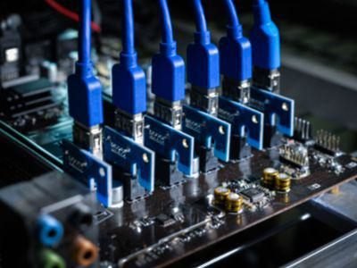

The world of digital finance is undergoing a significant transformation, driven primarily by the advancements in cryptocurrency mining and the proliferation of digital currencies. These innovations are reshaping traditional financial concepts and practices, offering new paradigms for investment and transactional efficiency. This article aims to unpack the intricate features of cryptocurrencies, with a particular emphasis on the emerging Signum platform, which represents a novel approach to eco-friendly mining and advanced blockchain functionalities.

Cryptocurrencies have transcended their initial perception as speculative assets, evolving into fundamental components of the digital economy. One of their central features is the ability for decentralized operations, achieved through cryptographic techniques that ensure security and privacy. Platforms like Signum are at the forefront, offering unique solutions such as the Proof-of-Capacity consensus mechanism, which distinguishes itself from more traditional mining processes by reducing environmental impact.



Algorithmic trading is another revolutionary aspect of the digital currency landscape. By harnessing sophisticated algorithms, traders and investors can capitalize on market opportunities with unprecedented speed and accuracy. This transformation is pivotal in managing the volatility inherent in cryptocurrency markets and in improving the efficiency of trade executions. The integration of artificial intelligence and machine learning further enhances these systems, making them more adaptive and predictive.

This guide intends to equip both seasoned investors and newcomers with a comprehensive understanding of these pivotal elements that are shaping the future of finance. By exploring the unique attributes of cryptocurrencies and the transformative power of algorithmic trading, readers will gain valuable insights into this dynamic and rapidly evolving field. As the digital currency space continues to expand, staying informed about these advancements is essential for maximizing potential benefits and navigating the complex landscape of digital finance.

## Table of Contents

## Understanding Cryptocurrency Mining

Cryptocurrency mining is a fundamental process integral to the lifecycle of digital currencies. At its core, mining is the method through which new digital coins are created and verified, ensuring the integrity and security of the blockchain— the decentralized ledger underpinning cryptocurrencies. This is achieved through the resolution of complex mathematical problems that validate and confirm transactions, subsequently adding them to the blockchain in the form of new blocks.

Two primary mechanisms define the mining process: Proof-of-Work (PoW) and Proof-of-Stake (PoS).

**Proof-of-Work (PoW)** is synonymous with early cryptocurrencies, such as Bitcoin. Here, miners compete to solve intricate cryptographic puzzles, known as hash functions. The first miner to solve the puzzle earns the privilege to add a new block to the blockchain and is rewarded with cryptocurrency. The computation involved in solving these puzzles requires substantial processing power and energy, establishing a barrier to entry that ensures network security. The hash function used in PoW can be represented as follows:

$$
\text{SHA-256}(\text{Block Header}) \leq \text{Target}
$$

Miners continuously generate guesses until the hash of a new block header is less than or equal to the target.

**Proof-of-Stake (PoS)**, in contrast, replaces computational efforts with financial commitments. Miners are chosen to create new blocks based on the number of coins they hold and are willing to 'stake' as security. This inherently consumes less energy than PoW and reduces the risk of centralization since mining capabilities are not directly tied to computational power. PoS systems often allocate the probability of creating a new block proportional to the stakes held by participants.

The significance of these mechanisms lies in their ability to maintain the security and trustworthiness of cryptocurrencies without relying on a central authority. In a decentralized network, mining ensures all transactions are confirmed and agreed upon, preventing double-spending and establishing consensus across the distributed ledger.

Moreover, the mining process supports the operation of decentralized networks, which function independently of governmental or institutional oversight. This decentralization is pivotal as it negates the necessity for intermediaries, lowers transaction costs, and enhances global accessibility to financial services.

Cryptocurrency mining not only facilitates the addition of new digital currencies but also acts as a crucial linchpin in the decentralized ecosystem, ensuring persistence, security, and integrity of the currency system. As the digital landscape evolves, the mining processes may adapt, but the fundamental role of verification and creation within the blockchain will remain indispensable.

## Exploring Digital Currency Features

Digital currencies, commonly referred to as cryptocurrencies, are digital or virtual currencies that use cryptography for security. One of their primary characteristics is decentralization. Unlike traditional currencies, which are typically issued and regulated by a central authority such as a government or central bank, cryptocurrencies operate on decentralized networks based on blockchain technology. This decentralized nature prevents any single entity from exerting excessive control, thereby offering potential immunity to government interference and manipulation.

Security in cryptocurrencies is enhanced through the use of cryptographic protocols that secure transactions and control the creation of new units. The blockchain, a distributed ledger technology underlying most cryptocurrencies, serves as a public database that records all transactions across a network of computers. The immutable and transparent nature of blockchain helps prevent fraudulent activities and double-spending.

Cryptocurrencies also provide the potential for anonymity. While the transactions are transparent and visible on the blockchain, the identities of the individuals involved are often obscured through pseudonymity. This means that while it is possible to see the flow of funds, identifying the actual holders of [cryptocurrency](/wiki/cryptocurrency) addresses can be challenging without additional information.

The flexibility of digital currencies is another compelling feature. They can facilitate fast and low-cost transactions across borders, circumventing the need for traditional financial intermediaries. This is especially beneficial in cross-border trade, where traditional banking systems might impose significant delays and fees. Cryptocurrencies like Bitcoin enable users to transfer funds globally within minutes, at a fraction of the cost imposed by banks and money transfer services.

Digital currencies also pose a challenge to traditional banking systems. By enabling peer-to-peer transactions without intermediaries, cryptocurrencies reduce the dependency on banks for executing financial transactions. This allows users greater direct control over their funds, potentially reducing the relevance of banks in personal finance management.

Moreover, cryptocurrencies are playing an instrumental role in fostering financial inclusion. In regions where access to traditional banking is limited, digital currencies provide an alternative means for residents to participate in the global economy. By only requiring internet access and a smartphone, individuals can manage their assets, make transactions, and even obtain microloans.

In summary, the distinct features of digital currencies—decentralization, enhanced security, potential anonymity, transaction flexibility, and financial inclusiveness—are not only distinguishing them from conventional money but also driving a transformation in the global financial landscape. These features pose both opportunities and challenges to existing economic systems, inviting ongoing debate and exploration regarding their long-term impact.

## An Introduction to Signum

Signum represents a significant step forward in the cryptocurrency landscape by combining eco-friendly mining practices with sophisticated transactional capabilities. Originating as a response to the environmental concerns associated with traditional cryptocurrency mining methods, Signum employs an innovative consensus mechanism called Proof-of-Capacity (PoC). Unlike the energy-intensive Proof-of-Work (PoW) mechanisms employed by many other cryptocurrencies like Bitcoin, PoC allows miners to use available disk space for mining activities, drastically reducing energy consumption.

### History and Development

Signum's development traces back to the need for a more sustainable approach to digital currency creation and transaction validation. Initially conceived as Burstcoin, Signum evolved to address the limitations of earlier systems by introducing PoC, which leverages hard drive space rather than relying on powerful processors and graphics cards. This approach makes the mining process accessible to a broader audience and minimizes the ecological footprint associated with traditional mining.

### Sustainable and Scalable Solutions

The PoC protocol central to Signum's operation is not only energy-efficient but also scalable. By enabling miners to allocate unused storage space for mining, Signum lowers entry barriers and fosters a decentralized network of participants, enhancing both security and scalability. The utilization of disk space serves as a resource-efficient method, allowing for increased transaction throughput as the network expands.

### Key Features: Smart Contracts and Digital Tokenization

Signum integrates cutting-edge features such as Smart Contracts and Digital Tokenization to expand its functionality beyond traditional cryptocurrencies. Smart Contracts on the Signum platform enable decentralized applications (DApps) and automated transaction agreements without intermediaries. This is achieved by embedding executable code into blockchain transactions, which is then processed by the network, ensuring reliability and security.

Digital Tokenization on Signum allows for the creation and transfer of digital assets through a simple process. This feature facilitates everything from custom cryptocurrency creation to representing physical assets in a digital form, thus broadening the scope of blockchain applications across different sectors.

### Impact on Blockchain Technology

The combination of eco-friendly mining and advanced transactional features positions Signum as a pioneer in blockchain technology. Its Proof-of-Capacity mechanism not only reduces environmental impact but also maintains the decentralized ethos central to cryptocurrency innovation. Furthermore, by incorporating Smart Contracts and Digital Tokenization, Signum enhances blockchain's practicality and accessibility, setting a precedent for future developments in the digital currency realm.

Signum's approach demonstrates that sustainable practices and technological advancements can coexist within the rapidly changing cryptocurrency space, paving the way for more efficient and environmentally conscious blockchain systems.

## Algorithmic Trading in Cryptocurrency

Algorithmic trading is increasingly becoming a cornerstone of the cryptocurrency markets, leveraging sophisticated computer programs to execute trades at optimal speeds and prices. The volatile nature of crypto markets, characterized by rapid price changes and high [liquidity](/wiki/liquidity-risk-premium) risks, makes efficiency and accuracy critical. Algorithms address these challenges by eliminating human emotions from trading decisions and executing transactions based on predefined criteria.

One popular strategy within [algorithmic trading](/wiki/algorithmic-trading) is [arbitrage](/wiki/arbitrage). This involves exploiting price discrepancies for a particular asset across different markets or exchanges. For example, if Bitcoin is priced differently on two exchanges, an algorithm can buy low on one and sell high on the other almost simultaneously, capturing the price difference without exposing the trader to significant risk. The speed of algorithmic systems is crucial here, as these price discrepancies are typically minimal and only last for seconds.

Market making is another strategy where algorithms provide liquidity to the markets. They continuously quote both buy and sell prices in a financial instrument, benefiting from the spread between the bid and ask price. This strategy requires sophisticated risk management to handle large volumes of assets and maintain inventory levels.

Trend following strategies are also prevalent, where algorithms analyze historical price patterns and moving averages to identify the direction of market trends. These algorithms are programmed to buy or sell based on signals generated by market [momentum](/wiki/momentum), relying on the assumption that assets that have been rising steadily will continue to rise and vice versa.

Despite its advantages, algorithmic trading in cryptocurrency carries risks. The high [volatility](/wiki/volatility-trading-strategies) that provides arbitrage opportunities also means that markets can move against a trader rapidly, leading to losses. Additionally, technical failures such as connectivity issues or flaws in the algorithm's design can result in unintended trades and significant financial losses.

The advent of [artificial intelligence](/wiki/ai-artificial-intelligence) and [machine learning](/wiki/machine-learning) is further transforming algorithmic trading. Machine learning algorithms can adapt and improve over time by learning from historical data patterns and market signals, thus providing more robust and accurate predictions. For instance, neural networks, a subset of machine learning, can identify complex, non-linear relationships in data, offering insights that traditional algorithms might miss.

Python has emerged as a preferred programming language for building these advanced trading algorithms due to its simplicity and the availability of powerful libraries like NumPy, pandas, and TensorFlow. A simple example of a moving average crossover strategy using Python could look like this:

```python
import pandas as pd

# Assuming 'data' is a DataFrame with historical price data
short_window = 40
long_window = 100

# Calculate moving averages
data['short_mavg'] = data['Close'].rolling(window=short_window, min_periods=1).mean()
data['long_mavg'] = data['Close'].rolling(window=long_window, min_periods=1).mean()

# Define signals
data['signal'] = 0
data['signal'][short_window:] = np.where(data['short_mavg'][short_window:] > data['long_mavg'][short_window:], 1, 0)

# Calculate positions
data['positions'] = data['signal'].diff()

print(data[['Close', 'short_mavg', 'long_mavg', 'signal', 'positions']])
```

In conclusion, while algorithmic trading brings efficiency and potential profitability to cryptocurrency markets, it is crucial for traders and investors to recognize and manage the associated risks. As cryptocurrency markets evolve, continuous innovation in trading algorithms will be essential in maintaining competitive advantages.

## The Future of Cryptocurrency and Trading Innovations

The future of cryptocurrency promises a vibrant ecosystem where technological advancements and increased market understanding will play pivotal roles. As blockchain technology continues to evolve, its integration with the Internet of Things (IoT) and Decentralized Finance (DeFi) is expected to unlock new possibilities, enhancing interoperability, security, and efficiency across various applications. IoT devices, coupled with blockchain, could enable automated transactions based on smart contracts. This convergence would allow users to enjoy seamless interactions between IoT gadgets and blockchain networks, fostering a more interconnected digital landscape.

Decentralized Finance, on the other hand, is revolutionizing the traditional financial system by providing decentralized banking services through blockchain. Facilitating peer-to-peer lending, borrowing, and complex financial instruments without intermediaries reduces costs and increases accessibility. The ongoing innovation in DeFi is likely to democratize financial services further, bringing technology-driven changes to global finance.

Algorithmic trading is another significant area within cryptocurrency, poised for transformative growth. By employing sophisticated algorithms, traders can execute orders at optimal speeds and prices. This process enhances efficiency and accuracy in the volatile cryptocurrency markets. The democratization and decentralization of investments are expected as algorithmic trading becomes more accessible to retail investors. This advancement may reduce barriers to entry, allowing a broader spectrum of participants to engage in trading activities.

Emerging platforms like Signum are anticipated to wield considerable influence in the crypto space. Offering eco-friendly mining solutions through their Proof-of-Capacity consensus mechanism, Signum represents a shift toward more sustainable blockchain practices. This approach not only reduces the environmental impact but also supports scalable growth in the digital currency domain. With features such as Smart Contracts and Digital Tokenization, platforms like Signum are at the forefront of enhancing the utility and applicability of blockchain technology.

Forecasting the future of digital innovations suggests a landscape where these advancements will significantly reshape global finance. By fostering greater inclusion, reducing costs, and increasing transparency, cryptocurrencies and associated technologies will likely transform financial systems. As stakeholders continue to embrace these technological shifts, the potential for growth and innovation in the cryptocurrency and trading sectors appears limitless. This development marks an exciting era for participants willing to harness the potential of digital currencies and invest in forthcoming technologies.

## Conclusion

Cryptocurrency mining and digital currencies have emerged as dynamic and transformative forces within the financial sector, offering abundant opportunities for innovation and investment. Platforms like Signum exemplify how eco-friendly approaches and advanced features are reshaping traditional financial paradigms. The integration of algorithmic trading introduces a new layer of sophistication, enabling faster and more efficient transaction execution in highly volatile markets. 

For individuals keen on engaging with the digital currency market, a comprehensive understanding of these evolving technologies is imperative. The rapid pace at which cryptocurrency platforms and trading tools are developing necessitates a commitment to continuous learning. By staying informed, investors and enthusiasts alike can maximize the value of their participation in this burgeoning field.

As we progress, it is evident that the future holds significant promise for those ready to leverage the potential of cryptocurrencies and their associated technological innovations. Embracing these advancements not only fosters individual growth but also contributes to the broader evolution of financial systems worldwide. The potential for digital currencies and their technologies to redefine finance is immense, signifying a bright future for forward-thinking participants.

## References & Further Reading

[1]: Burstcoin. ["Burstcoin Proof of Capacity Protocol."](https://www.burstcoin.community/burstcoin-faqs/) Burstcoin official website.

[2]: Nakamoto, S. (2008). ["Bitcoin: A Peer-to-Peer Electronic Cash System."](https://nakamotoinstitute.org/library/bitcoin/) Bitcoin.org.

[3]: Bonneau, J., Miller, A., Clark, J., Narayanan, A., Kroll, J. A., & Felten, E. W. (2015). ["SoK: Research Perspectives and Challenges for Bitcoin and Cryptocurrencies."](https://ieeexplore.ieee.org/document/7163021) 2015 IEEE Symposium on Security and Privacy.

[4]: Lopez de Prado, M. (2018). ["Advances in Financial Machine Learning."](https://www.amazon.com/Advances-Financial-Machine-Learning-Marcos/dp/1119482089) Wiley.

[5]: Jansen, S. (2020). ["Machine Learning for Algorithmic Trading."](https://github.com/stefan-jansen/machine-learning-for-trading) Packt Publishing.

[6]: Brockwell, A. E. (2016). ["Introduction to Quantitative Finance: A Math Tool Kit."](https://link.springer.com/book/10.1007/978-3-319-29854-2) Cambridge University Press.

[7]: Antonopoulos, A. M. (2014). ["Mastering Bitcoin: Unlocking Digital Cryptocurrencies."](https://books.google.com/books/about/Mastering_Bitcoin.html?id=IXmrBQAAQBAJ) O'Reilly Media.