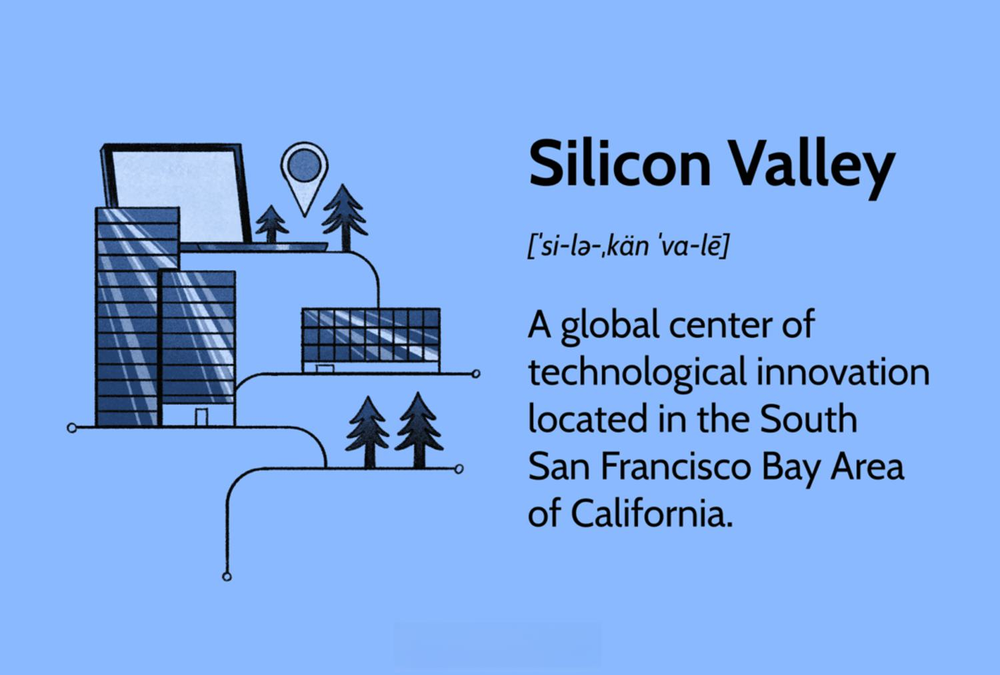

## Table of Contents

## What is Silicon Valley?

Silicon Valley is a region in California, near San Francisco. It is famous for having many technology companies. The name comes from the material silicon, which is used to make computer chips. Many big tech companies like Apple, Google, and Facebook started here. People come from all over the world to work in Silicon Valley because of the many job opportunities in technology.

The area became important for technology in the 20th century. At first, it was known for making radios and other electronics. Over time, it grew to include computers and software. Stanford University, which is nearby, helped a lot by doing research and starting new companies. Today, Silicon Valley is not just about making things. It is also about new ideas and starting new businesses. Many people call it the tech capital of the world.

## Where is Silicon Valley located?

Silicon Valley is in California, near the city of San Francisco. It is in the southern part of the San Francisco Bay Area. The main cities in Silicon Valley are San Jose, Palo Alto, and Mountain View.

The area got its name because many companies there use silicon to make computer chips. It is famous for technology and many big tech companies like Apple, Google, and Facebook started there. People from all over the world come to Silicon Valley to work in tech jobs.

## How did Silicon Valley get its name?

Silicon Valley got its name from the material silicon, which is used to make computer chips. In the 1950s and 1960s, many companies in the area started making these chips. The name "Silicon Valley" came from a journalist named Don Hoefler who used it in a series of articles in 1971.

The area was already known for technology before it got its name. It started with companies making radios and other electronics. Over time, it grew to include computers and software. The name "Silicon Valley" became popular because it described what the area was known for - making things with silicon.

## What are the major cities in Silicon Valley?

The major cities in Silicon Valley are San Jose, Palo Alto, and Mountain View. San Jose is the biggest city in the area. It is known as the capital of Silicon Valley. Many tech companies have offices there. Palo Alto is another important city. It is home to Stanford University, which has helped many tech companies start. Mountain View is famous because Google has its main office there.

These cities are all close to each other in the southern part of the San Francisco Bay Area. They are important because they have many tech jobs. People from all over the world come to these cities to work in technology. The area is busy and full of new ideas and businesses.

## What industries are most prominent in Silicon Valley?

The most prominent industry in Silicon Valley is technology. Many big tech companies like Apple, Google, and Facebook started there. These companies make things like computers, smartphones, and software. They also work on the internet and new ways to use technology. Silicon Valley is famous for making computer chips, which are small parts that help computers work. The chips are made from a material called silicon, which is why the area got its name.

Another important industry in Silicon Valley is venture capital. This means people and companies give money to new businesses to help them grow. Many new tech companies start in Silicon Valley because they can get this money. Venture capitalists look for good ideas and help turn them into successful businesses. This helps the area stay at the front of new technology and ideas.

Silicon Valley also has other industries like biotechnology and clean energy. Biotechnology companies work on new medicines and ways to help people stay healthy. Clean energy companies try to find new ways to make energy that do not hurt the environment. These industries are smaller than technology and venture capital, but they are still important and growing.

## Which are some of the most famous companies headquartered in Silicon Valley?

Some of the most famous companies headquartered in Silicon Valley are Apple, Google, and Facebook. Apple, based in Cupertino, is known for making popular products like the iPhone and MacBook. Google, located in Mountain View, is famous for its search engine and other services like YouTube and Android. Facebook, headquartered in Menlo Park, is well-known for its social media platform and also owns Instagram and WhatsApp.

These companies started in Silicon Valley and grew to become very big. They have helped make the area famous around the world. Other notable companies in the area include Intel, which makes computer chips, and Cisco, which makes networking equipment. These companies have played a big role in making Silicon Valley the center of technology and innovation.

## What role does Stanford University play in Silicon Valley?

Stanford University is very important to Silicon Valley. It is in Palo Alto, which is a big part of the area. Many people who started famous tech companies went to Stanford. The university helps new businesses start by giving them money and places to work. This is called an incubator. Stanford also does a lot of research that helps new technology grow.

The university has a big effect on Silicon Valley. Many tech companies, like Google and Hewlett-Packard, started because of Stanford. The school's professors and students work on new ideas that become big businesses. Stanford helps bring smart people together to make new things. This makes Silicon Valley a place where new technology can happen.

## How has Silicon Valley influenced global technology?

Silicon Valley has had a big impact on technology all over the world. Many of the most famous tech companies, like Apple, Google, and Facebook, started there. These companies have made things like smartphones, search engines, and social media that people use every day. Silicon Valley has also made a lot of computer chips, which are important parts of computers and other devices. Because of this, many new ideas and technologies have come from Silicon Valley and spread around the world.

The area is also known for helping new businesses start. People in Silicon Valley give money to new companies, which helps them grow. This has led to many new technologies and ways of doing things. Silicon Valley has shown the world how to make new technology and how to turn ideas into big businesses. This has made it a model for other places that want to grow their own technology industries.

## What are the economic impacts of Silicon Valley on the surrounding area?

Silicon Valley has a big impact on the economy of the area around it. The tech companies there create many jobs. People from all over the world come to work in Silicon Valley. This means more money is spent in local stores, restaurants, and services. The area grows because of all the people working and living there. The money from taxes also helps pay for things like schools and roads.

The high-tech industry also brings a lot of money into the area. Companies like Apple, Google, and Facebook make a lot of money and some of it stays in the area. This money helps the economy grow even more. But, because so many people want to live and work there, the cost of living is very high. Houses and apartments are expensive, and it can be hard for some people to afford to live there. Even with these challenges, Silicon Valley is still a very important part of the economy.

## What are some of the challenges faced by Silicon Valley?

Silicon Valley faces some big challenges. One big problem is the high cost of living. Houses and apartments are very expensive because so many people want to live and work there. This makes it hard for some people to afford to stay in the area. Another challenge is traffic. There are so many people and cars that it can take a long time to get around. This makes life harder for people who live and work there.

Another issue is the lack of diversity. Many tech companies in Silicon Valley are working to hire more people from different backgrounds, but it's still a challenge. There are also worries about the environment. The area uses a lot of energy and water, and this can hurt the environment. People in Silicon Valley are trying to find ways to use less energy and water, but it's not easy. These challenges show that even a place as successful as Silicon Valley has problems to solve.

## How has the culture of Silicon Valley evolved over time?

The culture of Silicon Valley has changed a lot over time. At first, it was all about making radios and other electronics. People worked hard to make new things and start new companies. The area was known for being creative and always trying new ideas. Over the years, the focus moved to computers and software. This brought more people to Silicon Valley, and it became a place where people from all over the world came to work on technology. The culture became more about working together and sharing ideas quickly.

As Silicon Valley grew, the culture also changed to include more focus on starting new businesses. People started to see Silicon Valley as a place where you could have a big idea and turn it into a successful company. This led to a culture of taking risks and trying new things. But, as more people came to the area, it also became more competitive. The cost of living went up, and it became harder for some people to stay. Even with these changes, Silicon Valley is still known for being a place where new ideas and technology can happen.

## What future trends are predicted for Silicon Valley?

In the future, Silicon Valley is expected to keep growing and changing. One big trend is the focus on new technologies like [artificial intelligence](/wiki/ai-artificial-intelligence) (AI) and [machine learning](/wiki/machine-learning). These technologies can help computers do things that used to need people, like understanding language or making decisions. Many companies in Silicon Valley are working on these new technologies, and they think they will change a lot of things in the future. Another trend is the growth of remote work. Because of the high cost of living in Silicon Valley, more companies are letting people work from home or other places. This could mean that Silicon Valley's influence spreads to other parts of the world.

Another trend is the focus on sustainability and green technology. Silicon Valley companies are working on new ways to use less energy and make less waste. This is important because the area uses a lot of resources, and people want to find ways to be kinder to the environment. There is also a push for more diversity and inclusion. Companies are trying to hire more people from different backgrounds to make their teams stronger and more creative. These trends show that Silicon Valley will keep changing and trying new things in the future.

## References & Further Reading

[1]: Saxenian, A. (1996). "Regional Advantage: Culture and Competition in Silicon Valley and Route 128." Harvard University Press.

[2]: Kenney, M. (2000). "Understanding Silicon Valley: The Anatomy of an Entrepreneurial Region." Stanford University Press.

[3]: Zacks, L. (2006). "The Market Whisperer: A New Approach to Stock Trading." Broadway Books.

[4]: Montes, R., & Wilczek, E. (2018). ["Machine Learning in Financial Markets: A Guide to Contemporary Practice."](https://books.google.com/books/about/Machine_Learning_and_Data_Sciences_for_F.html?id=hHa3EAAAQBAJ) Cambridge Scholars Publishing.

[5]: Lopez de Prado, M. (2018). "Advances in Financial Machine Learning." Wiley. 

[6]: Murphy, J. J. (1999). "Technical Analysis of the Financial Markets: A Comprehensive Guide to Trading Methods and Applications." New York Institute of Finance. 

[7]: Gilder, G. (1984). "The Silicon Valley Edge: A Habitat for Innovation and Entrepreneurship." Perseus Publishing. 

[8]: Chen, J., Dempsey, S., Hayward, K., Macleod, K., & Zhao, Y. (2016). "High-Frequency Trading: A Practical Guide to Algorithmic Strategies and Trading Systems." Wiley Finance Series.