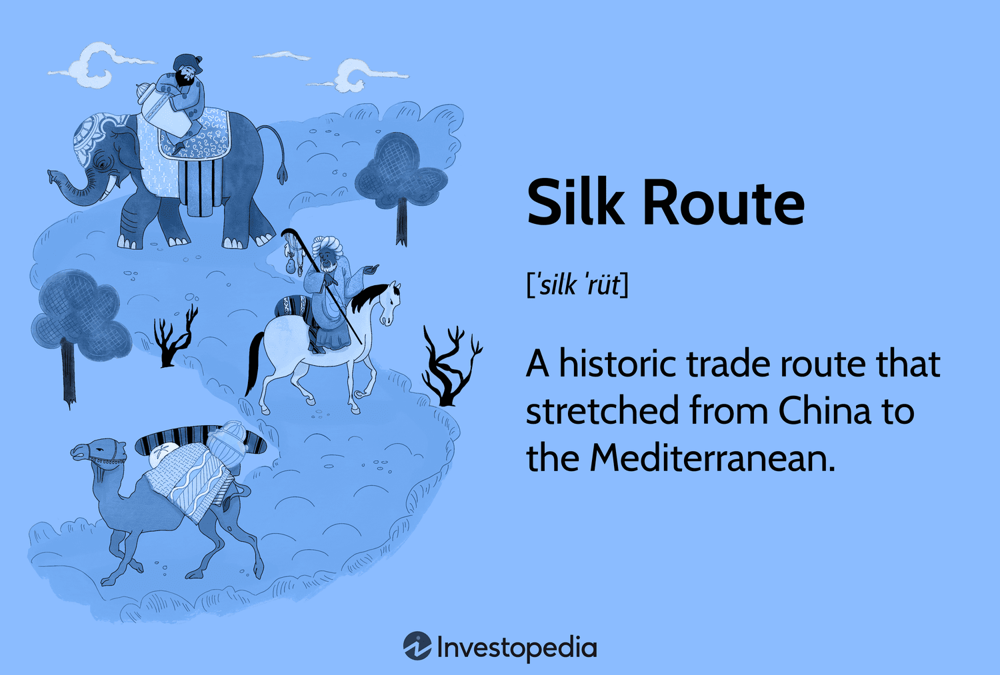

The Silk Road, an expansive network of trade routes, historically bridged the cultural and commercial chasm between the Eastern and Western worlds. Originating in ancient China and extending as far as Europe, it was pivotal in facilitating the exchange of goods, ideas, and culture for centuries. Items such as silk, spices, and precious metals traversed these routes, fostering economic growth and cultural interactions that have left a lasting legacy.

In contemporary contexts, the Silk Road is often reimagined not just as a series of trade paths but as a symbol of the enduring connections that underpin global trade. Today's global trade flows are profoundly influenced by the principles established during the Silk Road era, adapting to modern dynamics through global supply chains and international commerce.

This article aims to explore the impact of the Silk Road on modern economic structures, specifically through the lens of algorithmic trading. Algorithmic trading, defined as the use of computer algorithms to manage trading decisions and execute orders in financial markets, represents a significant evolution from ancient trading methods. However, the core principles of trade—such as the management of risk, pursuit of profit through arbitrage, and the diversification of exchanges—draw clear parallels to this ancient system. These principles are manifested today in the sophisticated algorithms that drive contemporary trading strategies.

With technology continually reshaping trading practices, significant parallels between historical trade principles of the Silk Road and today's market algorithms have emerged. The enhancement of modern trading systems through artificial intelligence and machine learning mirrors the innovation and adaptiveness seen throughout history. As technology evolves, so too do the methods by which goods, services, and capital traverse the globe, echoing the exchanges once prevalent along the Silk Road.

This introduction outlines the key themes this article will examine: the history of the Silk Road, its economic impact, and the evolution of modern trading systems. By drawing connections between ancient and modern trade routes, we aim to illuminate the enduring influence of the Silk Road on today's economy and trading methodologies.

## Table of Contents

## The Silk Road: A Historical Overview

## The Silk Road: A Historical Overview

The Silk Road was an ancient network of trade routes that played a pivotal role in cultural, commercial, and technological exchange between the East and the West. Its origins trace back to the Han Dynasty of China around the 2nd century BCE and expanded over time to connect multiple civilizations across the Asian continent, eventually reaching Europe. This extensive network was not a single path but rather a series of interconnected routes encompassing overland and maritime paths that facilitated trade and communication.

### Commodities Traded

The Silk Road was named after one of its most famous and lucrative commodities: silk, a symbol of luxury and a major driver of the economy for the Chinese empires. However, silk was only one of the many goods traded along these routes. Spices from India and Southeast Asia, precious metals like gold and silver, textiles, ceramics, and other luxury items traveled westward. In return, glassware, woolen textiles, horses, and foodstuffs like grapes and olives moved eastward. The exchange of such diverse goods not only stimulated economic growth across the regions but also introduced new products and resources, which became integral to the local economies they entered.

### Cultural and Technological Exchanges

Beyond the exchange of goods, the Silk Road was a conduit for cultural, scientific, and technological interactions. Art, religion, philosophy, and even technologies like papermaking and printing spread across continents, profoundly impacting societies along the Silk Road. Buddhism, for instance, traveled from India to China and other parts of Asia, altering religious landscapes and triggering new forms of artistic expression. The exchange of ideas and knowledge significantly affected educational and scientific advancements, laying foundations for further developments in mathematics, astronomy, and medicine.

### Evolution of the Routes

The Silk Road evolved considerably over time due to various geopolitical and economic factors. The rise and fall of empires and states brought about changes in the control and security of trade routes. For example, the expansion of the Roman Empire established new trading cities in the Middle East and Europe, which became major nodes in the network. Similarly, the Mongol Empire's expansion in the 13th century vastly improved the safety and efficiency of trade across the vast Eurasian landmass.

Conversely, the fragmentation of empires and the outbreak of plagues, such as the Black Death, severely impacted the flow of trade. Political instability could lead to shifts in trade routes, as merchants sought both safer and more profitable paths. The advent of maritime exploration in the 15th century marked a significant decline in the overland Silk Road, as sea routes became more efficient for transporting goods between East and West.

In conclusion, the Silk Road was not merely a trade network but a significant historical force that fostered economic prosperity and cultural development across continents. Its legacy is seen in the cultural exchanges and technological innovations that influenced ancient and modern civilizations alike.

## Economic Impact of the Silk Road

The Silk Road was instrumental in forging a connected global economy, serving as a conduit for not only the exchange of goods but also the transfer of knowledge, culture, and technology between East and West. Originating during the Han Dynasty (206 BCE – 220 CE), this network of trade routes facilitated the flow of diverse commodities, including silk, spices, gold, and precious stones, which contributed to the creation of wealth. The prosperity generated by these trade exchanges led to the rise of prominent trading cities such as Samarkand, Xi'an, and Constantinople, which became economic hubs that interconnected vast regions.

The wealth accumulation along the Silk Road catalyzed the economic development of these cities, transforming them into centers of commerce, art, and learning. This economic expansion spurred advancements in infrastructure, including the creation of road networks and caravanserais to support traders and travelers. Additionally, the trade activity fostered by the Silk Road encouraged urbanization and the proliferation of markets, providing a critical framework for economic growth that many regions still reflect today.

Trade imbalance was a notable issue managed in various ways throughout the history of the Silk Road. While China primarily exported silk, thereby perpetuating a trade surplus, other regions compensated through the exchange of valuable commodities such as gold, silver, and textiles, creating a dynamic balance of trade. This pioneering early form of globalization necessitated innovative solutions to address trade deficits, such as the development of credit systems and currency exchanges, improving the efficiency of trade transactions.

Long-term economic systems emerging from the Silk Road were characterized by increased market integration and interdependence, laying the groundwork for modern global trade. The Silk Road established enduring economic linkages between continents, providing a model for contemporary international trade agreements. These historical trade relations inspired the economic infrastructure we witness today, underscoring the Silk Road's legacy in shaping systems where cultural and economic exchanges reinforce global connectivity.

The economic impact of the Silk Road is thus multifaceted, influencing not only historical trade practices but also contributing foundational principles to contemporary economic structures. This ancient network's legacy continues to resonate, providing insights into modern trading systems that emphasize integration, cooperation, and development across borders.

## Modern Silk Road: Global Trade and Connectivity

The concept of a 'New Silk Road' is emblematic of efforts to revitalize and enhance Eurasian trade corridors reminiscent of ancient trade networks. These modern initiatives emphasize increasing global connectivity and economic integration across continents. Central to this is China's Belt and Road Initiative (BRI), launched in 2013, which aims to develop a comprehensive infrastructure and trade network linking Asia with Africa and Europe. This initiative has significant implications for global trade, fostering economic ties through investments in transportation, energy sectors, and digital infrastructure.

The Belt and Road Initiative encompasses over 60 countries, representing over 60% of the world's population and significant portions of global GDP and trade. By investing in highways, railways, ports, and pipelines, the BRI is poised to reduce logistical costs and enhance trade efficiency. For instance, the development of rail connections, such as the China-Europe Railway Express, facilitates quicker and more reliable shipping compared to traditional maritime routes, thereby reshaping trade dynamics and economic interactions. The creation of new maritime pathways and enhanced port facilities under the BRI exemplifies how modern logistics innovations are inspired by ancient trade systems, which relied heavily on strategic maritime and overland routes.

These advancements in logistics and transportation mirror the principles of the ancient Silk Road by providing robust networks that support cultural, technological, and economic exchanges. The Silk Road historically facilitated the flow of commodities, people, and ideas between continents. In a comparable manner, the BRI stimulates global interconnectedness, enabling the transfer of goods, capital, and technology across vast geographies.

Furthermore, the embrace of digital technologies alongside physical infrastructure is shaping the modern landscape of trade. Digital Silk Road initiatives focus on enhancing information and communication technology, which encourages seamless digital trade and commerce. This marks a synergy between ancient and modern trade principles, echoing the exchanges of knowledge and technology once fostered by the Silk Road.

Thus, the modern interpretation of the Silk Road underscores a framework where geopolitical, economic, and technological elements converge, striving for a harmonized and interconnected global trade system. This parallels historical practices, underscoring the cyclical nature of trade evolution and its enduring influence on contemporary economic landscapes.

## Algorithmic Trading: Technology Meets Tradition

Algorithmic trading involves using complex algorithms to execute trades in financial markets with minimal human intervention. These algorithms analyze market data, identify trading opportunities, and execute orders at high speeds, often within milliseconds. The significance of [algorithmic trading](/wiki/algorithmic-trading) in modern financial markets is profound, as it enhances market [liquidity](/wiki/liquidity-risk-premium), reduces transaction costs, and allows for precise and efficient trade execution. According to a report by the Aite Group, algorithmic trading accounts for about 60-73% of all U.S. equity trading [volume](/wiki/volume-trading-strategy), highlighting its pivotal role in contemporary finance.

Historically, trade practices were built upon principles such as [arbitrage](/wiki/arbitrage) and hedging, which remain integral to modern algorithmic strategies. Arbitrage, the simultaneous purchase and sale of an asset to profit from a difference in price, mirrors the arbitrage bots in today's markets that exploit price discrepancies across various platforms. Similarly, hedging, a risk management strategy used to offset potential losses in investments, is exemplified in algorithmic strategies that employ derivatives to protect against market [volatility](/wiki/volatility-trading-strategies).

The evolution of trading technology has accelerated with advancements such as [artificial intelligence](/wiki/ai-artificial-intelligence) (AI) and [machine learning](/wiki/machine-learning), which have propelled algorithmic trading to new heights. AI allows for the development of adaptive algorithms that learn from historical data to predict market trends. Machine learning techniques, such as supervised learning, enable models to recognize patterns in data, facilitating more informed trading decisions. For instance, Python libraries like TensorFlow and Scikit-learn are often used to develop machine learning models that analyze financial markets.

In summary, algorithmic trading blends traditional trade concepts with cutting-edge technology, creating a dynamic and efficient market environment. The legacy of historical trade practices, combined with innovations like AI and machine learning, underscores the transformative impact of technology on financial markets.

## The Silk Road's Legacy in Algorithmic Trading

The Silk Road's legacy in algorithmic trading is evident in the advanced strategies and risk management techniques employed by modern traders. Historically, merchants traversing the Silk Road were met with unpredictable variables, including fluctuating currencies, political instability, and varying market demands. They developed rudimentary but effective methods of risk management that echo in today's algorithm-driven markets. 

One of the primary principles adapted from the Silk Road is diversification. Just as ancient traders diversified their goods to mitigate the risk of loss, modern algorithms are designed to spread risk across various assets and markets. This principle is foundational in portfolio theory, which aims to optimize the balance between expected return and risk. Algorithms use metrics such as the Sharpe ratio to adjust holdings dynamically, ensuring an optimal risk-return profile. 

Globalization has expanded market horizons much like the Silk Road connected disparate economies. Traders today harness vast amounts of historical and real-time data to gain insights that guide algorithmic decisions. Machine learning models analyze data patterns for predictive analytics to anticipate market shifts. The historical precedent set by Silk Road trade routes, which facilitated information exchange, parallels the continuous data flow in algorithmic systems to inform strategic decisions.

Examining case studies of historical trade routes' influence on algorithm strategies highlights parallels between Silk Road trade practices and contemporary trading systems. For instance, during the Silk Road era, arbitrage opportunities arose from price discrepancies of goods in different regions. Similarly, modern high-frequency trading algorithms exploit temporary price inefficiencies across exchanges globally, executing trades rapidly to capitalize on minor differences before they can be corrected by the market.

Current trends in algorithmic trading reflect a synthesis of historical trade practices and innovative technologies. Algorithms are increasingly utilizing natural language processing (NLP) to interpret news feeds and sentiment on social media, assessing potential impacts on international markets—a nod to how ancient traders would rely on verbal information from distant lands to gauge market conditions. Moreover, advancements in AI and machine learning continue to refine these systems, offering predictive capabilities that model complex market dynamics influenced by global trade interactions.

In conclusion, the economic and cultural exchanges of the Silk Road have left an indelible mark on modern algorithmic trading. By integrating historical principles of diversification, risk management, and information synthesis, today's traders continue a tradition of leveraging available knowledge to maximize trading efficacy, much like their Silk Road predecessors. The globalization of markets, powered by cutting-edge technology, perpetuates the enduring legacy of the Silk Road in contemporary trading systems.

## Challenges and Opportunities in Modern Trading Systems

Modern trading systems, characterized by the proliferation of algorithmic trading, face significant challenges and opportunities. Traders today must navigate a complex landscape shaped by regulatory demands, ethical concerns, technological advancements, and geopolitical tensions. Understanding the insights offered by the historical Silk Road can provide context and guidance in addressing these challenges.

### Challenges in Modern Trading Systems

One primary challenge in modern trading is the intricate regulatory environment. Regulatory bodies across the globe, such as the U.S. Securities and Exchange Commission (SEC) and the European Securities and Markets Authority (ESMA), impose strict guidelines to prevent market manipulation and ensure fair trading practices. Algorithmic trading, with its ability to execute trades at blistering speeds, presents a unique challenge to regulators who aim to prevent systemic risks and market abuse. Historical trade systems, like the Silk Road, were governed by rules established through mutual agreements and negotiations, which emphasize the importance of standardized and transparent regulations in preventing exploitation and ensuring fairness.

Ethical considerations further complicate the landscape. Algorithmic trading, driven by Artificial Intelligence (AI) and machine learning, can sometimes act unpredictably due to their inherent complexity and data-driven nature. Such systems pose ethical dilemmas, particularly when algorithms might prioritize profit over fair market practices. The lessons from historical trade interactions, where trust and reliability were essential, can help instill ethical frameworks that prioritize transparency and accountability.

Geopolitical tensions continue to impact global markets, much like in the Silk Road era, where political disputes affected trade routes and access to markets. Modern traders must account for volatility caused by international conflicts, trade wars, and diplomatic disputes, which can influence market conditions and supply chains. Understanding these parallels can aid in developing robust risk management strategies that accommodate political fluctuations.

### Opportunities for Innovation in Trading

Despite these challenges, opportunities abound in modern trading systems. The historical Silk Road exemplifies the potential for connectivity and cooperation to drive economic progress, a lesson still relevant today. Leveraging advanced technologies inspired by historical trading principles, such as blockchain for transparency and improved logistics for global reach, aligns with the innovative spirit of the Silk Road.

Algorithmic trading offers particular prospects for enhancing efficiency and precision in trade execution. By using historical data and insights to train machine learning models, traders can develop predictive algorithms that anticipate market trends and optimize trading strategies. Furthermore, the concept of arbitrage, widely practiced along the Silk Road, continues to be a vital component of algorithmic trading. Algorithms can identify inefficiencies across various markets and execute trades designed to capitalize on these price discrepancies.

### Impact of Geopolitical Tensions

Geopolitical dynamics significantly influence modern trading systems, much like they did along the Silk Road. The recent global landscape has seen numerous economic sanctions, trade embargos, and renegotiated international agreements that affect market stability. These developments necessitate agile strategies to manage risks associated with political uncertainties. For instance, traders can use hedging strategies, akin to risk management practices on the historical Silk Road, to safeguard against currency fluctuations or commodity price shifts driven by geopolitical events.

In conclusion, while modern trading systems are confronted with multifaceted challenges, they also present opportunities for growth and innovation. By drawing on historical insights from the Silk Road, traders and policymakers can devise strategies that embrace technological advancements while upholding ethical standards and adapting to geopolitical changes. This integration of historical principles with contemporary practices can help build resilient and dynamic trading ecosystems.

## Conclusion

The Silk Road has left an indelible mark on modern economic systems and the practice of algorithmic trading. Throughout history, the Silk Road served as a conduit for goods, ideas, and technology, crafting a blueprint for interconnected trade networks that resonate in today's global markets. This legacy is evident in the algorithmic trading systems that mirror the connectivity and efficiency once embodied by the Silk Road, utilizing data and technological advancements to improve market prediction and execution.

Past and present trading practices share core principles such as risk management, arbitrage, and the pursuit of maximum efficiency, reflecting the Silk Road's foundational impact. Today’s algorithmic traders utilize historical insights, such as leveraging market imbalances for profit—a strategy akin to ancient arbitrage practices. By identifying inefficiencies and opportunities across global exchanges, modern algorithms echo the trade dynamics of the Silk Road era, further emphasizing the interconnectedness of past and present trading habits.

The future of algorithmic trading in a globalized market promises both challenges and opportunities. As technology such as artificial intelligence and machine learning continue to evolve, trading systems will likely become more sophisticated, offering unprecedented levels of market analysis and automated execution. However, the core principles derived from the Silk Road—efficiency, connectivity, and adaptability—will remain integral, guiding these advancements to address regulatory challenges and ethical considerations. 

Reflecting on trade's evolution from ancient to modern times reveals a continuous thread: the relentless pursuit of improved trade efficiency and connectivity. From exchanging silk and spices along dusty paths to executing trades in milliseconds across electronic platforms, the fundamental nature of trade remains unchanged. The Silk Road's legacy is not just a historical artifact but an ongoing influence that shapes contemporary trading practices, paving the way for future developments in economic systems and algorithmic trading. As markets continue to globalize, the lessons derived from this ancient network will undoubtedly inform innovation and sustain the dynamic [momentum](/wiki/momentum) of international trade.

## References & Further Reading

[1]: Bergstra, J., Bardenet, R., Bengio, Y., & Kégl, B. (2011). ["Algorithms for Hyper-Parameter Optimization."](https://papers.nips.cc/paper/4443-algorithms-for-hyper-parameter-optimization) Advances in Neural Information Processing Systems 24.

[2]: ["Advances in Financial Machine Learning"](https://www.amazon.com/Advances-Financial-Machine-Learning-Marcos/dp/1119482089) by Marcos Lopez de Prado

[3]: ["Evidence-Based Technical Analysis: Applying the Scientific Method and Statistical Inference to Trading Signals"](https://www.amazon.com/Evidence-Based-Technical-Analysis-Scientific-Statistical/dp/0470008741) by David Aronson

[4]: ["Machine Learning for Algorithmic Trading"](https://github.com/stefan-jansen/machine-learning-for-trading) by Stefan Jansen

[5]: ["Quantitative Trading: How to Build Your Own Algorithmic Trading Business"](https://www.amazon.com/Quantitative-Trading-Build-Algorithmic-Business/dp/1119800064) by Ernest P. Chan 

[6]: Hansen, L. P., & Sargent, T. J. (2001). ["Robust Control and Model Uncertainty."](https://larspeterhansen.org/wp-content/uploads/2016/10/Robust-Control-and-Model-Uncertainty.pdf) American Economic Review, 91(2), 60-66.

[7]: Federico, G. (2014). ["An Economic History of the Silk Road."](https://www.cambridge.org/core/books/an-economic-history-of-the-silk-industry-18301930/7A261538458D712D8BF659A5548CB04B) Economic History Review.

[8]: Frankopan, P. (2015). ["The Silk Roads: A New History of the World."](https://books.google.com/books/about/The_Silk_Roads.html?id=9RBsCQAAQBAJ) Bloomsbury Publishing.

[9]: Liu, X. (2010). ["The Silk Road in World History."](https://archive.org/details/silkroadinworldh0000liux) Oxford University Press.

[10]: Baraniuk, C. (2018). ["What is the Belt and Road Initiative?"](https://onlinelibrary.wiley.com/doi/full/10.1002/app5.265) BBC News.