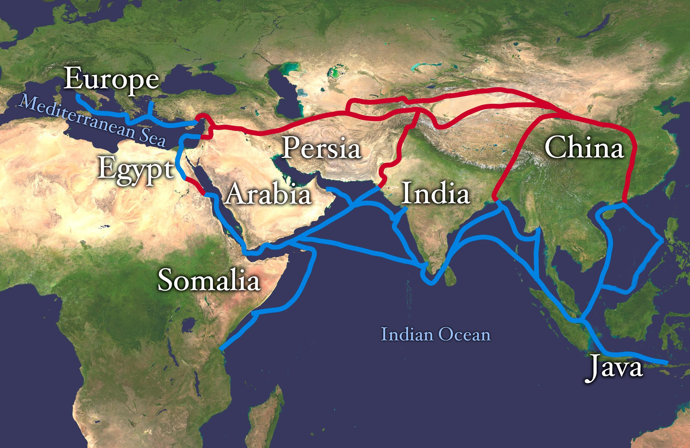

## Table of Contents

## What is the Silk Road?

The Silk Road was an ancient network of trade routes that connected the East and West. It started in China and went through many countries like India, Persia, and Rome. People used these routes to trade things like silk, spices, and gold. The Silk Road was not just one road but many paths that traders used over time.

The Silk Road was important because it helped different cultures learn about each other. People shared ideas, religions, and technologies. For example, paper and gunpowder from China reached the West through these routes. The Silk Road was active for many centuries, from around 130 BC until the 15th century. Even though it is no longer used, it had a big impact on the world.

## When was the Silk Road established?

The Silk Road was established around 130 BC. It started during the Han Dynasty in China when Emperor Wu sent Zhang Qian on a mission to the west. Zhang Qian's journey helped open up trade routes between China and Central Asia.

The Silk Road was not just one road but a network of paths that traders used to move goods across different regions. It connected China with the Mediterranean, passing through places like India, Persia, and Rome. Over time, these routes became important for trading silk, spices, and other valuable items.

## Which regions did the Silk Road connect?

The Silk Road connected many different regions across Asia and Europe. It started in China and went all the way to the Mediterranean Sea. Along the way, it passed through places like Central Asia, Persia, and India. These routes helped people from different parts of the world meet and trade with each other.

The Silk Road was not just one road but a network of paths. Traders used these paths to move goods like silk, spices, and gold from East to West. The routes also went through areas that are now part of countries like Afghanistan, Iran, and Turkey. This network made it possible for ideas, cultures, and technologies to spread between the East and the West.

## What types of goods were traded along the Silk Road?

The Silk Road was famous for trading many different things. One of the most important items was silk, which came from China. Silk was very valuable because it was soft and beautiful, and people in the West wanted it a lot. Besides silk, traders also moved spices like pepper and cinnamon. These spices made food taste better and were hard to find in Europe, so they were very expensive.

Another group of goods that were traded were precious items like gold, silver, and jewels. These were used to make beautiful things and were signs of wealth. Traders also carried other things like tea, porcelain, and paper from China. These items were new to the West and changed how people lived. The Silk Road helped move all these goods between the East and the West, making trade and culture richer for everyone.

## How did the Silk Road influence cultural exchange?

The Silk Road was very important for sharing cultures between the East and the West. People from different places met and traded not just goods but also ideas. For example, Buddhism spread from India to China and other parts of Asia through these routes. Traders and travelers shared stories, languages, and ways of living. This helped people understand and learn from each other, making the world more connected.

Also, technologies and inventions moved along the Silk Road. Paper and gunpowder from China reached the West, changing how people wrote and fought. The idea of making silk also spread to other countries, leading to new industries. These exchanges helped improve life in many places and showed how powerful sharing ideas can be. The Silk Road made the world a smaller place by bringing different cultures closer together.

## What role did the Silk Road play in the spread of religions?

The Silk Road helped spread religions across many countries. One big example is Buddhism. It started in India and moved to China and other parts of Asia through the Silk Road. Monks and traders traveled these routes and shared their beliefs. They built temples and monasteries along the way, which helped Buddhism grow in new places.

Another religion that spread along the Silk Road was Christianity. It came from the West and reached places like China and India. Nestorian Christians, for example, traveled the Silk Road and set up communities in Central Asia. They shared their faith with people they met, and this helped Christianity spread to new areas. The Silk Road was like a bridge that connected different religions and helped them grow in new lands.

## How did the Silk Road impact the economies of the regions it connected?

The Silk Road had a big impact on the economies of the places it connected. It helped trade grow a lot. People from different countries could buy and sell things they couldn't get at home. For example, China sold silk and got gold and silver from the West. This made the economies of these places stronger because they could make money from trading. Cities along the Silk Road, like Samarkand and Kashgar, became rich and important because they were busy trading centers.

The Silk Road also helped new businesses start. When people saw what others were trading, they started making those things too. For example, when silk reached the West, people there started trying to make it themselves. This led to new jobs and industries. The Silk Road made the world's economy more connected. It helped places that were far away from each other do business together, which made everyone's economy better.

## What were the major challenges faced by travelers on the Silk Road?

Traveling on the Silk Road was very hard because of many dangers. One big problem was the harsh weather. The deserts were very hot during the day and very cold at night. Mountains had snow and ice that made travel difficult. Another challenge was finding enough water and food. The Silk Road went through places where there were not many towns or villages, so travelers had to [carry](/wiki/carry-trading) everything they needed.

Another big challenge was bandits and robbers. The Silk Road was long and went through many places where it was hard to keep safe. Bandits would attack traders to steal their valuable goods like silk and spices. This made the journey very dangerous. Also, there were political problems. Different countries along the Silk Road might not get along, and this could lead to wars or closed borders, making travel even harder.

## How did the decline of the Silk Road occur?

The Silk Road started to decline in the 15th century. One reason was that new sea routes were found. Explorers like Christopher Columbus and Vasco da Gama found ways to sail around Africa and reach Asia by boat. These sea routes were faster and safer than the long land journey of the Silk Road. Also, ships could carry more goods than caravans, so trading by sea became more popular.

Another reason for the decline was political changes. Many countries along the Silk Road were not as strong or stable anymore. Wars and conflicts made the routes dangerous. Also, some countries started to control trade more tightly, which made it hard for traders to move freely. Over time, fewer people used the Silk Road, and it slowly stopped being an important trade route.

## What is the modern-day significance of the Silk Road?

The Silk Road is still important today because it shows us how people from different places can work together. It helped spread ideas, cultures, and goods between the East and West. Today, we can learn from this by trying to understand and respect other cultures. The Silk Road also shows us how important trade is for making the world's economy stronger. Many countries are working together now, just like they did on the Silk Road, to trade and help each other grow.

In modern times, the idea of the Silk Road has inspired new projects. One big example is China's "Belt and Road Initiative." This project wants to make new trade routes and help countries connect better. It is like a new Silk Road for today's world. The old Silk Road also reminds us of how travel and trade can bring people together. It teaches us to keep learning from each other and to keep building strong connections across the world.

## How has the concept of the Silk Road influenced contemporary geopolitics?

The idea of the Silk Road still shapes how countries work together today. One big way is through China's "Belt and Road Initiative." This project wants to build new roads, railways, and ports to connect Asia, Europe, and Africa. It's like a new Silk Road because it helps countries trade and work together. This initiative shows how the old Silk Road's idea of connecting different places is still important for making strong relationships between countries.

The Silk Road also affects how countries think about their place in the world. It reminds us that working together and trading can make everyone's economy stronger. Countries are trying to learn from the past and build new ways to connect, just like the Silk Road did. This helps them solve problems and grow together. So, the Silk Road's legacy is still alive and helps shape today's world.

## What are some current initiatives inspired by the Silk Road, such as the Belt and Road Initiative?

The Belt and Road Initiative (BRI) is a big project from China that wants to connect Asia, Europe, and Africa with new roads, railways, and ports. It's like a new Silk Road because it helps countries trade and work together. The BRI started in 2013 and many countries are joining in. It's all about making it easier for goods and people to move around the world, just like the old Silk Road did.

Another initiative inspired by the Silk Road is the Eurasian Economic Union (EAEU). This group of countries, including Russia and some Central Asian nations, work together to make trade easier between them. They want to be like the old Silk Road by making it simple to move goods across their borders. The EAEU and the BRI both show how the idea of connecting different places, like the Silk Road did, is still important today.

## References & Further Reading

[1]: Bergstra, J., Bardenet, R., Bengio, Y., & Kégl, B. (2011). ["Algorithms for Hyper-Parameter Optimization."](https://papers.nips.cc/paper/4443-algorithms-for-hyper-parameter-optimization) Advances in Neural Information Processing Systems 24.

[2]: ["Advances in Financial Machine Learning"](https://www.amazon.com/Advances-Financial-Machine-Learning-Marcos/dp/1119482089) by Marcos Lopez de Prado

[3]: ["Evidence-Based Technical Analysis: Applying the Scientific Method and Statistical Inference to Trading Signals"](https://www.amazon.com/Evidence-Based-Technical-Analysis-Scientific-Statistical/dp/0470008741) by David Aronson

[4]: ["Machine Learning for Algorithmic Trading"](https://github.com/stefan-jansen/machine-learning-for-trading) by Stefan Jansen

[5]: ["Quantitative Trading: How to Build Your Own Algorithmic Trading Business"](https://www.amazon.com/Quantitative-Trading-Build-Algorithmic-Business/dp/1119800064) by Ernest P. Chan 

[6]: Hansen, L. P., & Sargent, T. J. (2001). ["Robust Control and Model Uncertainty."](https://larspeterhansen.org/wp-content/uploads/2016/10/Robust-Control-and-Model-Uncertainty.pdf) American Economic Review, 91(2), 60-66.

[7]: Federico, G. (2014). ["An Economic History of the Silk Road."](https://www.cambridge.org/core/books/an-economic-history-of-the-silk-industry-18301930/7A261538458D712D8BF659A5548CB04B) Economic History Review.

[8]: Frankopan, P. (2015). ["The Silk Roads: A New History of the World."](https://books.google.com/books/about/The_Silk_Roads.html?id=9RBsCQAAQBAJ) Bloomsbury Publishing.

[9]: Liu, X. (2010). ["The Silk Road in World History."](https://archive.org/details/silkroadinworldh0000liux) Oxford University Press.

[10]: Baraniuk, C. (2018). ["What is the Belt and Road Initiative?"](https://onlinelibrary.wiley.com/doi/full/10.1002/app5.265) BBC News.