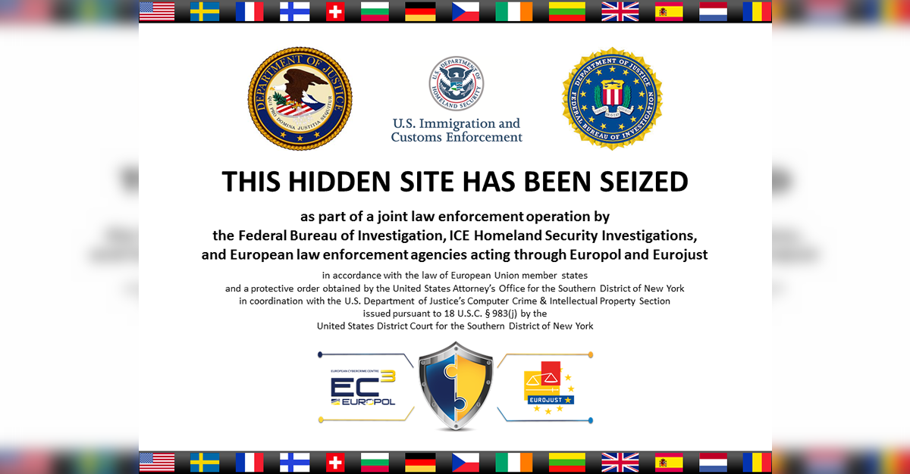

## Table of Contents

## What was the Silk Road online marketplace?

The Silk Road was an online marketplace that existed on the dark web. It was created by a person named Ross Ulbricht, who used the nickname "Dread Pirate Roberts." The Silk Road allowed people to buy and sell things using Bitcoin, a type of digital money. It was mostly known for selling illegal drugs, but people could also buy other things like fake IDs and hacking tools.

The website started in 2011 and was shut down by the FBI in 2013. During its time, it had many users from all over the world. The Silk Road was controversial because it made it easy for people to buy illegal things without getting caught easily. After the FBI closed it down, Ross Ulbricht was arrested and later sent to prison for a long time. Even though the original Silk Road is gone, it inspired other similar websites to appear on the dark web.

## Who founded the Silk Road and when was it launched?

The Silk Road was founded by Ross Ulbricht. He used the nickname "Dread Pirate Roberts" when he was running the website. Ross Ulbricht started the Silk Road because he wanted to create a place where people could buy and sell things without the government controlling it.

The Silk Road was launched in February 2011. It was an online marketplace on the dark web where people could use Bitcoin to buy and sell things. The website became famous for selling illegal drugs, but you could also find other things like fake IDs and hacking tools there.

## What types of goods were primarily sold on the Silk Road?

The Silk Road was mostly known for selling illegal drugs. People could buy all kinds of drugs there, like marijuana, cocaine, and heroin. It was easy for buyers to find what they wanted because the website had many sellers and a lot of different kinds of drugs.

Besides drugs, the Silk Road also sold other illegal things. You could find fake IDs, which people used to pretend to be someone else. There were also hacking tools, which helped people break into computers and steal information. These items were popular because they were hard to get in regular stores and the Silk Road made it easier for people to buy them without getting caught.

## How did the Silk Road ensure user anonymity?

The Silk Road used several ways to keep users' identities secret. One big way was by being on the dark web, which you could only reach with special software like Tor. Tor helps hide where you are and what you're doing online. When people used the Silk Road, their internet connection went through many different computers around the world, making it hard for anyone to find out who they were.

Another way the Silk Road kept users anonymous was by using Bitcoin for all transactions. Bitcoin is a type of digital money that doesn't need banks or governments to work. When people bought things on the Silk Road, they used Bitcoin, and their real names or bank details were not needed. This made it much harder for anyone to track who was buying and selling on the website.

## What was the economic impact of the Silk Road?

The Silk Road had a big impact on the economy, especially in the world of illegal goods. It made it easier for people to buy and sell drugs and other illegal things online. This created a new kind of market where people could trade without the government knowing. The Silk Road used Bitcoin, which helped make these trades secret. Because of this, the value of Bitcoin went up a lot during the time the Silk Road was open. It showed that people could use digital money for big transactions, which helped Bitcoin become more popular.

The Silk Road also changed how law enforcement and governments thought about online crime. When the FBI shut down the Silk Road, they took a lot of Bitcoin, which was worth a lot of money. This showed that online markets for illegal goods could make a lot of money and that governments needed to find new ways to stop them. The Silk Road's success also led to more dark web markets, which kept the cycle of illegal online trade going. Overall, the Silk Road had a big effect on both the illegal economy and the way digital money was used.

## How did law enforcement agencies view the Silk Road?

Law enforcement agencies saw the Silk Road as a big problem. They thought it was bad because it let people buy and sell illegal drugs and other illegal things easily. The Silk Road was hard to stop because it was on the dark web, which made it hard to find out who was using it. The FBI and other police groups worked hard to shut it down because they wanted to stop the illegal trade that was happening there.

When the FBI finally closed the Silk Road in 2013, they were happy because they stopped a big illegal market. They arrested Ross Ulbricht, the person who started it, and took a lot of Bitcoin, which was worth a lot of money. Law enforcement agencies saw this as a big win because it showed they could fight back against online crime. But they also knew that shutting down the Silk Road would not stop all illegal online markets, and they would need to keep working to stop new ones from starting.

## What led to the FBI's investigation of the Silk Road?

The FBI started looking into the Silk Road because they found out about this secret website where people could buy and sell illegal things. The FBI got a tip about the Silk Road in 2011, and they thought it was a big problem because it was selling drugs and other illegal stuff. They wanted to stop it, so they began their investigation. The FBI used different ways to find out more about the Silk Road, like following the money trails and trying to find out who was running it.

During their investigation, the FBI found out that the person behind the Silk Road was using the name "Dread Pirate Roberts." They worked hard to find out who this person really was. In 2013, they finally caught Ross Ulbricht, the man who started the Silk Road, in a public library in San Francisco. They were able to arrest him because they traced his internet connection and found him using the Silk Road. This was a big moment for the FBI because they could finally stop the Silk Road and show that they could fight against online crime.

## How did the FBI manage to identify and arrest the founder of the Silk Road?

The FBI started investigating the Silk Road after getting a tip in 2011 about this secret website where people could buy and sell illegal things. They wanted to stop it, so they followed the money trails and tried to find out who was running the site. The person behind the Silk Road was using the nickname "Dread Pirate Roberts," and the FBI worked hard to figure out who this person really was. They looked at a lot of information and tried different ways to track down the person running the site.

In 2013, the FBI finally found Ross Ulbricht, the man who started the Silk Road, in a public library in San Francisco. They were able to catch him because they traced his internet connection and saw that he was using the Silk Road. When they arrested him, they also shut down the website. This was a big moment for the FBI because they could stop the Silk Road and show that they could fight against online crime.

## What were the key events leading up to the FBI's closure of the Silk Road?

The FBI started looking into the Silk Road after getting a tip in 2011 about this secret website where people could buy and sell illegal things. They wanted to stop it, so they followed the money trails and tried to find out who was running the site. The person behind the Silk Road was using the nickname "Dread Pirate Roberts," and the FBI worked hard to figure out who this person really was. They looked at a lot of information and tried different ways to track down the person running the site.

In 2013, the FBI finally found Ross Ulbricht, the man who started the Silk Road, in a public library in San Francisco. They were able to catch him because they traced his internet connection and saw that he was using the Silk Road. When they arrested him, they also shut down the website. This was a big moment for the FBI because they could stop the Silk Road and show that they could fight against online crime.

## What was the legal outcome for the founder of the Silk Road after its closure?

After the FBI shut down the Silk Road, Ross Ulbricht, the person who started it, was arrested. He was charged with many crimes, like selling drugs, hacking, and money laundering. His trial happened in 2015, and a jury found him guilty of all the charges. The judge then sentenced him to life in prison without the chance to get out early. This was a big punishment because the judge thought the Silk Road was very dangerous.

Ross Ulbricht's lawyers tried to appeal the decision, but the appeals court agreed with the first trial's results. They said the evidence against him was strong and the trial was fair. Even though Ulbricht and his supporters kept trying to get a new trial or a shorter sentence, the courts have not changed their minds. So, Ross Ulbricht is still in prison serving his life sentence.

## How has the closure of the Silk Road influenced the development of subsequent dark web marketplaces?

The closure of the Silk Road did not stop the growth of dark web marketplaces. Instead, it showed people that there was a big demand for these kinds of websites. After the Silk Road was shut down, other similar websites started to appear. These new sites learned from the Silk Road's mistakes and tried to be more careful to avoid getting caught. They used better ways to keep users secret and made it harder for the police to find them. The Silk Road's success and its closure inspired many new dark web markets to start up.

Even though the Silk Road was gone, the idea of buying and selling things secretly online kept growing. New markets like AlphaBay and Hansa came up and became popular. These markets sold the same kinds of things as the Silk Road, like drugs and fake IDs. The police kept trying to close these new sites, but as soon as one was shut down, another one would start. The closure of the Silk Road showed that dark web markets could be very profitable, and it kept pushing people to create new ones.

## What are the ongoing debates and discussions about the legacy of the Silk Road in the context of internet freedom and regulation?

The Silk Road has caused a lot of debates about internet freedom and how much the government should control the internet. Some people think the Silk Road was good because it showed that people could trade without the government watching them. They believe that having a place where people can be free from government control is important. They argue that the Silk Road helped show that the internet can be a place for more freedom and that using Bitcoin for secret trading is a good thing.

On the other hand, many people think the Silk Road was bad because it made it easy for people to buy and sell illegal things like drugs. They believe that the government needs to control the internet more to stop crime. They argue that the Silk Road showed that the internet can be dangerous if it's not watched closely. These people think that the government should do more to stop illegal online markets and that the risks of the Silk Road outweigh any benefits it might have had for internet freedom.

## References & Further Reading

[1]: Greenberg, A. (2015). ["This is how the FBI took down the Silk Road mastermind."](https://www.wired.com/story/silk-road-creator-ross-ulbricht-is-waiting-for-trump-to-keep-his-word-and-set-him-free/) Wired.

[2]: Bilton, N. (2017). ["American Kingpin: The Epic Hunt for the Criminal Mastermind Behind the Silk Road."](https://www.goodreads.com/book/show/31920777-american-kingpin) Portfolio.

[3]: Foster, E. (2015). ["The Law Enforcement Challenges of Online Marketplaces: The Case of Silk Road."](https://www.researchgate.net/publication/283481769_The_law_enforcement_challenges_of_cybercrime_are_we_really_playing_catch-up) Policing, 9(2), 203-217.

[4]: Tapscott, D., & Tapscott, A. (2016). ["Blockchain Revolution: How the Technology Behind Bitcoin Is Changing Money, Business, and the World."](https://dl.acm.org/doi/10.5555/3051781) Penguin.

[5]: Narayanan, A., Bonneau, J., Felten, E., Miller, A., & Goldfeder, S. (2016). ["Bitcoin and Cryptocurrency Technologies: A Comprehensive Introduction."](https://press.princeton.edu/books/hardcover/9780691171692/bitcoin-and-cryptocurrency-technologies) Princeton University Press.