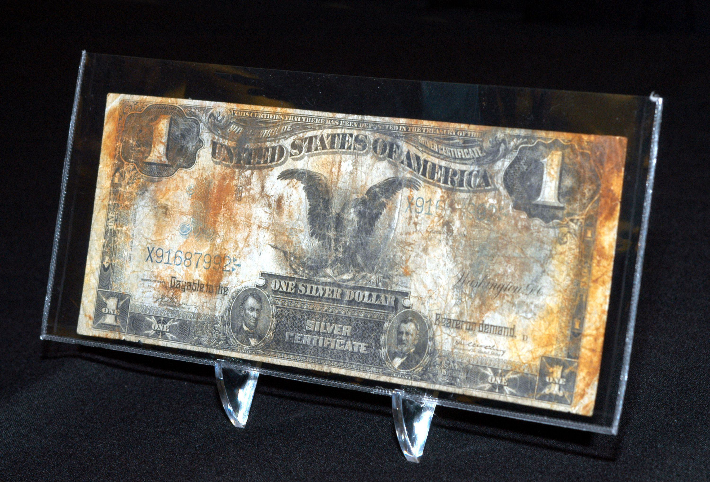

In this article, we explore the intriguing world of silver certificate currency, a distinctive form of paper money issued by the United States government. These certificates hold both historical significance and monetary value, making them a focal point for collectors and investors alike. Originally introduced as an exchangeable legal tender for silver bullion, silver certificates represent a unique chapter in the history of U.S. currency. As we examine their place in today's market, we'll delve into their evolving worth influenced by factors such as rarity and condition.

The integration of modern technology, specifically algorithmic trading, presents new opportunities in collectible paper money. Traditionally applied to streamline and optimize transactions in larger financial markets, algorithmic trading could revolutionize the trading dynamics of collectible items. This article investigates how these technological advancements can intersect with silver certificates, offering enhanced precision and potentially increasing their investment appeal.



Moreover, our discussion aims to illuminate the dual potential of silver certificates as both treasured collectibles and viable investment vehicles. With the advent of sophisticated trading algorithms, there is unprecedented potential to transform how these historical artifacts are appraised and traded. We embark on a journey to understand how these artifacts, interwoven with financial innovation, could redefine strategies in the collectible currency market.

## Table of Contents

## What Are Silver Certificates?

Silver certificates were introduced primarily as a form of U.S. currency under a policy that allowed citizens to exchange paper money for a specified amount of silver bullion. The origins of these certificates date back to the enactment of the Bland-Allison Act of 1878, which aimed to promote the use of silver and stabilize its value alongside gold. Consequently, silver certificates provided a practical alternative to carrying the heavy metal itself, thus facilitating easier transactions and circulation of silver-backed paper currency.

The issuance of silver certificates commenced in 1878 and continued until their eventual phase-out in the mid-20th century. During their initial issuance, these certificates demonstrated the innovation in financial instruments by permitting their holders to redeem the certificates for their face value in silver. This functionality made them a critical component of U.S. monetary policy at the time, reflecting an era when silver was integral to the currency system.

However, in the latter half of the 20th century, the practice of redeeming these certificates for silver bullion was discontinued as the U.S. moved towards fiat currency systems. By 1968, this redeemable feature was officially eliminated. Despite this, silver certificates still retain their status as legal tender, albeit without the promise of silver redemption.

Today, silver certificates hold significant appeal among collectors and numismatists due to their historical and cultural relevance. They are regarded as relics from a monetary era when the United States experimented with bimetallism, an economic stance endorsing the use of both gold and silver in currency. Collectors value these certificates not only for their direct association with historical economic practices but also for their unique designs and engravings, which often feature portraits of prominent historical figures and intricate artwork.

The enduring interest in silver certificates underscores their transformation from commonplace currency to prized collectibles. Their historical significance and aesthetic qualities continue to attract enthusiasts, who view them as artifacts offering insights into the economic history of the United States. For these reasons, silver certificates remain a vibrant part of the collectible currency market, distinct from other types of currency both in origin and the stories they encapsulate.

## Evaluating the Value of Silver Certificate Dollar Bills

The value of a silver certificate dollar bill is shaped by several determinants, primarily including rarity, condition, and historical significance. Rarity is a principal [factor](/wiki/factor-investing), as certain issues of silver certificates were produced in limited quantities. Bills with low serial numbers, unique errors, or special design features can substantially increase their collectible value. For instance, certificates with a star symbol before the serial number are usually rarer, since these were issued as replacements for damaged or misprinted bills [1].

Condition, commonly assessed by grading systems similar to those used for assessing coin quality, is another crucial factor. The grading typically ranges from poor to superb gem uncirculated, and even minor differences in condition can significantly impact value. Professional grading services like the Paper Money Guaranty (PMG) or the Professional Coin Grading Service (PCGS) provide certification, ensuring authenticity and grade transparency which can bolster market trust and value.

Historical significance is also pertinent. Certificates from notable time periods or those signed by historical figures can command higher prices. For example, silver certificates signed by prominent Secretary of the Treasury or Federal Reserve officials may heighten interest among collectors due to their historical connections.

To evaluate the current market value of silver certificates, one must also consider market trends and demographic shifts. The resurgence in interest for tangible assets, partly driven by uncertainties in digital assets and modern economic climates, can boost demand for collectibles like silver certificates. Moreover, demographic shifts, such as the increasing number of millennials entering the collectible markets, may influence demand patterns, considering younger collectors may value historical artifacts differently than older demographics.

Understanding these factors requires analysis similar to financial modeling and market analysis. Python libraries, such as pandas for data manipulation and matplotlib for visualization, can aid in mapping out trends over time. A simple example of assessing trends could include using Python to analyze auction data for silver certificates:

```python
import pandas as pd
import matplotlib.pyplot as plt

# Load auction data
data = pd.read_csv('auction_results.csv')

# Group by year and calculate average price
avg_price_per_year = data.groupby('Year')['Price'].mean()

# Plot data
plt.figure(figsize=(10, 6))
avg_price_per_year.plot(kind='line')
plt.title('Average Price of Silver Certificates by Year')
plt.xlabel('Year')
plt.ylabel('Average Price (USD)')
plt.grid(True)
plt.show()
```

This Python script provides a foundational approach to visualize how the average price of silver certificates can evolve over time, helping to identify periods of high demand or notable market shifts.

Thus, the interplay of rarity, condition, and historical significance, combined with insightful market analysis, offers a comprehensive framework for evaluating the value of silver certificate dollar bills, enabling collectors and investors to make informed decisions in this niche but rewarding market.

[1] "A Guide Book of United States Paper Money", Whitman Publishing.

## Algorithmic Trading in Modern Currency Markets

Algorithmic trading, often referred to as algo trading, involves the use of computer algorithms to [carry](/wiki/carry-trading) out trading decisions at speeds and efficiencies impossible for human traders. At its core, algo trading relies on a programmer's ability to predefine a set of rules or conditions under which a trade should be executed. These rules can be based on timing, price, quantity, or any mathematical model, ensuring that trading decisions are consistent and free from emotional biases.

In modern financial markets, [algorithmic trading](/wiki/algorithmic-trading) has become indispensable. It enables the swift analysis of large datasets, optimizing the timing and execution of trades to exploit narrow windows for profit. High-frequency trading ([HFT](/wiki/high-frequency-trading-strategies)), a subset of algo trading, epitomizes this capability, often executing thousands of trades per second based on nuanced market fluctuations.

For instance, consider a simple moving average crossover strategy, where an algorithm could be programmed in Python to buy stock when a short-term moving average crosses above a long-term moving average, and sell when the reverse occurs:

```python
# Example Python code for a moving average crossover strategy
def moving_average(prices, days):
    return sum(prices[-days:]) / days

def should_buy(prices, short_days=10, long_days=50):
    short_ma = moving_average(prices, short_days)
    long_ma = moving_average(prices, long_days)
    return short_ma > long_ma

# Example usage
prices = [45, 46, 47, 48, 50, 49, 51, 52, 50, 54, 55, 52, 56]
if should_buy(prices):
    print("Buy Signal")
else:
    print("Hold or Sell")
```

As technology continues to evolve, the principles of algorithmic trading are being explored beyond traditional financial assets, finding new applications in collectible markets, including historical paper money like silver certificates. These niche markets are typically characterized by lower [liquidity](/wiki/liquidity-risk-premium) and value influenced by subjective factors such as rarity and condition. Applying algorithmic strategies in such domains requires bespoke algorithms that account for these unique market dynamics.

In these contexts, algo trading can help traders identify pricing patterns and trends, potentially improving the efficiency of trades in markets that have traditionally relied on intuition and experience. However, the adaptation requires overcoming challenges such as sparse historical data and infrequent transactions, factors less prevalent in highly liquid markets.

In summary, algorithmic trading represents a significant technological advancement in finance, allowing for unprecedented speed and precision. Its integration into various asset classes, including collectibles, demonstrates the flexibility and potential of this approach to revolutionize how assets are traded, making it a critical tool in any modern trader's repertoire.

## Applying Algo Trading to Collectible Currency Markets

Algorithmic trading, a highly efficient mechanism in modern financial markets, has proven its capability to enhance trading outcomes through speed and data-driven precision. Applying these principles to the collectible currency market, such as silver certificates, presents unique opportunities and challenges. The primary advantage of algorithmic trading in this context is its ability to process large datasets rapidly, facilitating more informed decision-making for buying and selling.

One of the major challenges in applying algorithmic trading to collectible currency markets is the issue of low liquidity. Unlike stocks or commodities that are frequently traded, collectible currencies such as silver certificates have a more limited market. This scarcity can lead to significant price [volatility](/wiki/volatility-trading-strategies), where a small number of transactions can greatly affect market prices. Additionally, the subjective nature of assessing the condition and rarity of collectibles introduces complexity that standard financial assets do not possess.

However, these challenges can be addressed by developing innovative algorithms tailored specifically for this market. For example, [machine learning](/wiki/machine-learning) techniques can be employed to analyze historical sales data, providing insights into trends and price movements. By creating a rarity index, which quantifies the scarcity and desirability of specific silver certificate issues, algorithms can better predict potential value fluctuations.

One potential approach is using a predictive model to estimate future prices based on variables such as historical sale prices, economic indicators, and collector demand. Python, with libraries like Pandas for data manipulation and Scikit-learn for machine learning, can be used to build such a model. For instance:

```python
import pandas as pd
from sklearn.model_selection import train_test_split
from sklearn.ensemble import RandomForestRegressor

# Sample dataset containing historical sales data
data = pd.read_csv('silver_certificates_sales.csv')

# Features include historical price, demand index, and rarity score
X = data[['historical_price', 'demand_index', 'rarity_score']]
y = data['future_price']

# Splitting the data into training and testing sets
X_train, X_test, y_train, y_test = train_test_split(X, y, test_size=0.2, random_state=42)

# Random Forest model to predict future prices
model = RandomForestRegressor(n_estimators=100, random_state=42)
model.fit(X_train, y_train)

# Predicting future prices
future_prices = model.predict(X_test)
```

Furthermore, these algorithms could integrate sentiment analysis from online collector forums and social media to gauge market sentiment—an important factor in collectibles trading. This data can be incorporated into trading strategies, providing a more comprehensive picture of market dynamics.

The development of such specialized algorithms can transform the way silver certificates and other collectibles are traded, turning historical and subjective factors into quantifiable metrics. This evolution holds the potential to expand the market, attracting new participants seeking both the historical value and investment potential of these unique assets.

## Future Prospects and Investment Considerations

Technological advancements are set to transform the collectible currency market, making it increasingly accessible and appealing to today's investors. A key component of this transformation is the integration of algorithmic trading with innovative technologies such as blockchain. Blockchain's decentralized and immutable ledger system can significantly enhance the efficiency and transparency of authenticating and verifying the provenance of collectible items, including silver certificates. This application ensures that items traded on the market are genuine, helping investors make more informed decisions and reducing the risk of counterfeit products.

Algorithmic trading continues to evolve, and its application to niche markets like collectible currencies offers numerous opportunities. Advanced algorithms can process large datasets at incredible speeds, allowing for precise valuation assessments of collectible items. These assessments can include historical sales data, rarity indices, and other relevant factors. As algorithmic trading adapts to the unique characteristics of the collectible market, it could facilitate a more dynamic and responsive trading environment, attracting a broader range of investors who are eager to diversify their portfolios with non-traditional assets.

An example of how algorithms can enhance the trading of collectibles is the potential use of machine learning models to predict future price trends. Machine learning can identify patterns within historical data that might not be evident through manual analysis. By training models on past auction results, demographic shifts, and macroeconomic conditions, it is possible to develop robust predictive tools that aid investors in timing their collectible currency purchases and sales more effectively.

Additionally, the integration of smart contracts—self-executing contracts with terms directly written into code—on blockchain platforms can automate trading processes, reducing transaction costs and improving market liquidity. These technological developments hold the potential to democratize access to collectible investments, making the market more attractive to younger, tech-savvy investors who value transparency and efficiency in their investment processes.

By embracing these technological innovations, the collectible currency market might not only sustain its historical allure but also enhance its viability as a modern-day investment vehicle. These advancements promise to create a more inclusive and dynamic marketplace where the historical significance and cultural value of items like silver certificates are preserved, while also presenting new financial opportunities.

## Conclusion

Silver certificates represent an important aspect of U.S. currency history, continuing to draw interest from both collectors and investors. Their allure stems from a combination of historical significance, artistic design, and potential monetary value, which positions them as distinctive assets within the broader collectible market. 

The emergence of algorithmic trading and other technological advances presents new opportunities to refine investment strategies related to these historical documents. Algorithmic trading can provide a systematic approach to understanding market trends, evaluating historical sales data, and potentially predicting future value fluctuations of silver certificates. This method, coupled with technologies like blockchain, could offer enhanced authenticity verification and provenance tracking, thus providing greater transparency and efficiency in transactions.

For participants in collectible currency markets, adopting and integrating these innovative tools is essential. Successfully navigating the market's complexities requires not only a deep understanding of the historical context of items like silver certificates but also the ability to leverage modern technological advancements. This strategy ensures that investors remain at the cutting edge of this intriguing mesh between historical significance and financial innovation. By doing so, they can make informed decisions and potentially optimize their investment outcomes in this dynamic environment.

## References & Further Reading

[1]: Friedberg, A. H. (2007). ["Paper Money of the United States."](https://www.ebookshop.coin-currency.com/us/friedberg-paper-money-of-the-united-states/p/190091) Coin & Currency Institute.

[2]: Eliasberg, J. L. (1997). ["A Guide Book of United States Paper Money"](https://www.amazon.com/Guide-United-States-Paper-Money/dp/0794850707) Whitman Publishing.

[3]: Lopez de Prado, M. (2018). ["Advances in Financial Machine Learning"](https://www.amazon.com/Advances-Financial-Machine-Learning-Marcos/dp/1119482089) Wiley.

[4]: Chan, E. (2009). ["Quantitative Trading: How to Build Your Own Algorithmic Trading Business"](https://github.com/ftvision/quant_trading_echan_book) John Wiley & Sons.

[5]: Jansen, S. (2020). ["Machine Learning for Algorithmic Trading"](https://github.com/stefan-jansen/machine-learning-for-trading) Packt Publishing.