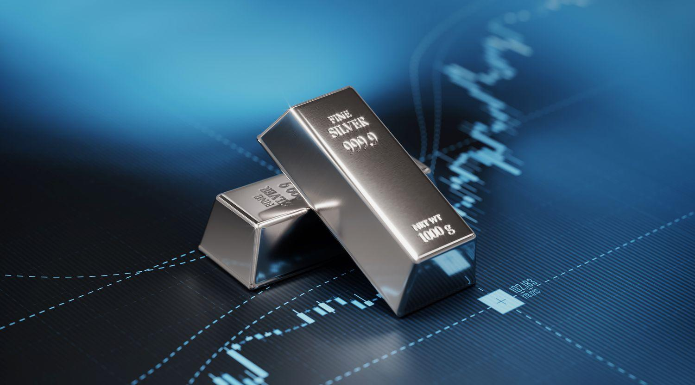

## Table of Contents

## What is a Silver ETF?

A Silver ETF, or Exchange Traded Fund, is a type of investment fund that tracks the price of silver. It allows people to invest in silver without having to buy and store physical silver bars or coins. Instead, you can buy shares of the ETF, which are traded on stock exchanges just like stocks. This makes it easier and more convenient for investors to gain exposure to the price movements of silver.

Silver ETFs hold physical silver as their underlying asset. This means that the value of the ETF goes up or down based on the current market price of silver. Investors can buy and sell shares of the ETF throughout the trading day at market prices. This provides a liquid and flexible way to invest in silver, as opposed to dealing with the challenges of buying, storing, and selling physical silver. Silver ETFs are popular among investors looking to diversify their portfolios and hedge against inflation or economic uncertainty.

## How does a Silver ETF work?

A Silver ETF works by holding physical silver, like bars or coins, and then issuing shares that people can buy and sell on a stock exchange. When you buy a share of a Silver ETF, you are not buying actual silver, but you are buying a piece of the fund that owns the silver. The price of the ETF share goes up and down based on the price of silver in the market. This makes it easy for you to invest in silver without having to worry about storing and protecting physical silver.

When you want to sell your shares of the Silver [ETF](/wiki/etf-trading-strategies), you can do it easily on the stock exchange during trading hours. The price you get for your shares will depend on the current market price of silver. This gives you a lot of flexibility because you can buy and sell shares whenever you want, just like you would with stocks. Silver ETFs are a popular way for people to invest in silver because they are easy to buy and sell, and they don't require you to handle physical silver.

## What are the benefits of investing in Silver ETFs?

Investing in Silver ETFs has several benefits. One big advantage is that it's easy to buy and sell them. You don't have to worry about storing physical silver or finding a buyer when you want to sell. You can just trade the ETF shares on the stock exchange during trading hours. This makes it simple and quick to get in and out of your investment.

Another benefit is that Silver ETFs can help you diversify your investment portfolio. Silver often moves differently from stocks and bonds, so adding silver to your investments can help spread out your risk. Plus, silver is seen as a safe-haven investment, which means it can protect your money during times of economic uncertainty or inflation. So, by investing in Silver ETFs, you can enjoy the potential gains of silver without the hassle of dealing with physical metal.

## What are the risks associated with Silver ETFs?

Investing in Silver ETFs comes with some risks that you should know about. One big risk is that the price of silver can go up and down a lot. This means the value of your Silver ETF can change quickly, and you might lose money if the price of silver goes down. Also, Silver ETFs have fees that you have to pay, like management fees. These fees can eat into your returns, making your investment less profitable over time.

Another risk is that Silver ETFs might not always track the price of silver perfectly. This is called tracking error. It can happen because of things like the costs of buying and selling silver, or because the ETF might hold some cash or other assets. This means that even if the price of silver goes up, your Silver ETF might not go up by the same amount. So, it's important to understand these risks before you decide to invest in Silver ETFs.

## How do you buy and sell Silver ETFs?

Buying and selling Silver ETFs is pretty easy. You can do it through a brokerage account, just like you would buy or sell stocks. First, you need to open an account with a broker that offers Silver ETFs. Once your account is set up, you can search for the Silver ETF you want to buy, enter the number of shares you want, and place your order. The price you pay will be the current market price of the ETF at the time you buy it.

When you want to sell your Silver ETF shares, you can do it the same way. Just log into your brokerage account, find your Silver ETF, and enter the number of shares you want to sell. You can place your order during trading hours, and the price you get will be the current market price of the ETF at the time you sell it. This makes it quick and easy to buy and sell Silver ETFs without having to deal with physical silver.

## What are the fees and expenses associated with Silver ETFs?

When you invest in Silver ETFs, you have to pay some fees and expenses. One common fee is the management fee, which is what the ETF charges to cover the costs of running the fund. This fee is usually a small percentage of the total value of your investment, and it's taken out of the fund's assets every year. Another fee you might see is the expense ratio, which includes the management fee and other costs like administrative expenses. The expense ratio is also a percentage of the fund's assets, and it can affect how much money you make from your investment over time.

There can also be other costs when you buy or sell Silver ETFs. For example, you might have to pay a commission to your broker every time you make a trade. This is a fee for using their service to buy or sell the ETF shares. Some brokers might not charge a commission, but they might have other fees instead. It's important to check all these fees before you invest, because they can add up and reduce your returns. Knowing about these costs can help you make a better decision about whether Silver ETFs are right for you.

## How do Silver ETFs compare to physical silver investments?

Silver ETFs and physical silver both let you invest in silver, but they work in different ways. With a Silver ETF, you buy shares of a fund that holds physical silver. This means you don't have to worry about storing and protecting the silver yourself. It's easy to buy and sell these shares on the stock market, and you can do it quickly during trading hours. This makes Silver ETFs a convenient option for people who want to invest in silver without the hassle of dealing with the metal directly.

On the other hand, investing in physical silver means you actually own the metal, like silver bars or coins. You have to find a safe place to store it and make sure it's secure. When you want to sell, you need to find a buyer and handle the transaction yourself. This can be more work, but some people like having the silver in their hands and knowing they own it outright. Physical silver can also be a good choice if you want to use it for things like jewelry or industrial purposes. Both options have their pros and cons, so it depends on what you're looking for in an investment.

## What are the tax implications of investing in Silver ETFs?

When you invest in Silver ETFs, you have to think about taxes. If you make money from selling your Silver ETF shares, you might have to pay capital gains tax. This tax depends on how long you held the shares before selling them. If you held them for a year or less, it's called a short-term capital gain, and you'll pay tax at your regular income tax rate. If you held them for more than a year, it's a long-term capital gain, and you'll pay a lower tax rate.

Silver ETFs can also give you dividends, which are payments from the fund. These dividends are usually taxed as ordinary income. But, some Silver ETFs might be structured as grantor trusts, and in that case, they might not pay dividends. Instead, they might give you something called a "grantor letter," which can be taxed differently. It's a good idea to talk to a tax advisor to understand all the tax rules for your Silver ETF investments.

## How are gains from Silver ETFs taxed?

When you sell your Silver ETF shares and make a profit, you have to pay taxes on that profit. This is called capital gains tax. If you held your shares for a year or less before selling, it's called a short-term capital gain. You'll pay tax on this at your regular income tax rate, which can be pretty high. But if you held your shares for more than a year, it's a long-term capital gain. The tax rate for this is lower, so you'll pay less tax on your profit.

Sometimes, Silver ETFs can also give you dividends, which are payments from the fund. These dividends are usually taxed as ordinary income, just like your paycheck. But, some Silver ETFs are set up as grantor trusts, and they might not pay dividends. Instead, they might give you something called a "grantor letter." This can be taxed differently, so it's a good idea to talk to a tax advisor to understand all the tax rules for your Silver ETF investments.

## What are the tax differences between holding Silver ETFs in a taxable account versus a tax-advantaged account?

When you hold Silver ETFs in a taxable account, you have to pay taxes on your gains and dividends. If you sell your shares for a profit, you'll pay capital gains tax. Short-term gains, from holding the shares for a year or less, are taxed at your regular income tax rate. Long-term gains, from holding the shares for more than a year, are taxed at a lower rate. Dividends from the ETF are also taxed as ordinary income. This can eat into your returns, so you need to think about these taxes when you invest.

If you hold Silver ETFs in a tax-advantaged account like an IRA or a 401(k), things are different. In these accounts, you don't have to pay taxes on your gains or dividends until you take the money out. This can help your investment grow faster because you're not losing money to taxes every year. But, when you do take the money out, it will be taxed as ordinary income, no matter how long you held the investment. So, using a tax-advantaged account can be a good way to save on taxes while your Silver ETFs grow.

## How can investors use Silver ETFs for tax-loss harvesting?

Investors can use Silver ETFs for tax-loss harvesting by selling their shares at a loss to offset capital gains from other investments. If you have a Silver ETF that has gone down in value, you can sell it and use the loss to reduce the taxes you owe on profits from other investments. This is helpful because it can lower your tax bill. But, you have to be careful about the "wash-sale" rule, which says you can't buy the same or a very similar investment within 30 days before or after the sale. If you do, you can't use the loss to offset your gains.

After selling the Silver ETF at a loss, you can wait 31 days and then buy it back if you still believe in the investment. This way, you can keep your investment strategy going while also getting the tax benefit. Or, you can use the money to invest in a different silver investment that isn't too similar to the one you sold. This helps you stay invested in silver while still taking advantage of the tax-loss harvesting strategy.

## What advanced tax strategies can be applied to optimize returns from Silver ETFs?

One advanced tax strategy for Silver ETFs is called tax-gain harvesting. If you think the tax rates might go up in the future, you can sell your Silver ETF shares now to lock in the current, lower long-term capital gains tax rate. After selling, you can buy the shares back right away because there's no wash-sale rule for gains. This way, you can keep your investment in silver while also saving on taxes if rates do go up.

Another strategy is using Silver ETFs in a tax-advantaged account like a Roth IRA. In a Roth IRA, your investments grow tax-free, and you don't have to pay taxes when you take the money out in retirement. This can be a great way to let your Silver ETFs grow without worrying about taxes on gains or dividends. Just remember, you can't take the money out until you're retired, or you might have to pay penalties.

You can also use Silver ETFs for tax diversification. This means holding some Silver ETFs in a taxable account and some in a tax-advantaged account. This way, you can take advantage of different tax rules to optimize your returns. For example, you might keep Silver ETFs that you plan to hold for a long time in a tax-advantaged account to avoid paying taxes on dividends and gains. Meanwhile, you can keep Silver ETFs that you might sell sooner in a taxable account to take advantage of lower long-term capital gains rates.

## References & Further Reading

[1]: Bergstra, J., Bardenet, R., Bengio, Y., & Kégl, B. (2011). ["Algorithms for Hyper-Parameter Optimization."](https://papers.nips.cc/paper/4443-algorithms-for-hyper-parameter-optimization) Advances in Neural Information Processing Systems 24.

[2]: ["Advances in Financial Machine Learning"](https://www.amazon.com/Advances-Financial-Machine-Learning-Marcos/dp/1119482089) by Marcos Lopez de Prado

[3]: ["Evidence-Based Technical Analysis: Applying the Scientific Method and Statistical Inference to Trading Signals"](https://www.amazon.com/Evidence-Based-Technical-Analysis-Scientific-Statistical/dp/0470008741) by David Aronson

[4]: ["Machine Learning for Algorithmic Trading"](https://github.com/stefan-jansen/machine-learning-for-trading) by Stefan Jansen

[5]: ["Quantitative Trading: How to Build Your Own Algorithmic Trading Business"](https://www.amazon.com/Quantitative-Trading-Build-Algorithmic-Business/dp/1119800064) by Ernest P. Chan