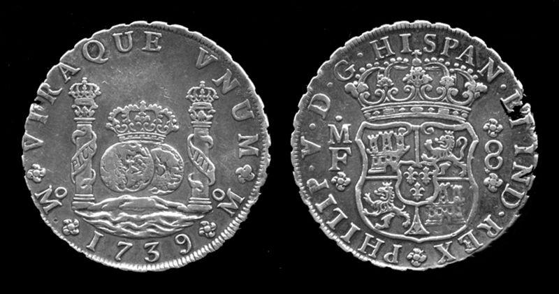

In today's rapidly evolving financial landscape, understanding the interconnected elements of monetary systems, the silver standard, and algorithmic trading is crucial. The complexity of these components defines the backbone of our modern economic world, influencing how financial transactions are conducted and how markets operate. Monetary systems, which involve the institutions, rules, and regulations managing a nation's currency and money supply, serve as the foundation upon which economic stability and growth are built. A deep knowledge of these systems is essential in discerning current economic trends and the impact of policy changes.

Historically, the silver standard played a significant role in supporting monetary systems by backing a country's currency value with silver reserves. This practice bolstered economic stability through its intrinsic value and facilitated international trade. As the global economy moved towards fiat currency systems in the 20th century, the silver standard's influence waned, but its underlying principles continue to inform discussions on currency valuation and monetary policy today.



In contrast, algorithmic trading represents a relatively recent but transformative development in financial markets. By utilizing computer programs to execute trades based on specific criteria, algorithmic trading enhances efficiency and liquidity, reshaping market dynamics. This technological advancement reduces human error and introduces novel strategies for capitalizing on market movements.

Together, these elements exhibit a symbiotic relationship where historical monetary practices inform modern technologies, and vice versa. Understanding this interplay is fundamental not only for grasping contemporary economic and financial trends but also for identifying future opportunities and strategies. This article explores these concepts in depth, equipping readers with comprehensive knowledge and insights essential for navigating today's financial domains and capitalizing on emerging opportunities.

## Table of Contents

## The Role of Monetary Systems in Economics

Monetary systems are fundamental to the functioning of economies, providing the necessary framework for conducting transactions and ensuring economic stability. At the core of these systems is the concept of money, which serves as a medium of exchange, a unit of account, and a store of value. The evolution of monetary systems has been marked by significant shifts from commodity money to fiat money, reflecting broader changes in economic policies and mechanisms of control.

Historically, commodity money, which derives its value from the material it is made of—such as gold or silver—was prevalent. The intrinsic value of these metals ensured widespread acceptance and facilitated international trade. However, reliance on commodity money introduced certain limitations, such as the need for vast reserves and the risks associated with fluctuating commodity prices.

The transition to fiat money—currency that a government declares to be legal tender but is not backed by a physical commodity—represents a decisive shift in the economic landscape. Fiat money relies on the trust and authority of the issuing government. This transition allowed for greater flexibility and control over the money supply. Central banks, such as the Federal Reserve in the United States or the European Central Bank in the Eurozone, play pivotal roles in this modern monetary framework.

Central banks utilize various tools to regulate the economy and maintain stability. Interest rate adjustments influence consumer and business borrowing and spending behaviors, thereby affecting overall economic activity. Open market operations, which involve the buying and selling of government securities, directly impact the money supply and [liquidity](/wiki/liquidity-risk-premium) within the financial system. By employing these and other mechanisms, central banks aim to achieve targets related to inflation, unemployment, and economic growth.

Understanding the dynamics of monetary systems is crucial for interpreting economic trends and assessing the impact of policy decisions. For instance, changes in interest rates can signal shifts in economic priorities, such as stimulating growth or curbing inflation. Likewise, historical fluctuations between commodity and fiat money continue to influence debates on currency valuation and economic stability.

In summary, monetary systems are indispensable in shaping the economic environment. Their evolution from commodity to fiat money marks a significant transformation in economic policy and control, with central banks playing a central role in maintaining economic stability and growth. Insights into these dynamics offer valuable perspectives on current and future economic trends, providing a foundation for strategic financial decision-making.

## The Silver Standard: History and Impact

The silver standard served as a foundational element in the monetary systems of various countries, providing a mechanism through which currencies were backed by silver reserves. Historically, silver was prized for its intrinsic value, making it a reliable medium of exchange and a critical asset in international trade. The metal's utility extended beyond mere transaction facilitation; it contributed significantly to economic stability across civilizations. 

In many economies, particularly during the 19th and early 20th centuries, silver was employed alongside gold within a bimetallic standard. For instance, the United States adopted the Coinage Act of 1873 which demonetized silver, leading to a notable economic transition referred to as the 'Crime of 1873'. This act marked the nation's shift from a bimetallic to a de facto gold standard, influencing monetary policy and economic conditions. Such transitions often resulted from geopolitical factors and macroeconomic trends, which saw countries adjusting their monetary systems to better control their economic environments and engage more effectively in global trade.

The eventual transition away from the silver standard to fiat currency systems marked a pivotal change in monetary economics. By the 20th century, most nations had moved towards fiat money—a system devoid of intrinsic metallic backing but maintained through government regulation and trust. This shift was driven by the need for more flexible monetary policies, particularly in response to economic crises and the expanding complexities of global finance. The pure fiat system allowed countries to adjust their money supply without the constraints posed by finite silver reserves, thereby facilitating economic growth through more dynamic policy interventions.

Understanding the historical significance of the silver standard is crucial for modern economists and investors as they evaluate current debates on currency valuation and alternative investment strategies. The intrinsic value associated with silver, alongside its historical role, continues to influence contemporary discussions about asset diversification and monetary reform. By studying past monetary systems like the silver standard, analysts can gain insights into the potential viability of current and future monetary frameworks, including cryptocurrencies and other digital assets. These historical contexts offer valuable lessons as they consider hedges against inflation and currency devaluation in today’s financial markets.

## Algorithmic Trading and Its Influence on Financial Markets

Algorithmic trading utilizes sophisticated computer programs to execute trades based on a set of predefined criteria. This advancement in trading technology enhances both efficiency and liquidity in financial markets. By automating the trading process, [algorithmic trading](/wiki/algorithmic-trading) minimizes human error and reduces emotional bias, significantly improving the precision and speed of transactions. This kind of trading leverages various strategies to capitalize on market movements, and it has transformed the landscape of financial markets by introducing both challenges and opportunities.

One of the primary benefits of algorithmic trading is its ability to process vast amounts of data at high speeds, allowing traders to quickly exploit market inefficiencies. Strategies such as [trend following](/wiki/trend-following) and mean reversion are commonly employed within algorithmic systems. Trend following involves identifying and following market trends, while mean reversion relies on the assumption that asset prices will eventually return to their historical averages. Both strategies utilize statistical models and historical data analysis to automate trading decisions.

Algorithmic trading also supports the implementation of high-frequency trading ([HFT](/wiki/high-frequency-trading-strategies)), a subset that involves executing a large number of trades at extremely fast speeds. The rapid pace of HFT can improve market liquidity, reducing bid-ask spreads and enabling more efficient price discovery. However, it also raises concerns about market stability, as the sheer [volume](/wiki/volume-trading-strategy) and speed of trades can exacerbate market [volatility](/wiki/volatility-trading-strategies) during periods of stress.

The rise of algorithmic trading presents numerous challenges. One significant concern is the potential for market manipulation, as malicious trading algorithms can be designed to distort market prices. Additionally, the reliance on complex algorithms raises questions about accountability and oversight. Regulatory bodies around the world are continually developing frameworks to address these issues, ensuring fair and transparent markets.

Despite the challenges, algorithmic trading offers significant opportunities for traders and institutions. By leveraging advanced analytics and [machine learning](/wiki/machine-learning), these systems can uncover hidden patterns and correlations, providing insights that are not easily observable through traditional trading methods. Furthermore, algorithmic trading enables the execution of complex strategies that require precise timing and execution, capabilities that are beyond human traders.

In summary, the influence of algorithmic trading on financial markets is profound, reshaping how trades are executed and decisions are made. As technology continues to advance, the role of algorithms in trading is expected to grow, offering new possibilities and requiring ongoing adaptation to ensure ethical and effective market participation.

## Interplay Between Silver Standard Economics and Algorithmic Trading

The transition from the silver standard to modern fiat currencies has not rendered the economic principles of the silver standard obsolete. In fact, these principles continue to hold relevance, especially in the context of commodities trading. Silver, once a primary backing for currency systems due to its intrinsic value, remains a significant asset within commodities markets. Its historical role in monetary systems offers a foundation for understanding fluctuations and valuation in current markets.

Algorithmic trading, which utilizes technology to execute trades based on pre-coded strategies, has fundamentally transformed how commodities like silver are traded. By leveraging historical data and statistical modeling, algorithmic trading systems can optimize trade strategies. For instance, analyzing long-term price data of silver can inform algorithmic models that predict future price movements, enabling traders to make informed decisions.

One of the primary advantages of using algorithmic trading in commodities markets, including silver, is its ability to mitigate risks associated with price volatility. Commodity prices are notoriously unstable, influenced by various factors such as geopolitical events, economic policies, and market sentiment. Algorithmic systems can rapidly process vast amounts of information and execute trades at speeds and precisions unattainable by human traders, thereby reducing exposure to volatile market swings.

For example, Python libraries such as Pandas, NumPy, and SciPy can be employed to develop algorithms that analyze historical price trends and volatility measures. An algorithm could be set to trigger buys or sells based on real-time comparisons of current prices against historically-derived moving averages. Here is a simple example of how a basic moving average strategy might be implemented in Python:

```python
import pandas as pd

# Load historical silver price data
data = pd.read_csv('silver_prices.csv')
data['Moving_Average'] = data['Close'].rolling(window=50).mean()

# Generate trading signals
data['Signal'] = 0
# Buy signal
data.loc[data['Close'] > data['Moving_Average'], 'Signal'] = 1
# Sell signal
data.loc[data['Close'] < data['Moving_Average'], 'Signal'] = -1

# Extract signals for review
signals = data[data['Signal'] != 0]
print(signals[['Date', 'Close', 'Signal']])
```

In practice, algorithmic trading of commodities like silver can integrate sophisticated statistical techniques and machine learning models to enhance predictive accuracy and account for more intricate market dynamics. Employing these technologies not only augments the execution efficiency but also supports more robust risk management frameworks that can adapt to and capitalize on the market movements captured from the remnants of the silver standard-era economic principles.

## Future Trends and Ethical Considerations

As technology continues to evolve at a rapid pace, algorithmic trading stands at the forefront of financial innovations, set to grow even more sophisticated with the integration of [artificial intelligence](/wiki/ai-artificial-intelligence) (AI) and machine learning. These advancements promise to enhance the accuracy of models predicting market trends and optimizing trade execution strategies. The adoption of AI enables algorithmic systems to analyze vast datasets, identify patterns, and make decisions with unprecedented speed and precision. Machine learning algorithms can adapt to new data, improving their performance over time and potentially delivering superior trading outcomes.

However, as algorithmic trading systems become more advanced, they also raise significant ethical considerations. Market manipulation is a major concern, as algorithms with self-learning capabilities might inadvertently contribute to unfair market activities. Practices such as "quote stuffing," where traders place a large number of orders to create congestion and manipulate prices, demonstrate potential pitfalls of unregulated algorithmic trading.

Fairness in trading practices is another ethical issue that demands attention. The use of high-frequency trading (HFT) by large firms can create an uneven playing field, disadvantaging individual traders and smaller firms. Access to advanced technology and infrastructure can result in disparities that challenge the integrity of financial markets.

Regulatory bodies are responding to these challenges by developing frameworks aimed at ensuring transparency and accountability. Regulations are increasingly focused on preventing market abuses and ensuring that trading practices do not undermine market stability. For instance, the European Union's Markets in Financial Instruments Directive (MiFID II) has been instrumental in setting standards for algorithmic trading, requiring firms to implement controls to monitor their systems effectively.

Moreover, the deployment of circuit breakers and surveillance systems help detect and prevent manipulative trading behaviors. These regulatory measures aim to create a balanced market environment where technology-driven advantages do not compromise fairness and integrity.

The future of algorithmic trading will likely see stricter compliance requirements, where traders must ensure ethical conduct alongside technological advancements. As these trading systems grow more capable, the responsibility lies with both technologists and regulators to ensure that algorithmic innovations promote a fair and efficient market, safeguarding against practices that may threaten its core principles.

## Conclusion

The convergence of monetary systems, the silver standard, and algorithmic trading underscores the intricate nature of contemporary financial ecosystems. These components, individually and collectively, reflect the dynamic evolution of global economic foundations and technological advancements. Monetary systems provide the framework for economic operations, with the shift from commodity-backed standards such as the silver standard to fiat currency indicative of changing economic governance and policy strategies. The silver standard, historically significant for its role in stabilizing currencies and international trade, laid crucial groundwork influencing modern discussions on currency valuation and alternative investments.

Algorithmic trading represents a technological leap, enhancing transaction efficiency and precision in an increasingly digital marketplace. By automating trading based on complex algorithms and data analysis, this approach mitigates human error and exploits market inefficiencies, thus offering new avenues for financial gains while posing regulatory and ethical challenges.

Understanding these elements is crucial for individuals and institutions aiming to effectively navigate today’s financial markets. As financial technology progresses, incorporating machine learning and AI into algorithmic trading, stakeholders must remain informed and adaptable. Such knowledge ensures preparedness to capitalize on emerging economic opportunities and to make informed decisions regarding investments and market strategies. In an era where market conditions can shift rapidly, being equipped with insights into these foundational and transformative aspects of finance is increasingly vital.

## References & Further Reading

[1]: ["The History of Bimetallism in the United States"](https://archive.org/details/historybimetall00goog) by J. Laurence Laughlin

[2]: Eichengreen, B. (1998). ["Globalizing Capital: A History of the International Monetary System."](https://www.jstor.org/stable/j.ctt7pfmc) Princeton University Press.

[3]: ["Advances in Financial Machine Learning"](https://www.amazon.com/Advances-Financial-Machine-Learning-Marcos/dp/1119482089) by Marcos Lopez de Prado

[4]: ["Machine Learning for Algorithmic Trading"](https://github.com/stefan-jansen/machine-learning-for-trading) by Stefan Jansen

[5]: Silver, S. W. (2002). ["The Impact of the Demonitization of Silver."](https://setac.onlinelibrary.wiley.com/doi/pdf/10.1002/etc.5620180102) The Economic Journal, 112(479), F46-F68.

[6]: ["Quantitative Trading: How to Build Your Own Algorithmic Trading Business"](https://www.amazon.com/Quantitative-Trading-Build-Algorithmic-Business/dp/1119800064) by Ernest P. Chan