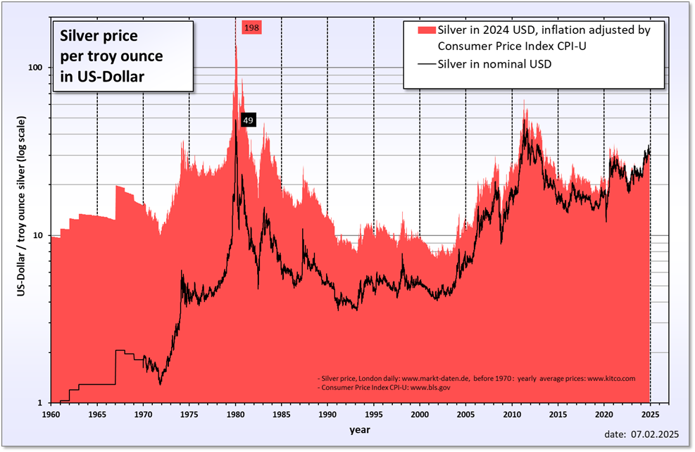

## Table of Contents

## What was Silver Thursday?

Silver Thursday was a big event that happened on March 27, 1980. It was when the price of silver dropped a lot because two brothers, Nelson and William Hunt, tried to control the silver market. They bought a lot of silver, which made the price go up. But then, they couldn't keep buying more, and the price crashed.

This event caused a lot of problems. Many people lost money because they had bought silver at high prices. Some banks and brokers also had trouble because they had lent money to the Hunt brothers. The government had to step in to help calm things down. Silver Thursday showed how dangerous it can be when a few people try to control a market.

## When did Silver Thursday occur?

Silver Thursday happened on March 27, 1980. It was a big event because the price of silver fell a lot that day. This happened because two brothers, Nelson and William Hunt, had been buying a lot of silver. They wanted to control the silver market, but they couldn't keep buying more, and the price crashed.

This event caused many problems. People who had bought silver at high prices lost a lot of money. Banks and brokers also had trouble because they had lent money to the Hunt brothers. The government had to help to stop the situation from getting worse. Silver Thursday showed how risky it can be when a few people try to control a market.

## Who were the main figures involved in Silver Thursday?

The main figures involved in Silver Thursday were Nelson Bunker Hunt and William Herbert Hunt. They were brothers who tried to control the silver market. They bought a lot of silver, which made the price go up. But then, they couldn't keep buying more, and the price crashed. This happened on March 27, 1980.

Because of what the Hunt brothers did, many people lost money. People who had bought silver at high prices were in trouble. Banks and brokers also had problems because they had lent money to the Hunt brothers. The government had to step in to help fix things. Silver Thursday showed how dangerous it can be when a few people try to control a market.

## What were the immediate effects of Silver Thursday on the silver market?

On Silver Thursday, March 27, 1980, the price of silver dropped a lot because the Hunt brothers, Nelson and William, couldn't keep buying more silver. They had been buying a lot of silver to try to control the market, but when they stopped, the price crashed. This made the price of silver go down from almost $50 an ounce to about $11 an ounce in just a few days.

This sudden drop in the price of silver caused a lot of problems. Many people who had bought silver at high prices lost a lot of money. Banks and brokers also had trouble because they had lent money to the Hunt brothers. The government had to step in to help calm things down and stop the situation from getting worse. Silver Thursday showed how risky it can be when a few people try to control a market.

## How did Silver Thursday impact the broader financial markets?

Silver Thursday had a big impact on the broader financial markets. When the price of silver crashed on March 27, 1980, it caused a lot of worry and panic. Many people and companies had invested in silver because the Hunt brothers had made the price go up. When the price dropped suddenly, these people lost a lot of money. This led to problems in other parts of the financial markets because many banks and brokers had lent money to the Hunt brothers and to other people who had bought silver. These banks and brokers were now in trouble because they might not get their money back.

The government had to step in to help calm things down. They made new rules to stop people from trying to control markets like the Hunt brothers had done. This event made people more careful about investing in commodities like silver. It also made banks and brokers more careful about who they lent money to. Silver Thursday showed everyone how risky it can be when a few people try to control a market, and it led to changes that made the financial markets safer.

## What were the economic conditions that led to Silver Thursday?

The economic conditions that led to Silver Thursday were a mix of high inflation and a weak dollar in the late 1970s. During this time, the value of the dollar was going down, and prices for everything were going up. People were looking for ways to protect their money, and some thought that buying silver was a good idea. The Hunt brothers, Nelson and William, saw this as a chance to make money. They started buying a lot of silver, which made the price go up even more.

As the price of silver kept going up, more and more people wanted to buy it. This made the Hunt brothers think they could control the silver market. But they were borrowing a lot of money to buy the silver, and when the banks started to worry about getting their money back, they stopped lending to the Hunts. Without more money to keep buying silver, the Hunt brothers couldn't keep the price up. On March 27, 1980, the price of silver crashed, causing Silver Thursday.

## What were the regulatory responses to Silver Thursday?

After Silver Thursday, the government made new rules to stop people from trying to control markets like the Hunt brothers had done. They wanted to make sure that no one could do what the Hunts did again. The government set limits on how much of a commodity like silver one person or group could own. This was to stop anyone from having too much control over the market.

The government also made it harder for people to borrow money to buy commodities. They did this because the Hunt brothers had borrowed a lot of money to buy silver, and when they couldn't pay it back, it caused a lot of problems. These new rules helped to make the financial markets safer and more stable. Silver Thursday showed everyone how important it is to have rules to protect the market from being controlled by just a few people.

## How did Silver Thursday influence future commodity market regulations?

Silver Thursday had a big impact on how commodity markets are regulated. After the Hunt brothers tried to control the silver market and caused a big crash, the government made new rules. They set limits on how much of a commodity one person or group could own. This was to stop anyone from having too much control over the market and causing another big problem like Silver Thursday.

The government also made it harder for people to borrow money to buy commodities. They did this because the Hunt brothers had borrowed a lot of money to buy silver, and when they couldn't pay it back, it caused a lot of trouble. These new rules helped to make the financial markets safer and more stable. Silver Thursday showed everyone how important it is to have rules to protect the market from being controlled by just a few people.

## What were the long-term effects of Silver Thursday on silver prices?

After Silver Thursday, the price of silver went down a lot and stayed lower for a long time. Before Silver Thursday, the Hunt brothers had made the price of silver go up to almost $50 an ounce. But after the crash, the price dropped to about $11 an ounce. It took many years for the price of silver to go up again. People were scared to invest in silver because they remembered how much money they had lost during Silver Thursday.

The event also changed how people thought about silver as an investment. Before Silver Thursday, many people thought silver was a safe way to protect their money from inflation. But after the crash, they saw that the price of silver could go down just as fast as it went up. This made people more careful about investing in silver. They started to look at other ways to invest their money that seemed less risky. Silver Thursday showed everyone that even things like silver, which many thought were safe, could be very risky if the market was not stable.

## How did the mechanism of cornering the market work in the case of Silver Thursday?

The Hunt brothers, Nelson and William, tried to corner the silver market by buying a lot of silver. They thought that if they owned a big part of all the silver, they could control the price. They started buying silver when the price was low, and as they kept buying, the price went up. More people saw the price going up and wanted to buy silver too. This made the price go up even more. The Hunt brothers were borrowing money to buy more and more silver, hoping to keep the price high.

But then, the banks got worried. They saw that the Hunt brothers were borrowing a lot of money and might not be able to pay it back. So, the banks stopped lending money to the Hunts. Without more money to buy silver, the Hunt brothers couldn't keep the price up. On March 27, 1980, the price of silver crashed because people started selling their silver. This is how the Hunt brothers' plan to corner the market failed, and it led to Silver Thursday.

## What lessons can be learned from Silver Thursday to prevent similar events?

Silver Thursday teaches us that it's really important to have rules to stop people from trying to control markets. The Hunt brothers bought a lot of silver and made the price go up, but when they couldn't keep buying, the price crashed. This hurt a lot of people who had bought silver at high prices. To stop this from happening again, the government made new rules. They set limits on how much of a commodity one person can own. They also made it harder for people to borrow money to buy commodities. These rules help keep the market fair and safe for everyone.

Another lesson from Silver Thursday is that markets can be very risky. People thought silver was a safe way to protect their money from inflation, but the crash showed that even silver can be dangerous if the market is not stable. This made people more careful about investing in commodities. They started looking at other ways to invest their money that seemed less risky. Silver Thursday showed everyone that it's important to be careful and to understand the risks before investing in anything.

## How has the understanding of market manipulation evolved since Silver Thursday?

Since Silver Thursday, people have learned a lot more about market manipulation. They now understand that when someone tries to control a market by buying a lot of something, like the Hunt brothers did with silver, it can cause big problems. Governments and financial watchdogs have gotten better at spotting these kinds of actions early. They use new rules and technology to keep an eye on markets and stop people from trying to control them. This helps to make sure that markets stay fair and safe for everyone.

Also, the way people think about investing has changed. After Silver Thursday, many people realized that even things like silver, which they thought were safe, can be risky if someone tries to manipulate the market. This has made investors more careful. They now look at many different things before they decide to invest, and they are more aware of the dangers of market manipulation. Overall, Silver Thursday helped everyone learn to be more watchful and to create better rules to protect the market.

## References & Further Reading

[1]: ["Beyond Greed and Fear: Understanding Behavioral Finance and the Psychology of Investing"](https://academic.oup.com/book/27607) by Hersh Shefrin.

[2]: ["The Great Silver Bubble"](https://www.amazon.com/Great-Silver-Bubble-Coronet-Books/dp/0340330333) by Stephen Fay.

[3]: ["A History of Modern Europe: From the Renaissance to the Present"](https://archive.org/details/a-history-of-modern-europe-from-the-renaissance-to-the-present) by John Merriman.

[4]: Shiller, R. J. (2000). ["Irrational Exuberance."](https://press.princeton.edu/books/paperback/9780691173122/irrational-exuberance) Princeton University Press.

[5]: Partnoy, F. (2003). ["Infectious Greed: How Deceit and Risk Corrupted the Financial Markets."](https://archive.org/details/infectiousgreedh0000part) Times Books.

[6]: Cheng, E. (2012). ["Silver on the Hunt: Examining the 1980 Silver Thursday Events."](https://en.wikipedia.org/wiki/Silver_Thursday) The Quarterly Journal of Economics.