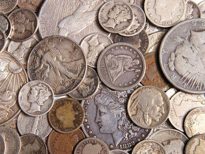

The financial markets are arenas of both opportunity and risk, where understanding historical events plays a critical role in grasping their complexity. Silver Thursday in 1980 stands as a vivid example of the volatility and speculative risks inherent in commodities markets. On this day, the market experienced a dramatic crash in silver prices, which was largely attributed to attempts by the Hunt brothers to manipulate the market for financial gain.

This article examines the catalysts, consequences, and lessons derived from the Silver Thursday episode, with particular attention to the burgeoning role of algorithmic trading. This trading technique, using computer algorithms to execute and manage trading processes, has become increasingly prevalent in modern markets. Analyzing its role in Silver Thursday sheds light on how such technologies could affect current market dynamics and inform regulatory structures.



The Hunt brothers' initiative to corner the silver market illustrated the potential for individual actors to influence global commodity prices significantly. Their actions were fueled by leveraging futures contracts to control approximately one-third of the world's privately-held silver reserves. This event emphasizes the ongoing importance of regulatory oversight in mitigating market manipulation risks and fostering transparent trading environments.

Exploring how traditional trading strategies intersect with modern technologies, like algorithmic trading, is pivotal in discussing strategies to avert future financial crises. The lessons learned from the Hunt brothers' strategy offer valuable insights into the necessity of robust regulatory frameworks and risk management strategies that accommodate the rapid developments in trading technology. Understanding these dynamics aids in creating a more resilient and transparent financial system in today’s global economy.

## Table of Contents

## The Hunt Brothers and the Lead Up to Silver Thursday

Nelson Bunker Hunt, William Herbert Hunt, and Lamar Hunt, known collectively as the Hunt brothers, were prominent figures in the financial world during the late 20th century. Their attempt to corner the silver market in the late 1970s stands as one of the most audacious efforts in commodity market manipulation. The Hunts inherited substantial wealth from their father, H.L. Hunt, who had amassed a fortune in the oil industry. This wealth provided the financial foundation from which they launched their ambitious silver purchasing strategy.

In the 1970s, the economic landscape was characterized by high inflation and a significant shift in monetary policy following the abandonment of the gold standard by the United States in 1971. Removing the direct convertibility of the U.S. dollar to gold increased inflationary pressures. As a result, investors turned to commodities like silver, traditionally seen as a hedge against inflation. The Hunt brothers were among those who saw silver as a stable investment during times of economic uncertainty.

The Hunts began purchasing silver in large quantities, motivated by the belief that the metal's price would continue to rise amidst ongoing inflation. By leveraging their substantial financial resources, they utilized futures contracts to augment their holdings. Futures contracts allowed them to commit to purchasing silver at set prices on a future date, effectively amplifying their market positions. This strategy enabled them to accumulate almost one-third of the privately-held silver supply worldwide.

Their financial activities were supported by numerous banks and brokers who provided margin loans to finance their purchases. Margin loans allowed the Hunts to borrow funds by using the silver itself as collateral. However, this also exposed them and the lending institutions to significant risk. As silver prices continued to rise, driven partly by the Hunts' own buying spree, these loans appeared secure. Yet, this significant exposure to leverage meant that any adverse price movements could swiftly lead to financial distress.

The confluence of these factors — the Hunts' aggressive acquisition strategies, the economic context of inflation and monetary policy changes, and the role of financial institutions in enabling their purchases — set the stage for the tumultuous events that led to Silver Thursday and its subsequent market upheaval. The Hunt brothers' actions underscore the profound influence individuals can wield in commodity markets, particularly when operating with extensive financial backing and high-risk strategies.

## Market Mechanics and the Collapse

The late 1970s and early 1980 marked a period of extraordinary activity in the silver market, primarily driven by speculative purchases led by the Hunt brothers. Armed with significant inherited wealth, the Hunts embarked on an ambitious scheme to amass a substantial portion of the world's silver, contributing to a dramatic rise in prices. The price of silver, which was approximately $6 per ounce in early 1979, skyrocketed to nearly $50 per ounce by January 1980, reflecting a nearly tenfold increase. This surge was largely attributable to intense buying pressure, compounded by market dynamics involving futures contracts.  

Futures contracts played a critical role in amplifying market positions during this period. By leveraging these financial instruments, the Hunts were able to control a more extensive amount of silver than would be possible in the spot market alone. However, this high leverage also introduced significant risk. As silver prices began to decline, margin calls—a demand by brokers for clients to deposit additional funds to cover potential losses—cascaded through the market. Traders, unable to meet these margin requirements, were forced to liquidate their positions, exacerbating the downward pressure on silver prices.  

Reacting to the escalating bubble, regulatory bodies, notably the Commodity Futures Trading Commission (CFTC) and major exchanges, initiated stringent measures to curb excessive speculation. Position limits, designed to restrict the maximum number of futures contracts a single entity could hold, were imposed alongside increased margin requirements. These regulatory changes aimed to stabilize the market by reducing the impact of large, speculative positions. However, they also introduced additional selling pressure, as traders were compelled to reduce their holdings to comply with the new regulations.  

The broader silver market's response to these regulatory shifts was marked by panic and a rapid withdrawal of capital. Confidence in the market diminished, triggering a rush to sell as investors sought to mitigate potential losses. The severity of the situation culminated on Silver Thursday, March 27, 1980, when the market witnessed a dramatic collapse. Silver prices plummeted, prompting a financial crisis that rippled through other sectors and markets.  

This event underlined the fragility of markets subject to speculative excess and the necessity for regulatory oversight to maintain stability. The collapse starkly demonstrated the potential consequences of unregulated leverage and the interconnectedness of modern financial systems. The lessons learned from this episode continue to inform contemporary regulatory frameworks and risk management strategies in commodity markets.

## The Aftermath of Silver Thursday

The collapse of the silver market on March 27, 1980, known as Silver Thursday, had profound financial implications, particularly for the Hunt brothers. The severe decline in silver prices left Nelson Bunker Hunt, William Herbert Hunt, and their associates facing extensive losses. Originally purchasing large quantities of silver when prices were low, the Hunts had amassed significant leverage through futures contracts and margin loans. As prices plummeted, they encountered margin calls that exceeded their financial capabilities, ultimately leading to bankruptcy filings in 1988. Legal repercussions followed as well, resulting from accusations of market manipulation and subsequent lawsuits filed by creditors and other affected parties.

To mitigate systemic financial risk, a consortium of banks organized a bailout for the Hunt brothers, providing them with $1.1 billion in loans to prevent broader market fallout. This intervention underscores the critical role financial institutions played during the crisis, as the failure of the Hunts could have destabilized credit systems and inflicted further damage on market participants. The bailout was not without controversy, as it raised concerns about moral hazard and the role of major financial entities in supporting traders with excessive speculative positions.

Beyond the Hunts, the crash had significant ramifications for other market participants, including traders and brokers who experienced substantial losses. Many had initially profited from the speculative surge in silver prices, but the unexpected collapse led to rapid devaluation of their holdings. The interconnection between futures markets and their reliance on credit arrangements magnified the impact, resulting in financial distress across the commodities trading community.

Following the crisis, the U.S. Securities and Exchange Commission (SEC) and other regulatory bodies initiated investigations into the events surrounding Silver Thursday. These inquiries aimed to identify the causes of the market disruption and to assess the role of speculative practices in exacerbating market [volatility](/wiki/volatility-trading-strategies). The Commodity Futures Trading Commission (CFTC) implemented stricter position limits and margin requirements to curb excessive speculation and enhance market stability.

In the long term, Silver Thursday had lasting effects on the silver market, instilling a more cautious approach among investors. The collapse underscored the risks associated with speculative trading and the importance of effective regulatory oversight to maintain market integrity. As a result, market participants became more vigilant in assessing leverage risks, and the lessons from this event continue to inform regulatory frameworks and trading practices in the commodity space.

## Algorithmic Trading and Its Role in Modern Markets

Algorithmic trading, also known as algo trading, refers to the use of computer programs to automate trading decisions. It incorporates algorithms capable of executing trades based on pre-defined criteria, such as timing, price, or [volume](/wiki/volume-trading-strategy), at speeds and frequencies that are beyond human capacity. Originating in the late 20th century, [algorithmic trading](/wiki/algorithmic-trading) has become a dominant force in modern financial markets, accounting for a significant portion of trading across asset classes, including commodities.

The integration of algorithmic trading in commodities markets comes with both risks and benefits. One clear advantage is the increased efficiency and [liquidity](/wiki/liquidity-risk-premium) brought about by automated trading. Algorithms can process vast amounts of data quickly, making trade executions far more efficient than manual trading methods. This efficiency reduces transaction costs and allows for real-time [arbitrage](/wiki/arbitrage) opportunities. However, the very attributes that make algorithmic trading beneficial also introduce risks. Rapid, automated buy/sell executions can amplify market volatility. A dire illustration would have been possible during the speculative excesses seen in the Hunt brothers' time, where algorithms might have exacerbated price swings in their pursuit to manipulate silver prices.

Algorithms have the ability to magnify market movements. A series of algorithmic trades, triggered by market conditions or signals, can lead to a cascade effect, escalating price fluctuations. This was evident in the 2010 "Flash Crash," where algorithmic trading contributed to a significant and rapid market decline. The parallels to the Silver Thursday event lie in the capacity of algorithms to enhance speculative behavior. While the Hunt brothers manually manipulated silver prices, today’s equivalents could leverage algorithms to achieve similar outcomes, potentially leading to systemic risks.

Regulatory frameworks have evolved to address these challenges. The Commodity Futures Trading Commission (CFTC), among others, has introduced measures to manage and monitor algorithmic trading activities to mitigate systemic risks. This includes regulations such as the implementation of circuit breakers to halt trading in the event of extreme market volatility, along with requirements for risk controls and testing algorithms to ensure market stability.

Notable case studies offer insight into the effects of algorithmic trading on market stability. The "Knight Capital" incident in 2012 highlighted the potential risks of algorithm-induced market disruptions. An error in the firm's trading software led to unintended large-scale trades, resulting in a $440 million loss over mere minutes and significant market turmoil. Lessons learned from such incidents underscore the necessity for robust risk management systems and continuous monitoring of algorithmic activities to protect against systemic threats.

In summary, while algorithmic trading has enhanced market efficiency and liquidity, it also brings risks that echo the speculative chaos reminiscent of the Hunt brothers' era. Proper regulatory oversight and advancements in technology are imperative to ensure these automated systems augment rather than undermine market stability.

## Lessons from Silver Thursday for Today’s Commodities Market

The Silver Thursday episode stands as a crucial learning opportunity for today's commodities market, underlining the significance of effective regulatory oversight, comprehensive investor education, and the prudent use of technology.

**Regulatory Oversight**

The Hunt brothers’ attempt to corner the silver market exposed vulnerabilities in the regulatory framework of the time, particularly in commodities and futures markets. Their ability to wield significant market power through the accumulation of a vast amount of silver, facilitated by leverage and futures contracts, highlighted the absence of stringent position limits and margin requirements initially. This underscored the necessity for robust regulatory measures to prevent such market distortions. For modern markets, clear regulatory mandates and proactive oversight are essential to ensure market stability and transparency. Regulatory bodies, such as the Commodity Futures Trading Commission (CFTC), continue to play a critical role in implementing rules that prevent manipulative practices, ensuring that markets operate fairly.

**Investor Education**

The Hunt brothers' saga illustrates the risks associated with leveraging and speculative trading. Education is pivotal in equipping investors with the knowledge to understand market mechanisms and the inherent risks of leverage. Comprehensive investor education programs can empower market participants to make informed decisions, fostering a more resilient financial environment. By understanding how leverage can amplify losses, investors are better positioned to manage risk exposure effectively. This, in turn, contributes to a more stable and predictable market landscape.

**Modern Technology and Data Analytics**

With advances in technology, markets today are significantly different than those of the 1980s. Algorithmic trading and data analytics now play a significant role in market operations. When harnessed correctly, these technologies can enhance market efficiency and investor protection. For instance, data analytics can be employed to detect unusual trading patterns indicative of manipulation, allowing for timely regulatory intervention. Additionally, technology enables more accurate pricing models and risk assessment tools, improving market stability. 

Below is a simple Python code snippet demonstrating the use of data analytics for anomaly detection in trading data:

```python
import numpy as np
from sklearn.ensemble import IsolationForest

# Simulated trading data
trading_data = np.random.normal(loc=0, scale=1, size=(1000, 2))

# Introduce anomalies
trading_data[-5:] = np.random.normal(loc=10, scale=1, size=(5, 2))

# Use Isolation Forest for anomaly detection
model = IsolationForest(contamination=0.01)
model.fit(trading_data)

# Detect anomalies
anomalies = model.predict(trading_data)

# Print out the positions of anomalies
print("Anomalies found at positions:", np.where(anomalies == -1))
```

**Vigilance in Financial Practices**

Ensuring transparency and fairness in the commodities market is imperative to prevent manipulation and sustain investor confidence. This vigilance involves active monitoring and strict enforcement of ethical standards across financial institutions. By fostering a culture of integrity, market participants can trust in the fairness of financial practices, bolstering confidence in market operations. Enhanced surveillance and accountability are critical in preventing future crises akin to Silver Thursday.

In conclusion, learning from past events like Silver Thursday is crucial for developing a resilient commodities market. While the risks of market manipulation and speculative excesses remain, the lessons learned can guide regulations, education, and technology to work in tandem to create a secure and transparent financial environment.

## Conclusion

Silver Thursday remains a significant case study in the analysis of commodities trading and financial markets. This event underscores the intricacies of market manipulation and the subsequent regulatory transformations that shape contemporary trading practices. The incident stands as a testament to the critical importance of regulation in maintaining market integrity and preventing excessive speculation that can lead to systemic crises.

Silver Thursday also highlights the perennial need for responsible integration of technology in trading operations. While algorithmic trading has revolutionized the speed and scale at which transactions occur, it simultaneously introduces new risks. As seen in historical precedents like that of the Hunt brothers, unchecked trading activities, whether motivated by human actors or automated systems, have the potential to cause significant market disruptions. It is therefore vital to harness these technological advancements wisely, ensuring that they contribute positively to market transparency and stability.

The incident from March 27, 1980, further reinforces the importance of strategic regulation and effective monitoring to mitigate the risks inherent in modern financial markets. Proactive regulatory measures can help identify and neutralize potential threats, fostering an environment where investor confidence is sustained and financial institutions operate with greater accountability.

Finally, Silver Thursday serves as a poignant reminder of the need for a forward-looking approach, applying insights gleaned from past crises to enhance the durability and resilience of current financial systems. Such adaptability is essential in a landscape where market dynamics are continuously evolving, and where the lessons of history offer vital guidance in navigating future challenges. By learning from events like Silver Thursday, stakeholders can better prepare for unforeseen events, securing a more stable and robust economic framework for generations to come.

## References & Further Reading

[1]: ["Beyond Greed and Fear: Understanding Behavioral Finance and the Psychology of Investing"](https://academic.oup.com/book/27607) by Hersh Shefrin.

[2]: ["The Great Silver Bubble"](https://www.amazon.com/Great-Silver-Bubble-Coronet-Books/dp/0340330333) by Stephen Fay.

[3]: ["A History of Modern Europe: From the Renaissance to the Present"](https://archive.org/details/a-history-of-modern-europe-from-the-renaissance-to-the-present) by John Merriman.

[4]: Shiller, R. J. (2000). ["Irrational Exuberance."](https://press.princeton.edu/books/paperback/9780691173122/irrational-exuberance) Princeton University Press.

[5]: Partnoy, F. (2003). ["Infectious Greed: How Deceit and Risk Corrupted the Financial Markets."](https://archive.org/details/infectiousgreedh0000part) Times Books.

[6]: Cheng, E. (2012). ["Silver on the Hunt: Examining the 1980 Silver Thursday Events."](https://en.wikipedia.org/wiki/Silver_Thursday) The Quarterly Journal of Economics.