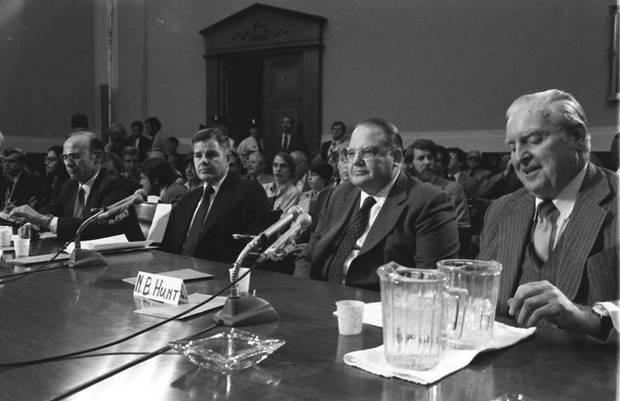

Understanding market manipulation is essential for both investors and regulators to safeguard market integrity and maintain equitable trading environments. Market manipulation refers to the deliberate attempt to interfere with the free and fair operation of the financial markets, usually with the intent of creating artificial, false, or misleading appearances with respect to the price of, or market for, a security, commodity, or currency. Such practices can undermine investor confidence and lead to substantial financial losses.

A historic example of market manipulation can be seen in the events of Silver Thursday, which occurred on March 27, 1980. On this day, the silver market suffered a dramatic decline, largely due to the actions of the Hunt brothers, Nelson Bunker Hunt and William Herbert Hunt. These Texas oil barons attempted to corner the silver market by buying large quantities of silver and using futures contracts to exert influence over market prices. Their aggressive acquisition strategy led to soaring silver prices, which ultimately culminated in a market crash when prices plummeted as creditors demanded payment and regulatory bodies intervened. Silver Thursday serves as a poignant case study on how individual traders' strategies can disrupt entire markets and lead to significant regulatory scrutiny.



In today's financial environment, the landscape of trading has evolved with the advent of modern technology, introducing new opportunities and challenges for market manipulation. Algorithmic trading, which involves the use of computer algorithms to automate trading decisions, has become commonplace. While this technology offers potential advantages such as increased efficiency and reduced costs, it also poses new risks for market manipulation. The speed and complexity of algorithmic trading systems can be exploited to create conditions that resemble classic manipulation tactics on a much larger scale.

This article examines the intricacies of market manipulation through the historical lens of Silver Thursday while considering the evolving nature of trading practices. By comparing the tactics employed during the Hunt brothers' era with the present-day prevalence of algorithmic trading, we gain insights into the continual need for vigilance and adaptability in regulation. Ultimately, understanding past events like Silver Thursday provides valuable lessons for preventing market abuses and ensuring the fair functioning of modern financial markets.

## Table of Contents

## The Background of Silver Thursday

March 27, 1980, is a pivotal date in financial history, particularly within the silver market, due to an event known as "Silver Thursday." This date is marked by a dramatic plunge in silver prices, precipitating widespread disruptions in financial markets. The root cause of this turmoil was the attempt by the Hunt brothers, Nelson Bunker Hunt and William Herbert Hunt, to corner the silver market.

The Hunt brothers, scions of one of America's wealthiest families, embarked on a strategy to amass substantial amounts of silver, aiming to control the market's supply and thereby influence prices. Their efforts to corner the market began in the early 1970s when they started purchasing silver in vast quantities. By leveraging significant financial resources and employing futures contracts, they managed to acquire an unprecedented stockpile of physical silver.

The brothers' strategy rested on the belief that paper currency was unreliable due to rampant inflation, which led them to view silver as a more stable store of value. This conviction led to extensive buying, driving silver prices from around $6 per ounce in early 1979 to a peak of $49.45 in January 1980. The price surge created a speculative bubble, attracting other investors and further inflating silver prices.

However, their strategy came with inherent risks, particularly the use of leverage. The margins required to maintain their futures position became unsustainable as market conditions shifted. In March 1980, the silver market witnessed a rapid decline in prices. As the market collapsed, the Hunt brothers faced margin calls that they could not meet, leading to significant financial distress.

The repercussions of Silver Thursday were far-reaching. The Hunts' inability to cover their positions prompted a [liquidity](/wiki/liquidity-risk-premium) crisis in the commodities and futures markets. Brokerage houses faced financial strains, and the broader financial system experienced destabilization, prompting interventions from regulatory bodies and financial institutions.

This event underscored the vulnerabilities of financial markets to manipulation and excessive speculation, leading to heightened scrutiny and the eventual implementation of regulatory measures to prevent similar occurrences in the future.

## Key Players and Their Strategies

The Hunt brothers, Nelson Bunker Hunt and William Herbert Hunt, were pivotal figures in the events leading up to Silver Thursday. Their primary motivation in the silver market was to hedge against the perceived risks of inflation and the anticipated devaluation of the U.S. dollar. Believing that silver prices were undervalued, the brothers initiated an aggressive strategy to accumulate vast quantities of the metal. This strategy was rooted in their belief that economic instability would drive the price of silver upwards, thus providing them substantial financial gain.

To execute their plan, the Hunt brothers began purchasing large amounts of silver bullion in the early 1970s. Their strategy evolved as they began to acquire futures contracts, which allowed them to control large quantities of silver without requiring immediate payment. This method involves a contract to buy or sell a commodity at a predetermined price at a specified future date. By amassing futures contracts, the Hunts could exert significant influence on silver prices without having to outlay substantial capital upfront.

The brothers employed leverage to magnify their purchasing power. Leverage involves using borrowed funds to increase a position in the market, thus amplifying potential gains as well as losses. In their case, the Hunt brothers borrowed heavily to buy silver. This aggressive use of leverage enabled them to corner the market by holding a large portion of the world's deliverable silver. They aimed to reduce its availability, thereby driving up prices.

Mathematically, the extent of their influence on silver prices can be described by the supply and demand framework. By significantly reducing the available supply of silver (S), while demand (D) remained stable or increased, the price (P) of silver was bound to rise, a basic economic principle represented by the equation:

$$
P = f(S, D)
$$

As $S$ decreased, $P$ increased, assuming steady $D$.

However, this strategy was not without its risks. The use of leverage meant that any downturn in silver prices would result in significant financial losses, as their debts were considerable. Additionally, as they became more conspicuous in the market, their influence attracted scrutiny from regulatory bodies.

In summary, the Hunt brothers' strategy in the silver market was a calculated attempt to capitalize on economic forecasts favoring precious metals. Their use of futures contracts and leverage were central to their plan to manipulate the market by cornering the supply of silver, thus illustrating the potential power and peril inherent in market manipulation.

## Regulatory Response and Lessons Learned

The U.S. government and the Commodity Futures Trading Commission (CFTC) played pivotal roles in addressing the market turmoil caused by Silver Thursday. In the wake of the dramatic price collapse of silver on March 27, 1980, these entities had to quickly respond to stabilize financial markets and prevent similar occurrences in the future.

The event underscored critical gaps in market regulations, particularly regarding the use of leverage and the accumulation of futures contracts. The Hunt brothers, who spearheaded the attempt to corner the silver market, primarily exploited these regulatory weaknesses. Their vast accumulation of silver and significant reliance on leverage created a precarious financial landscape, leading to the CFTC's focused intervention.

As a result, the CFTC introduced significant regulatory reforms, including the notable Silver Rule 7. This regulation aimed to prevent excessive speculation by setting stricter limits on the amount of silver any single entity could hold. The rule established position limits, effectively capping the exposure any trader could have in futures markets, thereby mitigating the risk of individuals or entities exerting undue influence over markets. Additionally, Silver Rule 7 required increased transparency in trading activities, making it harder for manipulative trades to go unnoticed.

Moreover, the events of Silver Thursday led to broader changes across the financial regulatory landscape. Market oversight agencies enhanced their monitoring mechanisms and improved coordination among themselves to ensure quick responses to potential threats. These changes have had lasting implications for market regulation and oversight, providing more robust frameworks that aim to balance market efficiency with protection against manipulation.

In subsequent decades, the regulatory strategies adopted in response to Silver Thursday have served as references for modern financial oversight initiatives. They emphasize the need for continuous adaptation of regulatory approaches to address evolving market conditions, ensuring that the stability of financial systems is maintained.

The lessons learned from Silver Thursday continue to influence regulatory practices today, reminding market participants and regulators of the importance of vigilance and proactive measures in maintaining fair, transparent, and stable markets.

## Algorithmic Trading in the Modern Market

Technological advancements have dramatically altered the landscape of financial markets, with algorithmic and high-frequency trading ([HFT](/wiki/high-frequency-trading-strategies)) playing pivotal roles in this transformation. Algorithmic trading refers to the use of computer algorithms to automate trading decisions, executing orders based on pre-set criteria with speed and precision that surpass human capabilities. High-frequency trading, a subset of [algorithmic trading](/wiki/algorithmic-trading), involves executing a large number of orders across various markets and securities in fractions of a second.

### Technology's Transformative Impact

The introduction of sophisticated algorithms and high-speed data processing allows traders to assess vast amounts of market data in real-time, enabling rapid decision-making and execution. This automation reduces transaction costs and increases market liquidity by narrowing bid-ask spreads, thus benefiting all market participants. Moreover, algorithmic trading ensures systematic and less emotion-driven market participation, contributing to more efficient price discovery.

A typical HFT strategy involves taking advantage of small price discrepancies that exist for very short periods due to market inefficiencies. By executing trades in lightning speed, these algorithms can exploit such opportunities before the broader market corrects them. Here is a simple Python example illustrating a basic HFT strategy using moving averages:

```python
import pandas as pd
import numpy as np

# Example price data
prices = pd.Series([100 + np.sin(x / 5) * 10 for x in range(100)])

# Calculate moving averages
short_window = 5
long_window = 20

signals = pd.DataFrame(index=prices.index)
signals['price'] = prices
signals['short_mavg'] = prices.rolling(window=short_window, min_periods=1, center=False).mean()
signals['long_mavg'] = prices.rolling(window=long_window, min_periods=1, center=False).mean()

# Generate buy/sell signals
signals['signal'] = 0
signals['signal'][short_window:] = np.where(signals['short_mavg'][short_window:] > signals['long_mavg'][short_window:], 1.0, 0.0)
signals['positions'] = signals['signal'].diff()
```

### Potential for Modern Market Manipulation

Despite these benefits, the rise of algorithmic trading introduces new avenues for market manipulation. Techniques such as "spoofing"—placing large orders with no intention of executing to deceive market participants—become easier with automation. This manipulation erodes market integrity and can cause substantial financial disruptions, as seen in incidents like the 2010 "Flash Crash."

### Comparison with Traditional Manipulation Tactics

Traditional market manipulation, such as the strategies employed by the Hunt brothers during Silver Thursday, involved direct attempts to influence market prices through the accumulation of large positions. These tactics required significant capital and were more straightforward to identify and regulate. Algorithmic manipulation, by contrast, is more subtle and operates at a highly sophisticated, granular level that can mask malicious intent within high trading volumes and complex strategies.

While traditional methods relied on visible market control, algorithmic-manipulated tactics exploit market microstructure, taking advantage of speed and [volume](/wiki/volume-trading-strategy). This comparison highlights the necessity for regulators to evolve alongside technological advancements to detect and mitigate new forms of manipulation effectively.

In conclusion, while algorithmic and high-frequency trading have redefined market operations, they also present novel challenges for preventing market manipulation. It is essential to continuously develop and implement robust regulatory frameworks to address these emerging risks, ensuring market stability and fairness.

## The Risks and Challenges Ahead

Market manipulation persists as a significant risk despite regulatory efforts aimed at maintaining fair and transparent financial markets. With the advancement of technology, the trading landscape has undergone considerable transformations, particularly through the integration of Artificial Intelligence (AI) and [machine learning](/wiki/machine-learning) in modern trading systems. These technologies, while providing substantial benefits, also present new challenges and potential for manipulation.

AI and machine learning have revolutionized trading by enabling the development of high-frequency trading (HFT) systems and algorithm-based strategies. These systems can process and analyze large datasets at unprecedented speeds, identifying patterns and making trading decisions in milliseconds. However, the opacity and complexity of these algorithms can mask manipulative practices, making detection and regulation more difficult. For example, algorithms can execute spoofing and layering tactics quickly and with great subtlety, complicating efforts to identify fraudulent activities.

Spoofing involves placing a large order on one side of the market without the intention of executing it, to mislead other market participants about supply or demand levels. Once traders react to this artificial pressure, the manipulator cancels the order and takes advantage of the resulting price move. Similarly, layering entails placing and canceling multiple orders at different price levels to create the illusion of market interest, influencing others' trading behavior.

The detection of such strategies requires sophisticated monitoring tools and regulatory frameworks that evolve alongside technological advancements. Regulators and market participants need to adopt enhanced surveillance systems capable of analyzing trading patterns and detecting anomalies indicative of manipulation. Employing machine learning models in this context can help identify suspicious trading activities by recognizing patterns that deviate from typical market behavior.

Moreover, fostering transparency in algorithmic and high-frequency trading is vital. Regulators may require traders to disclose their algorithms' general logic or the decision-making framework, without compromising proprietary information. This disclosure could be combined with regular audits to ensure compliance with fair trading practices.

Additionally, the collaborative efforts of regulators, exchanges, and financial institutions are crucial. Establishing cross-border regulatory cooperation can help address the global nature of modern trading systems and manipulative strategies. By sharing information and resources, regulators can better understand and respond to international manipulation schemes.

Finally, educating market participants about emerging risks is essential. Traders should be made aware of the potential ethical and legal ramifications of participating in or facilitating market manipulation through technology. Promoting a culture of compliance within trading organizations can further mitigate these risks.

In conclusion, while AI and machine learning bring numerous advantages to modern trading, they also introduce new avenues for market manipulation that require vigilant and adaptive regulatory responses. By leveraging technology, enhancing transparency, and fostering collaboration, the financial industry can better manage these risks and promote fair market practices.

## Conclusion

Reflecting on Silver Thursday, the event highlights the complex dynamics of financial markets and underscores the critical need for effective regulation. This episode exposed vulnerabilities within the market structure, showcasing how concentrated efforts by a small group of investors, like the Hunt brothers, can create significant [volatility](/wiki/volatility-trading-strategies) and disrupt market equilibrium. Such events emphasize the role of vigilant oversight to maintain fair trading environments.

The Silver Thursday incident teaches us the importance of adaptability in trading and regulatory mechanisms. Markets are dynamic, constantly shaped by new financial instruments, technologies, and global economic forces. Regulators must evolve in tandem, adopting innovative strategies and technologies to detect and mitigate potential manipulation. For instance, data analytics and machine learning can offer advanced monitoring capabilities, enabling real-time detection of suspicious trading patterns and behaviors.

Looking forward, ensuring fair and transparent markets demands a multifaceted approach. Regulators should focus on strengthening international cooperation, given the global nature of financial markets. Additionally, there is a need for continuous education for both market participants and regulators, fostering a deeper understanding of emerging technologies and their potential exploitation. Enhanced transparency through improved disclosure requirements, alongside promoting ethical standards within trading, can also contribute to minimizing the risks of future market manipulation.

Ultimately, the lessons from Silver Thursday remain highly relevant. By prioritizing vigilance, adopting innovative tools, and fostering a culture of transparency and cooperation, the financial industry can work towards mitigating the risks of market manipulation and ensuring a robust market environment.

## References & Further Reading

[1]: Buxbaum, P. (1983). ["The Great Silver Bubble."](https://archive.org/details/greatsilverbubbl0000fays) Unwin Paperbacks.

[2]: Jickling, M. (1999). ["Silver Prices: Manipulation or Normal Market Behavior?"](https://metalsedge.com/silver-price-manipulation-understanding-how-its-possible/) Congressional Research Service Report RS20352.

[3]: Surowiecki, J. (2008). ["The Hunt Brothers, Silver Thursday, and the Manipulation of the Silver Market."](https://learn.apmex.com/learning-guide/history/silver-thursday-the-hunt-brothers-scheme-2/) The New Yorker.

[4]: Mayer, M. (1981). ["The Greatest-Ever Bank Robbery: The Collapse of the Savings and Loan Industry."](https://archive.org/details/greatesteverbank00maye) Scribner.

[5]: MacKenzie, D., & Millo, Y. (2003). ["Constructing a Market, Performing Theory: The Historical Sociology of a Financial Derivatives Exchange."](https://www.jstor.org/stable/10.1086/374404) American Journal of Sociology, 109(1), 107-145.