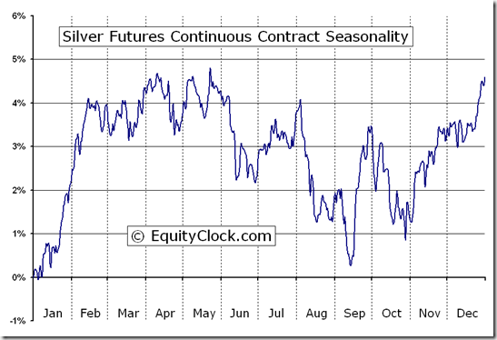

Algorithmic trading has transformed financial markets by providing traders with innovative methodologies and enhanced efficiencies. Silver trading, within this context, offers both opportunities and distinct challenges due to its unique market characteristics. Silver's dual roles as an industrial metal and a financial asset mean its price is influenced by a variety of factors, including industrial demand, inflation, and currency fluctuations. By employing algorithmic strategies, traders can leverage these dynamics to ensure precision and optimization in their trading approaches.

This article aims to explore the development of effective silver trading strategies through algorithmic trading methods, balancing data-driven insights with pattern-based methodologies. The integration of quantitative models and automated systems enables traders to execute trades based on complex algorithms that can discern profitable patterns more efficiently than manual trading.



We'll explore the principles of algorithmic trading and how they apply specifically to the silver market, yielding actionable insights for traders and investors aiming to maximize profits while minimizing risks. This involves understanding market liquidity, volatility, and the historical price movements of silver, which are pivotal in formulating successful trading scripts.

Our ultimate objective is to provide a comprehensive understanding of the strategies available in silver trading using algorithmic frameworks. This discourse will empower both novice and experienced traders by illuminating the broad and intricate aspects of this trading specialization. Whether one is beginning their journey in algorithmic trading or seeking to refine existing strategies, understanding the nuanced application of these methodologies to silver trading will be invaluable. Through a rigorous examination of the elements underpinning successful trading strategies, readers can develop a solid foundation to thrive in the dynamic world of silver algorithmic trading.

## Table of Contents

## Understanding Silver Trading in the Algorithmic Context

Silver trading, when approached through the lens of algorithmic trading, can present traders with significant opportunities due to its unique market characteristics. Silver, as a commodity, reacts distinctively to various market dynamics including industrial demand, market sentiment, and broader macroeconomic factors. These elements influence its price movements and create a landscape where algorithmic trading can be particularly effective.

Algorithmic trading applies sophisticated quantitative models and processes that allow for the automated execution of trades. This is particularly beneficial in silver trading as it enables the quick capitalization on price fluctuations that may result from its variable influences. By automating the trading process, algorithms can execute trades more efficiently than human traders, often at a higher frequency, and without the error-prone influence of human emotions or biases.

To successfully implement algorithmic strategies in silver trading, it is crucial to understand and analyze key market concepts such as [liquidity](/wiki/liquidity-risk-premium), [volatility](/wiki/volatility-trading-strategies), and price [momentum](/wiki/momentum). Liquidity refers to the ease with which trades can be executed without causing significant price changes. Silver markets often exhibit varied liquidity levels, especially between trading hours or during geopolitical events. Algorithmic strategies must account for these fluctuations to optimize the timing and size of trades. 

Volatility, which measures the extent of price variation, is another critical [factor](/wiki/factor-investing). Silver prices can be volatile due to changes in industrial demand or global economic stability. Algorithms can be designed to take advantage of high volatility periods by identifying trends and profitable entry or [exit](/wiki/exit-strategy) points.

Price momentum, or the rate of change in price, is integral to formulating profitable trading algorithms. By examining historical price movements, algorithms can predict potential future price directions. This requires the integration of historical data analysis, allowing traders to backtest their models against past market conditions. Backtesting offers valuable insights into the robustness of an algorithm, revealing its performance across different market scenarios and preventing overfitting to current or recent market data.

The application of these principles creates a framework within which algorithmic traders can devise strategies tailored to the nuances of the silver market. By leveraging automation and sophisticated modeling, traders aim to execute more informed and timely trades, potentially maximizing profitability while effectively managing the associated risks.

## Key Elements of a Silver Trading Strategy in Algo Trading

Building a successful silver trading strategy through algorithmic means requires a multifaceted approach involving the careful analysis of market timing, identification of entry and exit points, and stringent risk management practices. These elements combine to not only enhance the trader's decision-making process but also ensure consistent profitability and reduced exposure to market risks.

One critical aspect of this strategy is the development of algorithms capable of recognizing key market patterns such as support and resistance levels, trends, and breakouts. These patterns provide valuable indicators of potential price movements, allowing traders to position themselves advantageously in the market. For instance, support and resistance levels can signify potential turning points where the price of silver might reverse direction, providing entry or exit points for trades. Automated algorithms can efficiently scan large datasets to detect these levels and respond faster than human traders.

Incorporating technical indicators like Moving Averages (MAs) or the Relative Strength Index (RSI) further refines decision-making within a trading algorithm. Moving Averages, for example, help smooth out price data by creating a constantly updated average price, and are used to identify the direction of the trend. MAs can be simple (SMA) or exponential (EMA), with EMAs giving more weight to recent prices, thereby reacting more quickly to price changes. For instance, a crossover of short-term and long-term MAs is often used as a trading signal. Similarly, the RSI is a momentum oscillator that measures the speed and change of price movements, helping identify overbought or oversold conditions in the silver market.

Understanding liquidity and fair value gaps, a concept popularized by Smart Money Concepts, is essential for targeting trades efficiently. Liquidity refers to the ease with which an asset can be bought or sold without affecting its price. High liquidity ensures that trades can be executed quickly and at the desired price levels. Fair value gaps represent areas where there are discrepancies between market price and perceived intrinsic value, potentially indicating movement opportunities to exploit.

The choice of algorithmic models, such as trend-following or mean-reversion, should align with specific market conditions and trading objectives. Trend-following strategies aim to capitalize on market momentum, buying when prices are rising and selling when they are falling. In contrast, mean-reversion strategies rely on the assumption that prices will revert to their mean over time, allowing traders to profit from temporary deviations. Selecting the appropriate model largely depends on the prevailing market environment and the trader's risk tolerance and investment horizon.

The following Python code snippet demonstrates a simple implementation of a trend-following strategy using Moving Averages:

```python
import pandas as pd

# Load silver price data
data = pd.read_csv('silver_prices.csv')
data['SMA_50'] = data['Close'].rolling(window=50).mean()
data['SMA_200'] = data['Close'].rolling(window=200).mean()

# Generate trading signals
data['Signal'] = 0
data['Signal'][50:] = np.where(data['SMA_50'][50:] > data['SMA_200'][50:], 1, -1)

# Entry/Exit points
data['Position'] = data['Signal'].diff()

# Output signals
print(data[['Close', 'SMA_50', 'SMA_200', 'Signal', 'Position']].tail())
```

In conclusion, crafting an effective [algorithmic trading](/wiki/algorithmic-trading) strategy for silver necessitates the integration of pattern recognition, technical indicators, liquidity considerations, and appropriate algorithmic models. By balancing these elements, traders can create robust strategies that maximize profits while minimizing exposure to potential losses.

## Exploring Backtesting and Performance Analysis

Backtesting serves as a fundamental component in the verification process of any algorithmic trading strategy. It enables traders to simulate how their trading strategies would have performed using historical market data. This process is essential for identifying the effectiveness and viability of a strategy before applying it in real market conditions. By replicating past trading scenarios, traders gain insights into possible future performances, helping to build confidence in their algorithmic models.

One significant pitfall to be mindful of during [backtesting](/wiki/backtesting) is overfitting. Overfitting occurs when a model is excessively complex, capturing noise or random fluctuations in the historical data rather than the actual underlying trends. This results in a strategy that performs well on past data but poorly in live trading due to its lack of adaptability to new market conditions. To prevent overfitting, it is crucial to keep the model simple and ensure that the dataset used for testing is sufficiently extensive and diverse. Cross-validation techniques—such as splitting data into training and testing subsets—can also provide a more robust evaluation of a strategy's predictive capabilities.

Analyzing backtest results allows traders to refine their strategies iteratively. By carefully examining how different parameters affect outcomes, traders can adjust these parameters to enhance performance. For example, optimization techniques like grid search or genetic algorithms may be employed to find the optimal set of parameters. This iterative process is vital as it helps in balancing trade-offs between risk and return, tailoring the strategy to align with specific trading goals.

In evaluating the backtest outcomes, several key performance metrics should be considered to provide a comprehensive assessment of risk and return potential. The win/loss ratio, which indicates the proportion of winning trades to losing trades, offers a basic measure of strategy success. The Sharpe ratio, calculated as the average return earned in excess of the risk-free rate per unit of volatility or total risk, helps assess the efficiency of a trading strategy by incorporating risk-adjusted returns. Another crucial metric is drawdown, representing the peak-to-trough decline during a specific period; this metric measures the downside risk and the ability of the strategy to sustain adverse market conditions without significant losses.

Examining case studies of successful silver trading algorithms can offer valuable lessons. For instance, algorithms that leveraged momentum-based strategies during periods of pronounced silver volatility demonstrated notable profitability. These strategies often integrated indicators such as moving averages to capture and ride market trends. Other successful case studies featured mean-reversion approaches, capitalizing on temporary mispricings in the silver market for short-term gains. By analyzing such instances, traders can garner insights into the effective application of various algorithmic frameworks, thus enhancing their strategy development process.

In conclusion, backtesting and performance analysis are indispensable in algorithmic trading. They not only validate trading strategies but also provide critical insights for their refinement and optimization. By avoiding common pitfalls like overfitting and utilizing robust performance metrics, traders can devise strategies that are both resilient and adaptable to dynamic market conditions, ultimately leading to more informed and successful trading decisions.

## Risk Management in Silver Trading Algorithms

Effective risk management plays a crucial role in mitigating potential losses and ensuring consistent profitability in algorithmic trading of silver. This involves the strategic use of various tools and methodologies to safeguard investments and optimize trading outcomes.

Setting stop-loss and take-profit orders dynamically based on market conditions is a fundamental strategy. These orders allow traders to define specific price points at which they will exit a trade to either limit losses or secure profits. Dynamic adjustment of these levels in response to volatile market conditions or significant market events can enhance their effectiveness. For instance, in Python, using libraries like `pandas` and `numpy`, traders can develop algorithms to adjust stop-loss levels based on recent volatility:

```python
import numpy as np
import pandas as pd

# Assuming 'data' is a DataFrame containing silver price and 'volatility' is a calculated volatility measure
data['stop_loss'] = data['closing_price'] - (2 * data['volatility'])
data['take_profit'] = data['closing_price'] + (3 * data['volatility'])
```

Additionally, diversification and hedging are key principles to mitigate risks associated with the inherent volatility in silver prices. Diversification involves spreading investments across different assets to reduce exposure to any single market movement. Hedging, on the other hand, involves taking offsetting positions in related assets, such as trading silver futures or silver mining stocks, to counterbalance potential losses in silver spot trading.

Money management strategies, such as position sizing and risk-to-reward ratios, further reinforce trading discipline. Position sizing determines the amount of capital allocated to each trade, balancing aggressive and conservative approaches based on the trader's risk tolerance. The risk-to-reward ratio, calculated as the ratio of potential profit to potential loss, guides traders to pursue trades where potential gains significantly outweigh potential risks:

$$

\text{Risk-to-Reward Ratio} = \frac{\text{Potential Profit}}{\text{Potential Loss}}
$$

Understanding the regulatory landscape is vital for maintaining compliance and avoiding legal issues in algorithmic trading. Regulations can vary significantly across different jurisdictions, affecting aspects such as data privacy, algorithmic transparency, and trade execution standards. Staying informed of these regulations ensures that trading activities adhere to legal requirements, protecting traders from potential penalties.

Integrating a comprehensive risk management framework into silver trading algorithms not only reduces the likelihood of significant losses but also positions traders for long-term success in a competitive market environment.

## Future Prospects and Innovations in Silver Algo Trading

Algorithmic trading continues to advance rapidly, driven by significant innovations in technology, particularly [machine learning](/wiki/machine-learning) (ML) and [artificial intelligence](/wiki/ai-artificial-intelligence) (AI). These advancements have the potential to transform silver trading strategies, making them more adaptive and efficient. Adaptive algorithms, which learn and improve from real-time data, represent one of the most promising areas of innovation. These algorithms can dynamically adjust their models based on new information, allowing them to respond to market shifts more effectively. For example, [reinforcement learning](/wiki/reinforcement-learning), a type of machine learning, can optimize trading strategies by learning from continuous feedback, improving decision-making over time as market conditions evolve.

The integration of market sentiment analysis into algorithmic trading is becoming increasingly important. Sentiment analysis involves extracting valuable insights from social media, news articles, and other text-based data sources to gauge public mood and market sentiment. These insights can be incorporated into trading algorithms to provide a more comprehensive view of market movements, allowing traders to anticipate market trends and adjust their strategies accordingly. Natural language processing (NLP) techniques enable the parsing and understanding of vast amounts of unstructured data, transforming sentiment-driven insights into actionable trading signals.

Blockchain technology and cryptocurrencies offer another potential catalyst for revolutionizing silver trading paradigms. The transparency and security provided by blockchain could streamline trading processes, reduce fraud, and enhance trust within the market. Additionally, the tokenization of silver assets could increase market accessibility and liquidity, facilitating fractional ownership and trading of silver. Cryptocurrencies might also influence price correlations and volatility, offering new opportunities for algorithmic strategies tailored to capitalize on these dynamics.

Decentralized finance (DeFi) represents a burgeoning area of exploration for silver trading strategies. By leveraging smart contracts, DeFi platforms could enable automated and trustless trading of silver-based assets without intermediaries, potentially reducing fees and increasing transaction speed. Silver-backed stablecoins might emerge, providing a bridge between digital assets and physical commodities, and enhancing the liquidity of the silver market. The development of decentralized exchanges (DEXs) could further democratize access to silver trading, allowing more participants to engage in the market.

The future of silver algo trading is poised for transformation through these technological innovations. Adaptive algorithms, enhanced by real-time data, market sentiment analysis, blockchain advancements, and DeFi, offer a compelling vision of more agile, informed, and efficient trading strategies. As these technologies mature, they are likely to unlock new possibilities and redefine the landscape of silver trading in the years to come.

## Conclusion

Silver trading within algorithmic trading frameworks presents significant opportunities due to the distinctive dynamics of the silver market. By integrating algorithmic strategies, traders can refine their approach with heightened precision, improved efficiency, and increased effectiveness. This refinement is essential given the intricate nature of silver which is influenced by a myriad of factors such as industrial demand, market sentiment, and global economic indicators.

Algorithmic strategies allow traders to systematically leverage data-driven insights which lead to optimized decision-making processes. For instance, an algorithm could continuously monitor multiple indicators—such as moving averages, RSI, and [volume](/wiki/volume-trading-strategy) profiles—enabling timely entries and exits that manual monitoring might not achieve. Further, through algorithmic trading, the ability to backtest against extensive historical data empowers traders to validate and refine strategies before deployment in real markets.

Continuous learning and adaptation are vital as market conditions are never static. Traders and their algorithms must evolve to stay competitive, requiring awareness of emerging technologies and methodologies. This includes advancements in machine learning and AI, which can offer predictive analytics and automated adjustments that could significantly impact silver trading outcomes.

Starting small and scaling gradually are prudent approaches. New traders should establish a foundation by testing strategies thoroughly. Such a strategy could initially involve a simulation or small-scale live trading, which mitigates risk while confirming the strategy’s efficacy. This approach balances gaining real-world insights against potential financial exposure.

Ultimately, mastering algorithmic trading in the silver market is an ongoing journey that synthesizes knowledge, technology, and strategic acumen. As traders incorporate more sophisticated tools and continuously seek deeper market understanding, they enhance their potential not only to manage risk but also to capitalize on opportunities that manual trading might overlook. This dynamic synthesis empowers both novice and seasoned traders to navigate the ever-evolving landscape of silver trading with confidence.

## References & Further Reading

[1]: Bergstra, J., Bardenet, R., Bengio, Y., & Kégl, B. (2011). ["Algorithms for Hyper-Parameter Optimization."](https://papers.nips.cc/paper/4443-algorithms-for-hyper-parameter-optimization) Advances in Neural Information Processing Systems 24.

[2]: ["Advances in Financial Machine Learning"](https://www.amazon.com/Advances-Financial-Machine-Learning-Marcos/dp/1119482089) by Marcos Lopez de Prado

[3]: ["Evidence-Based Technical Analysis: Applying the Scientific Method and Statistical Inference to Trading Signals"](https://www.amazon.com/Evidence-Based-Technical-Analysis-Scientific-Statistical/dp/0470008741) by David Aronson

[4]: ["Machine Learning for Algorithmic Trading"](https://github.com/stefan-jansen/machine-learning-for-trading) by Stefan Jansen

[5]: ["Quantitative Trading: How to Build Your Own Algorithmic Trading Business"](https://www.amazon.com/Quantitative-Trading-Build-Algorithmic-Business/dp/1119800064) by Ernest P. Chan