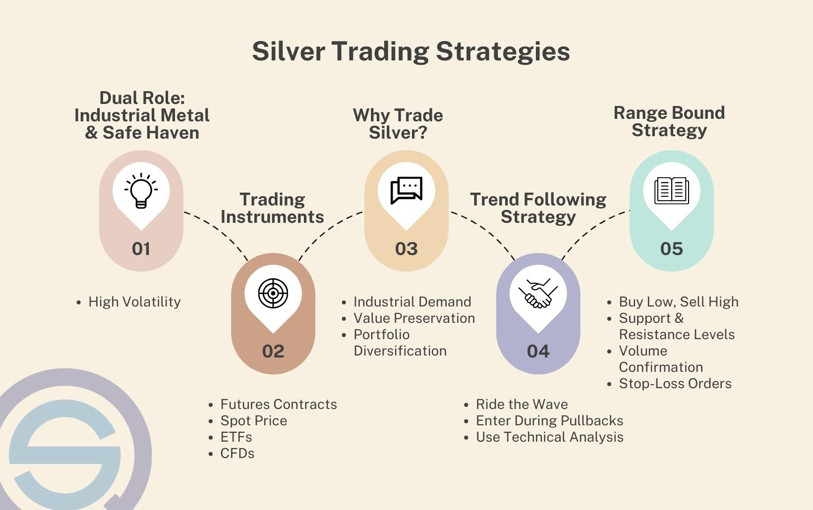

## Table of Contents

## What is silver trading and why is it important?

Silver trading is when people buy and sell silver as a way to make money. Silver is a shiny metal that people use for jewelry, coins, and in electronics. Traders buy silver when they think its price will go up and sell it when they think the price will go down. They can trade silver in different forms, like physical silver bars or coins, or through financial products like futures and exchange-traded funds (ETFs).

Silver trading is important for a few reasons. First, it helps set the price of silver. When lots of people want to buy silver, the price goes up. When lots of people want to sell, the price goes down. This trading helps keep the market balanced. Second, silver trading can be a way for people to protect their money. If they think other investments like stocks might lose value, they might buy silver instead. Silver can be a safe place to put money during uncertain times.

## What are the basic concepts a beginner should know before starting to trade silver?

Before starting to trade silver, a beginner should understand a few basic concepts. First, they need to know what affects silver prices. Things like how much silver is being produced, how much people want to buy, and what's happening in the world economy can all change the price of silver. For example, if a new big mine opens, more silver might be available, which could lower the price. On the other hand, if a lot of people suddenly want to buy silver for their jewelry or electronics, the price might go up.

Second, beginners should learn about the different ways to trade silver. They can buy physical silver, like coins or bars, and store it themselves. Or they can trade silver through financial products like futures contracts, which let them agree to buy or sell silver at a certain price in the future, or ETFs, which are like funds that hold silver and trade on stock exchanges. Each way has its own risks and benefits, so it's important to understand them before starting to trade.

Lastly, it's crucial for beginners to understand the risks involved in trading silver. The price of silver can be very unpredictable and can go up or down quickly. This means there's a chance to make money, but also a chance to lose money. It's important to only trade with money you can afford to lose and to do a lot of research before making any trades. Learning about these concepts can help beginners make better decisions and trade silver more safely.

## How does the silver market work and who are the key players?

The silver market works a lot like other markets where things are bought and sold. People who want to buy silver, like jewelry makers or electronics companies, meet with people who want to sell silver, like miners or investors. This happens in different places, like on special exchanges where people trade silver futures, or through dealers who sell physical silver. The price of silver goes up and down based on how much people want to buy it and how much is available to sell. If more people want silver than there is available, the price goes up. If there's more silver than people want to buy, the price goes down.

The key players in the silver market are miners, who dig silver out of the ground; refiners, who make the silver pure enough to use; dealers, who buy and sell silver in different forms; and investors, who buy silver hoping its price will go up. There are also big banks and financial institutions that trade silver in large amounts, often using futures contracts. These players all work together to keep the silver market moving, with miners supplying the silver, dealers helping it get to buyers, and investors and banks helping to set the price through their buying and selling.

## What are the different types of silver trading strategies available for beginners?

For beginners, there are a few simple silver trading strategies to consider. One common strategy is called "buy and hold." This means you buy silver and keep it for a long time, hoping its price will go up. It's a simple way to start because you don't need to watch the market every day. Another strategy is called "[trend following](/wiki/trend-following)." Here, you look at the price of silver over time and try to see if it's going up or down. If you think the price will keep going up, you buy silver. If you think it will keep going down, you might sell what you have or wait to buy later.

Another strategy for beginners is "dollar-cost averaging." This means you buy a little bit of silver at regular times, like every month, no matter what the price is. Over time, this can help you buy silver at a lower average price. Lastly, there's "[scalping](/wiki/gamma-scalping)," where you buy and sell silver quickly, trying to make small profits from small changes in the price. This can be more exciting but also riskier, so it's important to be careful and not trade more than you can afford to lose. Each of these strategies has its own way of working, and beginners should think about which one fits best with their goals and how much risk they're okay with.

## How can one analyze the silver market using technical analysis?

Technical analysis is a way to look at the silver market by studying past prices and trading volumes. It helps traders guess where the price might go next. They use charts and tools like moving averages, which show the average price over time, to see if the price is going up or down. They also use support and resistance levels, which are like floors and ceilings for the price. If the price keeps bouncing off a certain level, that's support. If it keeps getting stopped at a certain level, that's resistance. By looking at these things, traders can decide when to buy or sell silver.

Another important part of technical analysis is using indicators like the Relative Strength Index (RSI) and the Moving Average Convergence Divergence (MACD). The RSI helps traders see if silver is overbought, meaning too many people have bought it and the price might go down soon, or oversold, meaning not enough people have bought it and the price might go up. The MACD helps show the strength and direction of a price trend. If the MACD line crosses above the signal line, it might be a good time to buy. If it crosses below, it might be a good time to sell. By using these tools and watching the charts, beginners can start to understand the silver market better and make smarter trading decisions.

## What role does fundamental analysis play in silver trading?

Fundamental analysis looks at the big things that affect the price of silver, like how much silver is being made, how much people want to buy it, and what's happening in the world economy. It helps traders understand why the price of silver might go up or down. For example, if a new big silver mine opens, there will be more silver, which might make the price go down. Or if a lot of people suddenly want to buy silver for their jewelry or electronics, the price might go up. By looking at these things, traders can make better guesses about where the price of silver is headed.

Using [fundamental analysis](/wiki/fundamental-analysis) can be really helpful for silver traders. It gives them a bigger picture of what's going on in the market, not just the day-to-day price changes. For example, if there's a lot of uncertainty in the world, like during a big economic crisis, people might want to buy more silver because it's seen as a safe investment. By keeping an eye on these big factors, traders can decide when it might be a good time to buy or sell silver. Combining fundamental analysis with technical analysis, which looks at price charts, can give traders a fuller understanding of the silver market and help them make smarter trading decisions.

## What are the common risks associated with silver trading and how can they be mitigated?

Silver trading can be risky because the price of silver can change a lot and quickly. This is called price [volatility](/wiki/volatility-trading-strategies). If the price goes down after you buy silver, you might lose money. Another risk is that silver markets can be affected by big events in the world, like changes in the economy or new laws about mining. These things can make the price of silver go up or down in ways that are hard to predict. Also, if you're trading with borrowed money, called margin trading, you can lose more than you put in if the price moves against you.

To lower these risks, it's a good idea to only trade with money you can afford to lose. This way, if the price goes down, it won't hurt you too much. It's also smart to spread out your investments, which means not putting all your money into silver but also buying other things like stocks or bonds. This can help protect you if the price of silver drops. Lastly, doing a lot of research and keeping up with what's happening in the world can help you make better guesses about where the price of silver might go. By understanding both the big picture and the day-to-day changes, you can make smarter trading choices.

## How can an intermediate trader develop a personalized silver trading strategy?

An intermediate trader can develop a personalized silver trading strategy by first understanding their own goals and risk tolerance. They need to figure out if they want to make quick profits by trading often or if they're okay with holding onto silver for a longer time, hoping for bigger gains. They should also think about how much money they're willing to risk. Once they know these things, they can start to build a strategy that fits them. For example, if they like to trade a lot and are okay with taking more risks, they might choose a strategy like scalping, where they buy and sell silver quickly to make small profits. If they prefer to be more patient and take fewer risks, they might go for a buy-and-hold strategy, where they keep silver for a long time.

Next, the trader should combine both technical and fundamental analysis to make their strategy stronger. Technical analysis helps them look at price charts and patterns to guess where the price might go next. They can use tools like moving averages, RSI, and MACD to find good times to buy or sell. Fundamental analysis helps them understand the big things that affect silver prices, like how much silver is being produced or what's happening in the world economy. By using both types of analysis, they can get a fuller picture of the market. They can also learn from their trades, keeping track of what works and what doesn't, and adjust their strategy over time. This way, they can keep improving and find a trading style that really works for them.

## What advanced tools and indicators should an expert use for silver trading?

An expert trader in silver might use advanced tools like Fibonacci retracement levels to find key points where the price might change direction. These levels are based on a special number pattern that traders believe can predict where prices will go. They can also use the Ichimoku Cloud, which is a more complex indicator that shows support and resistance, [momentum](/wiki/momentum), and trend direction all at once. This can help them see the bigger picture of the market. Another useful tool is the Bollinger Bands, which show how much the price is moving around its average. If the price goes outside the bands, it might mean the price will soon go back to the middle, helping experts decide when to buy or sell.

Experts might also use more advanced indicators like the Average Directional Index (ADX) to measure the strength of a trend. If the ADX shows a strong trend, they might decide to trade in the direction of that trend. Another indicator they might use is the Stochastic Oscillator, which helps them see if the price is overbought or oversold. This can be a sign that the price might soon go the other way. By combining these tools and indicators, expert traders can get a deeper understanding of the silver market and make more informed trading decisions.

## How do geopolitical events and economic reports influence silver prices?

Geopolitical events can have a big impact on silver prices. When there's a lot of uncertainty in the world, like wars or political changes, people often want to buy more silver because they see it as a safe place to put their money. This increased demand can push the price of silver up. On the other hand, if a big country starts to produce more silver or if there are new trade rules that make it easier to get silver, the price might go down because there's more silver available. So, keeping an eye on what's happening around the world can help traders guess where the price of silver might go.

Economic reports also play a big role in silver prices. When reports show that the economy is doing well, like when there are more jobs or people are spending more money, the price of silver might go down. This is because people might feel more confident about investing in other things like stocks, so they don't need to buy as much silver. But if economic reports show that things are not going so well, like when there's a lot of inflation or the economy is slowing down, people might buy more silver to protect their money. This can make the price of silver go up. By watching these economic reports, traders can get a better idea of what might happen to silver prices.

## What are the best practices for managing a silver trading portfolio?

Managing a silver trading portfolio well means keeping a close eye on your investments and making smart choices. You should always know how much silver you have, how much it's worth, and how it's doing compared to the rest of your investments. It's important to check your portfolio often and see if you need to make any changes. If the price of silver goes up a lot, you might want to sell some to take your profits. If it goes down a lot, you might want to buy more if you think the price will go back up. Also, don't put all your money into silver. It's a good idea to spread your money around in different things like stocks or bonds. This way, if the price of silver goes down, you won't lose all your money.

Another good practice is to use both technical and fundamental analysis to make your decisions. Technical analysis helps you look at price charts and patterns to guess where the price might go next. Fundamental analysis helps you understand the big things that affect silver prices, like how much silver is being produced or what's happening in the world economy. By using both, you can get a fuller picture of the market and make better guesses about where the price of silver is headed. Lastly, always be ready to change your plans. The market can change quickly, so you need to be able to adjust your strategy if things don't go the way you expected. By staying flexible and informed, you can manage your silver trading portfolio better.

## How can one stay updated with the latest trends and technologies in silver trading?

To stay updated with the latest trends and technologies in silver trading, it's important to keep an eye on financial news websites and subscribe to newsletters that focus on precious metals. Websites like Bloomberg, Reuters, and Kitco often have up-to-date information on silver prices, market trends, and new technologies that can affect trading. Joining online forums and communities, like those on Reddit or specialized trading platforms, can also help you learn from other traders and stay informed about what's happening in the market. These communities often share tips, new tools, and discuss the latest news that could impact silver prices.

Another way to stay updated is by using trading platforms and apps that offer real-time data and advanced analysis tools. Many of these platforms, like MetaTrader or TradingView, have features that can help you track silver prices and use technical indicators to make better trading decisions. They often get updated with new features and technologies, so it's a good idea to keep your software up to date. Also, attending webinars, workshops, or trading courses can help you learn about the newest strategies and technologies in silver trading. By staying active and engaged in these ways, you can keep up with the fast-changing world of silver trading.

## How can risk be managed in silver trading algorithms?

Effective risk management plays a crucial role in mitigating potential losses and ensuring consistent profitability in [algorithmic trading](/wiki/algorithmic-trading) of silver. This involves the strategic use of various tools and methodologies to safeguard investments and optimize trading outcomes.

Setting stop-loss and take-profit orders dynamically based on market conditions is a fundamental strategy. These orders allow traders to define specific price points at which they will [exit](/wiki/exit-strategy) a trade to either limit losses or secure profits. Dynamic adjustment of these levels in response to volatile market conditions or significant market events can enhance their effectiveness. For instance, in Python, using libraries like `pandas` and `numpy`, traders can develop algorithms to adjust stop-loss levels based on recent volatility:

```python
import numpy as np
import pandas as pd

# Assuming 'data' is a DataFrame containing silver price and 'volatility' is a calculated volatility measure
data['stop_loss'] = data['closing_price'] - (2 * data['volatility'])
data['take_profit'] = data['closing_price'] + (3 * data['volatility'])
```

Additionally, diversification and hedging are key principles to mitigate risks associated with the inherent volatility in silver prices. Diversification involves spreading investments across different assets to reduce exposure to any single market movement. Hedging, on the other hand, involves taking offsetting positions in related assets, such as trading silver futures or silver mining stocks, to counterbalance potential losses in silver spot trading.

Money management strategies, such as position sizing and risk-to-reward ratios, further reinforce trading discipline. Position sizing determines the amount of capital allocated to each trade, balancing aggressive and conservative approaches based on the trader's risk tolerance. The risk-to-reward ratio, calculated as the ratio of potential profit to potential loss, guides traders to pursue trades where potential gains significantly outweigh potential risks:

$$

\text{Risk-to-Reward Ratio} = \frac{\text{Potential Profit}}{\text{Potential Loss}}
$$

Understanding the regulatory landscape is vital for maintaining compliance and avoiding legal issues in algorithmic trading. Regulations can vary significantly across different jurisdictions, affecting aspects such as data privacy, algorithmic transparency, and trade execution standards. Staying informed of these regulations ensures that trading activities adhere to legal requirements, protecting traders from potential penalties.

Integrating a comprehensive risk management framework into silver trading algorithms not only reduces the likelihood of significant losses but also positions traders for long-term success in a competitive market environment.

## References & Further Reading

[1]: Bergstra, J., Bardenet, R., Bengio, Y., & Kégl, B. (2011). ["Algorithms for Hyper-Parameter Optimization."](https://papers.nips.cc/paper/4443-algorithms-for-hyper-parameter-optimization) Advances in Neural Information Processing Systems 24.

[2]: ["Advances in Financial Machine Learning"](https://www.amazon.com/Advances-Financial-Machine-Learning-Marcos/dp/1119482089) by Marcos Lopez de Prado

[3]: ["Evidence-Based Technical Analysis: Applying the Scientific Method and Statistical Inference to Trading Signals"](https://www.amazon.com/Evidence-Based-Technical-Analysis-Scientific-Statistical/dp/0470008741) by David Aronson

[4]: ["Machine Learning for Algorithmic Trading"](https://github.com/stefan-jansen/machine-learning-for-trading) by Stefan Jansen

[5]: ["Quantitative Trading: How to Build Your Own Algorithmic Trading Business"](https://www.amazon.com/Quantitative-Trading-Build-Algorithmic-Business/dp/1119800064) by Ernest P. Chan